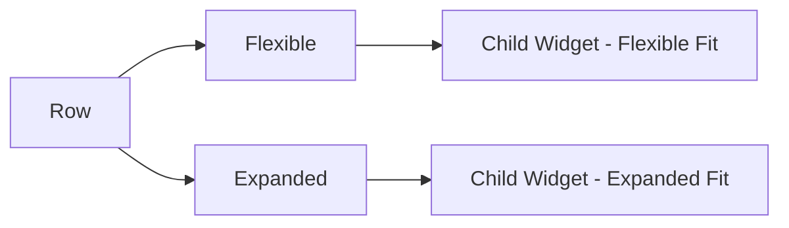

## 2.1.1 Using Flexible and Expanded Widgets

In the realm of Flutter development, creating responsive layouts that adapt gracefully to different screen sizes and orientations is a crucial skill. Two powerful tools in Flutter's layout arsenal are the `Flexible` and `Expanded` widgets. These widgets allow developers to control how child widgets within a `Row`, `Column`, or `Flex` adapt to the available space, making it easier to build dynamic and responsive user interfaces.

### Overview of Flexible and Expanded Widgets

The `Flexible` and `Expanded` widgets are essential for managing space distribution among children in a `Row`, `Column`, or `Flex` widget. They enable developers to create layouts that can adjust to varying screen dimensions, ensuring that the UI remains functional and aesthetically pleasing across devices.

- **Purpose of Flexible and Expanded Widgets:**
  - Both widgets help in distributing available space among child widgets.
  - They are particularly useful in scenarios where the layout needs to be responsive to different screen sizes.

- **How They Work:**
  - `Flexible` and `Expanded` widgets allow child widgets to expand or contract based on the available space.
  - They work by wrapping child widgets and controlling their size relative to other children.

### Flexible Widget

The `Flexible` widget allows a child widget to occupy space flexibly within a `Row` or `Column`. It provides the flexibility to adjust the space taken by a child widget based on the available space and the `flex` property.

- **The `flex` Property:**
  - The `flex` property determines how much space a `Flexible` widget should take relative to its siblings.
  - A higher `flex` value means the widget will take more space compared to its siblings with lower `flex` values.

- **Example Usage:**
  ```dart
  Row(
    children: [
      Flexible(
        flex: 1,
        child: Container(
          color: Colors.red,
          height: 100,
        ),
      ),
      Flexible(
        flex: 2,
        child: Container(
          color: Colors.green,
          height: 100,
        ),
      ),
      Flexible(
        flex: 1,
        child: Container(
          color: Colors.blue,
          height: 100,
        ),
      ),
    ],
  )
  ```
  In this example, the green container takes twice the horizontal space of the red and blue containers because its `flex` value is 2.

### Expanded Widget

The `Expanded` widget is essentially a shorthand for `Flexible` with `fit: FlexFit.tight`. It forces the child widget to take up all available space within its parent, making it an ideal choice when you want a widget to fill the remaining space.

- **When to Use Expanded:**
  - Use `Expanded` when you want a widget to fill all available space within a `Row` or `Column`.
  - It simplifies code by eliminating the need to specify `fit: FlexFit.tight`.

- **Example Usage:**
  ```dart
  Row(
    children: [
      Expanded(
        child: Container(
          color: Colors.red,
          height: 100,
        ),
      ),
      Expanded(
        child: Container(
          color: Colors.green,
          height: 100,
        ),
      ),
      Expanded(
        child: Container(
          color: Colors.blue,
          height: 100,
        ),
      ),
    ],
  )
  ```
  Here, each container takes an equal share of the available horizontal space.

### Code Examples

Let's explore some practical examples to understand how `Flexible` and `Expanded` widgets can be used to create responsive layouts.

#### Example 1: Using Expanded to Evenly Distribute Space

```dart
Row(
  children: [
    Expanded(
      child: Container(
        color: Colors.red,
        height: 100,
      ),
    ),
    Expanded(
      child: Container(
        color: Colors.green,
        height: 100,
      ),
    ),
    Expanded(
      child: Container(
        color: Colors.blue,
        height: 100,
      ),
    ),
  ],
)
```

In this example, each `Expanded` widget takes an equal share of the available space, resulting in three equally sized containers.

#### Example 2: Using Flexible with Different Flex Values

```dart
Row(
  children: [
    Flexible(
      flex: 1,
      child: Container(
        color: Colors.red,
        height: 100,
      ),
    ),
    Flexible(
      flex: 2,
      child: Container(
        color: Colors.green,
        height: 100,
      ),
    ),
    Flexible(
      flex: 1,
      child: Container(
        color: Colors.blue,
        height: 100,
      ),
    ),
  ],
)
```

In this example, the green container takes twice the space of the red and blue containers due to its higher `flex` value.

### Mermaid.js Diagrams

To visually understand the relationship between `Flexible` and `Expanded` widgets, let's look at a simple flowchart.



This diagram illustrates how a `Row` can contain both `Flexible` and `Expanded` widgets, each managing their child widgets differently.

### Best Practices

- **Use `Expanded` for Simplicity:**
  - When you want a child to fill all available space, `Expanded` is a straightforward choice.
  
- **Use `Flexible` for Controlled Space Allocation:**
  - Opt for `Flexible` when you need more control over how space is distributed among children.
  - `Flexible` with `FlexFit.loose` allows a child to take only the space it needs.

- **Avoid Excessive Nesting:**
  - Keep your widget tree clean and readable by avoiding unnecessary nesting of `Flexible` and `Expanded` widgets.

- **Consider Readability:**
  - Use meaningful names for variables and ensure your layout logic is easy to follow.

### Conclusion

Understanding and effectively using `Flexible` and `Expanded` widgets is key to mastering responsive layouts in Flutter. These widgets provide powerful tools for managing space within `Row` and `Column` widgets, allowing for dynamic and adaptable UIs. By leveraging these widgets, you can create layouts that not only look great but also function well across a wide range of devices and screen sizes.

### Additional Resources

- [Flutter Official Documentation on Flexible](https://api.flutter.dev/flutter/widgets/Flexible-class.html)
- [Flutter Official Documentation on Expanded](https://api.flutter.dev/flutter/widgets/Expanded-class.html)
- [Responsive Design in Flutter](https://flutter.dev/docs/development/ui/layout/responsive)

## Quiz Time!



### What is the primary purpose of the `Flexible` widget in Flutter?

- [x] To allow a child widget to occupy space flexibly within a Row or Column.
- [ ] To force a child widget to take all available space.
- [ ] To make a widget invisible.
- [ ] To add padding around a widget.

> **Explanation:** The `Flexible` widget allows a child to occupy space flexibly within a `Row` or `Column`, adjusting based on the available space and the `flex` property.

### How does the `flex` property affect the space distribution among `Flexible` widgets?

- [x] It determines how much space a `Flexible` widget should take relative to its siblings.
- [ ] It sets the color of the widget.
- [ ] It controls the alignment of the widget.
- [ ] It makes the widget non-interactive.

> **Explanation:** The `flex` property determines the relative space a `Flexible` widget should occupy compared to its siblings.

### What is the difference between `Expanded` and `Flexible` with `fit: FlexFit.tight`?

- [x] There is no difference; `Expanded` is a shorthand for `Flexible` with `fit: FlexFit.tight`.
- [ ] `Expanded` allows more flexibility than `Flexible`.
- [ ] `Flexible` is always smaller than `Expanded`.
- [ ] `Expanded` cannot be used in a Column.

> **Explanation:** `Expanded` is essentially a shorthand for `Flexible` with `fit: FlexFit.tight`, meaning it forces the child to fill all available space.

### In which scenario would you prefer using `Expanded` over `Flexible`?

- [x] When you want a child widget to fill all available space.
- [ ] When you want to add padding around a widget.
- [ ] When you need to align widgets to the left.
- [ ] When you want to make a widget invisible.

> **Explanation:** `Expanded` is used when you want a child widget to fill all available space within a `Row` or `Column`.

### Which widget would you use to ensure a child takes only the necessary space?

- [x] Flexible with `FlexFit.loose`.
- [ ] Expanded.
- [ ] Container.
- [ ] Align.

> **Explanation:** `Flexible` with `FlexFit.loose` allows a child to take only the space it needs, rather than filling all available space.

### What is a potential downside of excessive nesting of `Flexible` and `Expanded` widgets?

- [x] It can make the widget tree complex and hard to read.
- [ ] It improves performance.
- [ ] It makes the app faster.
- [ ] It reduces the number of widgets.

> **Explanation:** Excessive nesting can make the widget tree complex and difficult to maintain, impacting readability.

### What is the role of the `flex` property in a `Flexible` widget?

- [x] It determines the proportion of space a widget takes relative to its siblings.
- [ ] It sets the widget's color.
- [ ] It aligns the widget to the center.
- [ ] It makes the widget non-interactive.

> **Explanation:** The `flex` property determines the proportion of space a `Flexible` widget takes relative to its siblings.

### Which widget is best for creating a layout where each child takes an equal share of space?

- [x] Expanded.
- [ ] Flexible with different `flex` values.
- [ ] Container.
- [ ] Align.

> **Explanation:** `Expanded` is ideal for creating layouts where each child takes an equal share of the available space.

### What is the default fit for a `Flexible` widget if not specified?

- [x] FlexFit.loose.
- [ ] FlexFit.tight.
- [ ] FlexFit.expand.
- [ ] FlexFit.shrink.

> **Explanation:** The default fit for a `Flexible` widget is `FlexFit.loose`, allowing the child to take only the space it needs.

### True or False: The `Expanded` widget can only be used within a `Row`.

- [ ] True
- [x] False

> **Explanation:** The `Expanded` widget can be used within any `Flex` widget, including `Row` and `Column`.


