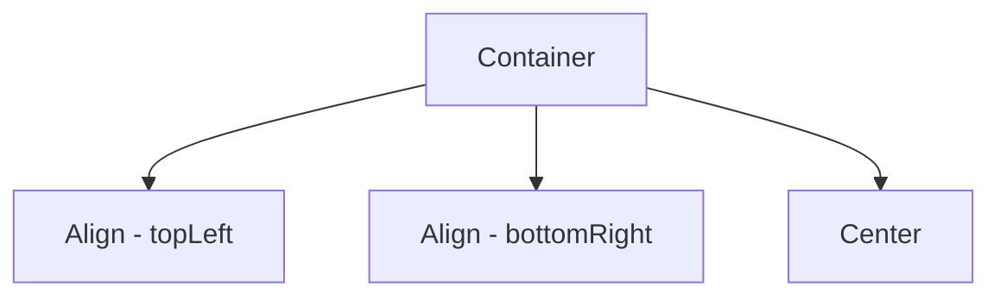

## 2.1.3 Aligning Widgets

In the realm of Flutter, aligning widgets is a fundamental aspect of creating visually appealing and user-friendly interfaces. Proper alignment ensures that your app's UI elements are positioned correctly, enhancing both aesthetics and functionality. In this section, we will delve into the `Align` and `Center` widgets, exploring their properties, use cases, and best practices for aligning widgets within their parent containers.

### Alignment Widgets: An Introduction

Flutter provides two primary widgets for aligning child widgets within their parent: the `Align` widget and the `Center` widget. These widgets are essential tools in your Flutter toolkit, allowing you to position elements precisely where you want them.

- **Align Widget**: Offers flexible alignment options, allowing you to position a child widget at any point within its parent.
- **Center Widget**: A convenient shorthand for centering a child widget within its parent, simplifying the alignment process.

Understanding when and how to use these widgets is crucial for building responsive and adaptive UIs.

### Align Widget: Properties and Usage

The `Align` widget is a versatile tool for positioning child widgets. It provides several properties that give you fine-grained control over alignment:

- **alignment**: This property determines where the child widget is placed within the parent. It accepts values from the `Alignment` class, such as `Alignment.topLeft`, `Alignment.center`, and `Alignment.bottomRight`.

- **widthFactor** and **heightFactor**: These optional properties allow you to adjust the size of the `Align` widget based on the size of its child. A value of `null` means the `Align` widget will take up as much space as its parent allows.

#### Example: Aligning a Widget to the Top-Left

Here's a simple example demonstrating how to use the `Align` widget to position a text widget at the top-left corner of its parent container:

```dart
Align(
  alignment: Alignment.topLeft,
  child: Text('Top Left'),
)
```

In this example, the `alignment` property is set to `Alignment.topLeft`, which places the text widget at the top-left corner of the parent container.

#### Exploring Alignment Options

The `Align` widget supports a variety of alignment options, enabling you to position widgets precisely. Here are some common alignments:

- **`Alignment.topLeft`**: Aligns the child to the top-left corner.
- **`Alignment.centerRight`**: Aligns the child to the center-right edge.
- **`Alignment.bottomCenter`**: Aligns the child to the bottom-center of the parent.

These alignment options provide flexibility in designing your UI, allowing you to position elements exactly where they are needed.

### Center Widget: Simplifying Center Alignment

The `Center` widget is a convenient shorthand for centering a child widget within its parent. It is essentially equivalent to using the `Align` widget with `alignment: Alignment.center`.

#### Example: Centering a Widget

Here's how you can use the `Center` widget to center a text widget within its parent container:

```dart
Center(
  child: Text('Centered Text'),
)
```

In this example, the `Center` widget automatically centers the text widget, simplifying the code and making it more readable.

#### When to Use Center Over Align

Use the `Center` widget when you need to center a widget within its parent. It provides a concise and clear way to achieve this common alignment task. For more complex alignments, where specific positioning is required, the `Align` widget is the better choice.

### Visualizing Alignments with Mermaid.js Diagrams

To better understand how different alignments work, let's visualize them using a Mermaid.js diagram. This diagram illustrates how various alignment options affect the positioning of child widgets within a parent container.



In this diagram:
- **B** represents a widget aligned to the top-left.
- **C** represents a widget aligned to the bottom-right.
- **D** represents a centered widget.

### Best Practices for Aligning Widgets

When aligning widgets in Flutter, consider the following best practices:

- **Use `Center` for Simple Centering**: When you need to center a widget, use the `Center` widget for simplicity and readability.
- **Leverage `Align` for Specific Positioning**: Use the `Align` widget when you need precise control over the alignment of a widget within its parent.
- **Combine with Padding or Margin**: For better control over positioning, combine alignment widgets with padding or margin. This allows you to adjust the spacing around the aligned widget, enhancing the overall layout.

### Practical Code Examples and Exercises

To solidify your understanding of aligning widgets in Flutter, try the following exercises:

1. **Exercise 1**: Align a button to the bottom-right corner of a container using the `Align` widget.
2. **Exercise 2**: Center an image within a container using the `Center` widget, and add padding around the image.
3. **Exercise 3**: Experiment with different alignment options using the `Align` widget, and observe how the positioning changes.

These exercises will help you gain hands-on experience with aligning widgets, allowing you to apply these concepts in your own projects.

### Conclusion

Aligning widgets is a fundamental skill in Flutter development, enabling you to create responsive and adaptive UIs. By mastering the `Align` and `Center` widgets, you can position elements precisely within their parent containers, enhancing both the aesthetics and functionality of your app.

For further exploration, refer to the official [Flutter documentation on alignment](https://flutter.dev/docs/development/ui/layout/alignment) and consider experimenting with different alignment options in your projects.

## Quiz Time!



### What is the primary purpose of the Align widget in Flutter?

- [x] To position a child widget within its parent using specific alignment options.
- [ ] To resize a widget based on its parent's size.
- [ ] To apply animations to a widget.
- [ ] To handle user input events.

> **Explanation:** The Align widget is used to position a child widget within its parent using specific alignment options like topLeft, center, etc.

### Which property of the Align widget is used to specify the position of a child widget?

- [x] alignment
- [ ] widthFactor
- [ ] heightFactor
- [ ] padding

> **Explanation:** The alignment property of the Align widget is used to specify the position of a child widget within its parent.

### What is the difference between the Align and Center widgets in Flutter?

- [x] Center is a shorthand for Align with alignment: Alignment.center.
- [ ] Align is used for animations, while Center is not.
- [ ] Center can only be used with text widgets.
- [ ] Align is used for handling gestures.

> **Explanation:** The Center widget is a shorthand for Align with alignment: Alignment.center, making it easier to center widgets.

### When should you use the Center widget over the Align widget?

- [x] When you want to center a widget within its parent.
- [ ] When you need to apply padding to a widget.
- [ ] When you want to animate a widget.
- [ ] When you need to handle user input events.

> **Explanation:** The Center widget should be used when you want to center a widget within its parent, as it provides a simple and concise way to achieve this.

### Which of the following is NOT a valid alignment option for the Align widget?

- [ ] Alignment.topLeft
- [ ] Alignment.centerRight
- [x] Alignment.bottomLeftRight
- [ ] Alignment.bottomCenter

> **Explanation:** Alignment.bottomLeftRight is not a valid alignment option. Valid options include topLeft, centerRight, bottomCenter, etc.

### What is the purpose of the widthFactor and heightFactor properties in the Align widget?

- [x] To adjust the size of the Align widget based on the size of its child.
- [ ] To specify the alignment of the child widget.
- [ ] To apply padding to the child widget.
- [ ] To handle user input events.

> **Explanation:** The widthFactor and heightFactor properties are used to adjust the size of the Align widget based on the size of its child.

### How can you combine alignment with padding or margin for better control over widget positioning?

- [x] Use the Align widget with a Padding or Margin widget.
- [ ] Use the Center widget with a GestureDetector.
- [ ] Use the Align widget with an AnimationController.
- [ ] Use the Center widget with a StreamBuilder.

> **Explanation:** Combining the Align widget with a Padding or Margin widget allows for better control over widget positioning by adjusting the spacing around the aligned widget.

### Which widget would you use to center a text widget within a container?

- [x] Center
- [ ] Align
- [ ] Padding
- [ ] GestureDetector

> **Explanation:** The Center widget is used to center a text widget within a container, providing a simple and concise way to achieve this.

### What is the role of the alignment property in the Align widget?

- [x] It determines the position of the child widget within the parent.
- [ ] It specifies the size of the child widget.
- [ ] It applies animations to the child widget.
- [ ] It handles user input events.

> **Explanation:** The alignment property in the Align widget determines the position of the child widget within the parent.

### True or False: The Center widget can be used to align a widget to the top-left corner of its parent.

- [ ] True
- [x] False

> **Explanation:** False. The Center widget is used to center a widget within its parent, not to align it to the top-left corner.


