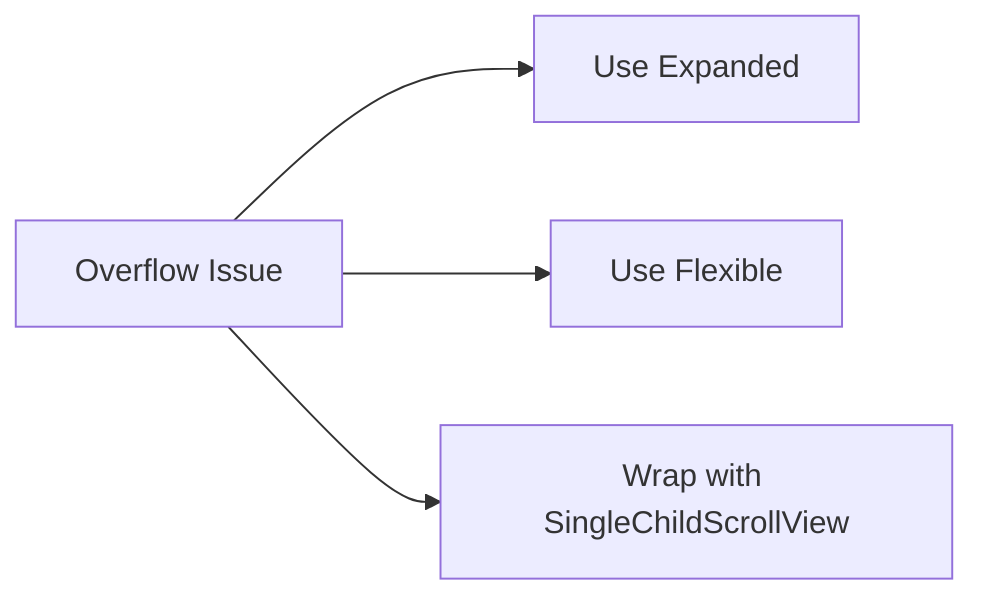

## 2.1.4 Handling Overflow

In the world of Flutter development, managing layout overflow is crucial for creating responsive and adaptive user interfaces. Overflow occurs when a child widget exceeds the available space within its parent, leading to errors or undesirable UI behavior. This section will explore the causes of overflow, common scenarios where it occurs, and strategies to prevent and handle it effectively.

### Understanding Overflow

Overflow in Flutter typically arises when a widget's size exceeds the constraints imposed by its parent. This can happen for several reasons, such as:

- **Fixed Dimensions:** Widgets with hardcoded sizes that do not adapt to varying screen dimensions.
- **Dynamic Content:** Text or images that change in size based on user input or data fetching.
- **Layout Misconfigurations:** Incorrect use of layout widgets like `Row`, `Column`, or `ListView` without proper constraints.

When overflow occurs, Flutter provides visual cues, such as a yellow and black striped pattern, to indicate the issue. Understanding how to interpret and resolve these cues is essential for maintaining a seamless user experience.

### Common Overflow Issues

Overflow can manifest in various scenarios, particularly when dealing with complex layouts. Here are some typical cases:

- **Row and Column Widgets:** These widgets can cause overflow if their children exceed the available horizontal or vertical space, respectively.
- **ListView and GridView:** Without proper constraints, these widgets can lead to overflow, especially when nested within other scrollable widgets.
- **Text Widgets:** Long strings of text without wrapping or truncation can exceed the available width, causing overflow.

#### Example: Overflow in a Row

Consider a `Row` widget containing a long text string and an icon. Without constraints, the text might overflow the available space:

```dart
Row(
  children: [
    Text('This is a very long text that needs to wrap or be constrained to avoid overflow.'),
    Icon(Icons.star),
  ],
)
```

In this example, the text widget does not have any constraints, leading to potential overflow issues.

### Preventing Overflow

Preventing overflow involves using layout strategies and widgets that adapt to available space. Here are some effective techniques:

- **Expanded and Flexible Widgets:** These widgets allow children to adapt to available space, distributing it proportionally among them.
- **SingleChildScrollView:** Wraps content in a scrollable view, allowing it to exceed the parent constraints without causing overflow errors.
- **TextOverflow Property:** Configures how text should behave when it exceeds its bounds, such as clipping or displaying an ellipsis.

#### Example 1: Handling Overflow in a Row Using Expanded

The `Expanded` widget can be used to ensure that the text adapts to the available space:

```dart
Row(
  children: [
    Expanded(
      child: Text(
        'This is a very long text that needs to wrap or be constrained to avoid overflow.',
        overflow: TextOverflow.ellipsis,
      ),
    ),
    Icon(Icons.star),
  ],
)
```

In this example, the `Expanded` widget ensures that the text occupies the available space, while the `TextOverflow.ellipsis` property truncates the text with an ellipsis if it still exceeds the bounds.

#### Example 2: Wrapping Content in SingleChildScrollView

For scenarios where content needs to be scrollable, `SingleChildScrollView` can be used:

```dart
SingleChildScrollView(
  scrollDirection: Axis.horizontal,
  child: Row(
    children: List.generate(10, (index) => Icon(Icons.star)),
  ),
)
```

Here, the `SingleChildScrollView` allows the `Row` to exceed the horizontal constraints, enabling horizontal scrolling.

### Flowchart Illustrating Overflow Handling Techniques

To visualize the decision-making process for handling overflow, consider the following flowchart:



This flowchart outlines the primary strategies for addressing overflow issues, guiding developers in selecting the appropriate solution based on their specific scenario.

### Best Practices

To effectively manage overflow in your Flutter applications, consider the following best practices:

- **Anticipate Overflow Scenarios:** Be proactive in identifying potential overflow issues, especially when dealing with dynamic content or user-generated data.
- **Test Across Devices:** Ensure that your layouts are tested on various screen sizes and orientations to verify that overflow is handled gracefully.
- **Leverage Flexible Layout Widgets:** Use `Flexible` and `Expanded` widgets to create adaptive layouts that adjust to available space, rather than relying on fixed dimensions.
- **Utilize Scrollable Widgets:** For content that naturally exceeds the available space, such as lists or grids, use scrollable widgets like `ListView` or `GridView`.

### Conclusion

Handling overflow in Flutter is a critical aspect of creating responsive and adaptive user interfaces. By understanding the causes of overflow and implementing effective strategies to prevent and manage it, you can ensure that your applications provide a seamless and engaging user experience across all devices.

For further exploration, consider reviewing the official [Flutter documentation](https://flutter.dev/docs) and experimenting with different layout widgets and techniques to deepen your understanding of responsive design in Flutter.

## Quiz Time!



### What is a common cause of overflow in Flutter applications?

- [x] Widgets exceeding their parent's constraints
- [ ] Using too many widgets in a layout
- [ ] Incorrect use of colors
- [ ] Lack of animations

> **Explanation:** Overflow occurs when a widget exceeds the constraints imposed by its parent, leading to layout errors.

### Which widget can be used to prevent overflow in a Row by adapting to available space?

- [x] Expanded
- [ ] Container
- [ ] Padding
- [ ] Align

> **Explanation:** The `Expanded` widget allows its child to take up the remaining available space, preventing overflow.

### How can you handle overflow for a long text string in a Row?

- [x] Use Expanded with TextOverflow.ellipsis
- [ ] Use a fixed width
- [ ] Wrap the Row in a Column
- [ ] Add more icons

> **Explanation:** Using `Expanded` with `TextOverflow.ellipsis` ensures the text adapts to available space and is truncated with an ellipsis if necessary.

### What is the purpose of the SingleChildScrollView widget?

- [x] To allow its child to exceed parent constraints and be scrollable
- [ ] To center its child widget
- [ ] To add padding around its child
- [ ] To change the background color

> **Explanation:** `SingleChildScrollView` allows its child to exceed the parent's constraints, enabling scrolling.

### Which property of the Text widget helps manage overflow by truncating text?

- [x] TextOverflow.ellipsis
- [ ] TextAlign.center
- [ ] TextStyle.fontSize
- [ ] TextDirection.ltr

> **Explanation:** `TextOverflow.ellipsis` truncates text with an ellipsis if it exceeds its bounds.

### What is a visual indicator of overflow in Flutter?

- [x] A yellow and black striped pattern
- [ ] A red border
- [ ] A blue background
- [ ] A flashing icon

> **Explanation:** Flutter uses a yellow and black striped pattern to indicate overflow issues.

### How can you ensure a layout adapts to different screen sizes?

- [x] Use Flexible and Expanded widgets
- [ ] Use hardcoded sizes
- [ ] Avoid using Rows and Columns
- [ ] Only test on one device

> **Explanation:** `Flexible` and `Expanded` widgets help create adaptive layouts that adjust to available space.

### What should you do to prevent overflow with dynamic content?

- [x] Anticipate potential overflow scenarios and test on various devices
- [ ] Use fixed dimensions for all widgets
- [ ] Avoid using dynamic content
- [ ] Only test on high-resolution screens

> **Explanation:** Anticipating overflow scenarios and testing on various devices ensures that dynamic content is handled gracefully.

### Which widget allows for horizontal scrolling of its child?

- [x] SingleChildScrollView
- [ ] Column
- [ ] Stack
- [ ] SizedBox

> **Explanation:** `SingleChildScrollView` can be configured for horizontal scrolling, allowing its child to exceed horizontal constraints.

### True or False: Overflow is only a concern for text widgets in Flutter.

- [ ] True
- [x] False

> **Explanation:** Overflow can occur with any widget that exceeds its parent's constraints, not just text widgets.


