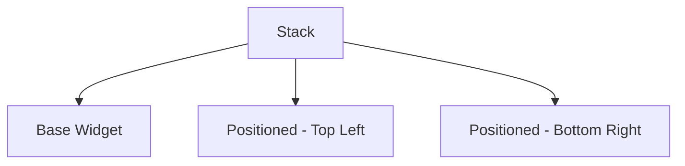

## 2.2.1 Stack and Positioned Widgets

In the world of Flutter, creating visually appealing and functional user interfaces often requires the ability to layer widgets on top of each other. This is where the `Stack` and `Positioned` widgets come into play. These widgets provide the flexibility to create complex layouts by allowing widgets to overlap and be precisely positioned within a parent container. In this section, we will delve into the intricacies of using `Stack` and `Positioned` widgets, explore practical examples, and discuss best practices to optimize their use in your Flutter applications.

### Introduction to Stack

The `Stack` widget in Flutter is a powerful tool for creating layouts where widgets can overlap each other. This capability is essential for designs that require layering, such as overlays, custom positioning, and more complex UI designs.

- **Purpose of Stack:**
  - The primary purpose of the `Stack` widget is to allow multiple children to be placed on top of each other. Unlike other layout widgets like `Column` or `Row`, which arrange their children linearly, `Stack` allows for overlapping, making it ideal for creating layered interfaces.
  
- **Use Cases:**
  - **Complex UI Designs:** When you need to create intricate designs with overlapping elements, such as a profile picture with a status badge.
  - **Overlays:** Implementing features like modal dialogs, tooltips, or floating action buttons that appear above other content.
  - **Custom Positioning:** Precisely positioning elements within a container, such as placing a watermark on an image.

### Positioned Widget

The `Positioned` widget is used within a `Stack` to place its child at a specific position relative to the stack's boundaries. It provides a high degree of control over the placement of widgets, allowing for precise adjustments.

- **Properties of Positioned:**
  - **top, right, bottom, left:** These properties specify the distance from the respective edge of the stack. You can use these to position the child widget precisely within the stack.
  - **width, height:** These properties allow you to define the size of the positioned widget, independent of its child's intrinsic size.

### Code Examples

Let's explore some practical examples to understand how `Stack` and `Positioned` widgets work together.

#### Example 1: Basic Usage of Stack and Positioned

In this example, we create a simple layout with a blue container as the base and two positioned elements: a red container and an overlay text.

```dart
Stack(
  children: [
    Container(
      width: 200,
      height: 200,
      color: Colors.blue,
    ),
    Positioned(
      top: 20,
      left: 20,
      child: Container(
        width: 100,
        height: 100,
        color: Colors.red,
      ),
    ),
    Positioned(
      bottom: 20,
      right: 20,
      child: Text('Overlay Text'),
    ),
  ],
)
```

**Explanation:**
- The `Stack` widget contains three children: a base blue container, a red container positioned at the top-left, and a text widget positioned at the bottom-right.
- The `Positioned` widget allows us to specify exact locations for the red container and the text within the stack.

#### Example 2: Creating an Image Overlay with Text

This example demonstrates how to overlay text on an image using `Stack` and `Positioned`.

```dart
Stack(
  children: [
    Image.network('https://example.com/image.jpg'),
    Positioned(
      bottom: 10,
      left: 10,
      child: Text(
        'Sample Overlay',
        style: TextStyle(color: Colors.white, fontSize: 20),
      ),
    ),
  ],
)
```

**Explanation:**
- The `Stack` widget layers a text widget over an image.
- The `Positioned` widget places the text at the bottom-left corner of the image, creating a simple overlay effect.

### Mermaid.js Diagrams

To better visualize the relationship between `Stack` and `Positioned` widgets, let's look at a diagram illustrating their usage.



**Diagram Explanation:**
- The `Stack` node represents the parent widget containing multiple children.
- The `Base Widget` node is the foundational layer, typically a background or a primary container.
- `Positioned - Top Left` and `Positioned - Bottom Right` nodes illustrate how children can be precisely placed within the stack.

### Best Practices

While `Stack` and `Positioned` widgets offer great flexibility, it's important to use them judiciously to maintain a clean and efficient widget tree.

- **Use Stack Sparingly:** Overusing `Stack` can lead to complex and hard-to-maintain layouts. Consider whether simpler layout widgets like `Column`, `Row`, or `Align` might suffice.
- **Organize Positioned Widgets:** Keep your `Positioned` widgets organized and well-documented to ensure readability and maintainability.
- **Consider Alignment:** For simpler positioning needs, using `Alignment` or `Align` can reduce complexity and improve performance.

### Common Pitfalls and Challenges

- **Overlapping Issues:** Ensure that overlapping widgets do not obscure important content or interactive elements.
- **Performance Concerns:** Excessive layering can impact performance, especially on lower-end devices. Optimize by minimizing unnecessary layers and using `const` constructors where possible.
- **Responsiveness:** Be mindful of different screen sizes and orientations. Use `MediaQuery` or `LayoutBuilder` to adapt positions dynamically.

### Conclusion

The `Stack` and `Positioned` widgets are invaluable tools in the Flutter developer's toolkit, enabling the creation of complex, layered interfaces with precise control over widget placement. By understanding their capabilities and limitations, you can design more dynamic and engaging user experiences. Remember to follow best practices to keep your layouts efficient and maintainable, and always test your designs across various devices to ensure a consistent user experience.

### Further Reading and Resources

- [Flutter Official Documentation on Stack](https://api.flutter.dev/flutter/widgets/Stack-class.html)
- [Flutter Official Documentation on Positioned](https://api.flutter.dev/flutter/widgets/Positioned-class.html)
- [Flutter Layout Cheat Sheet](https://medium.com/flutter-community/flutter-layout-cheat-sheet-5363348d037e)

By mastering the use of `Stack` and `Positioned` widgets, you can unlock new possibilities in your Flutter applications, creating interfaces that are both visually appealing and functionally robust.

---

## Quiz Time!



### What is the primary purpose of the Stack widget in Flutter?

- [x] To allow widgets to overlap each other
- [ ] To arrange widgets in a linear fashion
- [ ] To create a grid layout
- [ ] To manage state in an application

> **Explanation:** The Stack widget allows multiple children to be placed on top of each other, enabling overlapping and layered designs.

### Which widget is used within a Stack to position its child at a specific location?

- [ ] Align
- [x] Positioned
- [ ] Container
- [ ] Column

> **Explanation:** The Positioned widget is used within a Stack to place its child at a specific position relative to the stack's boundaries.

### What properties can be used with the Positioned widget to define its location?

- [x] top, right, bottom, left
- [ ] width, height
- [ ] padding, margin
- [ ] flex, fit

> **Explanation:** The Positioned widget uses the properties top, right, bottom, and left to define the distance from the respective edges of the stack.

### In the provided code example, what color is the base container in the Stack?

- [ ] Red
- [x] Blue
- [ ] Green
- [ ] Yellow

> **Explanation:** The base container in the Stack is colored blue, as specified in the code example.

### What is a common use case for using a Stack widget?

- [x] Creating overlays
- [ ] Managing state
- [ ] Fetching data from an API
- [ ] Handling user input

> **Explanation:** A common use case for using a Stack widget is to create overlays, such as modal dialogs or tooltips.

### Which property of the Positioned widget allows you to set its size?

- [ ] top
- [ ] left
- [x] width
- [x] height

> **Explanation:** The width and height properties of the Positioned widget allow you to set its size.

### What should you consider when using Stack and Positioned widgets?

- [x] Performance impact
- [x] Readability of the widget tree
- [ ] Color scheme
- [ ] API integration

> **Explanation:** When using Stack and Positioned widgets, consider the performance impact and maintain readability of the widget tree.

### How can you reduce complexity when positioning widgets?

- [x] Use Align or Alignment for simpler needs
- [ ] Use more layers in the Stack
- [ ] Avoid using Positioned
- [ ] Use a single Positioned widget for all children

> **Explanation:** Using Align or Alignment for simpler positioning needs can reduce complexity and improve performance.

### What is a potential challenge when using Stack widgets?

- [x] Overlapping issues
- [ ] Lack of flexibility
- [ ] Limited styling options
- [ ] Difficulty in managing state

> **Explanation:** A potential challenge when using Stack widgets is managing overlapping issues, ensuring important content is not obscured.

### True or False: The Stack widget is ideal for creating linear layouts.

- [ ] True
- [x] False

> **Explanation:** False. The Stack widget is not ideal for creating linear layouts; it is used for overlapping and layering widgets.


