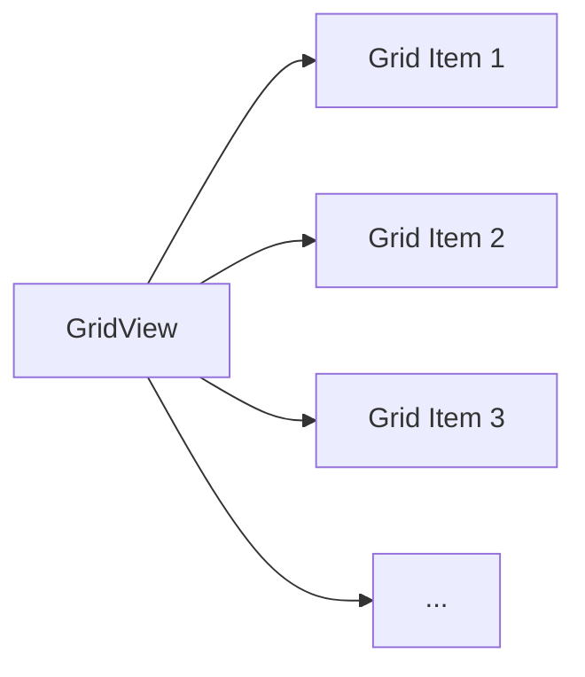

## 2.2.2 Grid Layouts with GridView

Creating visually appealing and responsive grid layouts is a fundamental aspect of modern app design. In Flutter, the `GridView` widget offers a powerful and flexible way to implement grid-based layouts, allowing developers to build UIs that are both functional and aesthetically pleasing. This section delves into the intricacies of `GridView`, exploring its various types, grid delegates, and best practices to optimize performance and usability.

### Introduction to GridView

The `GridView` widget in Flutter is designed to display items in a grid format, providing a structured and organized way to present content. It is particularly useful for creating layouts where items need to be arranged in rows and columns, such as photo galleries, product listings, or dashboards.

#### Types of GridView

Flutter offers several types of `GridView` widgets, each catering to different layout needs:

- **GridView.count**: This type allows you to specify the number of columns (cross-axis count) in the grid. It is ideal for scenarios where you have a fixed number of columns and want the grid to automatically adjust the size of the items to fit the screen.

- **GridView.extent**: This type lets you define the maximum extent (width or height) of each item in the grid. It is useful when you want to control the size of the grid items based on available space.

- **GridView.builder**: This type is designed for creating grids with dynamic content. It uses a builder function to generate grid items on demand, which is efficient for large datasets or when items are loaded asynchronously.

### Grid Delegates

Grid delegates in Flutter determine how the grid's layout is structured. They control the arrangement of items within the grid, influencing both the number of items per row and their size.

#### SliverGridDelegate

The `SliverGridDelegate` class is responsible for controlling the layout of grid items. Flutter provides two main types of grid delegates:

- **SliverGridDelegateWithFixedCrossAxisCount**: This delegate allows you to specify a fixed number of items per row (cross-axis count). It is straightforward and ensures that each row contains the same number of items, making it suitable for uniform grids.

- **SliverGridDelegateWithMaxCrossAxisExtent**: This delegate lets you define the maximum extent for each item along the cross-axis. It automatically adjusts the number of items per row based on the available space, providing flexibility for responsive designs.

### Code Examples

Let's explore some practical examples to understand how to implement grid layouts using `GridView` in Flutter.

#### Example 1: Using GridView.count for a Fixed Number of Columns

The `GridView.count` constructor is perfect for scenarios where you want a fixed number of columns. Here's how you can create a simple grid with three columns:

```dart
import 'package:flutter/material.dart';

void main() => runApp(MyApp());

class MyApp extends StatelessWidget {
  @override
  Widget build(BuildContext context) {
    return MaterialApp(
      home: Scaffold(
        appBar: AppBar(title: Text('GridView.count Example')),
        body: GridView.count(
          crossAxisCount: 3,
          children: List.generate(9, (index) {
            return Center(
              child: Text('Item $index'),
            );
          }),
        ),
      ),
    );
  }
}
```

In this example, the `GridView.count` widget creates a grid with three columns. The `List.generate` function is used to create nine items, each displaying its index.

#### Example 2: Using GridView.builder for Dynamic Content

The `GridView.builder` constructor is ideal for grids with a large number of items or when items are loaded dynamically. Here's an example:

```dart
import 'package:flutter/material.dart';

void main() => runApp(MyApp());

class MyApp extends StatelessWidget {
  @override
  Widget build(BuildContext context) {
    return MaterialApp(
      home: Scaffold(
        appBar: AppBar(title: Text('GridView.builder Example')),
        body: GridView.builder(
          gridDelegate: SliverGridDelegateWithFixedCrossAxisCount(
            crossAxisCount: 4,
          ),
          itemCount: 20,
          itemBuilder: (context, index) {
            return Card(
              color: Colors.amber,
              child: Center(child: Text('Item $index')),
            );
          },
        ),
      ),
    );
  }
}
```

In this example, `GridView.builder` is used to create a grid with four columns. The `itemBuilder` function generates each grid item, allowing for dynamic content creation.

### Mermaid.js Diagrams

To better understand the structure of a `GridView`, consider the following diagram:



This diagram illustrates how a `GridView` organizes its items in a grid structure, with each item represented as a node connected to the `GridView`.

### Best Practices

When working with `GridView` in Flutter, consider the following best practices to ensure optimal performance and usability:

- **Use GridView.builder for Large or Dynamically Loaded Grids**: For grids with a large number of items or when items are loaded asynchronously, `GridView.builder` is more efficient as it builds items on demand.

- **Choose Appropriate Grid Delegates**: Select the grid delegate that best suits your layout requirements. Use `SliverGridDelegateWithFixedCrossAxisCount` for uniform grids and `SliverGridDelegateWithMaxCrossAxisExtent` for responsive designs.

- **Optimize Grid Item Widgets**: Ensure that the widgets used for grid items are lightweight and efficient to maintain smooth scrolling performance. Avoid complex layouts or heavy computations within grid items.

- **Consider Accessibility and Responsiveness**: Design grid layouts that are accessible and responsive across different devices and screen sizes. Test your layouts on various screen dimensions to ensure a consistent user experience.

### Conclusion

The `GridView` widget in Flutter is a versatile tool for creating grid-based layouts, offering various types and grid delegates to cater to different design needs. By understanding the capabilities of `GridView` and following best practices, you can build responsive and efficient grid layouts that enhance the user experience. Experiment with the examples provided and explore the possibilities of `GridView` in your Flutter projects.

## Quiz Time!



### What is the primary purpose of the `GridView` widget in Flutter?

- [x] To display items in a grid format.
- [ ] To create lists of items.
- [ ] To manage state in an application.
- [ ] To handle user input events.

> **Explanation:** The `GridView` widget is designed to display items in a grid format, organizing content into rows and columns.

### Which `GridView` type is best suited for a fixed number of columns?

- [x] GridView.count
- [ ] GridView.extent
- [ ] GridView.builder
- [ ] GridView.custom

> **Explanation:** `GridView.count` allows you to specify a fixed number of columns, making it ideal for layouts with a predetermined column count.

### What is the role of a grid delegate in a `GridView`?

- [x] To control the layout of grid items.
- [ ] To handle user interactions.
- [ ] To manage state within the grid.
- [ ] To provide data to the grid.

> **Explanation:** A grid delegate determines how the grid's layout is structured, influencing the arrangement and size of items within the grid.

### Which grid delegate would you use to specify a fixed number of items per row?

- [x] SliverGridDelegateWithFixedCrossAxisCount
- [ ] SliverGridDelegateWithMaxCrossAxisExtent
- [ ] SliverGridDelegateWithFixedMainAxisExtent
- [ ] SliverGridDelegateWithDynamicExtent

> **Explanation:** `SliverGridDelegateWithFixedCrossAxisCount` allows you to specify a fixed number of items per row, ensuring uniformity in the grid layout.

### Why is `GridView.builder` recommended for large datasets?

- [x] It builds items on demand, improving performance.
- [ ] It automatically caches all items.
- [ ] It provides built-in pagination.
- [ ] It supports complex animations.

> **Explanation:** `GridView.builder` is efficient for large datasets because it generates grid items on demand, reducing memory usage and improving performance.

### What is a key advantage of using `SliverGridDelegateWithMaxCrossAxisExtent`?

- [x] It allows for responsive grid layouts by adjusting item count based on available space.
- [ ] It provides automatic item animations.
- [ ] It supports nested grids.
- [ ] It simplifies state management.

> **Explanation:** `SliverGridDelegateWithMaxCrossAxisExtent` adjusts the number of items per row based on available space, making it suitable for responsive designs.

### How can you ensure smooth scrolling performance in a `GridView`?

- [x] Optimize grid item widgets to be lightweight.
- [ ] Use complex animations for each item.
- [ ] Load all items at once.
- [ ] Avoid using grid delegates.

> **Explanation:** To maintain smooth scrolling performance, ensure that grid item widgets are lightweight and efficient, avoiding complex layouts or heavy computations.

### What is the purpose of the `itemBuilder` function in `GridView.builder`?

- [x] To generate grid items dynamically.
- [ ] To manage grid state.
- [ ] To handle user input.
- [ ] To control grid layout.

> **Explanation:** The `itemBuilder` function in `GridView.builder` is used to dynamically generate grid items, allowing for efficient handling of large or dynamic datasets.

### Which of the following is a best practice when using `GridView`?

- [x] Test layouts on various screen sizes for responsiveness.
- [ ] Use the same grid delegate for all grids.
- [ ] Avoid using lightweight widgets for grid items.
- [ ] Load all grid items at once for better performance.

> **Explanation:** Testing layouts on various screen sizes ensures that your grid designs are responsive and provide a consistent user experience across devices.

### True or False: `GridView.extent` allows you to specify the number of columns in a grid.

- [ ] True
- [x] False

> **Explanation:** `GridView.extent` allows you to define the maximum extent of each item, not the number of columns. `GridView.count` is used to specify the number of columns.


