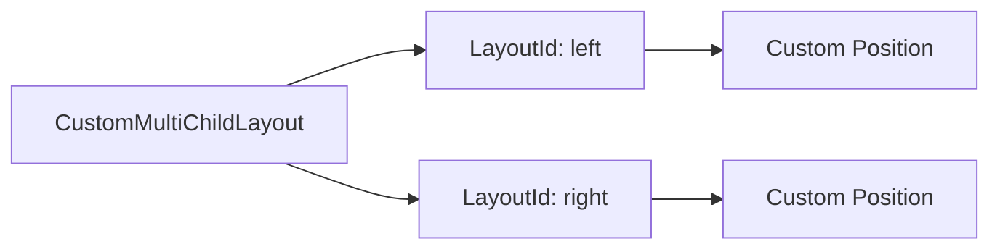

## 2.2.3 CustomMultiChildLayout

In the realm of Flutter development, creating responsive and adaptive user interfaces often requires going beyond the standard layout widgets. The `CustomMultiChildLayout` widget provides developers with the flexibility to design complex and unique layouts that are not possible with conventional widgets like `Row`, `Column`, or `Stack`. This section delves into the intricacies of `CustomMultiChildLayout`, guiding you through its purpose, implementation, and best practices.

### Introduction to CustomMultiChildLayout

The `CustomMultiChildLayout` widget is a powerful tool for developers who need to create highly customized layouts. Unlike standard layout widgets, which offer predefined arrangements and constraints, `CustomMultiChildLayout` allows you to define your own layout logic. This is particularly useful when you need precise control over the positioning and sizing of multiple child widgets.

#### When to Use CustomMultiChildLayout

- **Complex Layouts:** When your design requirements exceed the capabilities of standard widgets, such as overlapping widgets or dynamic positioning based on content size.
- **Performance Optimization:** In scenarios where you need to optimize layout performance by minimizing unnecessary rebuilds or recalculations.
- **Custom Positioning:** When you need to position child widgets in a non-linear or non-standard manner, such as creating a custom banner or a unique dashboard layout.

### Understanding Layout Delegates

At the heart of `CustomMultiChildLayout` is the `MultiChildLayoutDelegate`, which controls the layout behavior of its children. This delegate is responsible for determining the size and position of each child widget.

#### Implementing MultiChildLayoutDelegate

To create a custom layout, you need to extend the `MultiChildLayoutDelegate` class and override its methods:

- **`performLayout`:** This method is where the layout logic is implemented. You define how each child should be sized and positioned within the available space.

- **`shouldRelayout`:** This method determines whether the layout should be recalculated. It is typically used to compare the current delegate with the old one to decide if a relayout is necessary.

Here's a breakdown of how to implement these methods:

```dart
class MyLayoutDelegate extends MultiChildLayoutDelegate {
  @override
  void performLayout(Size size) {
    if (hasChild('left')) {
      layoutChild('left', BoxConstraints.loose(size));
      positionChild('left', Offset(0, 0));
    }
    if (hasChild('right')) {
      Size childSize = layoutChild('right', BoxConstraints.loose(size));
      positionChild('right', Offset(size.width - childSize.width, 0));
    }
  }

  @override
  bool shouldRelayout(covariant MultiChildLayoutDelegate oldDelegate) => false;
}
```

- **`layoutChild`:** This method is used to define the constraints for each child and to obtain its size.
- **`positionChild`:** This method positions the child widget within the parent widget's coordinate space.

### Code Examples

#### Example 1: Simple Custom Layout with Two Children

This example demonstrates a basic use of `CustomMultiChildLayout` to position two child widgets side by side.

```dart
CustomMultiChildLayout(
  delegate: MyLayoutDelegate(),
  children: [
    LayoutId(
      id: 'left',
      child: Container(color: Colors.red),
    ),
    LayoutId(
      id: 'right',
      child: Container(color: Colors.blue),
    ),
  ],
)
```

In this layout, the `left` child is positioned at the top-left corner, and the `right` child is positioned at the top-right corner.

#### Example 2: Creating a Custom Banner Layout

This example shows how to create a custom banner layout with a background and centered text.

```dart
CustomMultiChildLayout(
  delegate: BannerLayoutDelegate(),
  children: [
    LayoutId(
      id: 'background',
      child: Container(color: Colors.yellow),
    ),
    LayoutId(
      id: 'text',
      child: Padding(
        padding: EdgeInsets.all(16),
        child: Text('Custom Banner', style: TextStyle(fontSize: 24)),
      ),
    ),
  ],
)

class BannerLayoutDelegate extends MultiChildLayoutDelegate {
  @override
  void performLayout(Size size) {
    if (hasChild('background')) {
      layoutChild('background', BoxConstraints.expand());
      positionChild('background', Offset.zero);
    }
    if (hasChild('text')) {
      Size textSize = layoutChild('text', BoxConstraints.loose(size));
      positionChild('text', Offset((size.width - textSize.width) / 2, (size.height - textSize.height) / 2));
    }
  }

  @override
  bool shouldRelayout(covariant MultiChildLayoutDelegate oldDelegate) => false;
}
```

In this layout, the `background` child fills the entire space, while the `text` child is centered both vertically and horizontally.

### Mermaid.js Diagrams

To better understand the structure of a `CustomMultiChildLayout`, consider the following diagram:



This diagram illustrates how the `CustomMultiChildLayout` manages its children, each identified by a unique `LayoutId`, allowing for custom positioning.

### Best Practices

- **Use for Unique Layout Needs:** Reserve `CustomMultiChildLayout` for scenarios where standard widgets fall short. This ensures that your layout logic remains maintainable and efficient.
- **Optimize Layout Delegates:** Ensure that your layout delegates are optimized to prevent performance bottlenecks. Avoid complex calculations within `performLayout` that could slow down the rendering process.
- **Descriptive LayoutId Identifiers:** Use clear and descriptive `LayoutId` identifiers to improve code readability and maintainability. This makes it easier for others (or yourself in the future) to understand the layout logic.

### Conclusion

The `CustomMultiChildLayout` widget is a powerful tool in the Flutter developer's toolkit, enabling the creation of highly customized and responsive layouts. By leveraging the `MultiChildLayoutDelegate`, developers can achieve precise control over the positioning and sizing of child widgets, allowing for innovative and unique user interfaces. As you experiment with `CustomMultiChildLayout`, remember to consider performance implications and maintain clear code for future maintainability.

## Quiz Time!



### What is the primary purpose of the `CustomMultiChildLayout` widget in Flutter?

- [x] To create highly customized layouts that standard widgets cannot achieve
- [ ] To simplify the use of standard layout widgets like `Row` and `Column`
- [ ] To automatically adjust layouts based on screen size
- [ ] To replace the need for `Stack` and `Positioned` widgets

> **Explanation:** The `CustomMultiChildLayout` widget is used for creating highly customized layouts that standard widgets cannot achieve, providing precise control over child positioning and sizing.

### Which class must be extended to create a custom layout logic for `CustomMultiChildLayout`?

- [x] MultiChildLayoutDelegate
- [ ] CustomLayoutDelegate
- [ ] LayoutBuilder
- [ ] CustomPainter

> **Explanation:** The `MultiChildLayoutDelegate` class must be extended to implement custom layout logic for `CustomMultiChildLayout`.

### In the `performLayout` method, which function is used to define constraints for a child widget?

- [x] layoutChild
- [ ] positionChild
- [ ] hasChild
- [ ] shouldRelayout

> **Explanation:** The `layoutChild` function is used in the `performLayout` method to define constraints for a child widget and obtain its size.

### What is the role of the `shouldRelayout` method in a `MultiChildLayoutDelegate`?

- [x] To determine if the layout should be recalculated
- [ ] To position child widgets
- [ ] To define constraints for child widgets
- [ ] To initialize the layout delegate

> **Explanation:** The `shouldRelayout` method determines if the layout should be recalculated, typically by comparing the current delegate with the old one.

### Which of the following is a best practice when using `CustomMultiChildLayout`?

- [x] Use it for unique layout needs that cannot be achieved with standard widgets
- [ ] Use it for all layouts to ensure consistency
- [ ] Avoid using `LayoutId` for identifying children
- [ ] Always use it with `Stack` and `Positioned`

> **Explanation:** It is best to use `CustomMultiChildLayout` for unique layout needs that cannot be achieved with standard widgets, ensuring maintainability and efficiency.

### What does the `positionChild` method do in a `MultiChildLayoutDelegate`?

- [x] Positions the child widget within the parent widget's coordinate space
- [ ] Defines constraints for the child widget
- [ ] Checks if a child widget exists
- [ ] Determines if the layout should be recalculated

> **Explanation:** The `positionChild` method positions the child widget within the parent widget's coordinate space.

### Which widget is used to identify children within a `CustomMultiChildLayout`?

- [x] LayoutId
- [ ] Container
- [ ] Positioned
- [ ] Align

> **Explanation:** The `LayoutId` widget is used to identify children within a `CustomMultiChildLayout`, allowing for custom positioning.

### What is the benefit of using descriptive `LayoutId` identifiers?

- [x] Improves code readability and maintainability
- [ ] Increases the performance of the layout
- [ ] Reduces the need for `performLayout`
- [ ] Automatically adjusts layouts based on screen size

> **Explanation:** Using descriptive `LayoutId` identifiers improves code readability and maintainability, making it easier to understand the layout logic.

### True or False: The `CustomMultiChildLayout` widget should be used for all layouts to ensure flexibility.

- [ ] True
- [x] False

> **Explanation:** False. `CustomMultiChildLayout` should be reserved for unique layout needs that cannot be achieved with standard widgets, not for all layouts.

### Which method in `MultiChildLayoutDelegate` is responsible for positioning child widgets?

- [x] positionChild
- [ ] layoutChild
- [ ] hasChild
- [ ] shouldRelayout

> **Explanation:** The `positionChild` method is responsible for positioning child widgets within the parent widget's coordinate space.


