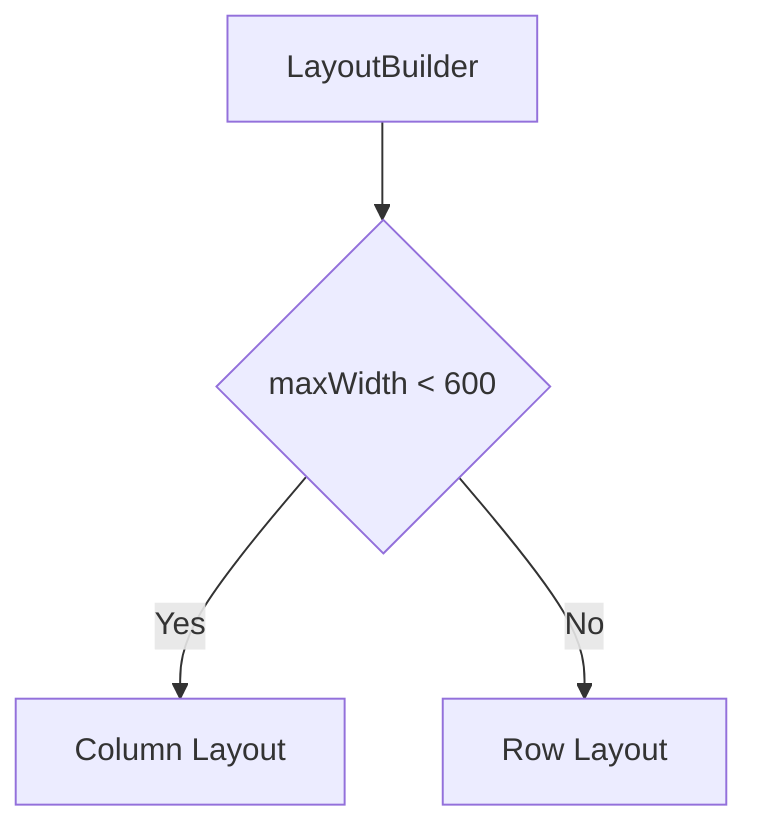

## 2.2.4 Using LayoutBuilder

In the world of mobile app development, creating responsive and adaptive user interfaces is crucial for delivering a seamless user experience across a variety of devices and screen sizes. Flutter, with its rich set of widgets, provides developers with powerful tools to achieve this. Among these tools, the `LayoutBuilder` widget stands out as a versatile and essential component for building responsive layouts that adapt to the constraints of their parent widgets. In this section, we will delve into the intricacies of the `LayoutBuilder`, exploring its role, functionality, and best practices for creating adaptive UIs.

### Introduction to LayoutBuilder

The `LayoutBuilder` widget is a fundamental building block in Flutter for constructing responsive layouts. It allows developers to build widgets that can adapt their structure and appearance based on the constraints imposed by their parent. This capability is particularly useful in scenarios where the available space can vary significantly, such as when designing for both mobile and desktop platforms.

**Role of LayoutBuilder:**

- **Responsive Layouts:** `LayoutBuilder` enables the creation of layouts that respond dynamically to changes in available space. By providing access to the constraints of its parent, it allows developers to make informed decisions about how to structure and size child widgets.
- **Adaptive UIs:** With `LayoutBuilder`, you can design UIs that adjust their layout based on the screen size, orientation, or any other environmental factor that affects the available space.

### Understanding Constraints

At the core of `LayoutBuilder` is the concept of constraints. In Flutter, constraints are a set of rules that dictate how a widget can be sized and positioned within its parent. The `LayoutBuilder` widget provides these constraints to its builder function, allowing developers to tailor the child widget's layout accordingly.

**BoxConstraints:**

- **Max and Min Dimensions:** `BoxConstraints` include properties such as `maxWidth`, `minWidth`, `maxHeight`, and `minHeight`, which define the boundaries within which a widget can be rendered.
- **Informing Layout Decisions:** By examining these constraints, developers can decide whether to display a widget in a compact form (e.g., a single column) or an expanded form (e.g., a multi-column layout).

### Code Examples

To illustrate the power and flexibility of `LayoutBuilder`, let's explore some practical examples.

**Example 1: Changing Layout Based on Available Width**

In this example, we use `LayoutBuilder` to switch between a column layout for small screens and a row layout for larger screens.

```dart
LayoutBuilder(
  builder: (context, constraints) {
    if (constraints.maxWidth < 600) {
      return Column(
        children: [
          Text('Small Screen Layout'),
          Icon(Icons.phone_android),
        ],
      );
    } else {
      return Row(
        children: [
          Text('Large Screen Layout'),
          Icon(Icons.desktop_windows),
        ],
      );
    }
  },
)
```

**Explanation:**

- **Constraints Check:** The `builder` function checks the `maxWidth` of the constraints. If it is less than 600 pixels, it renders a `Column` with a text and an icon, suitable for smaller screens.
- **Alternative Layout:** For larger screens, a `Row` is used, demonstrating how `LayoutBuilder` can adapt the UI based on available space.

**Example 2: Adjusting Grid Columns Based on Width**

This example demonstrates how to adjust the number of columns in a grid layout based on the screen width.

```dart
LayoutBuilder(
  builder: (context, constraints) {
    int columns = constraints.maxWidth > 800 ? 4 : 2;
    return GridView.count(
      crossAxisCount: columns,
      children: List.generate(20, (index) => Icon(Icons.star)),
    );
  },
)
```

**Explanation:**

- **Dynamic Columns:** The number of columns in the `GridView` is determined by the `maxWidth` of the constraints. If the width exceeds 800 pixels, four columns are used; otherwise, two columns are displayed.
- **Responsive Design:** This approach ensures that the grid layout remains visually appealing and functional across different screen sizes.

### Mermaid.js Diagrams

To further clarify the decision-making process within `LayoutBuilder`, let's visualize it using a Mermaid.js diagram.

**Diagram Showing LayoutBuilder Decision Making:**



**Explanation:**

- **Decision Node:** The diagram illustrates how `LayoutBuilder` evaluates the `maxWidth` to decide between a `Column` and a `Row` layout.
- **Flow:** The flowchart clearly shows the logical path taken based on the constraints, highlighting the adaptability of the `LayoutBuilder`.

### Best Practices

When using `LayoutBuilder`, there are several best practices to keep in mind to ensure optimal performance and maintainability of your Flutter applications.

- **Responsive Behaviors:** Leverage `LayoutBuilder` to implement complex responsive behaviors that are dependent on dynamic constraints. This allows your application to gracefully adapt to a wide range of devices and screen sizes.
- **Performance Considerations:** Avoid performing heavy computations or expensive operations inside the `builder` method. The `builder` function is called frequently, so keeping it lightweight is crucial for maintaining smooth performance.
- **Combining with Other Widgets:** Enhance the adaptability of your layouts by combining `LayoutBuilder` with other responsive widgets such as `Flexible` and `Expanded`. This combination allows for more granular control over how widgets adjust to available space.

### Conclusion

The `LayoutBuilder` widget is an indispensable tool in the Flutter developer's toolkit for creating responsive and adaptive user interfaces. By understanding and effectively utilizing the constraints provided by `LayoutBuilder`, developers can craft UIs that not only look great but also function seamlessly across a wide array of devices and screen sizes. As you continue to explore and experiment with `LayoutBuilder`, you will unlock new possibilities for delivering exceptional user experiences in your Flutter applications.

## Quiz Time!



### What is the primary role of the `LayoutBuilder` widget in Flutter?

- [x] To build responsive layouts based on the parent's constraints.
- [ ] To manage state across multiple widgets.
- [ ] To handle user input and gestures.
- [ ] To provide animations and transitions.

> **Explanation:** The `LayoutBuilder` widget is used to create responsive layouts by providing the constraints of its parent to its builder function, allowing for adaptive UI design.

### What does the `LayoutBuilder` widget provide to its builder function?

- [x] BoxConstraints
- [ ] AnimationController
- [ ] GestureDetector
- [ ] State

> **Explanation:** The `LayoutBuilder` provides `BoxConstraints` to its builder function, which informs the child widget's sizing and layout decisions.

### In the provided example, what layout is used when the `maxWidth` is less than 600 pixels?

- [x] Column
- [ ] Row
- [ ] Stack
- [ ] GridView

> **Explanation:** When the `maxWidth` is less than 600 pixels, a `Column` layout is used to accommodate smaller screens.

### How many columns are used in the grid layout when the `maxWidth` exceeds 800 pixels in the second example?

- [x] 4
- [ ] 2
- [ ] 3
- [ ] 5

> **Explanation:** When the `maxWidth` exceeds 800 pixels, the grid layout uses 4 columns.

### What should be avoided inside the `builder` method of `LayoutBuilder` to maintain performance?

- [x] Heavy computations
- [ ] Stateless widgets
- [ ] Simple text widgets
- [ ] Icon widgets

> **Explanation:** Heavy computations should be avoided inside the `builder` method to ensure smooth performance, as it is called frequently.

### Which of the following is a best practice when using `LayoutBuilder`?

- [x] Combine with `Flexible` and `Expanded` for enhanced adaptability.
- [ ] Use it for managing application state.
- [ ] Perform network requests inside the builder.
- [ ] Use it for handling animations.

> **Explanation:** Combining `LayoutBuilder` with `Flexible` and `Expanded` enhances adaptability by providing more control over how widgets adjust to available space.

### What is the purpose of `BoxConstraints` in Flutter?

- [x] To define the boundaries within which a widget can be rendered.
- [ ] To manage the state of a widget.
- [ ] To handle user input events.
- [ ] To provide animation properties.

> **Explanation:** `BoxConstraints` define the boundaries within which a widget can be rendered, informing layout decisions.

### What does the following `LayoutBuilder` code snippet do when the `maxWidth` is less than 600?

```dart
LayoutBuilder(
  builder: (context, constraints) {
    if (constraints.maxWidth < 600) {
      return Column(
        children: [
          Text('Small Screen Layout'),
          Icon(Icons.phone_android),
        ],
      );
    } else {
      return Row(
        children: [
          Text('Large Screen Layout'),
          Icon(Icons.desktop_windows),
        ],
      );
    }
  },
)
```

- [x] Displays a `Column` layout with text and an icon.
- [ ] Displays a `Row` layout with text and an icon.
- [ ] Displays a `Stack` layout with text and an icon.
- [ ] Displays a `GridView` layout with text and an icon.

> **Explanation:** When the `maxWidth` is less than 600, the code snippet displays a `Column` layout with text and an icon.

### What is a potential pitfall when using `LayoutBuilder`?

- [x] Performing heavy computations inside the builder function.
- [ ] Using it with `StatelessWidget`.
- [ ] Combining it with `Flexible`.
- [ ] Using it for simple layouts.

> **Explanation:** Performing heavy computations inside the builder function can lead to performance issues, as it is called frequently.

### True or False: `LayoutBuilder` can be used to create adaptive UIs that respond to changes in screen orientation.

- [x] True
- [ ] False

> **Explanation:** True. `LayoutBuilder` can be used to create adaptive UIs that respond to changes in screen orientation by adjusting the layout based on the constraints provided.


