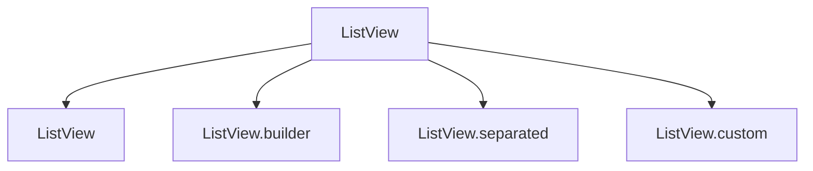

## 2.3.1 ListView and Its Variants

In the world of mobile app development, presenting data in a structured and scrollable format is a common requirement. Flutter, with its rich set of widgets, offers the `ListView` widget as a versatile solution for creating scrollable lists. This section delves into the various facets of `ListView`, its variants, and how to leverage them to build responsive and efficient UIs.

### Introduction to ListView

The `ListView` widget in Flutter is a powerful tool designed to display a scrollable list of widgets. Whether you're building a simple list of items or a complex, dynamic list that loads data on demand, `ListView` provides the flexibility and performance needed to handle these scenarios efficiently.

#### Purpose of ListView

The primary purpose of `ListView` is to enable developers to create scrollable lists of widgets. It is particularly useful when dealing with a large number of items that need to be displayed in a vertical or horizontal list. `ListView` ensures that only the visible portion of the list is rendered, which optimizes performance and memory usage.

#### Scenarios for Using ListView

`ListView` is preferred over other scrolling widgets in scenarios where:

- You need to display a list of items that can be scrolled vertically or horizontally.
- The list can have a dynamic number of items, potentially loading more as the user scrolls.
- You require a simple, straightforward way to implement lists with minimal setup.

### Variants of ListView

Flutter provides several variants of `ListView`, each catering to different use cases and offering varying levels of customization and efficiency.

#### Regular ListView

The simplest form of `ListView` is the regular `ListView`, which is ideal for static lists where the number of items is known and relatively small. This variant is straightforward to implement and is often used for quick prototypes or simple applications.

**Example:**

```dart
ListView(
  children: [
    ListTile(title: Text('Item 1')),
    ListTile(title: Text('Item 2')),
    ListTile(title: Text('Item 3')),
  ],
)
```

In this example, a `ListView` is created with three static `ListTile` widgets. This approach is suitable for lists with a fixed number of items that do not require dynamic loading.

#### ListView.builder

For larger or potentially infinite lists, `ListView.builder` is the go-to choice. It builds list items on demand, which significantly improves performance by rendering only the visible items.

**Key Properties:**

- `itemBuilder`: A function that returns a widget for each item in the list. It provides the context and index of the item.
- `itemCount`: The total number of items in the list. If the list is infinite, this can be set to `null`.

**Example:**

```dart
ListView.builder(
  itemCount: 100,
  itemBuilder: (context, index) {
    return ListTile(title: Text('Item $index'));
  },
)
```

Here, `ListView.builder` efficiently creates a list of 100 items, rendering only those that are visible. This approach is ideal for lists that may grow in size or require dynamic content loading.

#### ListView.separated

To introduce separators between list items, `ListView.separated` is an excellent choice. It allows for better visual distinction between items by inserting a separator widget between each item.

**Key Properties:**

- `separatorBuilder`: A function that returns a widget to display between list items.
- `itemBuilder`: Similar to `ListView.builder`, it returns a widget for each list item.
- `itemCount`: The total number of items in the list.

**Example:**

```dart
ListView.separated(
  itemCount: 20,
  separatorBuilder: (context, index) => Divider(),
  itemBuilder: (context, index) {
    return ListTile(title: Text('Item $index'));
  },
)
```

In this example, a `Divider` widget is used as a separator between each list item, enhancing readability and organization.

#### ListView.custom

For advanced customization, `ListView.custom` provides the flexibility to define how children are managed using a `SliverChildDelegate`. This variant is useful when you need fine-grained control over the list's behavior and appearance.

**When to Use ListView.custom:**

- When you need to implement complex list behaviors not supported by other `ListView` variants.
- When you want to optimize performance for very large datasets with custom caching or recycling strategies.

**Example:**

Implementing `ListView.custom` requires a deeper understanding of Flutter's sliver architecture, which is beyond the scope of this introductory section. However, it's important to recognize its potential for highly customized list implementations.

### Mermaid.js Diagrams

To visualize the relationship between different `ListView` variants, consider the following diagram:



This diagram illustrates the hierarchy and specialization of `ListView` variants, each offering unique features to address specific use cases.

### Best Practices

When working with `ListView` and its variants, consider the following best practices to ensure optimal performance and user experience:

- **Use `ListView.builder` for Large Lists:** For lists with a large number of items, `ListView.builder` is preferred due to its efficient item rendering.
- **Enhance Readability with `ListView.separated`:** Use `ListView.separated` to introduce consistent separators between items, improving the visual structure of the list.
- **Avoid Nested Scrolling Widgets:** Placing a `ListView` inside another scrollable widget can lead to scrolling conflicts. Instead, use a single scrollable parent or manage scrolling manually.
- **Optimize Item Building:** Minimize the complexity of item widgets to reduce build times and improve scrolling performance.

### Conclusion

The `ListView` widget and its variants are indispensable tools in Flutter for creating responsive and efficient scrollable lists. By understanding the strengths and appropriate use cases for each variant, you can build applications that handle data presentation with elegance and performance.

As you continue to explore Flutter's capabilities, consider experimenting with different `ListView` configurations to find the best fit for your application's needs. Remember to keep performance and user experience at the forefront of your design decisions.

## Quiz Time!



### What is the primary purpose of the ListView widget in Flutter?

- [x] To create scrollable lists of widgets
- [ ] To manage state in Flutter applications
- [ ] To handle user input events
- [ ] To perform network requests

> **Explanation:** The primary purpose of the `ListView` widget is to create scrollable lists of widgets, allowing for efficient display of large datasets.

### When should you use ListView.builder over a regular ListView?

- [x] When dealing with a large or infinite list of items
- [ ] When you have a fixed number of items
- [ ] When you need separators between items
- [ ] When you require advanced customization

> **Explanation:** `ListView.builder` is ideal for large or infinite lists because it builds items on demand, improving performance.

### What property does ListView.separated have that ListView.builder does not?

- [ ] itemBuilder
- [ ] itemCount
- [x] separatorBuilder
- [ ] scrollDirection

> **Explanation:** `ListView.separated` includes the `separatorBuilder` property, which allows for inserting separators between list items.

### Which ListView variant should you use for advanced customization with a SliverChildDelegate?

- [ ] ListView
- [ ] ListView.builder
- [ ] ListView.separated
- [x] ListView.custom

> **Explanation:** `ListView.custom` allows for advanced customization using a `SliverChildDelegate`, providing more control over the list's behavior.

### What is a common pitfall when using ListView inside another scrollable widget?

- [ ] Improved performance
- [x] Scrolling conflicts
- [ ] Enhanced readability
- [ ] Reduced memory usage

> **Explanation:** Nesting `ListView` inside another scrollable widget can lead to scrolling conflicts, which should be avoided.

### Which ListView variant is best for introducing consistent separators between items?

- [ ] ListView
- [ ] ListView.builder
- [x] ListView.separated
- [ ] ListView.custom

> **Explanation:** `ListView.separated` is designed to introduce consistent separators between items, enhancing readability.

### What is the role of the itemBuilder property in ListView.builder?

- [x] To define how each list item is built
- [ ] To specify the number of items in the list
- [ ] To insert separators between items
- [ ] To manage scrolling behavior

> **Explanation:** The `itemBuilder` property in `ListView.builder` defines how each list item is built, providing the context and index.

### How does ListView.builder improve performance for large lists?

- [x] By building only the visible items on demand
- [ ] By preloading all items at once
- [ ] By using a fixed number of items
- [ ] By caching all items in memory

> **Explanation:** `ListView.builder` improves performance by building only the visible items on demand, reducing memory usage.

### What is a key advantage of using ListView.custom?

- [ ] Simplicity in implementation
- [ ] Built-in separators
- [x] Advanced customization with SliverChildDelegate
- [ ] Automatic item caching

> **Explanation:** `ListView.custom` offers advanced customization with `SliverChildDelegate`, allowing for complex list behaviors.

### True or False: ListView is the only widget in Flutter for creating scrollable lists.

- [ ] True
- [x] False

> **Explanation:** False. Flutter offers other widgets like `SingleChildScrollView`, `CustomScrollView`, and `GridView` for creating scrollable content.


