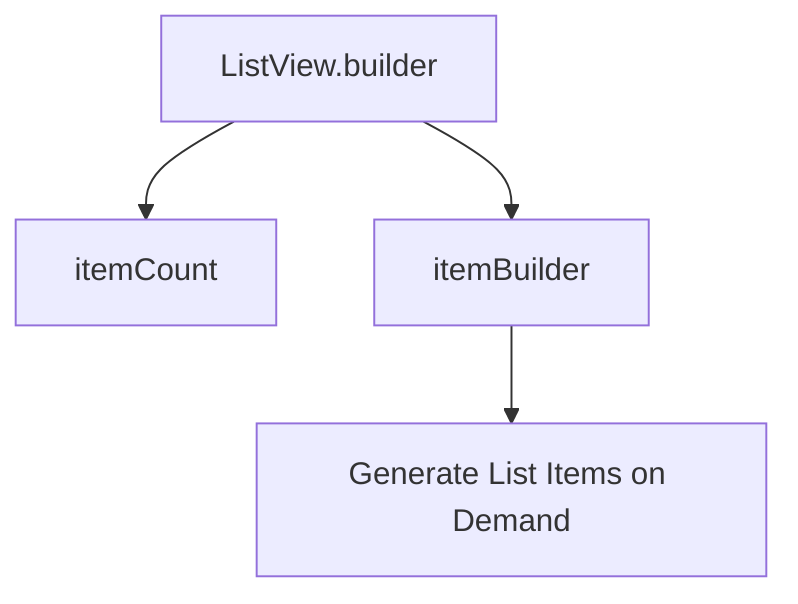

---

linkTitle: "2.3.2 Optimizing Lists with ListView.builder"
title: "Optimizing Lists with ListView.builder for Efficient Flutter Apps"
description: "Explore the performance benefits and best practices of using ListView.builder in Flutter to create efficient, memory-friendly lists that enhance app responsiveness."
categories:
- Flutter Development
- Mobile App Design
- UI/UX
tags:
- Flutter
- ListView.builder
- Performance Optimization
- Mobile Development
- UI Design
date: 2024-10-25
type: docs
nav_weight: 232000
canonical: "https://fluttermasterylibrary.com/6/2/3/2"
license: "© 2023 Tokenizer Inc. CC BY-NC-SA 4.0"
---

## 2.3.2 Optimizing Lists with ListView.builder

In the world of mobile app development, creating efficient and responsive user interfaces is paramount. Flutter, with its rich set of widgets, provides powerful tools to achieve this. One such tool is the `ListView.builder`, a widget designed to handle long lists of items efficiently. In this section, we'll delve into the intricacies of `ListView.builder`, exploring its performance benefits, key properties, and best practices to optimize your Flutter applications.

### Why Use ListView.builder

When dealing with lists in Flutter, especially large ones, performance and memory efficiency become critical. The `ListView.builder` widget is specifically designed to address these concerns by building list items on demand. This approach offers several advantages:

- **Performance Benefits:** By generating only the visible items, `ListView.builder` minimizes the computational overhead associated with rendering large lists. This ensures that your app remains smooth and responsive, even with extensive datasets.

- **Memory Efficiency:** Instead of creating all list items at once, `ListView.builder` constructs them as needed. This lazy loading mechanism reduces memory consumption, which is particularly beneficial for devices with limited resources.

### Key Properties of ListView.builder

Understanding the key properties of `ListView.builder` is essential for leveraging its full potential. Let's explore these properties in detail:

#### itemBuilder

The `itemBuilder` property is a function that constructs each widget in the list. It takes two parameters: the `BuildContext` and the index of the item to be built. This function is called lazily, meaning it only builds the widgets that are currently visible on the screen.

- **Lightweight Widgets:** It's crucial to return lightweight widgets from `itemBuilder` to maintain smooth scrolling. Avoid complex calculations or network requests within this function, as they can degrade performance.

- **Example Usage:**

  ```dart
  ListView.builder(
    itemCount: 50,
    itemBuilder: (context, index) {
      return ListTile(
        leading: Icon(Icons.person),
        title: Text('Person $index'),
        subtitle: Text('Subtitle $index'),
      );
    },
  )
  ```

#### itemCount

The `itemCount` property specifies the total number of items in the list. It helps `ListView.builder` determine when to stop calling `itemBuilder`. This property is particularly useful when dealing with dynamic data sources, where the number of items may change.

- **Dynamic Data Handling:** If your data source is dynamic, ensure that `itemCount` reflects the current size of your data list. This prevents index out-of-range errors and ensures that all items are displayed correctly.

- **Example Usage:**

  ```dart
  final List<String> names = ['Alice', 'Bob', 'Charlie', 'Diana'];

  ListView.builder(
    itemCount: names.length,
    itemBuilder: (context, index) {
      return ListTile(title: Text(names[index]));
    },
  )
  ```

### Code Examples

To illustrate the concepts discussed, let's look at two practical examples of using `ListView.builder`.

#### Example 1: Simple ListView.builder with Static Data

In this example, we create a list of 50 static items using `ListView.builder`. Each item is represented by a `ListTile` widget with an icon, title, and subtitle.

```dart
ListView.builder(
  itemCount: 50,
  itemBuilder: (context, index) {
    return ListTile(
      leading: Icon(Icons.person),
      title: Text('Person $index'),
      subtitle: Text('Subtitle $index'),
    );
  },
)
```

#### Example 2: ListView.builder with Dynamic Data from a List

Here, we use `ListView.builder` to display a list of names stored in a dynamic list. The `itemCount` property is set to the length of the list, ensuring all names are displayed.

```dart
final List<String> names = ['Alice', 'Bob', 'Charlie', 'Diana'];

ListView.builder(
  itemCount: names.length,
  itemBuilder: (context, index) {
    return ListTile(title: Text(names[index]));
  },
)
```

### Mermaid.js Diagrams

To better understand the process of `ListView.builder`, let's visualize it using a Mermaid.js flowchart.



### Best Practices

To maximize the efficiency and performance of `ListView.builder`, consider the following best practices:

- **Limit Widget Complexity:** Keep the widgets returned by `itemBuilder` as simple as possible. Avoid heavy computations or network calls within this function.

- **Use Keys Wisely:** Assign unique keys to list items to help Flutter manage widget states effectively, especially when the list changes dynamically.

- **State Management:** If you need to preserve the state of list items, consider using `AutomaticKeepAliveClientMixin`. This mixin allows widgets to maintain their state even when they are scrolled out of view.

- **Optimize for Smooth Scrolling:** Ensure that your list items are lightweight and that any animations or transitions are optimized for performance.

### Conclusion

The `ListView.builder` widget is a powerful tool for creating efficient and responsive lists in Flutter applications. By understanding its key properties and following best practices, you can build lists that are both performant and memory-efficient. Whether you're working with static or dynamic data, `ListView.builder` provides the flexibility and scalability needed to handle large datasets with ease.

### Further Exploration

For more information on optimizing lists in Flutter, consider exploring the following resources:

- [Flutter Official Documentation](https://flutter.dev/docs)
- [Effective Dart: Performance](https://dart.dev/guides/language/effective-dart/performance)
- [Flutter Performance Best Practices](https://flutter.dev/docs/perf)

By mastering `ListView.builder`, you can enhance the user experience of your Flutter applications, ensuring they remain fast and responsive across a wide range of devices.

## Quiz Time!



### What is the primary benefit of using ListView.builder over ListView?

- [x] It builds list items on demand, improving performance.
- [ ] It allows for more complex widgets.
- [ ] It automatically handles network requests.
- [ ] It requires less code.

> **Explanation:** ListView.builder builds list items on demand, which is more efficient for large lists as it reduces memory usage and improves performance.

### How does the itemBuilder function in ListView.builder work?

- [x] It generates each widget in the list as needed.
- [ ] It preloads all widgets at once.
- [ ] It only builds widgets when the list is scrolled to the end.
- [ ] It requires manual updates for each widget.

> **Explanation:** The itemBuilder function generates each widget in the list on demand, only creating widgets that are currently visible.

### What does the itemCount property in ListView.builder specify?

- [x] The total number of items in the list.
- [ ] The number of visible items.
- [ ] The number of items to preload.
- [ ] The maximum number of items allowed.

> **Explanation:** The itemCount property specifies the total number of items in the list, helping ListView.builder determine when to stop calling itemBuilder.

### Why is it important to return lightweight widgets from itemBuilder?

- [x] To maintain smooth scrolling performance.
- [ ] To ensure all widgets are visible.
- [ ] To reduce code complexity.
- [ ] To improve network performance.

> **Explanation:** Returning lightweight widgets from itemBuilder helps maintain smooth scrolling performance by reducing the computational overhead.

### How can you handle dynamic data sources in ListView.builder?

- [x] Update the itemCount property to reflect the current data length.
- [ ] Use a static list of items.
- [ ] Preload all data at once.
- [ ] Manually refresh the list.

> **Explanation:** For dynamic data sources, update the itemCount property to reflect the current data length to ensure all items are displayed correctly.

### What is a common use case for assigning keys to list items in ListView.builder?

- [x] To help Flutter manage widget states correctly.
- [ ] To improve network performance.
- [ ] To reduce code complexity.
- [ ] To automatically update itemCount.

> **Explanation:** Assigning keys to list items helps Flutter manage widget states correctly, especially when the list changes dynamically.

### When should you consider using AutomaticKeepAliveClientMixin in ListView.builder?

- [x] When you need to preserve the state of list items.
- [ ] When you have a static list.
- [ ] When you want to preload all items.
- [ ] When you need to reduce memory usage.

> **Explanation:** Use AutomaticKeepAliveClientMixin when you need to preserve the state of list items, even when they are scrolled out of view.

### What is a potential drawback of using complex widgets in itemBuilder?

- [x] It can degrade scrolling performance.
- [ ] It improves memory efficiency.
- [ ] It enhances visual appeal.
- [ ] It simplifies code structure.

> **Explanation:** Using complex widgets in itemBuilder can degrade scrolling performance due to increased computational overhead.

### How does ListView.builder improve memory efficiency?

- [x] By building items on demand rather than all at once.
- [ ] By preloading all items.
- [ ] By reducing the number of visible items.
- [ ] By caching all data locally.

> **Explanation:** ListView.builder improves memory efficiency by building items on demand, reducing the need to store all items in memory at once.

### True or False: ListView.builder is only suitable for static lists.

- [ ] True
- [x] False

> **Explanation:** False. ListView.builder is suitable for both static and dynamic lists, as it can handle changes in data efficiently.


