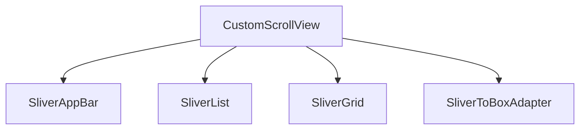

## 2.3.3 Slivers and CustomScrollView

In the world of mobile app development, creating smooth, responsive, and visually appealing scrolling interfaces is crucial. Flutter, with its rich set of widgets, offers a powerful toolset for building such interfaces: Slivers and `CustomScrollView`. This section will guide you through understanding and leveraging these components to create dynamic and flexible UIs.

### Introduction to Slivers

Slivers are a fundamental concept in Flutter, providing the building blocks for creating custom scrollable areas. Unlike traditional list views, slivers offer a high degree of flexibility, allowing developers to implement advanced scrolling effects and layouts. 

- **What are Slivers?**
  - Slivers are portions of a scrollable area that can change their size and shape as you scroll. They are designed to be used within a `CustomScrollView`, which orchestrates their behavior.
  - They allow for more complex and dynamic layouts compared to standard list views, enabling features like parallax effects, sticky headers, and more.

- **Role of Slivers in Flutter:**
  - Slivers enable developers to create scrollable areas that are not just limited to lists or grids. They can be combined to form intricate and highly customized user interfaces.
  - They provide a way to manage large amounts of data efficiently, as they only build the widgets that are currently visible on the screen.

### CustomScrollView

`CustomScrollView` is a versatile widget that acts as a container for multiple slivers. It allows you to mix and match different types of slivers to create unique scrolling experiences.

- **How `CustomScrollView` Works:**
  - It takes a list of slivers as its children and manages their layout and scrolling behavior.
  - It provides a flexible framework for combining different sliver types, such as `SliverList`, `SliverGrid`, `SliverAppBar`, and `SliverToBoxAdapter`.

- **Common Slivers:**
  - **`SliverList`:** Used to create a scrollable list of items. It is similar to `ListView` but offers more customization options.
  - **`SliverGrid`:** Allows for creating grid layouts within a scrollable area. It is similar to `GridView` but with the added flexibility of slivers.
  - **`SliverAppBar`:** A scrollable app bar that can expand, collapse, and float as you scroll.
  - **`SliverToBoxAdapter`:** A simple sliver that allows you to insert a regular widget into a sliver list.

### Code Examples

To illustrate how slivers and `CustomScrollView` work together, let's look at some practical code examples.

#### Example 1: Basic `CustomScrollView` with `SliverList`

This example demonstrates a simple `CustomScrollView` containing a `SliverAppBar` and a `SliverList`.

```dart
CustomScrollView(
  slivers: [
    SliverAppBar(
      floating: true,
      title: Text('SliverList Example'),
    ),
    SliverList(
      delegate: SliverChildBuilderDelegate(
        (context, index) => ListTile(title: Text('Item $index')),
        childCount: 100,
      ),
    ),
  ],
)
```

- **Explanation:**
  - The `SliverAppBar` provides a floating app bar that scrolls with the content.
  - The `SliverList` uses a `SliverChildBuilderDelegate` to lazily build list items, optimizing performance by only creating visible items.

#### Example 2: Combining `SliverGrid` with `SliverList`

In this example, we combine a `SliverGrid` and a `SliverList` within a `CustomScrollView`.

```dart
CustomScrollView(
  slivers: [
    SliverAppBar(
      pinned: true,
      title: Text('SliverGrid and SliverList'),
    ),
    SliverGrid(
      gridDelegate: SliverGridDelegateWithFixedCrossAxisCount(crossAxisCount: 3),
      delegate: SliverChildBuilderDelegate(
        (context, index) => Container(
          color: Colors.blue,
          margin: EdgeInsets.all(4),
          child: Center(child: Text('Grid $index')),
        ),
        childCount: 30,
      ),
    ),
    SliverList(
      delegate: SliverChildBuilderDelegate(
        (context, index) => ListTile(title: Text('List Item $index')),
        childCount: 50,
      ),
    ),
  ],
)
```

- **Explanation:**
  - The `SliverAppBar` is pinned, meaning it remains visible at the top of the screen when scrolling.
  - The `SliverGrid` displays items in a grid format, with a fixed number of columns.
  - The `SliverList` follows the grid, providing a seamless transition between different types of content.

### Mermaid.js Diagrams

To better understand how slivers fit within a `CustomScrollView`, let's visualize the structure using a Mermaid.js diagram.



- **Diagram Explanation:**
  - The diagram shows a `CustomScrollView` containing various slivers, illustrating how they are organized and interact within the scrollable area.

### Best Practices

When working with slivers and `CustomScrollView`, consider the following best practices to ensure optimal performance and maintainability:

- **Use Slivers for Customization:**
  - Slivers are ideal for creating highly customized scrolling behaviors and layouts. Use them to implement features like sticky headers, parallax effects, and more.
  
- **Optimize Sliver Implementations:**
  - Be mindful of performance, especially when dealing with complex nested slivers. Use lazy loading techniques provided by slivers to minimize resource usage.

- **Leverage Existing Slivers:**
  - Before creating custom slivers, explore the existing sliver widgets provided by Flutter. They often cover common use cases and can simplify your codebase.

### Conclusion

Slivers and `CustomScrollView` are powerful tools in Flutter for creating responsive and adaptive UIs. By understanding and utilizing these components, you can build complex, dynamic, and efficient scrolling interfaces that enhance the user experience. Experiment with different sliver combinations and configurations to discover the full potential of these widgets in your projects.

### Additional Resources

To further enhance your understanding of slivers and `CustomScrollView`, consider exploring the following resources:

- [Flutter Official Documentation on Slivers](https://flutter.dev/docs/development/ui/advanced/slivers)
- [Flutter Widget of the Week: CustomScrollView](https://www.youtube.com/watch?v=ORiTTaVY6mM)
- Books and courses on advanced Flutter UI design

By mastering slivers and `CustomScrollView`, you'll be well-equipped to tackle even the most demanding UI challenges in your Flutter applications.

## Quiz Time!



### What are slivers in Flutter?

- [x] Portions of a scrollable area that can change size and shape as you scroll.
- [ ] Widgets that are always visible on the screen.
- [ ] Static components that do not interact with scrolling.
- [ ] A type of animation in Flutter.

> **Explanation:** Slivers are dynamic portions of a scrollable area, allowing for advanced scrolling effects and layouts.

### Which widget acts as a container for multiple slivers?

- [x] CustomScrollView
- [ ] ListView
- [ ] GridView
- [ ] SingleChildScrollView

> **Explanation:** `CustomScrollView` is designed to hold and manage multiple slivers, providing a flexible scrolling framework.

### What is the role of a SliverAppBar?

- [x] A scrollable app bar that can expand, collapse, and float.
- [ ] A static header that remains at the top of the screen.
- [ ] A widget for displaying lists.
- [ ] A widget for displaying grids.

> **Explanation:** `SliverAppBar` provides a scrollable app bar that can change its size and position as you scroll.

### How does SliverList optimize performance?

- [x] By lazily building only the visible list items.
- [ ] By preloading all items in memory.
- [ ] By using static widgets that never change.
- [ ] By caching all data locally.

> **Explanation:** `SliverList` uses lazy loading to build only the items currently visible on the screen, optimizing performance.

### What is the purpose of SliverToBoxAdapter?

- [x] To insert a regular widget into a sliver list.
- [ ] To create a grid layout.
- [ ] To manage app bar behavior.
- [ ] To handle network requests.

> **Explanation:** `SliverToBoxAdapter` allows you to include non-sliver widgets within a `CustomScrollView`.

### Which sliver is used to create grid layouts?

- [x] SliverGrid
- [ ] SliverList
- [ ] SliverAppBar
- [ ] SliverToBoxAdapter

> **Explanation:** `SliverGrid` is specifically designed for creating grid layouts within a scrollable area.

### What is a key advantage of using slivers?

- [x] They allow for highly customized scrolling behaviors and layouts.
- [ ] They simplify the codebase by removing all customizations.
- [ ] They are easier to use than all other widgets.
- [ ] They automatically handle all animations.

> **Explanation:** Slivers provide flexibility and customization for creating advanced scrolling interfaces.

### How can you prevent performance issues with slivers?

- [x] By optimizing sliver implementations and using lazy loading techniques.
- [ ] By avoiding the use of slivers altogether.
- [ ] By preloading all data at once.
- [ ] By using only static widgets.

> **Explanation:** Optimizing sliver implementations and using lazy loading can help prevent performance issues.

### What does the Mermaid.js diagram illustrate in this section?

- [x] The structure of a CustomScrollView containing various slivers.
- [ ] The lifecycle of a Flutter widget.
- [ ] The architecture of a Flutter application.
- [ ] The process of handling user input.

> **Explanation:** The diagram shows how different slivers are organized within a `CustomScrollView`.

### True or False: Slivers can only be used with ListView.

- [ ] True
- [x] False

> **Explanation:** Slivers are designed to be used with `CustomScrollView`, not limited to `ListView`.


