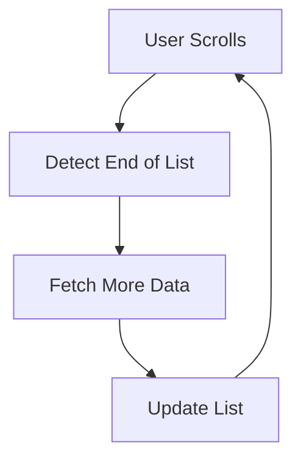

## 2.3.4 Infinite Scrolling and Pagination

In the world of mobile applications, efficiently managing and displaying large datasets is a common challenge. Infinite scrolling and pagination are two popular techniques that can enhance user experience by dynamically loading data as needed, reducing initial load times and memory usage. This section delves into these techniques, offering insights into their implementation in Flutter.

### Introduction to Infinite Scrolling

Infinite scrolling is a design pattern where content is continuously loaded as the user scrolls down a list. This approach is widely used in social media feeds, news apps, and any application where users expect to browse through extensive content without interruption.

**Use Cases for Infinite Scrolling:**

- **Social Media Feeds:** Platforms like Facebook and Twitter use infinite scrolling to keep users engaged by continuously loading new posts.
- **E-commerce Catalogs:** Online stores can display products without overwhelming users with a long initial load time.
- **News Applications:** News apps can present articles in a seamless stream, encouraging users to consume more content.

### Implementing Infinite Scrolling

To implement infinite scrolling in Flutter, you can use a `ScrollController` to detect when the user has reached the end of the list. This detection triggers the fetching of additional data, which is then appended to the existing list.

#### Detecting End of List with `ScrollController`

A `ScrollController` is used to monitor the scroll position of a `ListView`. By adding a listener to the controller, you can check when the user has scrolled to the bottom of the list.

```dart
class InfiniteList extends StatefulWidget {
  @override
  _InfiniteListState createState() => _InfiniteListState();
}

class _InfiniteListState extends State<InfiniteList> {
  final ScrollController _controller = ScrollController();
  List<int> _items = List.generate(20, (index) => index);
  bool _isLoading = false;

  @override
  void initState() {
    super.initState();
    _controller.addListener(() {
      if (_controller.position.pixels == _controller.position.maxScrollExtent && !_isLoading) {
        _fetchMore();
      }
    });
  }

  Future<void> _fetchMore() async {
    setState(() {
      _isLoading = true;
    });

    // Simulate fetching data from an API
    await Future.delayed(Duration(seconds: 2));
    List<int> newItems = List.generate(20, (index) => _items.length + index);
    setState(() {
      _items.addAll(newItems);
      _isLoading = false;
    });
  }

  @override
  Widget build(BuildContext context) {
    return ListView.builder(
      controller: _controller,
      itemCount: _items.length + 1,
      itemBuilder: (context, index) {
        if (index == _items.length) {
          return _isLoading ? Center(child: CircularProgressIndicator()) : SizedBox.shrink();
        }
        return ListTile(title: Text('Item ${_items[index]}'));
      },
    );
  }

  @override
  void dispose() {
    _controller.dispose();
    super.dispose();
  }
}
```

**Explanation:**

- **ScrollController:** Monitors the scroll position.
- **Listener:** Triggers data fetching when the end of the list is reached.
- **Loading Indicator:** Displays a `CircularProgressIndicator` while new data is being fetched.

### Pagination Strategies

Pagination is another technique to manage large datasets by dividing them into discrete pages. This approach is beneficial when dealing with APIs that support paginated responses.

#### Different Pagination Techniques

- **Page-Based Pagination:** Fetches data in fixed-size pages. Each page contains a set number of items.
- **Offset-Based Pagination:** Uses an offset to determine the starting point for data fetching. This method is useful for APIs that support offset queries.

#### Implementing Pagination with Page Numbers

Here's how you can implement pagination using page numbers in Flutter:

```dart
class PaginatedList extends StatefulWidget {
  @override
  _PaginatedListState createState() => _PaginatedListState();
}

class _PaginatedListState extends State<PaginatedList> {
  final ScrollController _controller = ScrollController();
  List<String> _posts = [];
  int _page = 1;
  bool _isLoading = false;

  @override
  void initState() {
    super.initState();
    _fetchPosts();

    _controller.addListener(() {
      if (_controller.position.pixels == _controller.position.maxScrollExtent && !_isLoading) {
        _fetchPosts();
      }
    });
  }

  Future<void> _fetchPosts() async {
    setState(() {
      _isLoading = true;
    });

    // Simulate fetching paginated data
    await Future.delayed(Duration(seconds: 2));
    List<String> newPosts = List.generate(10, (index) => 'Post ${(_page - 1) * 10 + index + 1}');
    setState(() {
      _posts.addAll(newPosts);
      _page++;
      _isLoading = false;
    });
  }

  @override
  Widget build(BuildContext context) {
    return ListView.builder(
      controller: _controller,
      itemCount: _posts.length + 1,
      itemBuilder: (context, index) {
        if (index == _posts.length) {
          return _isLoading ? Center(child: CircularProgressIndicator()) : SizedBox.shrink();
        }
        return ListTile(title: Text(_posts[index]));
      },
    );
  }

  @override
  void dispose() {
    _controller.dispose();
    super.dispose();
  }
}
```

**Explanation:**

- **Page Number Tracking:** Keeps track of the current page to fetch the correct data.
- **Data Fetching:** Simulates an API call to fetch new posts.
- **Incrementing Page:** Increases the page number after each successful data fetch.

### Mermaid.js Diagrams

To better understand the infinite scrolling process, consider the following diagram:



**Diagram Explanation:**

- **User Scrolls:** The process begins when the user scrolls through the list.
- **Detect End of List:** The application detects when the user reaches the end.
- **Fetch More Data:** Additional data is fetched from the server or local storage.
- **Update List:** The new data is appended to the existing list, allowing the user to continue scrolling.

### Best Practices

Implementing infinite scrolling and pagination effectively requires attention to detail and user experience considerations.

- **Loading Indicators:** Always provide visual feedback to users when data is being loaded. This can be a spinner or a loading bar.
- **Error Handling:** Implement robust error handling to manage network failures or API errors gracefully.
- **Optimize Data Fetching:** Avoid redundant API calls by ensuring data is only fetched when necessary. Consider using debounce techniques to manage rapid scroll events.
- **User Experience:** Ensure that the scrolling experience remains smooth, even when loading new data. This may involve optimizing the data fetching process and managing state efficiently.

### Conclusion

Infinite scrolling and pagination are powerful techniques for managing large datasets in mobile applications. By implementing these strategies in Flutter, you can create responsive and efficient user interfaces that enhance user engagement and satisfaction. The provided examples and best practices offer a solid foundation for integrating these features into your applications.

## Quiz Time!



### What is infinite scrolling?

- [x] A design pattern where content is continuously loaded as the user scrolls down a list.
- [ ] A method to load all data at once before displaying it.
- [ ] A technique to paginate data into fixed-size pages.
- [ ] A way to display data in a grid format.

> **Explanation:** Infinite scrolling is a design pattern where content is continuously loaded as the user scrolls down a list, commonly used in social media feeds and news apps.

### Which Flutter widget is used to monitor scroll position for infinite scrolling?

- [x] ScrollController
- [ ] ListView
- [ ] ScrollView
- [ ] PageView

> **Explanation:** `ScrollController` is used to monitor the scroll position and detect when the user has reached the end of the list.

### What is a key advantage of using infinite scrolling?

- [x] It reduces initial load times and memory usage by loading data as needed.
- [ ] It loads all data at once, improving performance.
- [ ] It simplifies the user interface by displaying fewer items.
- [ ] It eliminates the need for a loading indicator.

> **Explanation:** Infinite scrolling reduces initial load times and memory usage by loading data as needed, enhancing user experience.

### How can you implement pagination in Flutter?

- [x] By using page numbers or offsets to fetch data in discrete pages.
- [ ] By loading all data at once and displaying it in a grid.
- [ ] By using a single API call to fetch all data.
- [ ] By displaying only the first 10 items and ignoring the rest.

> **Explanation:** Pagination can be implemented by using page numbers or offsets to fetch data in discrete pages, allowing for efficient data management.

### What is the purpose of a loading indicator in infinite scrolling?

- [x] To inform users when new data is being fetched.
- [ ] To display the total number of items in the list.
- [ ] To show the current page number.
- [ ] To hide the list while data is loading.

> **Explanation:** A loading indicator informs users when new data is being fetched, enhancing user experience by providing feedback.

### What is a common challenge when implementing infinite scrolling?

- [x] Handling rapid scroll events and preventing redundant API calls.
- [ ] Displaying all data at once.
- [ ] Ensuring the list is always full.
- [ ] Hiding the loading indicator.

> **Explanation:** A common challenge is handling rapid scroll events and preventing redundant API calls, which can affect performance.

### Which diagram best represents the infinite scrolling process?

- [x] A flowchart showing user scrolls, detecting end of list, fetching more data, and updating the list.
- [ ] A bar chart showing the number of items loaded.
- [ ] A pie chart showing the percentage of data loaded.
- [ ] A line graph showing scroll speed over time.

> **Explanation:** A flowchart best represents the infinite scrolling process, illustrating the steps involved in loading additional data.

### What is a debounce technique used for in infinite scrolling?

- [x] To manage rapid scroll events and optimize data fetching.
- [ ] To increase the speed of data loading.
- [ ] To decrease the number of items displayed.
- [ ] To hide the loading indicator.

> **Explanation:** A debounce technique is used to manage rapid scroll events and optimize data fetching, preventing excessive API calls.

### What is the difference between infinite scrolling and pagination?

- [x] Infinite scrolling continuously loads data as the user scrolls, while pagination divides data into discrete pages.
- [ ] Infinite scrolling loads all data at once, while pagination loads data as needed.
- [ ] Infinite scrolling is used for small datasets, while pagination is for large datasets.
- [ ] Infinite scrolling requires a loading indicator, while pagination does not.

> **Explanation:** Infinite scrolling continuously loads data as the user scrolls, while pagination divides data into discrete pages, each fetched separately.

### True or False: Infinite scrolling is always the best choice for displaying large datasets.

- [ ] True
- [x] False

> **Explanation:** False. While infinite scrolling is useful for certain applications, it may not be suitable for all use cases, such as when users need to access specific items quickly.


