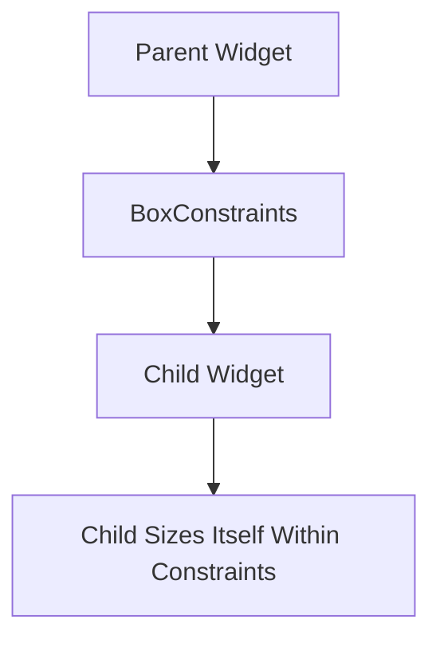

## 2.4.1 Constraint-Based Layouts

In the world of Flutter, understanding how constraints work is crucial for building responsive and adaptive user interfaces. Flutter's layout mechanism is fundamentally based on constraints, which dictate how widgets are sized and positioned within their parent containers. This section delves into the intricacies of constraint-based layouts, providing insights into how Flutter's layout system operates, the role of `BoxConstraints`, and practical examples to illustrate these concepts.

### Flutter’s Layout Mechanism

Flutter's layout system is built on a powerful yet straightforward principle: parent widgets impose constraints on their children. These constraints define the minimum and maximum width and height that a child widget can occupy. The child widget then decides its own size within these constraints, which allows for a flexible and adaptive layout system.

#### How Constraints Work

In Flutter, every widget is part of a widget tree, where each widget has a parent (except for the root widget) and may have one or more children. The layout process involves three main steps:

- **Parent Imposes Constraints:** The parent widget provides constraints to its child widgets. These constraints are encapsulated in the `BoxConstraints` object, which includes properties like `minWidth`, `maxWidth`, `minHeight`, and `maxHeight`.

- **Child Sizes Itself:** The child widget receives these constraints and determines its own size based on them. It can choose any size within the given constraints.

- **Parent Positions Child:** Once the child has chosen its size, the parent widget positions the child within its own bounds.

This process ensures that every widget in the tree is sized and positioned in a way that respects the constraints imposed by its parent, leading to a consistent and predictable layout behavior.

### BoxConstraints

The `BoxConstraints` class is a cornerstone of Flutter's layout system. It defines the constraints that a parent widget imposes on its children. Understanding how to use `BoxConstraints` effectively is key to mastering Flutter layouts.

#### Properties of BoxConstraints

- **minWidth:** The minimum width that the child widget can have.
- **maxWidth:** The maximum width that the child widget can have.
- **minHeight:** The minimum height that the child widget can have.
- **maxHeight:** The maximum height that the child widget can have.

These properties allow you to define flexible layouts that can adapt to different screen sizes and orientations.

### Parent-Child Interaction

The interaction between parent and child widgets is central to Flutter's constraint-based layout system. Let's explore how this interaction works in practice.

#### Passing Constraints Down

When a parent widget lays out its children, it passes down a `BoxConstraints` object. The child widget then uses these constraints to decide its own size. This interaction is recursive, as each child can also be a parent to its own children, passing down constraints further down the widget tree.

#### Sizing Within Constraints

A child widget must choose a size that fits within the constraints provided by its parent. If a child widget tries to exceed these constraints, it will be clipped or adjusted to fit within the allowed space.

### Code Examples

Let's look at some practical examples to understand how constraints affect widget sizing in Flutter.

#### Example 1: Understanding How Constraints Affect Widget Sizing

```dart
Container(
  width: 200,
  height: 200,
  child: Container(
    width: 300, // This will be constrained by the parent
    height: 300,
    color: Colors.red,
  ),
)
```

**Explanation:** In this example, the inner container attempts to set its size to 300x300. However, the parent container imposes a constraint of 200x200. As a result, the inner container will be sized to 200x200, ignoring its own width and height settings.

#### Example 2: Using BoxConstraints in a Custom Widget

```dart
class ConstrainedBoxExample extends StatelessWidget {
  @override
  Widget build(BuildContext context) {
    return ConstrainedBox(
      constraints: BoxConstraints(
        minWidth: 100,
        maxWidth: 150,
        minHeight: 100,
        maxHeight: 150,
      ),
      child: Container(
        color: Colors.green,
      ),
    );
  }
}
```

**Explanation:** Here, we use a `ConstrainedBox` to impose specific constraints on a child container. The container will be sized between 100x100 and 150x150, depending on the available space.

### Mermaid.js Diagrams

To visualize the flow of constraints in Flutter's layout system, let's use a Mermaid.js diagram.

#### Diagram Showing Constraint Flow



**Explanation:** This diagram illustrates how constraints are passed from the parent widget to the child widget, which then sizes itself within those constraints.

### Best Practices

When working with constraint-based layouts in Flutter, consider the following best practices:

- **Understand Widget Constraints:** Different widgets impose different constraints. Understanding these constraints is crucial for building effective layouts.

- **Use Debugging Tools:** Tools like Flutter Inspector can help visualize constraints and widget sizes, making it easier to debug layout issues.

- **Avoid Over-Constraining:** Over-constraining widgets can lead to inflexible layouts. Aim for a balance between constraints and flexibility to accommodate different screen sizes and orientations.

### Common Pitfalls and Solutions

- **Ignoring Constraints:** A common mistake is to ignore the constraints imposed by parent widgets. Always ensure that child widgets respect these constraints to avoid unexpected layout issues.

- **Overlapping Widgets:** If widgets overlap or are clipped, check the constraints and ensure that there is enough space for each widget to be displayed correctly.

- **Performance Considerations:** Be mindful of performance when building complex layouts. Overly nested widgets or excessive use of constraints can impact performance.

### Further Exploration

To deepen your understanding of constraint-based layouts in Flutter, consider exploring the following resources:

- **Official Flutter Documentation:** The [Flutter documentation](https://flutter.dev/docs) provides comprehensive information on layout and constraints.

- **Flutter Layout Cheat Sheet:** A visual guide to Flutter's layout widgets and their constraints.

- **Online Courses:** Platforms like Udemy and Coursera offer courses on Flutter development that cover layout and constraints in detail.

### Conclusion

Mastering constraint-based layouts in Flutter is essential for building responsive and adaptive user interfaces. By understanding how constraints work and how to use `BoxConstraints` effectively, you can create flexible layouts that adapt to different screen sizes and orientations. Remember to leverage debugging tools and best practices to ensure that your layouts are both functional and performant.

## Quiz Time!



### What is the primary role of constraints in Flutter's layout system?

- [x] To determine the size and position of child widgets.
- [ ] To define the color and style of widgets.
- [ ] To manage the state of widgets.
- [ ] To handle user interactions.

> **Explanation:** Constraints in Flutter's layout system are used to determine the size and position of child widgets within their parent containers.


### Which class encapsulates the constraints passed from parent to child in Flutter?

- [x] BoxConstraints
- [ ] SizeConstraints
- [ ] LayoutConstraints
- [ ] WidgetConstraints

> **Explanation:** `BoxConstraints` is the class that encapsulates the constraints passed from parent to child widgets in Flutter.


### What happens if a child widget tries to exceed the constraints imposed by its parent?

- [x] It will be clipped or adjusted to fit within the allowed space.
- [ ] It will expand beyond the parent's bounds.
- [ ] It will throw an error.
- [ ] It will ignore the constraints.

> **Explanation:** If a child widget tries to exceed the constraints imposed by its parent, it will be clipped or adjusted to fit within the allowed space.


### In the provided code example, what size will the inner container be?

- [x] 200x200
- [ ] 300x300
- [ ] 100x100
- [ ] 150x150

> **Explanation:** The inner container will be sized to 200x200 as per the parent’s constraints, ignoring its own width and height.


### What is a common mistake when working with constraints in Flutter?

- [x] Ignoring the constraints imposed by parent widgets.
- [ ] Using too many colors in a layout.
- [ ] Not using enough widgets.
- [ ] Overusing animations.

> **Explanation:** A common mistake is to ignore the constraints imposed by parent widgets, which can lead to unexpected layout issues.


### Which tool can help visualize constraints and widget sizes in Flutter?

- [x] Flutter Inspector
- [ ] Dart Analyzer
- [ ] Android Studio
- [ ] Xcode

> **Explanation:** Flutter Inspector is a tool that can help visualize constraints and widget sizes, making it easier to debug layout issues.


### What should you avoid to maintain flexibility in layouts?

- [x] Over-constraining widgets
- [ ] Using too many colors
- [ ] Adding too many animations
- [ ] Using stateless widgets

> **Explanation:** Avoid over-constraining widgets to maintain flexibility in layouts, allowing them to adapt to different screen sizes.


### What is the role of the `minWidth` property in `BoxConstraints`?

- [x] It defines the minimum width that a child widget can have.
- [ ] It sets the maximum width for the parent widget.
- [ ] It determines the default width of the widget.
- [ ] It specifies the width of the widget's border.

> **Explanation:** The `minWidth` property in `BoxConstraints` defines the minimum width that a child widget can have.


### How does a child widget determine its size in Flutter's layout system?

- [x] By choosing a size within the constraints provided by its parent.
- [ ] By setting its own width and height properties.
- [ ] By inheriting the size of its parent.
- [ ] By using the default size of the Flutter framework.

> **Explanation:** A child widget determines its size by choosing a size within the constraints provided by its parent.


### True or False: Constraints in Flutter are only used for positioning widgets.

- [ ] True
- [x] False

> **Explanation:** False. Constraints in Flutter are used for both sizing and positioning widgets within their parent containers.


