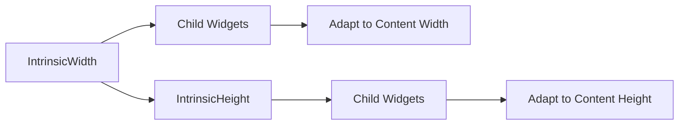

## 2.4.2 IntrinsicWidth and IntrinsicHeight

In the realm of Flutter UI development, understanding how to effectively manage widget sizing is crucial for creating responsive and adaptive interfaces. Two powerful tools in your Flutter toolkit are the `IntrinsicWidth` and `IntrinsicHeight` widgets. These widgets allow you to size your UI components based on their intrinsic properties, which can be particularly useful in certain scenarios. However, they come with their own set of challenges and considerations, especially regarding performance. In this section, we will delve into the purpose, use cases, and best practices for using `IntrinsicWidth` and `IntrinsicHeight` in your Flutter applications.

### Introduction to Intrinsic Widgets

Intrinsic widgets in Flutter are designed to size themselves based on the intrinsic properties of their children. This means that instead of relying solely on the constraints provided by the parent widget, these widgets measure their children to determine their own size. This can be particularly useful when you need a widget to adapt to the content it displays, ensuring that it is neither too small nor too large for the content it holds.

#### What are IntrinsicWidth and IntrinsicHeight?

- **IntrinsicWidth**: This widget sizes its child to the child's intrinsic width. It ensures that the width of the child is just enough to fit its content without clipping or leaving unnecessary space.
- **IntrinsicHeight**: This widget sizes its child to the child's intrinsic height. It ensures that the height of the child is just enough to fit its content, aligning the heights of children in a row, for example.

### When to Use Intrinsic Widgets

Intrinsic sizing can be beneficial in scenarios where child widgets need to adapt to their content size dynamically. Here are some common use cases:

- **Dynamic Content**: When the content size is not known beforehand and can vary significantly, intrinsic sizing ensures that the UI adapts to fit the content appropriately.
- **Consistent Sizing**: When you need children of a widget, such as a `Row`, to have consistent dimensions based on their content, intrinsic widgets can help achieve this.
- **Complex Layouts**: In complex layouts where precise control over widget dimensions is required, intrinsic sizing can provide the necessary flexibility.

### Performance Considerations

While intrinsic widgets offer flexibility, they can be expensive in terms of performance. This is because they require the widgets to be laid out multiple times to determine their intrinsic dimensions. Here are some key points to consider:

- **Layout Passes**: Intrinsic widgets may cause multiple layout passes, which can degrade performance, especially in complex UIs or when used excessively.
- **Use Sparingly**: It is advisable to use intrinsic widgets sparingly and only when necessary. Consider alternative sizing methods like `Expanded`, `Flexible`, or `SizedBox` when possible.
- **Performance Testing**: Always test your layouts with and without intrinsic widgets to assess the performance impacts and make informed decisions.

### Code Examples

Let's explore some practical examples to illustrate how `IntrinsicWidth` and `IntrinsicHeight` can be used in Flutter applications.

#### Example 1: Using IntrinsicWidth

In this example, we use `IntrinsicWidth` to size a `Row` based on its children's intrinsic widths. This ensures that the row adapts to the width of its children without clipping or leaving excess space.

```dart
IntrinsicWidth(
  child: Row(
    children: [
      Container(color: Colors.blue, width: 50, height: 50),
      Container(color: Colors.red, width: 100, height: 50),
    ],
  ),
)
```

In this code snippet, the `IntrinsicWidth` widget ensures that the `Row` is sized to fit the combined intrinsic widths of its children.

#### Example 2: Using IntrinsicHeight

Here, we use `IntrinsicHeight` to make the children of a `Row` have the same height, based on the tallest child.

```dart
IntrinsicHeight(
  child: Row(
    children: [
      Expanded(
        child: Container(color: Colors.green, height: 100),
      ),
      Expanded(
        child: Container(color: Colors.orange, height: 50),
      ),
    ],
  ),
)
```

In this example, the `IntrinsicHeight` widget ensures that both containers in the `Row` have the same height, matching the tallest child.

### Mermaid.js Diagrams

To better understand how intrinsic sizing works, let's visualize the process using a Mermaid.js diagram.



This diagram illustrates how `IntrinsicWidth` and `IntrinsicHeight` interact with their child widgets to adapt their size based on content dimensions.

### Best Practices

When working with intrinsic widgets, consider the following best practices to ensure optimal performance and usability:

- **Use Intrinsic Widgets Sparingly**: Due to their performance cost, use intrinsic widgets only when necessary. Evaluate if alternative sizing methods can achieve the desired effect.
- **Test Performance**: Regularly test your application's performance with and without intrinsic widgets to understand their impact and make data-driven decisions.
- **Combine with Other Widgets**: Consider combining intrinsic widgets with other layout widgets like `Expanded`, `Flexible`, or `SizedBox` to achieve the desired layout without compromising performance.
- **Profile Your App**: Use Flutter's performance profiling tools to identify bottlenecks and optimize your UI for better performance.

### Conclusion

IntrinsicWidth and IntrinsicHeight are powerful tools in Flutter for creating responsive and adaptive UIs. They allow you to size widgets based on their intrinsic properties, providing flexibility in dynamic content scenarios. However, due to their potential performance impact, it's important to use them judiciously and explore alternative solutions when possible. By understanding when and how to use these widgets effectively, you can create more adaptable and efficient Flutter applications.

### Further Reading and Resources

- [Flutter Documentation on IntrinsicWidth](https://api.flutter.dev/flutter/widgets/IntrinsicWidth-class.html)
- [Flutter Documentation on IntrinsicHeight](https://api.flutter.dev/flutter/widgets/IntrinsicHeight-class.html)
- [Flutter Performance Profiling](https://flutter.dev/docs/perf/rendering)

By mastering the use of intrinsic widgets, you can enhance your Flutter applications' responsiveness and adaptability, ensuring a seamless user experience across different devices and screen sizes.

## Quiz Time!



### What is the primary purpose of `IntrinsicWidth` and `IntrinsicHeight` widgets in Flutter?

- [x] To size widgets based on their intrinsic properties
- [ ] To set fixed dimensions for widgets
- [ ] To improve performance by reducing layout passes
- [ ] To align widgets within a `Column`

> **Explanation:** `IntrinsicWidth` and `IntrinsicHeight` are used to size widgets based on their intrinsic properties, allowing them to adapt to their content size.

### When should you consider using intrinsic widgets?

- [x] When child widgets need to adapt to their content size
- [ ] When you want to set fixed dimensions for all widgets
- [ ] When optimizing for performance
- [ ] When using a `Column` layout

> **Explanation:** Intrinsic widgets are beneficial when child widgets need to adapt to their content size dynamically, ensuring appropriate sizing.

### What is a potential downside of using intrinsic widgets?

- [x] They can be expensive in terms of performance
- [ ] They automatically set fixed dimensions
- [ ] They are not compatible with `Row` and `Column`
- [ ] They require manual layout adjustments

> **Explanation:** Intrinsic widgets can be expensive in terms of performance as they may cause multiple layout passes.

### Which alternative sizing methods can be used instead of intrinsic widgets to improve performance?

- [x] Expanded and Flexible
- [ ] IntrinsicWidth and IntrinsicHeight
- [ ] Align and Center
- [ ] Padding and Margin

> **Explanation:** `Expanded` and `Flexible` are alternative sizing methods that can improve performance by avoiding multiple layout passes.

### How does `IntrinsicHeight` affect the children of a `Row`?

- [x] It makes the children have the same height based on the tallest child
- [ ] It sets a fixed height for all children
- [ ] It aligns children to the top of the `Row`
- [ ] It adjusts the width of the children

> **Explanation:** `IntrinsicHeight` makes the children of a `Row` have the same height, matching the tallest child.

### What is a common use case for `IntrinsicWidth`?

- [x] Sizing a `Row` based on its children's intrinsic widths
- [ ] Setting a fixed width for all children
- [ ] Aligning children within a `Column`
- [ ] Improving performance by reducing layout passes

> **Explanation:** `IntrinsicWidth` is commonly used to size a `Row` based on its children's intrinsic widths.

### Which of the following is a best practice when using intrinsic widgets?

- [x] Use them sparingly and only when necessary
- [ ] Use them for all dynamic content
- [ ] Avoid using them with `Row` and `Column`
- [ ] Always use them to improve performance

> **Explanation:** It is best to use intrinsic widgets sparingly and only when necessary due to their potential performance impact.

### What does the Mermaid.js diagram illustrate about intrinsic sizing?

- [x] How intrinsic widgets adapt to content dimensions
- [ ] How to set fixed dimensions for widgets
- [ ] How to align widgets within a `Column`
- [ ] How to improve performance with intrinsic widgets

> **Explanation:** The Mermaid.js diagram illustrates how intrinsic widgets adapt to content dimensions, showing their interaction with child widgets.

### Which Flutter tool can help identify performance bottlenecks related to intrinsic widgets?

- [x] Flutter Performance Profiling
- [ ] Flutter Inspector
- [ ] Dart Analyzer
- [ ] Widget Tester

> **Explanation:** Flutter Performance Profiling can help identify performance bottlenecks related to intrinsic widgets.

### True or False: Intrinsic widgets always improve the performance of a Flutter application.

- [ ] True
- [x] False

> **Explanation:** False. Intrinsic widgets can negatively impact performance due to multiple layout passes, so they should be used judiciously.


