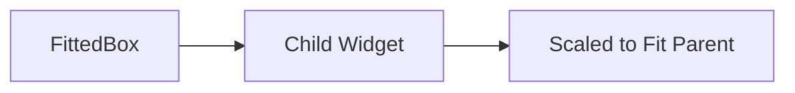

## 2.4.3 The FittedBox Widget

In the realm of responsive UI design, ensuring that your application's interface adapts seamlessly to various screen sizes and orientations is crucial. Flutter provides a plethora of widgets to facilitate this adaptability, and among them, the `FittedBox` widget stands out as a versatile tool for scaling and fitting child widgets within their parent constraints. This section delves into the intricacies of the `FittedBox` widget, exploring its properties, use cases, and best practices to help you master responsive layouts in Flutter.

### Introduction to FittedBox

The `FittedBox` widget is a powerful utility in Flutter's arsenal for managing how a child widget is scaled and positioned within its parent. It acts as a container that scales its child to fit within the parent's constraints, ensuring that the child widget is displayed appropriately regardless of the available space. This is particularly useful in scenarios where you want to maintain the aspect ratio of a widget or ensure that it does not overflow its bounds.

#### Key Characteristics of FittedBox

- **Scaling:** The primary function of `FittedBox` is to scale its child widget. This scaling can be controlled through the `fit` property, which determines how the child should be resized to fit within the parent's constraints.
- **Positioning:** In addition to scaling, `FittedBox` can also position its child within the available space, ensuring that it is centered or aligned as needed.
- **Aspect Ratio Maintenance:** By using `FittedBox`, you can maintain the aspect ratio of images or other widgets, preventing distortion when the widget is resized.

### Fitting Behavior

The `fit` property of the `FittedBox` widget plays a crucial role in determining how the child widget is scaled and fitted within its parent. This property accepts values from the `BoxFit` enumeration, each offering a different scaling behavior:

- **BoxFit.contain:** Scales the child to fit within the parent while maintaining its aspect ratio. The entire child will be visible, but there may be empty space around it if the aspect ratios do not match.

- **BoxFit.cover:** Scales the child to completely cover the parent, maintaining the aspect ratio. This may result in some parts of the child being clipped if the aspect ratios differ.

- **BoxFit.fill:** Stretches the child to fill the parent completely, disregarding the aspect ratio. This can lead to distortion if the aspect ratios are different.

- **BoxFit.fitHeight:** Scales the child to match the parent's height while maintaining the aspect ratio. The width may be smaller or larger than the parent's width.

- **BoxFit.fitWidth:** Scales the child to match the parent's width while maintaining the aspect ratio. The height may be smaller or larger than the parent's height.

- **BoxFit.none:** No scaling is applied. The child is displayed at its natural size, and it may overflow the parent if it is larger.

- **BoxFit.scaleDown:** Similar to `BoxFit.none`, but scales the child down to fit within the parent if it is larger than the available space.

Understanding these fitting behaviors allows you to choose the appropriate `BoxFit` value based on your design requirements, ensuring that your UI remains consistent and visually appealing across different devices.

### Common Use Cases

The `FittedBox` widget is particularly useful in scenarios where you need to ensure that a widget fits within a constrained space without losing its visual integrity. Here are some common use cases:

- **Image Scaling:** When displaying images, you may want to ensure that they fit within a specific area without being distorted. Using `FittedBox` with `BoxFit.cover` or `BoxFit.contain` can help achieve this.

- **Text Adaptation:** In responsive designs, text may need to scale to fit within a given space. `FittedBox` can be used to adjust the size of text dynamically, ensuring readability without overflow.

- **Icon and Graphic Scaling:** Similar to images, icons and graphics can be scaled to fit within their containers, maintaining their aspect ratio and ensuring they are displayed correctly.

### Code Examples

To illustrate the practical application of the `FittedBox` widget, let's explore some code examples that demonstrate its use in different scenarios.

#### Example 1: Using FittedBox to Scale an Image

In this example, we use `FittedBox` to scale an image so that it covers the entire area of a container, maintaining its aspect ratio:

```dart
Container(
  width: 100,
  height: 100,
  child: FittedBox(
    fit: BoxFit.cover,
    child: Image.network('https://example.com/image.jpg'),
  ),
)
```

In this code snippet, the `FittedBox` widget scales the image to cover the entire 100x100 container. The `BoxFit.cover` value ensures that the image maintains its aspect ratio, even if it means some parts of the image may be clipped.

#### Example 2: Scaling Text with FittedBox

Here, we use `FittedBox` to scale a text widget so that it fits within a constrained space without overflowing:

```dart
Container(
  width: 150,
  height: 50,
  child: FittedBox(
    fit: BoxFit.scaleDown,
    child: Text(
      'Scaled Text',
      style: TextStyle(fontSize: 30),
    ),
  ),
)
```

In this example, the `FittedBox` widget scales the text to fit within the 150x50 container. The `BoxFit.scaleDown` value ensures that the text is only scaled down if it is larger than the available space, maintaining its original size if it fits naturally.

### Mermaid.js Diagrams

To better understand the functionality of the `FittedBox` widget, let's visualize its behavior using a Mermaid.js diagram:



This diagram illustrates how the `FittedBox` widget acts as a container that scales its child widget to fit within the parent's constraints, ensuring that the child is displayed appropriately.

### Best Practices

When using the `FittedBox` widget, consider the following best practices to ensure optimal results:

- **Avoid Distortion:** Use `FittedBox` to maintain the aspect ratio of child widgets, preventing distortion when scaling.
- **Combine with Other Widgets:** Pair `FittedBox` with other layout widgets, such as `Row` or `Column`, to achieve more complex and precise layouts.
- **Test with Different BoxFit Values:** Experiment with various `BoxFit` values to determine the best fit for your design needs, ensuring that the visual outcome aligns with your expectations.
- **Performance Considerations:** While `FittedBox` is efficient, be mindful of performance implications when scaling large images or complex widgets, especially on lower-end devices.

### Conclusion

The `FittedBox` widget is an essential tool in Flutter for creating responsive and adaptive UIs. By understanding its properties and behaviors, you can effectively manage how child widgets are scaled and fitted within their parent constraints, ensuring a consistent and visually appealing user experience across different devices. Whether you're scaling images, adapting text, or managing icons, `FittedBox` offers the flexibility and control needed to master responsive layouts in Flutter.

### Further Exploration

For more information on the `FittedBox` widget and its applications, consider exploring the following resources:

- [Flutter Official Documentation on FittedBox](https://api.flutter.dev/flutter/widgets/FittedBox-class.html)
- [Responsive Design Patterns in Flutter](https://flutter.dev/docs/development/ui/layout/responsive)
- [BoxFit Enumeration](https://api.flutter.dev/flutter/painting/BoxFit-class.html)

By leveraging these resources, you can deepen your understanding of responsive design in Flutter and continue to refine your skills in building adaptable and user-friendly applications.

## Quiz Time!



### What is the primary function of the FittedBox widget in Flutter?

- [x] To scale its child widget to fit within the parent's constraints
- [ ] To provide padding around its child widget
- [ ] To align its child widget to the top-left corner
- [ ] To animate its child widget

> **Explanation:** The FittedBox widget's primary function is to scale its child widget to fit within the parent's constraints, ensuring that it is displayed appropriately without overflow or distortion.

### Which BoxFit value should you use if you want to maintain the aspect ratio and ensure the entire child is visible within the parent?

- [ ] BoxFit.cover
- [x] BoxFit.contain
- [ ] BoxFit.fill
- [ ] BoxFit.none

> **Explanation:** BoxFit.contain scales the child to fit within the parent while maintaining its aspect ratio, ensuring the entire child is visible.

### How does BoxFit.cover affect the child widget?

- [x] It scales the child to completely cover the parent, possibly clipping parts of the child
- [ ] It stretches the child to fill the parent, disregarding the aspect ratio
- [ ] It scales the child to fit within the parent without clipping
- [ ] It does not scale the child at all

> **Explanation:** BoxFit.cover scales the child to completely cover the parent while maintaining the aspect ratio, which may result in parts of the child being clipped if the aspect ratios differ.

### In which scenario would you use BoxFit.scaleDown?

- [x] When you want the child to scale down only if it is larger than the available space
- [ ] When you want the child to stretch to fill the parent
- [ ] When you want the child to maintain its natural size regardless of the parent size
- [ ] When you want the child to cover the parent completely

> **Explanation:** BoxFit.scaleDown scales the child down to fit within the parent only if it is larger than the available space, maintaining its original size if it fits naturally.

### What is a common use case for the FittedBox widget?

- [x] Ensuring images scale appropriately within a constrained space
- [ ] Adding shadows to text
- [ ] Animating transitions between screens
- [ ] Aligning widgets to the left

> **Explanation:** A common use case for the FittedBox widget is ensuring that images scale appropriately within a constrained space, maintaining their aspect ratio and preventing overflow.

### Which BoxFit value disregards the aspect ratio and stretches the child to fill the parent?

- [ ] BoxFit.contain
- [ ] BoxFit.cover
- [x] BoxFit.fill
- [ ] BoxFit.scaleDown

> **Explanation:** BoxFit.fill stretches the child to fill the parent completely, disregarding the aspect ratio, which can lead to distortion if the aspect ratios differ.

### How can you prevent distortion when using FittedBox?

- [x] By using BoxFit values that maintain the aspect ratio, such as BoxFit.contain or BoxFit.cover
- [ ] By using BoxFit.fill
- [ ] By setting the child widget's size manually
- [ ] By using a different widget instead of FittedBox

> **Explanation:** To prevent distortion, use BoxFit values that maintain the aspect ratio, such as BoxFit.contain or BoxFit.cover, ensuring that the child widget is scaled appropriately without losing its proportions.

### What is the role of the fit property in FittedBox?

- [x] It determines how the child widget should be resized to fit within the parent's constraints
- [ ] It sets the padding around the child widget
- [ ] It aligns the child widget within the parent
- [ ] It animates the child widget

> **Explanation:** The fit property in FittedBox determines how the child widget should be resized to fit within the parent's constraints, using different BoxFit values to control the scaling behavior.

### Which BoxFit value should you use if you want the child to match the parent's width while maintaining the aspect ratio?

- [ ] BoxFit.cover
- [ ] BoxFit.fill
- [x] BoxFit.fitWidth
- [ ] BoxFit.none

> **Explanation:** BoxFit.fitWidth scales the child to match the parent's width while maintaining the aspect ratio, allowing the height to adjust accordingly.

### True or False: The FittedBox widget can only be used with images.

- [ ] True
- [x] False

> **Explanation:** False. The FittedBox widget can be used with any child widget, not just images. It is commonly used for scaling text, icons, and other widgets to fit within constrained spaces.


