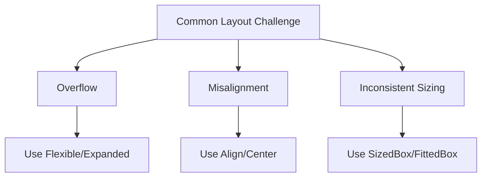

## 2.4.4 Overcoming Common Layout Challenges

Creating responsive and adaptive user interfaces in Flutter can be a rewarding yet challenging task. As developers, we often encounter common layout issues such as widget overflow, misalignment, inconsistent sizing, and ensuring responsiveness across a myriad of devices. In this section, we will delve into these challenges and explore effective strategies to overcome them using Flutter's powerful layout tools and widgets.

### Identifying Common Layout Issues

Before we dive into solutions, it's crucial to identify and understand the common layout challenges that developers face:

- **Widget Overflow:** This occurs when a widget's content exceeds the available space, leading to clipped or hidden content. This is especially prevalent in `Row` and `Column` widgets when their children do not fit within the allocated space.
  
- **Misalignment:** Widgets can sometimes appear misaligned due to improper use of alignment properties or constraints, resulting in a visually unappealing UI.

- **Inconsistent Sizing:** Widgets may not scale appropriately across different screen sizes, leading to inconsistent user experiences.

- **Responsiveness Across Devices:** Ensuring that your app looks and functions well on various devices with different screen sizes and orientations is a fundamental challenge in modern app development.

### Strategies to Overcome Challenges

To address these issues, Flutter provides a range of widgets and techniques that can help create flexible and adaptive layouts.

#### Flexible and Expanded Widgets

The `Flexible` and `Expanded` widgets are essential tools for managing space distribution within `Row` and `Column` widgets. They allow children to share available space according to specified flex factors.

**Example: Preventing Overflow with `Flexible`**

```dart
Row(
  children: [
    Flexible(
      child: Text(
        'A very long text that might otherwise cause overflow issues in a Row.',
        overflow: TextOverflow.ellipsis,
      ),
    ),
    Icon(Icons.info),
  ],
)
```

In this example, the `Flexible` widget ensures that the `Text` widget can shrink and avoid overflow by using `TextOverflow.ellipsis`.

#### MediaQuery and LayoutBuilder

`MediaQuery` and `LayoutBuilder` are powerful tools for building responsive layouts that adapt to screen size and constraints.

- **MediaQuery:** Provides information about the size and orientation of the current screen, allowing you to make layout decisions based on these parameters.

- **LayoutBuilder:** Allows you to build widgets based on the constraints provided by the parent widget, enabling dynamic layout adjustments.

**Example: Using `MediaQuery` for Responsive Layouts**

```dart
Widget build(BuildContext context) {
  var screenWidth = MediaQuery.of(context).size.width;
  return Container(
    padding: EdgeInsets.all(screenWidth * 0.05),
    child: Text('Responsive Padding'),
  );
}
```

In this example, the padding of the `Container` is dynamically set based on the screen width, ensuring consistent spacing across devices.

#### Wrap and Flow Widgets

The `Wrap` and `Flow` widgets are ideal for handling dynamic content that needs to wrap or flow automatically.

- **Wrap:** Automatically wraps its children into multiple lines, making it perfect for scenarios where you have a variable number of items.

**Example: Using `Wrap` to Handle Dynamic Content**

```dart
Wrap(
  spacing: 8.0,
  runSpacing: 4.0,
  children: List.generate(10, (index) => Chip(label: Text('Chip $index'))),
)
```

This example demonstrates how the `Wrap` widget arranges `Chip` widgets in a flexible manner, wrapping them as needed.

#### Intrinsic Widgets

`IntrinsicWidth` and `IntrinsicHeight` widgets can be used to size widgets based on their intrinsic dimensions, which is useful when you need to ensure that a widget sizes itself according to its content.

**Example: Using `IntrinsicWidth`**

```dart
IntrinsicWidth(
  child: Column(
    children: [
      Text('Short'),
      Text('A much longer text'),
    ],
  ),
)
```

Here, the `IntrinsicWidth` widget ensures that the `Column` sizes itself based on the widest child, maintaining consistent alignment.

### Mermaid.js Diagrams

To visualize the relationship between common layout challenges and their solutions, consider the following diagram:



This diagram illustrates how specific widgets and techniques can address common layout issues.

### Best Practices

- **Systematic Approach:** Adopt a systematic approach to diagnosing and resolving layout issues. Start by identifying the problem, then apply appropriate solutions.

- **Debugging Tools:** Utilize Flutter’s debugging tools, such as the Flutter Inspector, to visualize and troubleshoot layout problems effectively.

- **Organized Widget Tree:** Keep the widget tree as shallow and organized as possible to simplify layout management and improve performance.

- **Consistent Testing:** Test your layouts on various devices and orientations to ensure consistent behavior and appearance.

### Conclusion

Overcoming common layout challenges in Flutter requires a combination of understanding the underlying issues and applying the right tools and techniques. By leveraging widgets like `Flexible`, `Expanded`, `Wrap`, and `IntrinsicWidth`, along with tools like `MediaQuery` and `LayoutBuilder`, you can create responsive and adaptive UIs that provide a seamless user experience across all devices.

### Additional Resources

- [Flutter Documentation on Layouts](https://flutter.dev/docs/development/ui/layout)
- [Flutter Inspector Guide](https://flutter.dev/docs/development/tools/devtools/inspector)
- [Responsive Design in Flutter](https://flutter.dev/docs/development/ui/layout/responsive)

By mastering these strategies, you can enhance your Flutter applications' responsiveness and adaptability, ensuring a superior user experience.

## Quiz Time!



### What is a common issue when widgets exceed their available space in a layout?

- [x] Overflow
- [ ] Misalignment
- [ ] Inconsistent Sizing
- [ ] Responsiveness

> **Explanation:** Overflow occurs when a widget's content exceeds the available space, leading to clipped or hidden content.

### Which widget helps distribute space within a Row or Column?

- [x] Flexible
- [ ] Wrap
- [ ] MediaQuery
- [ ] IntrinsicWidth

> **Explanation:** The `Flexible` widget helps manage space distribution within `Row` and `Column` widgets.

### How can you adapt a layout based on screen size?

- [x] Use MediaQuery
- [ ] Use Wrap
- [ ] Use IntrinsicWidth
- [ ] Use Align

> **Explanation:** `MediaQuery` provides information about the screen size, allowing you to make layout decisions based on these parameters.

### Which widget automatically wraps its children into multiple lines?

- [ ] Flexible
- [x] Wrap
- [ ] Expanded
- [ ] IntrinsicHeight

> **Explanation:** The `Wrap` widget automatically arranges its children into multiple lines.

### What is the purpose of the IntrinsicWidth widget?

- [x] To size widgets based on their intrinsic dimensions
- [ ] To align widgets in the center
- [ ] To distribute space in a Row
- [ ] To handle overflow

> **Explanation:** `IntrinsicWidth` sizes widgets based on their intrinsic dimensions, ensuring consistent alignment.

### Which tool can help visualize and troubleshoot layout problems in Flutter?

- [x] Flutter Inspector
- [ ] MediaQuery
- [ ] Wrap
- [ ] IntrinsicHeight

> **Explanation:** The Flutter Inspector is a powerful tool for visualizing and troubleshooting layout issues.

### What is a best practice for managing complex widget trees?

- [x] Keep the widget tree shallow and organized
- [ ] Use as many widgets as possible
- [ ] Avoid using debugging tools
- [ ] Ignore layout issues

> **Explanation:** Keeping the widget tree shallow and organized simplifies layout management and improves performance.

### Which widget can help maintain consistent alignment by sizing a Column based on the widest child?

- [x] IntrinsicWidth
- [ ] Flexible
- [ ] Wrap
- [ ] Expanded

> **Explanation:** `IntrinsicWidth` ensures that a `Column` sizes itself based on the widest child, maintaining consistent alignment.

### What is a systematic approach to resolving layout issues?

- [x] Identify the problem, then apply appropriate solutions
- [ ] Ignore the problem
- [ ] Use random widgets
- [ ] Avoid testing

> **Explanation:** A systematic approach involves identifying the problem first, then applying the right solutions to resolve it.

### True or False: Using Flexible and Expanded widgets can help prevent overflow issues.

- [x] True
- [ ] False

> **Explanation:** `Flexible` and `Expanded` widgets help manage space distribution, preventing overflow issues in layouts.


