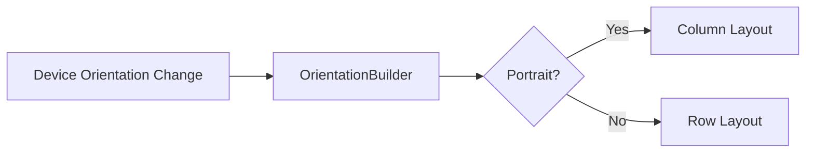

## 3.1.3 Responding to Orientation Changes

In the realm of mobile app development, the ability to adapt to changes in device orientation is a crucial aspect of creating responsive and user-friendly interfaces. This section delves into how Flutter facilitates handling orientation changes, ensuring your application remains robust and visually appealing regardless of how the user holds their device.

### Understanding Orientation Changes

Device orientation refers to the way a device is held, typically categorized into two primary modes: portrait and landscape. Each orientation can significantly impact the layout and usability of an app, influencing how content is displayed and interacted with.

- **Portrait Orientation:** This is the vertical alignment of the device, where the height is greater than the width. It is commonly used for reading, browsing social media, and other tasks that benefit from a taller display.
  
- **Landscape Orientation:** This is the horizontal alignment, where the width exceeds the height. It is often preferred for watching videos, playing games, or displaying content that benefits from a wider view.

Understanding these orientations is essential for designing interfaces that provide a seamless user experience. For instance, a photo gallery might display more images in landscape mode, while a news app might switch to a multi-column layout to utilize the extra horizontal space.

### Adapting Layouts Dynamically

To ensure a seamless user experience, your app should dynamically adapt its layout when the device orientation changes. This involves reconfiguring the UI to suit the new dimensions and aspect ratio, which can be achieved using Flutter's powerful widget system.

#### Strategies for Dynamic Layout Adaptation

1. **Responsive Layouts:** Use flexible layouts that automatically adjust to the available screen space. Widgets like `Flexible`, `Expanded`, and `Spacer` can help distribute space efficiently.

2. **Orientation-Specific Widgets:** Implement widgets that change their structure based on orientation. For example, a `Column` can switch to a `Row` when the device rotates.

3. **State Preservation:** Ensure that orientation changes do not disrupt the user's workflow or result in data loss. Maintain the state of your app across orientation changes using state management techniques.

4. **Testing Across Orientations:** Regularly test your app in both portrait and landscape modes to ensure consistent behavior and appearance.

#### Using OrientationBuilder

Flutter provides the `OrientationBuilder` widget, which makes it easy to adapt your layout based on the current orientation. This widget rebuilds its child whenever the orientation changes, allowing you to define different layouts for portrait and landscape modes.

**Example 1: Using OrientationBuilder to Adjust Layout**

```dart
Widget build(BuildContext context) {
  return Scaffold(
    appBar: AppBar(title: Text('Orientation Change Example')),
    body: OrientationBuilder(
      builder: (context, orientation) {
        return GridView.count(
          crossAxisCount: orientation == Orientation.portrait ? 2 : 4,
          children: List.generate(20, (index) {
            return Center(
              child: Text('Item $index'),
            );
          }),
        );
      },
    ),
  );
}
```

In this example, the `GridView` adjusts the number of columns based on the orientation. In portrait mode, it displays two columns, while in landscape mode, it expands to four columns, making better use of the available space.

**Example 2: Switching Between Column and Row Based on Orientation**

```dart
Widget build(BuildContext context) {
  var orientation = MediaQuery.of(context).orientation;

  return Scaffold(
    appBar: AppBar(title: Text('Responsive Layout')),
    body: orientation == Orientation.portrait
        ? Column(
            children: [
              Text('Portrait Mode'),
              Icon(Icons.portrait),
            ],
          )
        : Row(
            children: [
              Text('Landscape Mode'),
              Icon(Icons.landscape),
            ],
          ),
  );
}
```

This example demonstrates how to switch between a `Column` and a `Row` based on the device's orientation. Such flexibility allows you to tailor the user interface to the current context, enhancing usability and aesthetics.

### Mermaid.js Diagrams

To better understand how orientation-based layout adjustments work, consider the following flowchart:



This diagram illustrates the decision-making process when adapting layouts based on orientation changes. The `OrientationBuilder` checks the current orientation and applies the appropriate layout strategy.

### Best Practices

- **State Management:** Use state management solutions like Provider, Bloc, or Riverpod to preserve the state across orientation changes, ensuring a smooth user experience.
  
- **Avoid Manual Size Calculations:** Leverage Flutter's built-in widgets and layout mechanisms to handle size adjustments automatically, reducing complexity and improving maintainability.

- **Consistent Testing:** Regularly test your app in both orientations to identify and fix any layout inconsistencies or usability issues.

- **User Experience:** Ensure that orientation changes enhance the user experience rather than disrupt it. Consider how different layouts can improve content presentation and interaction.

### Conclusion

Handling orientation changes effectively is a fundamental aspect of building responsive and adaptive UIs in Flutter. By leveraging tools like `OrientationBuilder` and adhering to best practices, you can create applications that provide a seamless experience across all device orientations. This adaptability not only improves usability but also enhances the overall quality and appeal of your app.

### Further Exploration

For more information on responsive design in Flutter, consider exploring the following resources:

- [Flutter Documentation on OrientationBuilder](https://api.flutter.dev/flutter/widgets/OrientationBuilder-class.html)
- [Responsive Design Patterns in Flutter](https://flutter.dev/docs/development/ui/layout/responsive)
- [State Management in Flutter](https://flutter.dev/docs/development/data-and-backend/state-mgmt)

These resources will provide deeper insights into creating flexible and adaptive user interfaces, helping you to build better Flutter applications.

## Quiz Time!



### How does device orientation impact app usability?

- [x] It affects the layout and how content is displayed.
- [ ] It only changes the color scheme of the app.
- [ ] It has no impact on app usability.
- [ ] It only affects the app's performance.

> **Explanation:** Device orientation impacts the layout and usability of an app by changing how content is displayed, which can enhance or hinder user interaction depending on the design.

### What is the primary purpose of the OrientationBuilder widget in Flutter?

- [x] To adapt the layout based on the device's orientation.
- [ ] To manage state across orientation changes.
- [ ] To change the theme of the app.
- [ ] To handle network requests.

> **Explanation:** The `OrientationBuilder` widget is used to adapt the layout of a Flutter app based on the current orientation of the device, allowing for responsive design.

### In the provided code examples, what does the OrientationBuilder widget do when the device is in landscape mode?

- [x] It increases the number of columns in the GridView.
- [ ] It decreases the number of columns in the GridView.
- [ ] It switches from a GridView to a ListView.
- [ ] It changes the app's theme to dark mode.

> **Explanation:** In landscape mode, the `OrientationBuilder` increases the number of columns in the `GridView` to better utilize the available horizontal space.

### What is a common use case for landscape orientation?

- [x] Watching videos.
- [ ] Reading articles.
- [ ] Browsing social media.
- [ ] Typing documents.

> **Explanation:** Landscape orientation is commonly used for watching videos as it provides a wider view, enhancing the viewing experience.

### Which widget is used to switch between a Column and a Row based on orientation?

- [x] MediaQuery
- [ ] ListView
- [ ] GridView
- [ ] Stack

> **Explanation:** The `MediaQuery` widget is used to determine the current orientation, allowing the app to switch between a `Column` and a `Row` based on the device's orientation.

### Why is it important to test layouts in both portrait and landscape orientations?

- [x] To ensure consistent behavior and appearance.
- [ ] To improve the app's loading speed.
- [ ] To reduce the app's memory usage.
- [ ] To enhance the app's security features.

> **Explanation:** Testing layouts in both orientations ensures that the app behaves consistently and appears correctly, providing a seamless user experience.

### What is a key benefit of using Flutter's built-in widgets for handling orientation changes?

- [x] They reduce complexity and improve maintainability.
- [ ] They increase the app's file size.
- [ ] They make the app run faster.
- [ ] They are only useful for debugging.

> **Explanation:** Using Flutter's built-in widgets for handling orientation changes reduces complexity and improves maintainability by leveraging the framework's capabilities.

### What should be preserved across orientation changes to ensure a smooth user experience?

- [x] App state
- [ ] Network connections
- [ ] App theme
- [ ] User preferences

> **Explanation:** Preserving the app state across orientation changes ensures that the user's workflow is not disrupted, providing a smooth experience.

### Which of the following is NOT a strategy for adapting layouts dynamically?

- [ ] Responsive layouts
- [ ] Orientation-specific widgets
- [ ] State preservation
- [x] Manual size calculations

> **Explanation:** Manual size calculations are not recommended for adapting layouts dynamically as they can increase complexity and reduce maintainability.

### True or False: Orientation changes should disrupt the user's workflow to enhance the app's interactivity.

- [ ] True
- [x] False

> **Explanation:** Orientation changes should not disrupt the user's workflow. Instead, they should enhance the app's usability by providing a seamless transition between different layouts.


