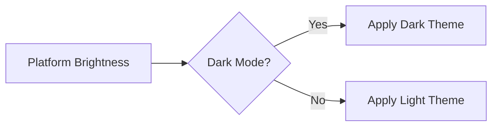

## 3.1.4 Detecting Platform Brightness

In today's mobile applications, adapting to the user's preferred theme—whether light or dark—has become a standard expectation. This adaptability not only enhances user experience but also aligns with accessibility standards, ensuring that applications are comfortable to use in various lighting conditions. In this section, we'll explore how Flutter facilitates the detection of platform brightness and how you can implement theme switching in your applications.

### Introduction to Platform Brightness

Platform brightness refers to the system-wide setting that determines whether the device is in light mode or dark mode. This setting is crucial for applications aiming to provide a seamless user experience by automatically adjusting their themes to match the user's preference. 

**Relevance in App Development:**
- **User Experience:** Adapting to the user's preferred brightness setting enhances comfort and usability, especially in low-light environments.
- **Battery Efficiency:** Dark mode can reduce battery consumption on OLED screens, as darker pixels require less power.
- **Accessibility:** Ensures that the application is accessible to users with visual impairments who may prefer one mode over the other for better readability.

### Implementing Light and Dark Modes

Flutter provides a straightforward way to detect and respond to the platform's brightness setting using the `MediaQuery` class. This allows developers to dynamically switch between light and dark themes based on the current system setting.

#### Detecting Platform Brightness

To determine the current brightness setting, you can use the `MediaQuery.of(context).platformBrightness` property. This returns a `Brightness` value, which can be either `Brightness.light` or `Brightness.dark`.

Here's a simple example demonstrating how to detect the platform brightness:

```dart
Widget build(BuildContext context) {
  var brightness = MediaQuery.of(context).platformBrightness;
  bool isDarkMode = brightness == Brightness.dark;

  return Scaffold(
    appBar: AppBar(
      title: Text('Brightness Detection'),
      backgroundColor: isDarkMode ? Colors.grey[900] : Colors.blue,
    ),
    body: Center(
      child: Text(
        'Current Mode: ${isDarkMode ? 'Dark' : 'Light'}',
        style: TextStyle(
          color: isDarkMode ? Colors.white : Colors.black,
        ),
      ),
    ),
    backgroundColor: isDarkMode ? Colors.black : Colors.white,
  );
}
```

**Explanation:**
- The `MediaQuery.of(context).platformBrightness` checks the current brightness setting.
- A boolean `isDarkMode` is used to determine if the current mode is dark.
- The UI elements such as `AppBar` and `Text` adjust their styles based on the `isDarkMode` value.

#### Dynamically Switching Themes

To implement dynamic theme switching, you can use the `ThemeData` class to define light and dark themes and apply them based on the detected brightness.

```dart
class MyApp extends StatelessWidget {
  @override
  Widget build(BuildContext context) {
    var brightness = MediaQuery.of(context).platformBrightness;
    bool isDarkMode = brightness == Brightness.dark;

    return MaterialApp(
      theme: isDarkMode ? ThemeData.dark() : ThemeData.light(),
      home: HomeScreen(),
    );
  }
}
```

**Explanation:**
- The `MaterialApp` widget's `theme` property is set conditionally based on the `isDarkMode` boolean.
- `ThemeData.dark()` and `ThemeData.light()` are predefined themes in Flutter that provide a consistent look for dark and light modes, respectively.

### Visualizing Theme Switching

To better understand the flow of theme switching based on platform brightness, let's look at a visual representation using a Mermaid.js diagram:



**Diagram Explanation:**
- The diagram illustrates a decision-making process where the application checks the platform brightness.
- Depending on whether the brightness is set to dark or light, the corresponding theme is applied.

### Best Practices

When implementing theme switching in your Flutter applications, consider the following best practices:

- **Respect User Preferences:** Always respect the user's system-wide theme preference to provide a consistent experience.
- **Ensure Visibility:** Make sure that all UI elements are clearly visible and appropriately styled in both light and dark modes. This includes adjusting colors for text, icons, and backgrounds.
- **Consistent Testing:** Regularly test your application in both modes to identify and fix any visual discrepancies or usability issues.
- **Accessibility Considerations:** Consider users with visual impairments who might rely on specific contrast settings. Ensure that your themes provide sufficient contrast and readability.
- **Performance Optimization:** While theme switching is generally efficient, ensure that your application handles these changes smoothly without noticeable lag or performance issues.

### Conclusion

Detecting and adapting to platform brightness is a key feature in modern app development, enhancing user experience and accessibility. By leveraging Flutter's `MediaQuery` class, you can easily implement dynamic theme switching in your applications. This not only aligns your app with user preferences but also prepares it for a wide range of environments and use cases.

As you continue to develop your Flutter applications, keep exploring ways to enhance user experience through responsive and adaptive design. Consider how you can further customize themes or integrate additional features that respond to user settings and preferences.

### Further Reading and Resources

- [Flutter Documentation on MediaQuery](https://api.flutter.dev/flutter/widgets/MediaQuery-class.html)
- [Material Design Guidelines for Dark Theme](https://material.io/design/color/dark-theme.html)
- [Accessibility in Flutter](https://flutter.dev/docs/development/accessibility)

By understanding and implementing these concepts, you can create applications that are not only visually appealing but also highly functional and user-friendly. Keep experimenting with different themes and styles to find what works best for your audience.

## Quiz Time!



### What is platform brightness in the context of Flutter?

- [x] It refers to the system-wide setting that determines whether the device is in light mode or dark mode.
- [ ] It is a property that adjusts the screen brightness automatically.
- [ ] It is a feature that controls the brightness of images in the app.
- [ ] It is a setting that changes the contrast of the app's UI.

> **Explanation:** Platform brightness is a system-wide setting that indicates whether the device is in light or dark mode, allowing apps to adapt their themes accordingly.

### How can you detect the current brightness setting in a Flutter app?

- [x] Using `MediaQuery.of(context).platformBrightness`
- [ ] Using `Brightness.of(context)`
- [ ] Using `Theme.of(context).brightness`
- [ ] Using `context.brightness`

> **Explanation:** The `MediaQuery.of(context).platformBrightness` property is used to detect the current brightness setting in a Flutter app.

### Which of the following is a predefined theme in Flutter for dark mode?

- [x] `ThemeData.dark()`
- [ ] `ThemeData.bright()`
- [ ] `ThemeData.night()`
- [ ] `ThemeData.black()`

> **Explanation:** `ThemeData.dark()` is a predefined theme in Flutter that provides a consistent look for dark mode.

### What is a key benefit of adapting your app to the user's preferred brightness setting?

- [x] Enhancing user experience by providing a comfortable viewing experience.
- [ ] Increasing the app's loading speed.
- [ ] Reducing the app's memory usage.
- [ ] Improving network connectivity.

> **Explanation:** Adapting to the user's preferred brightness setting enhances user experience by providing a comfortable viewing experience, especially in varying lighting conditions.

### Which method is used to apply a theme dynamically in a Flutter app?

- [x] Setting the `theme` property of `MaterialApp` based on a condition.
- [ ] Using `setState()` to change the theme.
- [ ] Modifying the `Scaffold` widget directly.
- [ ] Changing the `AppBar` color only.

> **Explanation:** You can apply a theme dynamically by setting the `theme` property of `MaterialApp` based on a condition, such as the current brightness setting.

### What should you ensure when implementing light and dark themes?

- [x] All UI elements are clearly visible and appropriately styled in both themes.
- [ ] Only the background color changes between themes.
- [ ] The app's performance is reduced.
- [ ] The app's layout is completely different in each theme.

> **Explanation:** When implementing light and dark themes, ensure that all UI elements are clearly visible and appropriately styled in both themes to maintain usability and accessibility.

### What is the purpose of the `isDarkMode` boolean in the provided code examples?

- [x] To determine if the current mode is dark and adjust the UI accordingly.
- [ ] To store the user's theme preference permanently.
- [ ] To switch the app's language settings.
- [ ] To control the app's network requests.

> **Explanation:** The `isDarkMode` boolean is used to determine if the current mode is dark and adjust the UI elements accordingly, such as colors and themes.

### Which of the following is a best practice when implementing theme switching?

- [x] Regularly test theme changes to maintain consistency and prevent visual discrepancies.
- [ ] Use the same color scheme for both light and dark modes.
- [ ] Ignore user preferences for system-wide themes.
- [ ] Implement theme switching only for the app's main screen.

> **Explanation:** Regularly testing theme changes helps maintain consistency and prevents visual discrepancies, ensuring a seamless user experience.

### What is the role of `ThemeData` in Flutter?

- [x] It defines the visual properties of the app's theme, such as colors and typography.
- [ ] It manages the app's state and data flow.
- [ ] It handles network requests and responses.
- [ ] It controls the app's navigation and routing.

> **Explanation:** `ThemeData` defines the visual properties of the app's theme, such as colors and typography, allowing for consistent styling across the app.

### True or False: Dark mode can reduce battery consumption on OLED screens.

- [x] True
- [ ] False

> **Explanation:** True. Dark mode can reduce battery consumption on OLED screens because darker pixels require less power.


