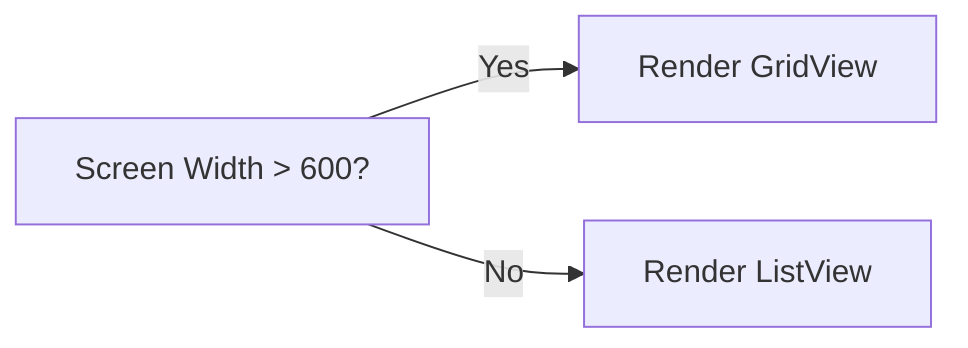

## 3.2.1 Conditional Layouts

In the ever-evolving landscape of mobile and web applications, creating a user interface that adapts to various screen sizes and orientations is crucial. This is where conditional layouts come into play. In this section, we will delve deep into the concept of conditional layouts in Flutter, leveraging the power of `MediaQuery` to build responsive and adaptive UIs.

### What Are Conditional Layouts?

Conditional layouts refer to the practice of dynamically altering the UI based on certain conditions, such as screen size, orientation, or aspect ratio. This approach ensures that your application provides an optimal user experience across different devices, from small mobile screens to large desktop monitors.

#### Key Concepts:

- **Dynamic Adaptation:** Conditional layouts allow your app to adjust its UI components based on real-time device parameters.
- **User Experience:** By tailoring the layout to the device, you enhance usability and accessibility.
- **Efficiency:** Properly implemented conditional layouts can reduce the need for separate codebases for different platforms or devices.

### Implementing Conditional Layouts

Flutter's `MediaQuery` class is a powerful tool for accessing device-specific information, such as screen dimensions, orientation, and more. By using `MediaQuery`, you can conditionally render different widget trees, ensuring that your app looks great on any screen.

#### Using MediaQuery for Conditional Rendering

To implement conditional layouts, you typically start by retrieving the screen dimensions or other relevant parameters using `MediaQuery.of(context)`. Based on these parameters, you can decide which widget tree to render.

#### Organizing Code for Multiple Layout States

When dealing with multiple layout states, it's essential to keep your code organized and maintainable. Here are some strategies:

- **Separate Layout Builders:** Create distinct methods or widgets for each layout state. This separation keeps your code clean and easy to manage.
- **Helper Functions:** Use helper functions to encapsulate conditional logic, reducing complexity in your main build method.
- **Widget Composition:** Leverage Flutter's composition model to build complex UIs from smaller, reusable widgets.

### Code Examples

Let's explore some practical examples to illustrate how conditional layouts can be implemented in Flutter.

#### Example 1: Switching Between List and Grid Layouts

In this example, we'll switch between a `ListView` and a `GridView` based on the screen width. This approach is particularly useful for displaying content differently on phones and tablets.

```dart
Widget build(BuildContext context) {
  var screenWidth = MediaQuery.of(context).size.width;

  if (screenWidth > 600) {
    return GridView.count(
      crossAxisCount: 4,
      children: List.generate(20, (index) => Card(child: Center(child: Text('Item $index')))),
    );
  } else {
    return ListView.builder(
      itemCount: 20,
      itemBuilder: (context, index) => ListTile(title: Text('Item $index')),
    );
  }
}
```

**Explanation:**

- **MediaQuery Usage:** We use `MediaQuery.of(context).size.width` to get the screen width.
- **Conditional Logic:** If the width is greater than 600 pixels, we render a `GridView`; otherwise, we render a `ListView`.
- **Responsive Design:** This approach ensures that the UI adapts seamlessly to different screen sizes.

#### Example 2: Displaying Different Widgets Based on Screen Aspect Ratio

This example demonstrates how to adjust the layout based on the screen's aspect ratio, which is the ratio of width to height.

```dart
Widget build(BuildContext context) {
  var size = MediaQuery.of(context).size;
  var aspectRatio = size.width / size.height;

  return Scaffold(
    appBar: AppBar(title: Text('Conditional Layouts')),
    body: aspectRatio > 1.6
        ? Row(
            children: [
              Expanded(child: Image.network('https://example.com/image.jpg')),
              Expanded(child: Text('Wide Screen Layout')),
            ],
          )
        : Column(
            children: [
              Image.network('https://example.com/image.jpg'),
              Text('Narrow Screen Layout'),
            ],
          ),
  );
}
```

**Explanation:**

- **Aspect Ratio Calculation:** We calculate the aspect ratio using `size.width / size.height`.
- **Conditional Layout:** Depending on whether the aspect ratio exceeds 1.6, we choose between a `Row` or a `Column` layout.
- **Adaptive UI:** This technique is useful for adjusting content presentation based on the device's orientation or screen shape.

### Mermaid.js Diagrams

To further illustrate the concept of conditional layouts, let's use a Mermaid.js flowchart to visualize the decision-making process for rendering different layouts.

#### Flowchart for Conditional Layout Rendering



**Diagram Explanation:**

- **Decision Node:** The flowchart starts with a decision based on the screen width.
- **Conditional Paths:** Depending on the outcome, the flowchart directs to rendering either a `GridView` or a `ListView`.

### Best Practices

To ensure your conditional layouts are efficient and maintainable, consider the following best practices:

- **Clean Code:** Keep conditional logic clean and maintainable by separating layout builders into distinct methods or widgets.
- **Avoid Nesting:** Avoid deeply nested conditionals; instead, use helper functions or widget composition to manage complexity.
- **Testing:** Test conditional layouts on various screen sizes to ensure seamless transitions and functionality.
- **Performance:** Be mindful of performance implications when using complex conditional logic, especially in frequently rebuilt widgets.

### Conclusion

Conditional layouts are a powerful tool in your Flutter development arsenal, enabling you to create responsive and adaptive UIs that cater to a wide range of devices and screen sizes. By leveraging `MediaQuery` and following best practices, you can ensure that your application provides an optimal user experience, regardless of the device it's running on.

### Further Exploration

For more in-depth knowledge, consider exploring the following resources:

- [Flutter Documentation on MediaQuery](https://flutter.dev/docs/development/ui/layout/responsive)
- [Official Flutter Samples](https://github.com/flutter/samples)
- Books like "Flutter for Beginners" by Alessandro Biessek

By mastering conditional layouts, you'll be well-equipped to tackle the challenges of responsive design in Flutter, creating applications that are both beautiful and functional across all devices.

## Quiz Time!



### What is the primary purpose of conditional layouts in Flutter?

- [x] To adapt the UI dynamically based on screen size or other parameters
- [ ] To create static layouts that do not change
- [ ] To reduce the number of widgets in an application
- [ ] To improve the app's performance

> **Explanation:** Conditional layouts allow the UI to adapt dynamically based on the screen size or other media query parameters, enhancing the user experience.

### Which Flutter class is primarily used for implementing conditional layouts?

- [ ] LayoutBuilder
- [x] MediaQuery
- [ ] OrientationBuilder
- [ ] Scaffold

> **Explanation:** MediaQuery is used to access device-specific information, such as screen dimensions, which is essential for implementing conditional layouts.

### In the provided example, what layout is used when the screen width is greater than 600 pixels?

- [ ] ListView
- [x] GridView
- [ ] Column
- [ ] Row

> **Explanation:** When the screen width is greater than 600 pixels, a GridView is used to display the items.

### What aspect of the device is used to determine the layout in Example 2?

- [ ] Device orientation
- [ ] Screen resolution
- [x] Screen aspect ratio
- [ ] Device pixel ratio

> **Explanation:** Example 2 uses the screen aspect ratio to determine whether to display a Row or Column layout.

### Which of the following is a best practice for managing conditional layouts?

- [x] Separate layout builders into distinct methods or widgets
- [ ] Use deeply nested conditionals
- [ ] Avoid testing on different screen sizes
- [ ] Ignore performance implications

> **Explanation:** Separating layout builders into distinct methods or widgets helps keep the code clean and maintainable.

### What is the advantage of using helper functions in conditional layouts?

- [x] They reduce complexity in the main build method
- [ ] They increase the number of lines of code
- [ ] They make the code harder to read
- [ ] They are not recommended

> **Explanation:** Helper functions encapsulate conditional logic, reducing complexity in the main build method and improving readability.

### How can you ensure that your conditional layouts perform well?

- [x] Test on various screen sizes and avoid complex logic in frequently rebuilt widgets
- [ ] Use as many conditionals as possible
- [ ] Avoid using MediaQuery
- [ ] Ignore performance testing

> **Explanation:** Testing on various screen sizes and avoiding complex logic in frequently rebuilt widgets can help ensure good performance.

### What is a potential drawback of deeply nested conditionals in Flutter?

- [x] They can make the code difficult to read and maintain
- [ ] They improve performance
- [ ] They are required for all responsive designs
- [ ] They simplify the code

> **Explanation:** Deeply nested conditionals can make the code difficult to read and maintain, which is why it's recommended to use helper functions or widget composition.

### Which method is used to retrieve screen dimensions in Flutter?

- [ ] LayoutBuilder.of(context)
- [x] MediaQuery.of(context).size
- [ ] OrientationBuilder.of(context)
- [ ] Scaffold.of(context)

> **Explanation:** MediaQuery.of(context).size is used to retrieve screen dimensions in Flutter.

### True or False: Conditional layouts can only be used for mobile applications.

- [ ] True
- [x] False

> **Explanation:** Conditional layouts can be used for both mobile and web applications to ensure a responsive design across different devices.


