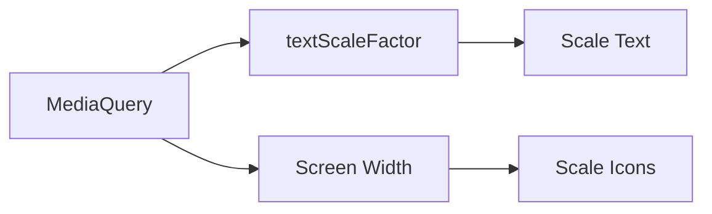

## 3.2.2 Scaling Text and Icons

In today's diverse digital landscape, where devices come in various shapes and sizes, ensuring that your application's text and icons are readable and visually appealing across all platforms is crucial. This section delves into the importance of scalable text and icons, leveraging Flutter's `MediaQuery` to achieve responsive designs that enhance user experience.

### Importance of Scalable Text and Icons

Scalable text and icons are vital for several reasons:

- **Readability:** Different devices have varying screen sizes and resolutions. Scalable text ensures that content is legible, regardless of the device.
- **Usability:** Icons that scale appropriately maintain their clarity and usability, providing users with intuitive navigation and interaction.
- **Accessibility:** Users with visual impairments may rely on larger text sizes, making scalable text a key component of accessible design.
- **Consistency:** A consistent look and feel across devices enhance the overall user experience, reinforcing brand identity and user satisfaction.

### Using MediaQuery for Text Scaling

Flutter's `MediaQuery` is a powerful tool for retrieving device-specific information, such as screen dimensions and text scaling factors. The `textScaleFactor` property of `MediaQuery` is particularly useful for adjusting text size dynamically.

#### Understanding `textScaleFactor`

The `textScaleFactor` represents the factor by which text should be scaled. It is influenced by the user's device settings, such as accessibility settings for larger text. By using `MediaQuery.of(context).textScaleFactor`, you can retrieve this value and apply it to your text widgets.

#### Adjusting Text Sizes Dynamically

To scale text dynamically, multiply the base font size by the `textScaleFactor`. This approach ensures that your text adapts to the user's preferences and device settings.

**Example: Scaling Text with MediaQuery**

```dart
Widget build(BuildContext context) {
  var textScale = MediaQuery.of(context).textScaleFactor;

  return Scaffold(
    appBar: AppBar(title: Text('Scaling Text')),
    body: Center(
      child: Text(
        'Responsive Text Size',
        style: TextStyle(fontSize: 16 * textScale),
      ),
    ),
  );
}
```

In this example, the text size is adjusted based on the `textScaleFactor`, ensuring that it scales appropriately across different devices and user settings.

### Scaling Icons Responsively

Icons, like text, should also be responsive to maintain usability and aesthetic consistency. While `MediaQuery` can be used to determine screen dimensions, you might also consider custom scaling logic or vector graphics for better scalability.

#### Using MediaQuery for Icon Scaling

By leveraging `MediaQuery`, you can adjust icon sizes based on screen width or other device characteristics.

**Example: Scaling Icons Based on Screen Width**

```dart
Widget build(BuildContext context) {
  var screenWidth = MediaQuery.of(context).size.width;
  double iconSize = screenWidth > 600 ? 48.0 : 24.0;

  return Scaffold(
    appBar: AppBar(title: Text('Scaling Icons')),
    body: Center(
      child: Icon(Icons.star, size: iconSize),
    ),
  );
}
```

In this example, the icon size is determined by the screen width, providing larger icons for wider screens, such as tablets, and smaller icons for narrower screens, like smartphones.

#### Alternative Methods for Icon Scaling

- **Vector Graphics:** Using vector graphics, such as SVGs, ensures that icons scale smoothly without losing quality. Flutter supports SVGs through packages like `flutter_svg`.
- **Custom Scaling Logic:** Implement custom logic to scale icons based on specific criteria, such as user preferences or device type.

### Best Practices for Scalable Text and Icons

- **Relative Sizing:** Use relative sizing (e.g., percentages, `em` units) rather than fixed dimensions to ensure elements adapt smoothly to different screen sizes.
- **Testing Across Devices:** Test your application on various devices to ensure that scaled text and icons maintain readability and design consistency.
- **Avoid Over-Scaling:** Be cautious of over-scaling, which can lead to layout issues or text overflow, negatively impacting user experience.

### Diagram Illustrating Text and Icon Scaling

To visualize the process of scaling text and icons using `MediaQuery`, consider the following diagram:



This diagram illustrates how `MediaQuery` provides the necessary information to scale text and icons, enhancing the responsiveness of your application.

### Conclusion

Scaling text and icons is a fundamental aspect of creating responsive and adaptive user interfaces in Flutter. By leveraging `MediaQuery`, you can ensure that your application's text and icons are both readable and visually appealing across a wide range of devices. Implementing these techniques not only improves usability and accessibility but also contributes to a consistent and engaging user experience.

### Further Exploration

For those interested in delving deeper into responsive design and scaling techniques, consider exploring the following resources:

- **Flutter Documentation:** The official Flutter documentation provides comprehensive guides and examples on responsive design.
- **Online Courses:** Platforms like Udemy and Coursera offer courses on Flutter development and responsive design principles.
- **Community Forums:** Engage with the Flutter community through forums and discussion groups to share insights and learn from others' experiences.

By continuously learning and experimenting with scalable design techniques, you can create applications that are both functional and aesthetically pleasing, catering to a diverse audience.

## Quiz Time!



### What is the primary purpose of scaling text and icons in a Flutter application?

- [x] To enhance readability and usability across different devices
- [ ] To make the application look more complex
- [ ] To reduce the application's file size
- [ ] To increase the number of widgets used

> **Explanation:** Scaling text and icons is primarily done to enhance readability and usability across various devices, ensuring a consistent user experience.

### How does `MediaQuery.of(context).textScaleFactor` affect text widgets?

- [x] It adjusts the size of text widgets based on user preferences and device settings
- [ ] It changes the color of text widgets
- [ ] It rotates text widgets
- [ ] It hides text widgets on smaller screens

> **Explanation:** The `textScaleFactor` adjusts the size of text widgets according to user preferences and device settings, improving accessibility and readability.

### Which of the following is a method to scale icons responsively?

- [x] Using MediaQuery to adjust icon size based on screen width
- [ ] Changing icon color based on user input
- [ ] Rotating icons for larger screens
- [ ] Using fixed icon sizes for all devices

> **Explanation:** MediaQuery can be used to adjust icon sizes based on screen width, ensuring icons are appropriately sized for different devices.

### What is a benefit of using vector graphics for icons?

- [x] They scale smoothly without losing quality
- [ ] They are easier to animate
- [ ] They require less memory
- [ ] They are only supported on Android devices

> **Explanation:** Vector graphics, such as SVGs, scale smoothly without losing quality, making them ideal for responsive designs.

### Which package can be used in Flutter to support SVGs?

- [x] flutter_svg
- [ ] flutter_icons
- [ ] flutter_vector
- [ ] flutter_graphics

> **Explanation:** The `flutter_svg` package is used in Flutter to support SVGs, allowing for scalable vector graphics.

### Why is it important to test scaled text and icons on various devices?

- [x] To ensure readability and design consistency
- [ ] To increase the app's download size
- [ ] To make the app look different on each device
- [ ] To reduce the number of widgets

> **Explanation:** Testing on various devices ensures that scaled text and icons maintain readability and design consistency across different screen sizes.

### What is a potential issue with over-scaling text and icons?

- [x] It might lead to layout issues or text overflow
- [ ] It can make the app run faster
- [ ] It reduces the app's memory usage
- [ ] It increases the number of animations

> **Explanation:** Over-scaling can lead to layout issues or text overflow, negatively impacting the user experience.

### How can you ensure that text and icons adapt smoothly to different screen sizes?

- [x] Use relative sizing instead of fixed dimensions
- [ ] Use fixed dimensions for all elements
- [ ] Avoid using MediaQuery
- [ ] Use only default font sizes

> **Explanation:** Using relative sizing instead of fixed dimensions ensures that text and icons adapt smoothly to different screen sizes.

### What does the `textScaleFactor` represent?

- [x] The factor by which text should be scaled
- [ ] The color of the text
- [ ] The rotation angle of the text
- [ ] The opacity of the text

> **Explanation:** The `textScaleFactor` represents the factor by which text should be scaled, influenced by user settings.

### True or False: Scaling text and icons is only important for accessibility purposes.

- [ ] True
- [x] False

> **Explanation:** While scaling text and icons is important for accessibility, it also enhances readability, usability, and consistency across different devices.


