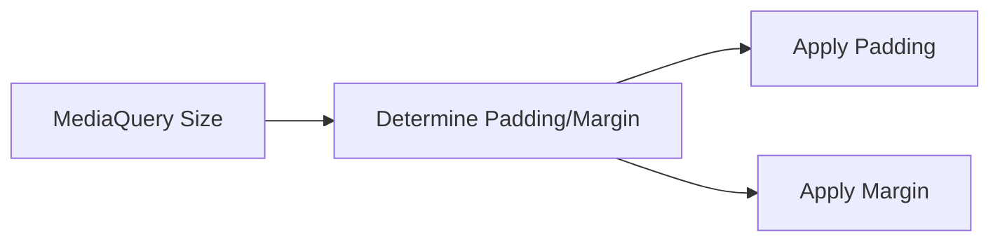

## 3.2.3 Responsive Padding and Margins

In the realm of mobile and web development, creating a user interface that adapts seamlessly to various screen sizes is crucial. Padding and margins play a vital role in achieving this adaptability, ensuring that your app's layout remains aesthetically pleasing and functional across different devices. In this section, we will delve into the significance of responsive padding and margins, explore how to implement them using Flutter's `MediaQuery`, and discuss best practices to enhance your UI design.

### Role of Padding and Margins in Responsive Design

Padding and margins are fundamental components of UI design, contributing significantly to the overall layout and spacing of elements within an application. They help define the visual hierarchy, improve readability, and ensure that content is not cramped or awkwardly spaced. In responsive design, padding and margins must adapt to different screen sizes to maintain a consistent and user-friendly experience.

- **Padding** refers to the space between the content of a widget and its boundary. It ensures that text and other elements are not flush against the edges of a container, providing breathing room and enhancing readability.
  
- **Margins** are the spaces outside the widget's boundary, affecting the distance between the widget and other surrounding elements. They help in aligning widgets and maintaining a structured layout.

In responsive design, both padding and margins must be dynamic, adjusting according to the screen dimensions to ensure that the UI remains balanced and visually appealing on all devices.

### Dynamic Padding and Margins

To create a responsive UI in Flutter, it's essential to dynamically adjust padding and margins based on the screen size. This can be achieved using `MediaQuery`, which provides information about the size and orientation of the current screen.

#### Using MediaQuery for Dynamic Adjustments

`MediaQuery` is a powerful tool in Flutter that allows you to access the dimensions and orientation of the device screen. By leveraging `MediaQuery`, you can calculate padding and margins dynamically, ensuring that your UI adapts gracefully to different screen sizes.

Here's how you can use `MediaQuery` to adjust padding and margins:

- **Access Screen Dimensions:** Use `MediaQuery.of(context).size` to retrieve the width and height of the screen.
- **Calculate Padding and Margins:** Based on the screen dimensions, calculate appropriate padding and margins.
- **Apply Padding and Margins:** Use the calculated values to set the padding and margins of your widgets.

#### Code Examples

Let's look at some practical examples to illustrate how you can implement responsive padding and margins in your Flutter applications.

**Example 1: Responsive Padding Based on Screen Width**

In this example, we adjust the horizontal padding of a widget based on the screen width. If the screen width is greater than 600 pixels, we use a larger padding value; otherwise, we use a smaller value.

```dart
Widget build(BuildContext context) {
  var screenWidth = MediaQuery.of(context).size.width;
  double horizontalPadding = screenWidth > 600 ? 32.0 : 16.0;

  return Scaffold(
    appBar: AppBar(title: Text('Responsive Padding')),
    body: Padding(
      padding: EdgeInsets.symmetric(horizontal: horizontalPadding),
      child: Column(
        children: [
          Text('Content with responsive padding'),
          // Other widgets
        ],
      ),
    ),
  );
}
```

**Example 2: Adjusting Margins Dynamically**

This example demonstrates how to adjust the vertical margin of a widget based on the screen height. If the screen height exceeds 800 pixels, we apply a larger margin; otherwise, a smaller margin is used.

```dart
Widget build(BuildContext context) {
  var screenHeight = MediaQuery.of(context).size.height;
  double verticalMargin = screenHeight > 800 ? 24.0 : 12.0;

  return Scaffold(
    appBar: AppBar(title: Text('Responsive Margins')),
    body: Container(
      margin: EdgeInsets.symmetric(vertical: verticalMargin),
      child: Text('Content with responsive margins'),
    ),
  );
}
```

### Mermaid.js Diagrams

To better understand the flow of applying responsive padding and margins, let's visualize the process using a Mermaid.js diagram.



This diagram illustrates the sequence of steps involved in determining and applying responsive padding and margins using `MediaQuery`.

### Best Practices

Creating a responsive UI involves more than just adjusting padding and margins. Here are some best practices to consider:

- **Utilize MediaQuery:** Use `MediaQuery` to create balanced and proportional spacing that enhances layout aesthetics. This ensures that your UI adapts to various screen sizes without manual adjustments.

- **Avoid Hardcoding:** Avoid hardcoding padding and margins. Instead, calculate them based on screen dimensions or other relevant factors. This approach enhances flexibility and maintainability.

- **Theme-Based Spacing:** Consider using theme-based spacing constants to maintain consistency across the app. Define spacing values in a centralized location, such as a theme or a constants file, to ensure uniformity.

- **Test Across Devices:** Regularly test your app on different devices and screen sizes to ensure that the responsive padding and margins function as expected. Use emulators and physical devices to cover a wide range of scenarios.

- **Consider Accessibility:** Ensure that your padding and margins support accessibility features, such as larger text sizes or screen readers. This consideration enhances the usability of your app for all users.

### Conclusion

Responsive padding and margins are essential components of a well-designed UI, contributing to the overall aesthetics and functionality of your app. By leveraging `MediaQuery` in Flutter, you can dynamically adjust these elements to create a seamless user experience across various devices. Implementing the best practices outlined in this section will help you build responsive and adaptive UIs that cater to diverse user needs.

As you continue to explore responsive design in Flutter, remember to experiment with different approaches and test your layouts on various devices. This hands-on experience will deepen your understanding and enable you to create more sophisticated and user-friendly applications.

## Quiz Time!



### What is the primary role of padding in UI design?

- [x] To provide space between the content of a widget and its boundary
- [ ] To create space outside the widget's boundary
- [ ] To align widgets within a container
- [ ] To define the color of a widget

> **Explanation:** Padding is used to provide space between the content of a widget and its boundary, enhancing readability and aesthetics.

### How does `MediaQuery` help in creating responsive UIs?

- [x] By providing information about the screen size and orientation
- [ ] By storing user preferences for padding and margins
- [ ] By automatically adjusting widget sizes
- [ ] By defining color schemes for different devices

> **Explanation:** `MediaQuery` provides information about the screen size and orientation, allowing developers to adjust UI elements dynamically.

### In the provided code examples, what determines the amount of padding or margin applied?

- [x] The screen width or height
- [ ] The number of widgets in the layout
- [ ] The color scheme of the app
- [ ] The type of device being used

> **Explanation:** The amount of padding or margin is determined by the screen width or height, allowing for dynamic adjustments based on device dimensions.

### Why should you avoid hardcoding padding and margins in responsive design?

- [x] To enhance flexibility and maintainability
- [ ] To increase the app's loading speed
- [ ] To reduce the app's memory usage
- [ ] To ensure compatibility with older devices

> **Explanation:** Avoiding hardcoded values enhances flexibility and maintainability, allowing the UI to adapt to different screen sizes.

### Which best practice involves using a centralized location for spacing values?

- [x] Theme-Based Spacing
- [ ] Hardcoding Values
- [ ] Using Random Values
- [ ] Device-Specific Spacing

> **Explanation:** Theme-Based Spacing involves using a centralized location for spacing values, ensuring consistency across the app.

### What is the benefit of using theme-based spacing constants?

- [x] Maintaining consistency across the app
- [ ] Increasing the app's loading time
- [ ] Reducing the number of widgets
- [ ] Automatically adjusting colors

> **Explanation:** Theme-based spacing constants help maintain consistency across the app by defining uniform spacing values.

### How can you test your app's responsive design effectively?

- [x] By testing on different devices and screen sizes
- [ ] By using only one type of emulator
- [ ] By focusing solely on high-resolution screens
- [ ] By ignoring accessibility features

> **Explanation:** Testing on different devices and screen sizes ensures that the responsive design functions as expected across various scenarios.

### What should you consider to enhance accessibility in your app's design?

- [x] Supporting larger text sizes and screen readers
- [ ] Using only default padding and margins
- [ ] Ignoring user preferences
- [ ] Hardcoding all UI elements

> **Explanation:** Enhancing accessibility involves supporting features like larger text sizes and screen readers to improve usability for all users.

### What is the purpose of using `MediaQuery` in Flutter?

- [x] To access the dimensions and orientation of the device screen
- [ ] To store user data securely
- [ ] To manage network requests
- [ ] To define app routes

> **Explanation:** `MediaQuery` is used to access the dimensions and orientation of the device screen, aiding in responsive design.

### True or False: Responsive padding and margins should be static and not change based on screen size.

- [ ] True
- [x] False

> **Explanation:** Responsive padding and margins should be dynamic, adjusting based on screen size to ensure a consistent user experience.


