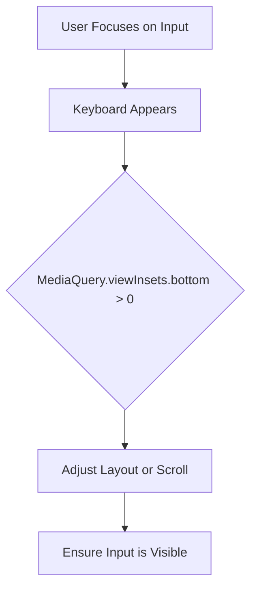

## 3.2.4 Handling Keyboard Insets

In the realm of mobile app development, ensuring that your user interface remains accessible and functional when the on-screen keyboard appears is crucial. This section delves into handling keyboard insets in Flutter applications, a key aspect of building responsive and adaptive UIs. We will explore how the appearance of the keyboard can affect your layout, how to manage UI elements when the keyboard is visible, and best practices to ensure a seamless user experience.

### Understanding Keyboard Insets

When a user interacts with an input field, the on-screen keyboard appears, potentially obscuring parts of your app's UI. This can be particularly problematic if important content or input fields are hidden behind the keyboard, leading to a frustrating user experience. Understanding how to detect and respond to these changes is essential for maintaining a responsive design.

#### How Keyboard Insets Affect Layout

The keyboard insets refer to the space occupied by the keyboard on the screen. When the keyboard is visible, it can push content upwards or cause overflow issues, especially on smaller screens. This necessitates adjustments to ensure that all interactive elements remain accessible.

### Managing UI Elements When Keyboard Appears

Flutter provides powerful tools to detect and respond to keyboard visibility changes, primarily through the `MediaQuery` class. By leveraging `MediaQuery.of(context).viewInsets`, you can determine the presence of the keyboard and adjust your layout accordingly.

#### Using MediaQuery to Detect Keyboard Visibility

The `MediaQuery` widget in Flutter is a versatile tool that provides information about the current state of the device, including screen dimensions, orientation, and insets. To detect keyboard visibility, you can check the `viewInsets` property, which returns the parts of the display that are obscured by system UI components, such as the keyboard.

```dart
bool isKeyboardVisible(BuildContext context) {
  return MediaQuery.of(context).viewInsets.bottom != 0;
}
```

This simple function checks if the bottom inset is non-zero, indicating that the keyboard is present.

#### Adjusting Layout with SingleChildScrollView and resizeToAvoidBottomInset

To ensure that your UI adapts when the keyboard appears, you can use layout strategies such as `SingleChildScrollView` or the `resizeToAvoidBottomInset` property of the `Scaffold` widget.

- **SingleChildScrollView**: This widget allows the entire screen to be scrollable, ensuring that all content remains accessible even when the keyboard is visible.

- **resizeToAvoidBottomInset**: By setting this property to `true` (which is the default), the `Scaffold` automatically resizes its body to avoid the keyboard.

### Code Examples

Let's explore some practical code examples to illustrate these concepts.

#### Example 1: Adjusting Layout Based on Keyboard Visibility

In this example, we will conditionally display a `TextField` based on the visibility of the keyboard.

```dart
Widget build(BuildContext context) {
  var keyboardVisible = MediaQuery.of(context).viewInsets.bottom != 0;

  return Scaffold(
    appBar: AppBar(title: Text('Keyboard Insets Example')),
    body: Column(
      children: [
        Expanded(
          child: Center(child: Text('Main Content')),
        ),
        if (!keyboardVisible)
          Padding(
            padding: EdgeInsets.all(16.0),
            child: TextField(
              decoration: InputDecoration(labelText: 'Enter text'),
            ),
          ),
      ],
    ),
  );
}
```

In this code, the `TextField` is only displayed when the keyboard is not visible, preventing it from being obscured.

#### Example 2: Using SingleChildScrollView to Prevent Overflow

Here, we use a `SingleChildScrollView` to ensure that all content remains accessible when the keyboard appears.

```dart
Widget build(BuildContext context) {
  return Scaffold(
    appBar: AppBar(title: Text('Keyboard Handling')),
    body: SingleChildScrollView(
      padding: EdgeInsets.all(16.0),
      child: Column(
        children: [
          TextField(decoration: InputDecoration(labelText: 'Field 1')),
          SizedBox(height: 20),
          TextField(decoration: InputDecoration(labelText: 'Field 2')),
          SizedBox(height: 20),
          // Additional content
        ],
      ),
    ),
  );
}
```

The `SingleChildScrollView` allows the user to scroll through the content, ensuring that all input fields are accessible.

### Mermaid.js Diagrams

To better understand the process of detecting keyboard visibility and adjusting the UI, let's visualize it with a Mermaid.js diagram.



This diagram illustrates the flow from user interaction to UI adjustment, ensuring that input fields remain visible when the keyboard appears.

### Best Practices

When handling keyboard insets, consider the following best practices:

- **Account for Keyboard Presence**: Always ensure that critical UI elements are not obscured by the keyboard. This can be achieved by using scrollable widgets or flexible layouts.
  
- **Test Extensively**: Input interactions should be tested on various devices and orientations to ensure a smooth user experience.
  
- **Use MediaQuery Judiciously**: While `MediaQuery` is powerful, it should be used carefully to avoid unnecessary rebuilds or performance issues.

- **Consider User Experience**: Ensure that the transition when the keyboard appears or disappears is smooth and does not disrupt the user's interaction with the app.

### Conclusion

Handling keyboard insets is a crucial aspect of building responsive and adaptive UIs in Flutter. By leveraging tools like `MediaQuery` and layout strategies such as `SingleChildScrollView`, you can ensure that your app remains functional and user-friendly, even when the keyboard is visible. Remember to test your app thoroughly and consider the user experience at every step.

## Quiz Time!



### What is the primary purpose of handling keyboard insets in Flutter applications?

- [x] To ensure UI elements are not obscured by the keyboard.
- [ ] To improve the app's performance.
- [ ] To enhance the app's visual design.
- [ ] To increase the app's loading speed.

> **Explanation:** Handling keyboard insets ensures that important UI elements, such as input fields, remain visible and accessible when the on-screen keyboard appears.

### Which Flutter widget can be used to make the entire screen scrollable when the keyboard appears?

- [ ] Column
- [ ] Row
- [x] SingleChildScrollView
- [ ] Stack

> **Explanation:** `SingleChildScrollView` allows the entire screen to be scrollable, ensuring that all content remains accessible when the keyboard is visible.

### How can you detect if the keyboard is visible using MediaQuery?

- [ ] MediaQuery.of(context).size.width > 0
- [x] MediaQuery.of(context).viewInsets.bottom != 0
- [ ] MediaQuery.of(context).orientation == Orientation.portrait
- [ ] MediaQuery.of(context).platformBrightness == Brightness.dark

> **Explanation:** `MediaQuery.of(context).viewInsets.bottom != 0` checks if the bottom inset is non-zero, indicating that the keyboard is present.

### What property of the Scaffold widget can automatically resize its body to avoid the keyboard?

- [ ] appBar
- [x] resizeToAvoidBottomInset
- [ ] floatingActionButton
- [ ] drawer

> **Explanation:** The `resizeToAvoidBottomInset` property, when set to `true`, automatically resizes the `Scaffold` body to avoid the keyboard.

### In the provided code example, what condition is used to determine if the keyboard is visible?

- [ ] MediaQuery.of(context).size.height > 0
- [x] MediaQuery.of(context).viewInsets.bottom != 0
- [ ] MediaQuery.of(context).padding.top > 0
- [ ] MediaQuery.of(context).devicePixelRatio > 1

> **Explanation:** The condition `MediaQuery.of(context).viewInsets.bottom != 0` is used to determine if the keyboard is visible.

### Which of the following is a best practice when handling keyboard insets?

- [x] Test input interactions extensively.
- [ ] Ignore keyboard presence in design.
- [ ] Use fixed layouts that do not adapt.
- [ ] Avoid using MediaQuery.

> **Explanation:** Testing input interactions extensively ensures that the UI remains accessible and user-friendly across different devices and orientations.

### What is the role of the `viewInsets` property in MediaQuery?

- [ ] It provides the screen's orientation.
- [x] It indicates the parts of the display obscured by system UI components.
- [ ] It returns the device's pixel ratio.
- [ ] It gives the screen's brightness level.

> **Explanation:** The `viewInsets` property indicates the parts of the display that are obscured by system UI components, such as the keyboard.

### Why is it important to handle keyboard insets in mobile applications?

- [x] To prevent critical UI elements from being obscured.
- [ ] To increase the app's download size.
- [ ] To make the app more colorful.
- [ ] To reduce the app's functionality.

> **Explanation:** Handling keyboard insets ensures that critical UI elements, like input fields, are not obscured, maintaining a smooth user experience.

### Which widget property helps in making the Scaffold body resize to avoid the keyboard?

- [ ] appBar
- [x] resizeToAvoidBottomInset
- [ ] floatingActionButton
- [ ] drawer

> **Explanation:** The `resizeToAvoidBottomInset` property helps in making the `Scaffold` body resize to avoid the keyboard.

### True or False: Using MediaQuery to detect keyboard visibility can help in adjusting the layout dynamically.

- [x] True
- [ ] False

> **Explanation:** True. Using MediaQuery to detect keyboard visibility allows developers to adjust the layout dynamically, ensuring that UI elements remain accessible.


