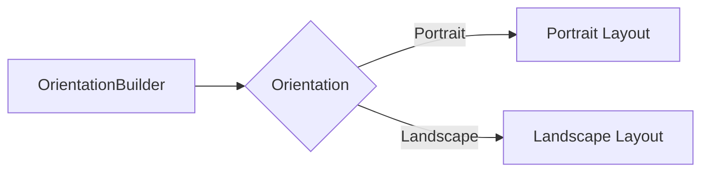

## 3.3.1 Using OrientationBuilder

In the ever-evolving landscape of mobile application development, creating interfaces that adapt seamlessly to different screen orientations is crucial. Flutter, with its rich set of widgets, provides the `OrientationBuilder` widget, a powerful tool for building adaptive UIs that respond dynamically to orientation changes. This section delves into the utility of `OrientationBuilder`, illustrating how it can be leveraged to enhance user experience by tailoring layouts to both portrait and landscape modes.

### Introduction to OrientationBuilder

`OrientationBuilder` is a Flutter widget designed to rebuild its child widget tree whenever the device's orientation changes. This capability is particularly beneficial for applications that need to present different layouts or content arrangements based on whether the device is held in portrait or landscape mode.

#### Benefits of Using OrientationBuilder

- **Adaptive Layouts:** `OrientationBuilder` allows developers to create distinct layouts for different orientations, ensuring that the UI is optimized for the available screen space.
- **Improved User Experience:** By adapting the UI to the device's orientation, applications can provide a more intuitive and comfortable user experience.
- **Dynamic Content Arrangement:** It enables dynamic rearrangement of content, such as switching from a single-column layout in portrait mode to a multi-column layout in landscape mode.

### Customizing Layouts per Orientation

One of the primary uses of `OrientationBuilder` is to customize layouts based on the current orientation of the device. This customization can range from simple changes, such as adjusting padding or margins, to more complex alterations, such as switching between entirely different widget trees.

#### Switching Layouts with OrientationBuilder

The following examples demonstrate how to use `OrientationBuilder` to adapt your application's layout according to the device's orientation.

**Example 1: Adjusting Layout with OrientationBuilder**

In this example, we use `OrientationBuilder` to switch between a `Column` layout in portrait mode and a `Row` layout in landscape mode. This simple adjustment ensures that the UI components are displayed optimally based on the screen's orientation.

```dart
Widget build(BuildContext context) {
  return Scaffold(
    appBar: AppBar(title: Text('OrientationBuilder Example')),
    body: OrientationBuilder(
      builder: (context, orientation) {
        if (orientation == Orientation.portrait) {
          return Column(
            children: [
              Icon(Icons.phone, size: 100),
              Text('Portrait Layout'),
            ],
          );
        } else {
          return Row(
            children: [
              Icon(Icons.phone, size: 100),
              Text('Landscape Layout'),
            ],
          );
        }
      },
    ),
  );
}
```

**Example 2: Different Widget Trees Based on Orientation**

This example illustrates a more complex use case where the widget tree changes entirely based on the orientation. In portrait mode, a `ListView` is used to display items in a single column, whereas in landscape mode, a `GridView` is employed to take advantage of the additional horizontal space.

```dart
Widget build(BuildContext context) {
  return Scaffold(
    appBar: AppBar(title: Text('Adaptive Widgets')),
    body: OrientationBuilder(
      builder: (context, orientation) {
        return orientation == Orientation.portrait
            ? ListView(
                children: [
                  ListTile(title: Text('Item 1')),
                  ListTile(title: Text('Item 2')),
                  // More items
                ],
              )
            : GridView.count(
                crossAxisCount: 3,
                children: List.generate(6, (index) => Card(child: Center(child: Text('Item $index')))),
              );
      },
    ),
  );
}
```

### Visualizing OrientationBuilder Functionality

To better understand how `OrientationBuilder` operates, consider the following Mermaid.js diagram, which visually represents the decision-making process within the widget:



This diagram illustrates how `OrientationBuilder` evaluates the device's orientation and chooses the appropriate layout accordingly.

### Best Practices for Using OrientationBuilder

When implementing `OrientationBuilder` in your Flutter applications, consider the following best practices to ensure a smooth and intuitive user experience:

- **Significant Layout Changes:** Utilize `OrientationBuilder` for substantial layout changes that enhance usability, such as switching from a list to a grid or altering navigation patterns.
- **Intuitive Transitions:** Ensure that any changes in layout are clear and logical to the user. Abrupt or confusing transitions can detract from the user experience.
- **Combine with Other Responsive Strategies:** While `OrientationBuilder` is powerful, it should be used in conjunction with other responsive design techniques, such as `MediaQuery` and `LayoutBuilder`, to create a cohesive adaptive design.

### Practical Application and Real-World Scenarios

In real-world applications, `OrientationBuilder` can be used to enhance various aspects of the user interface:

- **Media Applications:** In a media app, `OrientationBuilder` can switch between a list of thumbnails in portrait mode and a grid of larger images in landscape mode, providing an optimal viewing experience.
- **E-commerce Platforms:** For e-commerce apps, it can dynamically adjust product listings and detail views, ensuring that users can easily browse and interact with items regardless of how they hold their device.
- **Educational Apps:** In educational applications, `OrientationBuilder` can be used to switch between reading modes and interactive modes, adapting content presentation to suit the user's current focus.

### Conclusion

`OrientationBuilder` is an invaluable tool in the Flutter developer's toolkit, enabling the creation of adaptive and responsive user interfaces that cater to various device orientations. By understanding and applying the principles outlined in this section, developers can enhance their applications, providing users with a seamless and engaging experience across all screen orientations.

For further exploration, consider experimenting with `OrientationBuilder` in combination with other layout widgets and responsive design strategies. The official [Flutter documentation](https://flutter.dev/docs) and community resources offer additional insights and examples to deepen your understanding and proficiency with this versatile widget.

## Quiz Time!



### What is the primary purpose of the OrientationBuilder widget in Flutter?

- [x] To rebuild its child widget tree based on the device's orientation.
- [ ] To manage state changes within an application.
- [ ] To handle network requests efficiently.
- [ ] To provide animations for UI transitions.

> **Explanation:** OrientationBuilder is specifically designed to rebuild its child widget tree whenever the device's orientation changes, allowing developers to create adaptive layouts.

### Which of the following is a benefit of using OrientationBuilder?

- [x] It allows for adaptive layouts based on device orientation.
- [ ] It simplifies network request handling.
- [ ] It automatically manages application state.
- [ ] It provides built-in animations for widgets.

> **Explanation:** OrientationBuilder enables developers to create layouts that adapt to the device's orientation, enhancing user experience by optimizing the UI for available screen space.

### In the provided code examples, what layout is used in portrait mode in Example 2?

- [x] ListView
- [ ] GridView
- [ ] Stack
- [ ] Column

> **Explanation:** In Example 2, a ListView is used in portrait mode to display items in a single column.

### What does the OrientationBuilder widget use to determine the current orientation?

- [x] The Orientation enum
- [ ] The MediaQuery class
- [ ] The LayoutBuilder widget
- [ ] The DeviceOrientation class

> **Explanation:** OrientationBuilder uses the Orientation enum to determine whether the device is in portrait or landscape mode.

### Which widget is used in landscape mode in Example 2 to take advantage of additional horizontal space?

- [ ] ListView
- [x] GridView
- [ ] Stack
- [ ] Column

> **Explanation:** In landscape mode, Example 2 uses a GridView to take advantage of the additional horizontal space by displaying items in a grid format.

### What is a best practice when using OrientationBuilder for layout changes?

- [x] Ensure changes are clear and intuitive to the user.
- [ ] Use it for minor padding adjustments only.
- [ ] Avoid combining it with other responsive strategies.
- [ ] Always use it for managing application state.

> **Explanation:** It's important to ensure that layout changes are clear and intuitive to the user, avoiding confusion during orientation transitions.

### Which diagram type is used to visualize OrientationBuilder functionality in the article?

- [x] Mermaid.js graph
- [ ] UML class diagram
- [ ] Gantt chart
- [ ] Pie chart

> **Explanation:** A Mermaid.js graph is used to visually represent the decision-making process within the OrientationBuilder widget.

### What should OrientationBuilder be combined with for a cohesive adaptive design?

- [x] Other responsive strategies like MediaQuery and LayoutBuilder
- [ ] Only state management solutions
- [ ] Animation libraries
- [ ] Network handling packages

> **Explanation:** OrientationBuilder should be combined with other responsive strategies like MediaQuery and LayoutBuilder for a cohesive adaptive design.

### What kind of applications can benefit from using OrientationBuilder?

- [x] Media applications, e-commerce platforms, educational apps
- [ ] Only gaming applications
- [ ] Only financial applications
- [ ] Only social media applications

> **Explanation:** A wide range of applications, including media, e-commerce, and educational apps, can benefit from using OrientationBuilder to adapt their UIs based on device orientation.

### True or False: OrientationBuilder automatically handles state management within an application.

- [ ] True
- [x] False

> **Explanation:** OrientationBuilder does not handle state management; it is used for adapting layouts based on device orientation.


