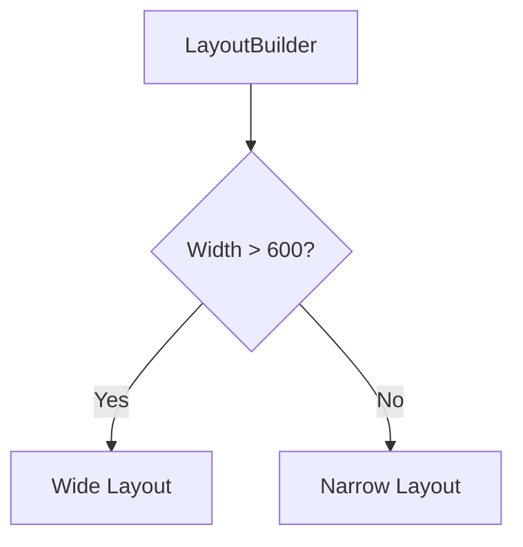

## 3.3.2 LayoutBuilder for Adaptive Designs

In the ever-evolving landscape of mobile and web applications, creating interfaces that adapt seamlessly to different screen sizes and orientations is crucial. Flutter, with its rich set of tools and widgets, provides developers with the ability to craft responsive and adaptive UIs. One such powerful widget is `LayoutBuilder`, which allows developers to build layouts that respond dynamically to the constraints provided by their parent widgets. This section delves into the intricacies of `LayoutBuilder`, illustrating how it can be leveraged to create adaptive designs.

### Introduction to LayoutBuilder

`LayoutBuilder` is a widget in Flutter that builds its child widgets based on the constraints it receives from its parent. This capability makes it an essential tool for creating adaptive designs. By using `LayoutBuilder`, developers can access the maximum width and height available to a widget, allowing them to adjust the layout accordingly.

#### Key Features of LayoutBuilder

- **Access to Constraints:** `LayoutBuilder` provides access to the constraints of its parent, enabling developers to make informed decisions about how to render child widgets.
- **Dynamic Adaptation:** It allows for dynamic adaptation of layouts based on available space, making it ideal for responsive design.
- **Flexibility:** `LayoutBuilder` can be combined with other widgets and techniques, such as `MediaQuery`, to achieve comprehensive responsiveness.

### Building Layouts That Respond to Size Changes

Creating layouts that respond to size changes is a fundamental aspect of adaptive design. With `LayoutBuilder`, you can adjust the size, arrangement, and even visibility of widgets based on the constraints provided by the parent. This ensures that your application looks great on any device, whether it's a small mobile screen or a large desktop monitor.

#### Example 1: Responsive Container Size

In this example, we'll use `LayoutBuilder` to create a container that changes its size and color based on the available width. This is a simple yet effective way to demonstrate how `LayoutBuilder` can be used to adapt to different screen sizes.

```dart
Widget build(BuildContext context) {
  return Scaffold(
    appBar: AppBar(title: Text('LayoutBuilder Example')),
    body: LayoutBuilder(
      builder: (context, constraints) {
        if (constraints.maxWidth > 600) {
          return Container(
            width: 500,
            height: 300,
            color: Colors.blue,
            child: Center(child: Text('Large Screen Container')),
          );
        } else {
          return Container(
            width: 200,
            height: 150,
            color: Colors.green,
            child: Center(child: Text('Small Screen Container')),
          );
        }
      },
    ),
  );
}
```

**Explanation:**

- **Constraints Access:** The `builder` function provides the `constraints` parameter, which contains the maximum width and height available to the `LayoutBuilder`.
- **Conditional Layout:** Based on the `maxWidth`, the layout changes. If the width is greater than 600 pixels, a larger blue container is displayed; otherwise, a smaller green container is shown.

#### Example 2: Adjusting Child Widget Arrangement

In this example, we'll use `LayoutBuilder` to switch between a row and a column layout based on the available width. This technique is particularly useful for adapting content presentation on different devices.

```dart
Widget build(BuildContext context) {
  return Scaffold(
    appBar: AppBar(title: Text('Adaptive Design with LayoutBuilder')),
    body: LayoutBuilder(
      builder: (context, constraints) {
        if (constraints.maxWidth > 800) {
          return Row(
            children: [
              Expanded(child: Image.network('https://example.com/image.jpg')),
              Expanded(child: Text('Detailed Information')),
            ],
          );
        } else {
          return Column(
            children: [
              Image.network('https://example.com/image.jpg'),
              Text('Detailed Information'),
            ],
          );
        }
      },
    ),
  );
}
```

**Explanation:**

- **Responsive Arrangement:** The layout changes from a row to a column based on the `maxWidth`, ensuring that the content is displayed optimally on both wide and narrow screens.
- **Use of Expanded:** The `Expanded` widget is used to ensure that the child widgets take up the available space within the `Row` or `Column`.

### Mermaid.js Diagrams

To further illustrate how `LayoutBuilder` adapts to different constraints, let's visualize the decision-making process using a Mermaid.js diagram.



**Diagram Explanation:**

- **Decision Node:** The diagram shows a decision node where the width is checked against a threshold (600 pixels in this case).
- **Outcome Paths:** Depending on the result, the layout adapts to either a wide or narrow configuration.

### Best Practices

When using `LayoutBuilder`, there are several best practices to keep in mind to ensure optimal performance and maintainability:

- **Fine-Grained Control:** Use `LayoutBuilder` for fine-grained control over widget layouts based on parent constraints. This is particularly useful for creating adaptive designs that need to respond to specific size changes.
- **Avoid Heavy Computations:** Avoid placing heavy computations inside the `builder` method. The `builder` function is called every time the constraints change, so keeping it lightweight is crucial for maintaining performance.
- **Combine with MediaQuery:** For more comprehensive responsiveness, combine `LayoutBuilder` with `MediaQuery`. This allows you to access additional device information, such as orientation and screen size, to make more informed layout decisions.

### Practical Applications and Real-World Scenarios

In real-world applications, `LayoutBuilder` can be used in various scenarios to enhance user experience:

- **Dashboard Layouts:** In applications with dashboard-like interfaces, `LayoutBuilder` can dynamically adjust the number of columns or the size of widgets based on the screen size.
- **E-commerce Apps:** For e-commerce applications, `LayoutBuilder` can be used to switch between grid and list views of products based on the available width.
- **Media Apps:** In media-rich applications, `LayoutBuilder` can help adjust the size and arrangement of video players, image galleries, and other media elements to fit different screen sizes.

### Conclusion

`LayoutBuilder` is a powerful tool in Flutter's arsenal for creating adaptive and responsive designs. By providing access to the constraints of its parent, it allows developers to build layouts that can dynamically adjust to different screen sizes and orientations. Whether you're building a simple app or a complex application with multiple layouts, `LayoutBuilder` can help ensure that your UI looks great on any device.

By following the best practices outlined in this section and experimenting with the provided examples, you can harness the full potential of `LayoutBuilder` to create adaptive designs that enhance user experience across all platforms.

## Quiz Time!



### What is the primary purpose of the `LayoutBuilder` widget in Flutter?

- [x] To provide access to the parent widget's constraints for adaptive design.
- [ ] To manage state changes in a Flutter application.
- [ ] To handle user input and gestures.
- [ ] To render complex animations smoothly.

> **Explanation:** `LayoutBuilder` is used to access the constraints of its parent, allowing developers to create adaptive layouts based on available space.

### In the provided code examples, what determines whether a `Row` or `Column` layout is used?

- [x] The maximum width constraint provided by `LayoutBuilder`.
- [ ] The height of the parent widget.
- [ ] The number of child widgets.
- [ ] The presence of an `Expanded` widget.

> **Explanation:** The layout switches between `Row` and `Column` based on the `maxWidth` constraint provided by `LayoutBuilder`.

### What is a recommended practice when using `LayoutBuilder`?

- [x] Avoid placing heavy computations inside the `builder` method.
- [ ] Always use `LayoutBuilder` with `StatefulWidget`.
- [ ] Use `LayoutBuilder` only for fixed layouts.
- [ ] Avoid using `LayoutBuilder` with `MediaQuery`.

> **Explanation:** To maintain performance, it's important to avoid heavy computations inside the `builder` method, as it is called every time constraints change.

### How can `LayoutBuilder` be combined with `MediaQuery`?

- [x] To achieve more comprehensive responsiveness by accessing additional device information.
- [ ] To manage state changes more efficiently.
- [ ] To handle animations and transitions.
- [ ] To improve network request handling.

> **Explanation:** Combining `LayoutBuilder` with `MediaQuery` allows developers to access more device information, such as orientation and screen size, for better layout decisions.

### Which of the following is a practical application of `LayoutBuilder`?

- [x] Dynamically adjusting the number of columns in a dashboard layout.
- [ ] Managing user authentication and sessions.
- [ ] Handling network requests and responses.
- [ ] Creating complex animations and transitions.

> **Explanation:** `LayoutBuilder` can be used to dynamically adjust layouts, such as the number of columns in a dashboard, based on available space.

### What does the `builder` function of `LayoutBuilder` provide?

- [x] The constraints of the parent widget.
- [ ] The state of the application.
- [ ] The current theme data.
- [ ] The list of child widgets.

> **Explanation:** The `builder` function provides the constraints of the parent widget, which can be used to adapt the layout.

### What should be avoided inside the `builder` method of `LayoutBuilder`?

- [x] Heavy computations that can affect performance.
- [ ] Using `Expanded` widgets.
- [ ] Accessing `MediaQuery` data.
- [ ] Defining child widgets.

> **Explanation:** Heavy computations should be avoided inside the `builder` method to maintain performance, as it is called frequently.

### What is the benefit of using `Expanded` within a `LayoutBuilder`?

- [x] It ensures child widgets take up available space within their parent.
- [ ] It improves network performance.
- [ ] It handles user input more effectively.
- [ ] It manages state changes automatically.

> **Explanation:** `Expanded` ensures that child widgets take up the available space within their parent, which is useful in adaptive layouts.

### What type of layout change does `LayoutBuilder` facilitate in the second example?

- [x] Switching between `Row` and `Column` layouts based on width.
- [ ] Changing the theme of the application.
- [ ] Managing user authentication.
- [ ] Handling asynchronous data fetching.

> **Explanation:** In the second example, `LayoutBuilder` facilitates switching between `Row` and `Column` layouts based on the available width.

### True or False: `LayoutBuilder` can be used to create fixed layouts that do not change with screen size.

- [ ] True
- [x] False

> **Explanation:** `LayoutBuilder` is specifically designed to create adaptive layouts that change based on the constraints provided by the parent, not fixed layouts.


