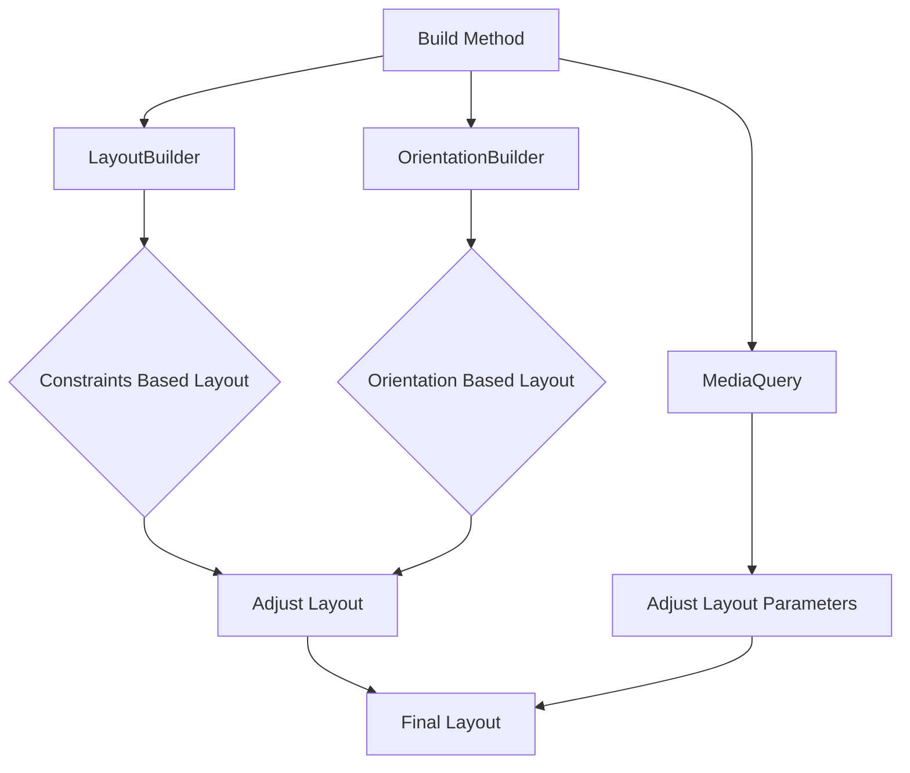

## 3.3.3 Combining MediaQuery, OrientationBuilder, and LayoutBuilder for Advanced Responsive UIs

In the ever-evolving landscape of mobile app development, creating applications that seamlessly adapt to various devices and orientations is crucial. Flutter, with its rich set of tools, offers developers the ability to craft highly responsive and adaptive user interfaces. This section delves into the advanced techniques of combining `MediaQuery`, `OrientationBuilder`, and `LayoutBuilder` to achieve sophisticated responsiveness in your Flutter apps.

### Advanced Responsiveness Techniques

Combining `MediaQuery`, `OrientationBuilder`, and `LayoutBuilder` allows developers to create UIs that are not only responsive to screen size but also adaptive to orientation changes and layout constraints. This trifecta provides a robust framework for handling complex UI requirements.

- **MediaQuery**: Provides information about the size, orientation, and other characteristics of the current device's screen.
- **OrientationBuilder**: Allows you to build layouts that adapt to changes in device orientation.
- **LayoutBuilder**: Offers a way to build widgets that can adapt to the constraints of their parent widget.

By layering these tools, you can create UIs that dynamically adjust to a wide range of devices and user preferences.

### Layering Responsiveness

Layering different responsive strategies involves using each of these tools to address specific aspects of your UI's adaptability:

- **MediaQuery** is used to gather information about the device's screen, such as size and orientation, which can inform layout decisions.
- **OrientationBuilder** helps in adjusting the layout based on whether the device is in portrait or landscape mode.
- **LayoutBuilder** provides the constraints of the parent widget, allowing for fine-tuned control over how child widgets are displayed.

This layered approach ensures that your application remains usable and visually appealing across a variety of devices and orientations.

### Code Examples

Let's explore some practical examples to illustrate how these tools can be combined effectively.

#### Example 1: Using MediaQuery with LayoutBuilder for Comprehensive Responsiveness

In this example, we demonstrate how to use `MediaQuery` in conjunction with `LayoutBuilder` and `OrientationBuilder` to create a responsive layout that adapts to both screen size and orientation.

```dart
Widget build(BuildContext context) {
  var mediaQuery = MediaQuery.of(context);
  var screenWidth = mediaQuery.size.width;

  return Scaffold(
    appBar: AppBar(title: Text('Combined Builders')),
    body: LayoutBuilder(
      builder: (context, constraints) {
        return OrientationBuilder(
          builder: (context, orientation) {
            if (screenWidth > 800) {
              return Row(
                children: [
                  Expanded(child: Image.network('https://example.com/image.jpg')),
                  Expanded(child: Text('Detailed Information')),
                ],
              );
            } else if (orientation == Orientation.portrait) {
              return Column(
                children: [
                  Image.network('https://example.com/image.jpg'),
                  Text('Portrait Layout Information'),
                ],
              );
            } else {
              return Row(
                children: [
                  Image.network('https://example.com/image.jpg'),
                  Expanded(child: Text('Landscape Layout Information')),
                ],
              );
            }
          },
        );
      },
    ),
  );
}
```

**Explanation:**

- **MediaQuery** is used to determine the screen width, which helps decide whether to use a `Row` or `Column`.
- **LayoutBuilder** provides the constraints of the parent widget, ensuring that the layout adapts to available space.
- **OrientationBuilder** switches between portrait and landscape layouts, demonstrating how orientation affects the UI.

#### Example 2: Dynamic Padding and Layout Based on Multiple Factors

This example illustrates how to adjust padding and layout based on screen width and orientation, using a combination of `MediaQuery`, `OrientationBuilder`, and `LayoutBuilder`.

```dart
Widget build(BuildContext context) {
  var mediaQuery = MediaQuery.of(context);
  var screenWidth = mediaQuery.size.width;
  var textScale = mediaQuery.textScaleFactor;

  return Scaffold(
    appBar: AppBar(title: Text('Advanced Responsiveness')),
    body: LayoutBuilder(
      builder: (context, constraints) {
        return OrientationBuilder(
          builder: (context, orientation) {
            double padding = screenWidth > 600 ? 32.0 : 16.0;
            return Padding(
              padding: EdgeInsets.all(padding),
              child: Column(
                children: [
                  Text(
                    'Responsive Text Size',
                    style: TextStyle(fontSize: 18 * textScale),
                  ),
                  SizedBox(height: 20),
                  orientation == Orientation.portrait
                      ? Column(
                          children: [
                            Icon(Icons.portrait, size: 48),
                            Text('Portrait Icon'),
                          ],
                        )
                      : Row(
                          children: [
                            Icon(Icons.landscape, size: 48),
                            Text('Landscape Icon'),
                          ],
                        ),
                ],
              ),
            );
          },
        );
      },
    ),
  );
}
```

**Explanation:**

- **MediaQuery** is used to adjust text size and padding dynamically based on the screen width and text scale factor.
- **OrientationBuilder** changes the layout from a column to a row depending on the device's orientation.
- **LayoutBuilder** ensures that the layout adapts to the constraints of its parent widget.

### Mermaid.js Diagrams

To better understand the workflow of combining these tools, let's visualize it using a Mermaid.js diagram.



**Diagram Explanation:**

- The build method initiates the process, gathering device information through `MediaQuery`.
- `LayoutBuilder` and `OrientationBuilder` work in tandem to adjust the layout based on constraints and orientation.
- The final layout is a result of combining these adjustments, ensuring a responsive and adaptive UI.

### Best Practices

When combining `MediaQuery`, `OrientationBuilder`, and `LayoutBuilder`, consider the following best practices:

- **Organize Responsive Logic**: Keep your code organized by clearly separating logic for different responsive strategies. This improves readability and maintainability.
- **Thorough Testing**: Test your application on various devices and orientations to ensure that all scenarios are handled gracefully.
- **Documentation**: Document your responsive design decisions within the code. This aids future maintenance and updates, providing clarity on why certain decisions were made.

### Conclusion

By effectively combining `MediaQuery`, `OrientationBuilder`, and `LayoutBuilder`, you can create highly responsive and adaptive UIs that cater to a wide range of devices and user preferences. These tools provide a powerful framework for handling complex layout requirements, ensuring that your application remains both functional and visually appealing across different contexts.

### Further Exploration

For those interested in delving deeper into responsive design in Flutter, consider exploring the following resources:

- **Official Flutter Documentation**: [Flutter Layouts](https://flutter.dev/docs/development/ui/layout)
- **Online Courses**: Platforms like Udemy and Coursera offer courses on advanced Flutter development.
- **Community Forums**: Engage with the Flutter community on platforms like Reddit and Stack Overflow to share insights and seek advice.

By mastering these advanced responsiveness techniques, you can elevate your Flutter applications to new heights, delivering exceptional user experiences across all devices.

## Quiz Time!



### What is the primary role of MediaQuery in Flutter?

- [x] To provide information about the device's screen size and orientation.
- [ ] To build layouts that adapt to orientation changes.
- [ ] To manage state across the application.
- [ ] To handle network requests and responses.

> **Explanation:** MediaQuery provides information about the device's screen, such as size and orientation, which is crucial for building responsive UIs.

### Which builder is used to adapt layouts based on the device's orientation?

- [ ] MediaQuery
- [ ] LayoutBuilder
- [x] OrientationBuilder
- [ ] Scaffold

> **Explanation:** OrientationBuilder is specifically designed to help build layouts that adapt to changes in device orientation.

### What does LayoutBuilder provide to its builder function?

- [ ] The current theme of the app.
- [ ] The device's screen size and orientation.
- [x] The constraints of the parent widget.
- [ ] The current state of the widget.

> **Explanation:** LayoutBuilder provides the constraints of the parent widget, allowing for fine-tuned control over how child widgets are displayed.

### In the provided code examples, what does the variable 'screenWidth' represent?

- [ ] The height of the screen.
- [x] The width of the screen.
- [ ] The orientation of the device.
- [ ] The text scale factor.

> **Explanation:** The variable 'screenWidth' is obtained from MediaQuery and represents the width of the device's screen.

### How does the combination of MediaQuery, OrientationBuilder, and LayoutBuilder enhance responsiveness?

- [x] By allowing the UI to adapt to screen size, orientation, and layout constraints.
- [ ] By managing network requests more efficiently.
- [ ] By providing a unified state management solution.
- [ ] By improving the app's performance on older devices.

> **Explanation:** Combining these tools allows developers to create UIs that dynamically adjust to a wide range of devices and user preferences, enhancing responsiveness.

### What is a best practice when organizing responsive logic in Flutter?

- [ ] Use a single function for all responsive logic.
- [x] Clearly separate logic for different responsive strategies.
- [ ] Avoid using MediaQuery for performance reasons.
- [ ] Rely solely on OrientationBuilder for all responsiveness.

> **Explanation:** Organizing responsive logic clearly improves code readability and maintainability, making it easier to manage and update.

### Why is thorough testing important when implementing responsive strategies?

- [ ] To ensure the app runs faster on all devices.
- [x] To ensure all scenarios are handled gracefully across different devices and orientations.
- [ ] To reduce the app's memory usage.
- [ ] To simplify the codebase.

> **Explanation:** Thorough testing ensures that the application behaves correctly across various devices and orientations, providing a consistent user experience.

### What is the purpose of documenting responsive design decisions within the code?

- [ ] To increase the app's performance.
- [ ] To reduce the file size of the application.
- [x] To aid future maintenance and updates by providing clarity on design decisions.
- [ ] To make the app more secure.

> **Explanation:** Documenting responsive design decisions helps future developers understand the rationale behind certain implementations, facilitating maintenance and updates.

### Which of the following is NOT a benefit of using LayoutBuilder?

- [ ] It provides the constraints of the parent widget.
- [ ] It allows for fine-tuned control over child widget display.
- [x] It manages network requests.
- [ ] It helps in creating adaptive layouts.

> **Explanation:** LayoutBuilder is used for building adaptive layouts based on constraints, not for managing network requests.

### True or False: Combining MediaQuery, OrientationBuilder, and LayoutBuilder can help create UIs that are both responsive and adaptive.

- [x] True
- [ ] False

> **Explanation:** True. Combining these tools allows developers to create UIs that are both responsive to screen size and adaptive to orientation changes and layout constraints.


