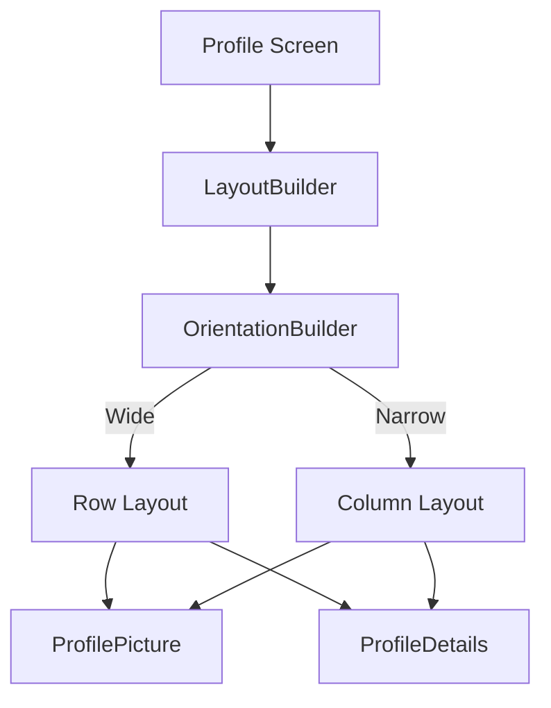

## 3.3.4 Practical Examples

In this section, we delve into practical applications of `MediaQuery`, `LayoutBuilder`, and `OrientationBuilder` to create responsive and adaptive user interfaces in Flutter. These tools are essential for building apps that provide a seamless experience across different devices and orientations. We'll explore real-world scenarios, complete with code examples and diagrams, to illustrate how these widgets can be used effectively.

### Real-World Scenarios

Responsive design is crucial in today's mobile-first world, where users expect applications to work flawlessly on a variety of devices, from small smartphones to large tablets and desktops. Let's explore how `MediaQuery`, `LayoutBuilder`, and `OrientationBuilder` can be combined to tackle common design challenges:

- **Dashboard Layouts:** Creating dashboards that adapt to screen size and orientation.
- **Profile Screens:** Designing profile interfaces that adjust layout based on device dimensions.
- **News Feeds:** Implementing news feeds that maintain readability and usability across different screens.

### Example Projects

We'll walk through two example projects: a responsive dashboard layout and an adaptive profile screen. These examples will demonstrate how to use Flutter's responsive design tools to create flexible and user-friendly interfaces.

#### Example 1: Responsive Dashboard Layout

A dashboard is a common feature in many applications, providing users with an overview of key information and controls. Let's build a responsive dashboard that adapts to different screen sizes and orientations.

```dart
Widget build(BuildContext context) {
  var mediaQuery = MediaQuery.of(context);
  var screenWidth = mediaQuery.size.width;

  return Scaffold(
    appBar: AppBar(title: Text('Responsive Dashboard')),
    body: LayoutBuilder(
      builder: (context, constraints) {
        return OrientationBuilder(
          builder: (context, orientation) {
            if (screenWidth > 1000) {
              return Row(
                children: [
                  Expanded(child: Sidebar()),
                  Expanded(flex: 3, child: DashboardContent()),
                ],
              );
            } else if (orientation == Orientation.landscape) {
              return Column(
                children: [
                  DashboardContent(),
                  Expanded(child: Sidebar()),
                ],
              );
            } else {
              return DashboardContent();
            }
          },
        );
      },
    ),
  );
}

class Sidebar extends StatelessWidget {
  @override
  Widget build(BuildContext context) {
    return Container(
      color: Colors.blueGrey,
      child: ListView(
        children: [
          ListTile(title: Text('Home')),
          ListTile(title: Text('Profile')),
          ListTile(title: Text('Settings')),
          // More items
        ],
      ),
    );
  }
}

class DashboardContent extends StatelessWidget {
  @override
  Widget build(BuildContext context) {
    return Container(
      padding: EdgeInsets.all(16.0),
      child: Column(
        children: [
          Text('Dashboard Overview', style: TextStyle(fontSize: 24)),
          // Additional dashboard widgets
        ],
      ),
    );
  }
}
```

**Explanation:**

- **MediaQuery:** Used to determine the screen width, allowing us to decide when to switch between different layouts.
- **LayoutBuilder:** Provides the constraints of the parent widget, helping us adapt the layout based on available space.
- **OrientationBuilder:** Adjusts the layout based on the device's orientation, switching between row and column layouts as needed.

#### Example 2: Adaptive Profile Screen

Profile screens are another common feature in many apps. They often need to display a user's picture and details in a way that is both attractive and functional across different devices.

```dart
Widget build(BuildContext context) {
  var mediaQuery = MediaQuery.of(context);
  var screenWidth = mediaQuery.size.width;

  return Scaffold(
    appBar: AppBar(title: Text('Profile')),
    body: LayoutBuilder(
      builder: (context, constraints) {
        return OrientationBuilder(
          builder: (context, orientation) {
            if (screenWidth > 800) {
              return Row(
                children: [
                  ProfilePicture(),
                  Expanded(child: ProfileDetails()),
                ],
              );
            } else {
              return Column(
                children: [
                  ProfilePicture(),
                  ProfileDetails(),
                ],
              );
            }
          },
        );
      },
    ),
  );
}

class ProfilePicture extends StatelessWidget {
  @override
  Widget build(BuildContext context) {
    return Container(
      padding: EdgeInsets.all(16.0),
      child: CircleAvatar(
        radius: 50,
        backgroundImage: NetworkImage('https://example.com/profile.jpg'),
      ),
    );
  }
}

class ProfileDetails extends StatelessWidget {
  @override
  Widget build(BuildContext context) {
    return Padding(
      padding: EdgeInsets.all(16.0),
      child: Column(
        crossAxisAlignment: CrossAxisAlignment.start,
        children: [
          Text('Username', style: TextStyle(fontSize: 20, fontWeight: FontWeight.bold)),
          Text('Email: user@example.com'),
          Text('Bio: Flutter Developer'),
          // More details
        ],
      ),
    );
  }
}
```

**Explanation:**

- **Responsive Layout:** The profile screen switches between a row layout for wider screens and a column layout for narrower screens, ensuring that the content is always presented in an optimal way.
- **Modular Widgets:** The `ProfilePicture` and `ProfileDetails` widgets are modular and reusable, promoting clean code and easy maintenance.

### Mermaid.js Diagrams

To better understand the flow and structure of these layouts, let's visualize the responsive profile screen layout using a Mermaid.js diagram.



**Diagram Explanation:**

- **Profile Screen:** The main entry point for the layout.
- **LayoutBuilder:** Determines the constraints and available space.
- **OrientationBuilder:** Adjusts the layout based on orientation.
- **Row and Column Layouts:** Switches between row and column based on screen width and orientation.
- **ProfilePicture and ProfileDetails:** Modular components that are reused in both layouts.

### Best Practices

When building responsive and adaptive UIs in Flutter, consider the following best practices:

- **Modular Widgets:** Break down your UI into small, reusable widgets. This not only makes your code cleaner but also simplifies the process of making your app responsive.
- **Consistent User Experience:** Ensure that core functionalities remain accessible and intuitive, regardless of the device or orientation.
- **Accessibility:** Keep interactive elements easy to use across different layouts, ensuring that your app is accessible to all users.
- **Testing:** Regularly test your app on different devices and orientations to ensure a consistent experience.

### Conclusion

By leveraging `MediaQuery`, `LayoutBuilder`, and `OrientationBuilder`, you can create responsive and adaptive UIs that provide a seamless user experience across a wide range of devices. These tools allow you to build flexible layouts that adjust to different screen sizes and orientations, ensuring that your app remains functional and attractive on any device.

For further exploration, consider experimenting with these widgets in your own projects. Try creating different layouts and see how they adapt to various screen sizes and orientations. The more you practice, the more proficient you'll become at building responsive and adaptive UIs in Flutter.

## Quiz Time!



### What is the primary purpose of using `MediaQuery` in a Flutter app?

- [x] To retrieve information about the device's screen size and orientation.
- [ ] To manage state across different widgets.
- [ ] To handle user input and gestures.
- [ ] To define the app's navigation structure.

> **Explanation:** `MediaQuery` is used to obtain information about the device's screen size, orientation, and other characteristics, which is essential for building responsive layouts.

### How does `LayoutBuilder` assist in creating responsive designs?

- [x] It provides the constraints of the parent widget, allowing adaptation based on available space.
- [ ] It manages the state of widgets within a layout.
- [ ] It handles animations and transitions between layouts.
- [ ] It is used to fetch data from APIs.

> **Explanation:** `LayoutBuilder` provides the constraints of its parent widget, enabling developers to adapt the layout based on the available space, which is crucial for responsive design.

### In the provided code example, what layout is used for a screen width greater than 1000 pixels?

- [x] A row layout with a sidebar and dashboard content.
- [ ] A column layout with a sidebar and dashboard content.
- [ ] A grid layout with multiple widgets.
- [ ] A single column layout with only dashboard content.

> **Explanation:** For screens wider than 1000 pixels, the code example uses a row layout with a sidebar and dashboard content to utilize the available space effectively.

### What is the role of `OrientationBuilder` in responsive design?

- [x] It adjusts the layout based on the device's orientation.
- [ ] It manages network requests and data fetching.
- [ ] It handles user authentication and security.
- [ ] It defines the app's color scheme and themes.

> **Explanation:** `OrientationBuilder` is used to adjust the layout based on the device's orientation, allowing for different layouts in portrait and landscape modes.

### Which widget is used to create a circular profile picture in the profile screen example?

- [x] CircleAvatar
- [ ] Container
- [ ] Image
- [ ] Icon

> **Explanation:** The `CircleAvatar` widget is used to create a circular profile picture, providing a simple way to display images in a circular shape.

### What is a key benefit of using modular widgets in responsive design?

- [x] It promotes code reusability and maintainability.
- [ ] It increases the app's loading time.
- [ ] It reduces the need for testing.
- [ ] It simplifies state management.

> **Explanation:** Modular widgets promote code reusability and maintainability, making it easier to manage and update the UI as needed.

### How does the profile screen example adapt to different screen widths?

- [x] It switches between row and column layouts based on the screen width.
- [ ] It changes the color scheme based on the screen width.
- [ ] It hides certain widgets on smaller screens.
- [ ] It uses a fixed layout regardless of screen width.

> **Explanation:** The profile screen example adapts to different screen widths by switching between row and column layouts, ensuring an optimal presentation of content.

### What is the purpose of using `Expanded` in the dashboard layout example?

- [x] To allow widgets to take up available space within a row or column.
- [ ] To fetch data from a remote server.
- [ ] To manage user input and gestures.
- [ ] To define the app's navigation structure.

> **Explanation:** `Expanded` is used to allow widgets to take up the available space within a row or column, helping to create flexible layouts.

### Which of the following is a best practice for ensuring a consistent user experience in responsive design?

- [x] Testing the app on various devices and orientations.
- [ ] Using a single fixed layout for all devices.
- [ ] Avoiding the use of `MediaQuery` and `LayoutBuilder`.
- [ ] Hardcoding widget sizes and positions.

> **Explanation:** Testing the app on various devices and orientations ensures that the user experience remains consistent and functional across different scenarios.

### True or False: `MediaQuery`, `LayoutBuilder`, and `OrientationBuilder` are only useful for mobile app development.

- [ ] True
- [x] False

> **Explanation:** These widgets are useful for any Flutter app, including those targeting web and desktop platforms, as they help create responsive and adaptive UIs across all devices.


