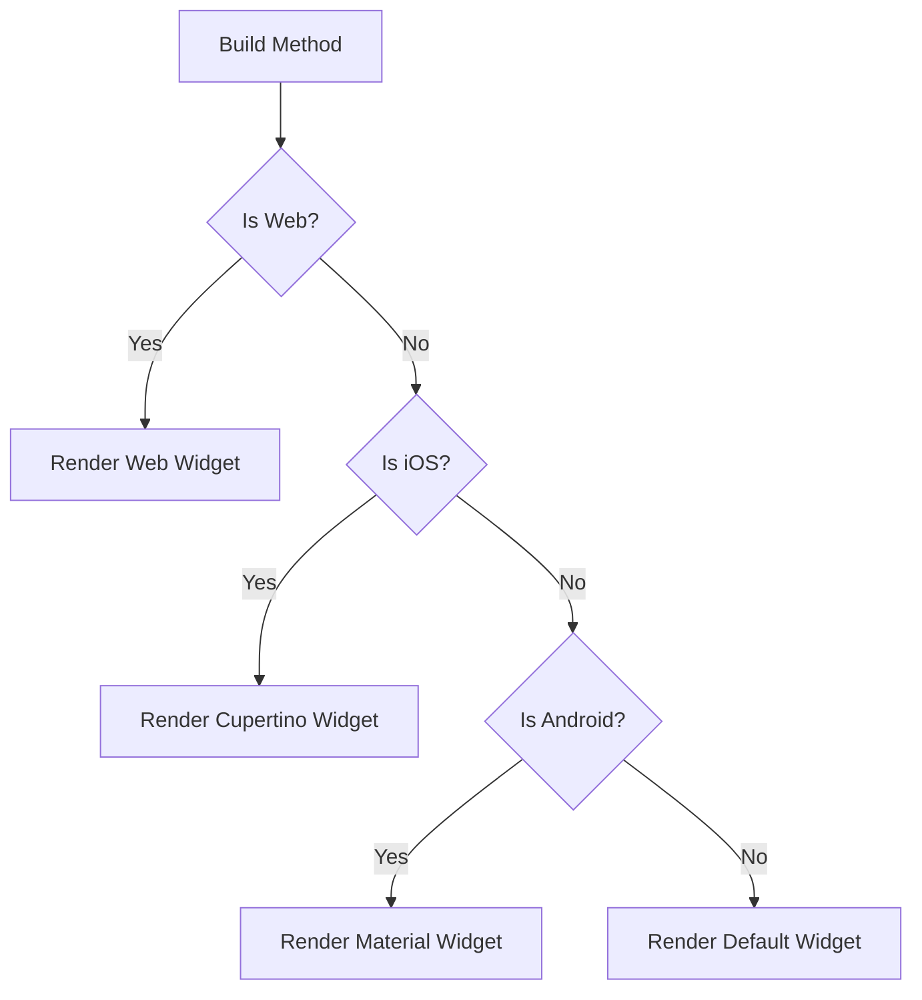

## 3.4.1 Platform Checks

In the ever-evolving landscape of mobile and web applications, creating a seamless user experience across various platforms is paramount. Flutter, with its cross-platform capabilities, allows developers to write once and deploy everywhere. However, certain platform-specific nuances and user expectations necessitate the use of platform checks to tailor the user experience appropriately. This section delves into the importance of platform detection, methods to achieve it in Flutter, and best practices to ensure your app remains maintainable and efficient.

### Introduction to Platform Detection

Platform detection is a crucial aspect of building applications that cater to the unique characteristics and user expectations of different operating systems. Whether it's the distinct design language of iOS and Android, or the interaction paradigms of web and desktop applications, understanding the underlying platform can significantly enhance the user experience.

- **Why Platform Detection Matters:**
  - **User Experience:** Users expect apps to behave in a manner consistent with their platform's conventions. For instance, iOS users anticipate the use of Cupertino-style widgets, while Android users are accustomed to Material Design.
  - **Feature Availability:** Some features may only be available or behave differently on certain platforms. Detecting the platform allows you to enable or disable features accordingly.
  - **Performance Optimization:** Certain optimizations can be platform-specific, such as using different image formats or handling gestures differently.

### Using Platform Checks

Flutter provides several ways to detect the platform on which your app is running. The `Platform` class from `dart:io` and the `kIsWeb` constant from `flutter/foundation` are the primary tools for this purpose.

#### The `Platform` Class

The `Platform` class offers a straightforward way to determine the operating system. It provides boolean properties such as `isIOS`, `isAndroid`, `isLinux`, `isMacOS`, and `isWindows`.

```dart
import 'dart:io';

void checkPlatform() {
  if (Platform.isIOS) {
    print('Running on iOS');
  } else if (Platform.isAndroid) {
    print('Running on Android');
  } else if (Platform.isLinux) {
    print('Running on Linux');
  } else if (Platform.isMacOS) {
    print('Running on macOS');
  } else if (Platform.isWindows) {
    print('Running on Windows');
  } else {
    print('Unknown platform');
  }
}
```

#### The `kIsWeb` Constant

For web applications, the `Platform` class is not applicable. Instead, Flutter provides the `kIsWeb` constant to determine if the app is running on the web.

```dart
import 'package:flutter/foundation.dart';

void checkIfWeb() {
  if (kIsWeb) {
    print('Running on the web');
  } else {
    print('Not running on the web');
  }
}
```

#### Limitations and Alternatives

- **Limitations:** The `Platform` class is part of `dart:io`, which is not available for web applications. Thus, `kIsWeb` is essential for web platform detection.
- **Alternatives:** For more complex scenarios, consider using packages like `universal_platform` which abstracts platform checks into a single API.

### Code Examples

Let's explore some practical examples of how to implement platform checks in your Flutter applications.

#### Example 1: Detecting iOS vs. Android

This example demonstrates how to render different widgets based on the platform.

```dart
import 'dart:io' show Platform;
import 'package:flutter/foundation.dart' show kIsWeb;

Widget build(BuildContext context) {
  if (kIsWeb) {
    return WebSpecificWidget();
  } else if (Platform.isIOS) {
    return CupertinoWidget();
  } else if (Platform.isAndroid) {
    return MaterialWidget();
  } else {
    return DefaultWidget();
  }
}
```

#### Example 2: Creating Platform-Agnostic Widgets

This example shows how to create buttons that adapt to the platform.

```dart
Widget build(BuildContext context) {
  if (Platform.isIOS) {
    return CupertinoButton(
      child: Text('iOS Button'),
      onPressed: () {},
    );
  } else {
    return ElevatedButton(
      child: Text('Android Button'),
      onPressed: () {},
    );
  }
}
```

### Mermaid.js Diagrams

To better understand the flow of platform detection and widget rendering, let's visualize it with a flowchart.



### Best Practices

While platform checks are powerful, they should be used judiciously to maintain a clean and maintainable codebase.

- **Avoid Excessive Platform-Specific Code:** Overusing platform checks can lead to a fragmented codebase that's difficult to maintain. Aim to use Flutter's cross-platform capabilities wherever possible.
- **Encapsulate Logic:** Encapsulate platform-specific logic within separate widgets or services. This approach keeps your code organized and modular.
- **Use Cross-Platform Widgets:** Flutter's extensive widget library often provides cross-platform solutions that can reduce the need for platform checks.
- **Test Across Platforms:** Always test your app on all target platforms to ensure consistent behavior and appearance.

### Conclusion

Platform detection is a vital tool in the Flutter developer's toolkit, enabling the creation of applications that feel native to each platform. By understanding and implementing platform checks effectively, you can enhance user experience, optimize performance, and maintain a clean codebase. As you continue to develop with Flutter, remember to balance platform-specific adaptations with the power of Flutter's cross-platform capabilities.

## Quiz Time!



### What is the primary reason for detecting the underlying platform in a Flutter application?

- [x] To provide platform-specific features and UI elements
- [ ] To increase the app's file size
- [ ] To make the app slower
- [ ] To reduce the app's functionality

> **Explanation:** Detecting the underlying platform allows developers to tailor the user experience by providing platform-specific features and UI elements, enhancing the overall user experience.

### Which class is used to detect the platform in a Flutter application?

- [x] Platform
- [ ] Device
- [ ] System
- [ ] Environment

> **Explanation:** The `Platform` class from `dart:io` is used to detect the platform in a Flutter application, providing properties like `isIOS` and `isAndroid`.

### How do you detect if a Flutter app is running on the web?

- [x] Using the `kIsWeb` constant
- [ ] Using the `Platform.isWeb` property
- [ ] Using the `WebPlatform` class
- [ ] Using the `isWeb` method

> **Explanation:** The `kIsWeb` constant from `flutter/foundation` is used to detect if a Flutter app is running on the web.

### What is a limitation of using the `Platform` class for platform detection?

- [x] It cannot be used for web-based platforms
- [ ] It is only available in Flutter 2.0 and above
- [ ] It requires internet connectivity
- [ ] It increases the app's memory usage

> **Explanation:** The `Platform` class is part of `dart:io`, which is not available for web-based platforms, necessitating the use of `kIsWeb` for web detection.

### Which widget should you use for a button on iOS?

- [x] CupertinoButton
- [ ] ElevatedButton
- [ ] FlatButton
- [ ] RaisedButton

> **Explanation:** The `CupertinoButton` widget is designed to match the iOS design language, making it the appropriate choice for buttons on iOS.

### Which widget should you use for a button on Android?

- [x] ElevatedButton
- [ ] CupertinoButton
- [ ] FlatButton
- [ ] RaisedButton

> **Explanation:** The `ElevatedButton` widget is part of Flutter's Material Design library, making it suitable for use on Android.

### What is a best practice when using platform checks in Flutter?

- [x] Encapsulate platform-specific logic within separate widgets or services
- [ ] Use platform checks for every widget
- [ ] Avoid using cross-platform widgets
- [ ] Write separate codebases for each platform

> **Explanation:** Encapsulating platform-specific logic within separate widgets or services helps maintain a clean and organized codebase.

### What should you do if a feature is only available on certain platforms?

- [x] Enable or disable the feature based on platform detection
- [ ] Remove the feature entirely
- [ ] Ignore the platform differences
- [ ] Use the feature on all platforms regardless

> **Explanation:** By enabling or disabling features based on platform detection, you can ensure that your app behaves correctly and provides a consistent user experience.

### How can you visualize the flow of platform detection and widget rendering?

- [x] Using a Mermaid.js flowchart
- [ ] Using a pie chart
- [ ] Using a bar graph
- [ ] Using a scatter plot

> **Explanation:** A Mermaid.js flowchart is an excellent tool for visualizing the flow of platform detection and widget rendering, providing a clear and structured representation.

### True or False: You should always use platform checks to customize every aspect of your Flutter app.

- [ ] True
- [x] False

> **Explanation:** While platform checks are useful, they should be used judiciously. Overusing them can lead to a fragmented codebase. It's better to leverage Flutter's cross-platform capabilities whenever possible.


