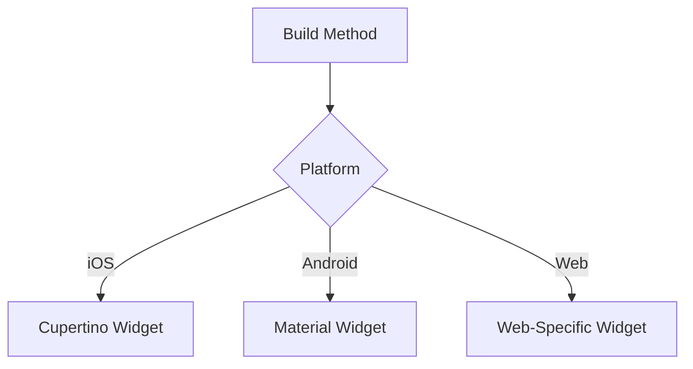

## 3.4.2 Conditional Rendering

In the ever-evolving landscape of mobile and web applications, delivering a seamless user experience across various devices and platforms is paramount. Conditional rendering in Flutter allows developers to tailor the user interface (UI) based on specific conditions, such as platform, screen size, or user preferences. This section delves into the concept of conditional rendering, illustrating its implementation with practical examples and best practices to ensure a consistent and adaptive user experience.

### What Is Conditional Rendering?

Conditional rendering refers to the practice of displaying different widgets or UI elements based on certain conditions. This technique is essential for creating applications that adapt to various platforms (iOS, Android, web), screen sizes, or user settings, such as dark mode or accessibility preferences. By leveraging conditional rendering, developers can ensure that their applications not only look and feel native on each platform but also provide an optimal user experience tailored to the user's device and preferences.

### Implementing Conditional Rendering

In Flutter, conditional rendering can be implemented using several constructs, including `if` statements, ternary operators, and switch cases within the `build` method. These constructs allow developers to dynamically choose which widgets to display based on the evaluated conditions.

#### Using `if` Statements

The `if` statement is a straightforward way to implement conditional rendering. It allows you to execute code blocks based on whether a condition is true or false.

```dart
Widget build(BuildContext context) {
  bool isLargeScreen = MediaQuery.of(context).size.width > 600;

  return Scaffold(
    appBar: AppBar(
      title: Text('Conditional Rendering Example'),
    ),
    body: Center(
      child: isLargeScreen
          ? Text('Large Screen Layout')
          : Text('Small Screen Layout'),
    ),
  );
}
```

In this example, the text displayed changes based on the screen width, demonstrating a simple form of conditional rendering based on screen size.

#### Using Ternary Operators

Ternary operators provide a concise way to implement conditional rendering, especially when dealing with simple conditions.

```dart
Widget build(BuildContext context) {
  return Scaffold(
    appBar: AppBar(
      title: Text('Platform-Specific AppBar'),
    ),
    body: Center(
      child: Platform.isIOS
          ? CupertinoButton(
              child: Text('iOS Button'),
              onPressed: () {},
            )
          : ElevatedButton(
              child: Text('Android Button'),
              onPressed: () {},
            ),
    ),
  );
}
```

Here, a different button widget is displayed depending on whether the app is running on iOS or Android, showcasing platform-specific UI adaptation.

#### Using Switch Cases

Switch cases are useful when you have multiple conditions to evaluate, such as different platforms or user settings.

```dart
Widget build(BuildContext context) {
  switch (Theme.of(context).platform) {
    case TargetPlatform.iOS:
      return CupertinoPageScaffold(
        navigationBar: CupertinoNavigationBar(
          middle: Text('iOS AppBar'),
        ),
        child: Center(child: Text('iOS Content')),
      );
    case TargetPlatform.android:
      return Scaffold(
        appBar: AppBar(
          title: Text('Android AppBar'),
        ),
        body: Center(child: Text('Android Content')),
      );
    default:
      return Scaffold(
        appBar: AppBar(
          title: Text('Default AppBar'),
        ),
        body: Center(child: Text('Default Content')),
      );
  }
}
```

This example demonstrates how to use a switch case to render different widgets based on the platform, allowing for more complex conditional logic.

### Code Examples

Let's explore some practical examples of conditional rendering in Flutter.

#### Example 1: Rendering Different AppBars Based on Platform

```dart
Widget build(BuildContext context) {
  return Scaffold(
    appBar: Platform.isIOS
        ? CupertinoNavigationBar(
            middle: Text('iOS AppBar'),
          )
        : AppBar(
            title: Text('Android AppBar'),
          ),
    body: Center(child: Text('Content')),
  );
}
```

In this example, the app bar changes based on the platform, using the `Platform` class to determine whether the app is running on iOS or Android.

#### Example 2: Displaying Platform-Specific Icons

```dart
Widget build(BuildContext context) {
  IconData iconData = Platform.isIOS ? CupertinoIcons.settings : Icons.settings;

  return Icon(iconData, size: 30);
}
```

This code snippet demonstrates how to display different icons based on the platform, ensuring that the UI adheres to platform-specific design guidelines.

### Mermaid.js Diagrams

To further illustrate the concept of conditional rendering, let's visualize it using a Mermaid.js diagram.

#### Diagram Showing Conditional Widget Rendering



This diagram depicts the decision-making process within the `build` method, where different widgets are rendered based on the platform.

### Best Practices

When implementing conditional rendering, consider the following best practices to ensure a seamless and consistent user experience:

- **Consistency Across Platforms:** While it's important to respect platform-specific design guidelines, strive to maintain a consistent user experience across all platforms. This includes using familiar navigation patterns and ensuring that core functionalities are accessible regardless of the device.
  
- **Minimize Code Duplication:** Avoid duplicating large sections of UI code for different platforms. Instead, focus on adapting only the necessary components, such as navigation bars or buttons, while keeping the overall structure consistent.

- **Thorough Testing:** Test conditional rendering thoroughly on all target platforms to ensure that the UI functions and appears as expected. This includes testing on different screen sizes and orientations to verify that the layout adapts correctly.

- **Performance Considerations:** Be mindful of performance implications when using conditional rendering. Avoid complex logic within the `build` method that could lead to performance bottlenecks, especially on lower-end devices.

### Conclusion

Conditional rendering is a powerful technique in Flutter that enables developers to create responsive and adaptive UIs tailored to different platforms and user preferences. By leveraging constructs such as `if` statements, ternary operators, and switch cases, you can dynamically render widgets based on specific conditions, ensuring that your application provides a seamless and consistent user experience across all devices.

As you continue to explore the capabilities of Flutter, consider how conditional rendering can enhance your application's adaptability and user experience. Experiment with different conditions and platforms to gain a deeper understanding of how to effectively implement this technique in your projects.

### References and Further Reading

- [Flutter Official Documentation](https://flutter.dev/docs)
- [Dart Language Tour](https://dart.dev/guides/language/language-tour)
- [Platform-Specific Widgets in Flutter](https://flutter.dev/docs/development/ui/widgets/platform)
- [Responsive Design in Flutter](https://flutter.dev/docs/development/ui/layout/responsive)

By mastering conditional rendering, you can create applications that not only look and feel native on each platform but also provide an optimal user experience tailored to the user's device and preferences.

## Quiz Time!



### What is conditional rendering in Flutter?

- [x] Displaying different widgets based on certain conditions
- [ ] Rendering widgets without any conditions
- [ ] Using only Material widgets for all platforms
- [ ] Avoiding platform-specific design guidelines

> **Explanation:** Conditional rendering involves displaying different widgets or UI elements based on specific conditions, such as platform, screen size, or user preferences.

### Which construct is NOT typically used for conditional rendering in Flutter?

- [ ] if statements
- [ ] ternary operators
- [ ] switch cases
- [x] for loops

> **Explanation:** Conditional rendering typically uses `if` statements, ternary operators, and switch cases. `for` loops are not used for conditional rendering.

### What is the purpose of using the `Platform` class in Flutter?

- [x] To determine the platform the app is running on
- [ ] To create animations
- [ ] To manage state
- [ ] To handle network requests

> **Explanation:** The `Platform` class is used to determine the platform (iOS, Android, etc.) the app is running on, which is useful for conditional rendering.

### How can you render different AppBars based on the platform in Flutter?

- [x] Using a ternary operator with the `Platform` class
- [ ] Using a `for` loop
- [ ] By creating separate apps for each platform
- [ ] By using only Material widgets

> **Explanation:** You can use a ternary operator with the `Platform` class to conditionally render different AppBars based on the platform.

### What is a best practice when implementing conditional rendering?

- [x] Maintain consistency across platforms
- [ ] Duplicate large sections of UI code
- [ ] Ignore platform-specific design guidelines
- [ ] Avoid testing on all target platforms

> **Explanation:** Maintaining consistency across platforms while respecting platform-specific design guidelines is a best practice in conditional rendering.

### Which widget is used for iOS-specific navigation in Flutter?

- [x] CupertinoNavigationBar
- [ ] AppBar
- [ ] BottomNavigationBar
- [ ] Drawer

> **Explanation:** `CupertinoNavigationBar` is used for iOS-specific navigation, providing a native look and feel.

### What is the advantage of using ternary operators for conditional rendering?

- [x] Conciseness in code
- [ ] Slower performance
- [ ] Increased complexity
- [ ] Less readability

> **Explanation:** Ternary operators provide a concise way to implement conditional rendering, especially for simple conditions.

### What should you avoid when implementing conditional rendering?

- [x] Duplicating large sections of UI code
- [ ] Testing on all platforms
- [ ] Using platform-specific widgets
- [ ] Maintaining consistency

> **Explanation:** Avoid duplicating large sections of UI code for different platforms; focus on adapting only the necessary components.

### Which of the following is a platform-specific icon for iOS in Flutter?

- [x] CupertinoIcons.settings
- [ ] Icons.settings
- [ ] Icons.home
- [ ] CupertinoIcons.home

> **Explanation:** `CupertinoIcons.settings` is a platform-specific icon for iOS, adhering to the Cupertino design language.

### True or False: Conditional rendering can help create a consistent user experience across different platforms.

- [x] True
- [ ] False

> **Explanation:** True. Conditional rendering allows developers to tailor the UI to different platforms, ensuring a consistent and optimal user experience.


