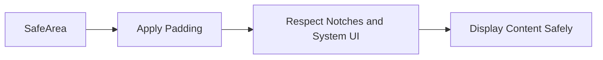

## 3.4.3 Adapting to Screen Notches and Cutouts

As mobile devices continue to evolve, their designs often include notches, cutouts, and other screen intrusions that can obscure parts of the display. These features, while aesthetically appealing and functional, pose challenges for developers aiming to provide a seamless user experience. In this section, we will explore how to adapt your Flutter applications to accommodate these design elements, ensuring that your UI remains intuitive and accessible across all devices.

### Understanding Safe Areas and Notches

Modern smartphones frequently incorporate notches or cutouts to house front-facing cameras and sensors. While these features enhance device functionality, they can interfere with app content if not properly managed. Safe areas are the portions of the screen that are guaranteed to be unobstructed by hardware or system UI elements, such as the status bar or navigation bar.

#### Why Safe Areas Matter

- **User Experience:** Ensuring content is not obscured by notches or system UI elements is crucial for maintaining a positive user experience.
- **Device Compatibility:** With the variety of device designs, using safe areas ensures your app looks good on all screens.
- **Consistency:** Safe areas help maintain consistent padding and layout across different devices and orientations.

### Using the SafeArea Widget

Flutter provides the `SafeArea` widget to automatically adjust your app's layout, ensuring that content is displayed within the safe areas of the screen. This widget applies padding to avoid system UI intrusions, making it an essential tool for responsive design.

#### Properties of SafeArea

- **`minimum`:** Specifies the minimum padding to apply. This can be used to add additional padding beyond the default safe area.
- **`maintainBottomViewPadding`:** When set to true, it maintains the bottom padding even when the keyboard is visible, which can be useful for forms or text inputs.

#### Implementing SafeArea

The `SafeArea` widget is straightforward to use. By wrapping your main content with `SafeArea`, you can ensure that it respects the device's safe areas.

**Example 1: Wrapping Content with SafeArea**

```dart
Widget build(BuildContext context) {
  return Scaffold(
    body: SafeArea(
      child: Column(
        children: [
          Text('Content within safe area'),
          // More widgets
        ],
      ),
    ),
  );
}
```

In this example, the `SafeArea` widget ensures that the `Column` and its children are displayed within the safe area, avoiding any notches or system UI elements.

### Handling Edge Cases

While `SafeArea` handles most scenarios, there may be cases where additional adjustments are necessary. For instance, you might want to apply custom padding or constraints to achieve a specific layout.

#### Using MediaQuery for Fine-Grained Control

`MediaQuery` provides detailed information about the device's screen, including padding values that account for notches and other intrusions. By accessing these properties, you can customize your layout further.

**Example 2: Custom Padding for Notches**

```dart
Widget build(BuildContext context) {
  var mediaQuery = MediaQuery.of(context);
  var padding = mediaQuery.padding;

  return Scaffold(
    body: Padding(
      padding: EdgeInsets.only(top: padding.top + 10, bottom: padding.bottom + 10),
      child: Column(
        children: [
          Text('Custom Padded Content'),
          // More widgets
        ],
      ),
    ),
  );
}
```

In this example, we use `MediaQuery` to retrieve the device's padding and apply additional padding to the top and bottom. This approach allows for more precise control over the layout, accommodating unique design requirements.

### Visualizing SafeArea with Mermaid.js Diagrams

To better understand how `SafeArea` works, let's visualize its effect using a Mermaid.js diagram.



This diagram illustrates the flow of how `SafeArea` operates: it applies necessary padding to ensure that content is displayed safely, respecting notches and system UI elements.

### Best Practices for Adapting to Notches and Cutouts

- **Always Wrap Main Content with SafeArea:** This ensures that your app's primary content is not obscured by system UI elements or hardware features.
- **Use Additional Padding or Constraints When Necessary:** For layouts that require more customization, use `MediaQuery` to apply specific padding or constraints.
- **Test on Multiple Devices:** Verify your app's appearance on various devices with different screen designs to ensure consistent safe area handling.
- **Consider Orientation Changes:** Ensure that your app adapts correctly when the device orientation changes, as this can affect the safe areas.

### Conclusion

Adapting to screen notches and cutouts is a crucial aspect of modern app development. By leveraging Flutter's `SafeArea` widget and `MediaQuery`, you can create responsive, adaptive UIs that provide a seamless experience across all devices. Remember to test your app on multiple devices and orientations to ensure that your layout is robust and flexible.

### Further Exploration

For more information on handling safe areas and adapting to various device designs, consider exploring the following resources:

- [Flutter Documentation on SafeArea](https://api.flutter.dev/flutter/widgets/SafeArea-class.html)
- [MediaQuery Class Documentation](https://api.flutter.dev/flutter/widgets/MediaQuery-class.html)
- [Responsive Design Patterns in Flutter](https://flutter.dev/docs/development/ui/layout/responsive)

By understanding and applying these concepts, you can ensure that your Flutter applications are ready to meet the challenges of modern device designs.

## Quiz Time!



### What is the primary purpose of the SafeArea widget in Flutter?

- [x] To ensure content is displayed within the safe areas of the screen, avoiding notches and system UI elements.
- [ ] To add animations to widgets.
- [ ] To manage state in a Flutter application.
- [ ] To handle network requests.

> **Explanation:** The `SafeArea` widget is used to ensure that content is displayed within the safe areas of the screen, avoiding notches and system UI elements.

### Which property of SafeArea maintains bottom padding even when the keyboard is visible?

- [ ] `minimum`
- [x] `maintainBottomViewPadding`
- [ ] `padding`
- [ ] `bottomPadding`

> **Explanation:** The `maintainBottomViewPadding` property, when set to true, maintains the bottom padding even when the keyboard is visible.

### How can you access the device's screen padding in Flutter?

- [ ] Using the `Padding` widget.
- [ ] By setting the `padding` property in `SafeArea`.
- [x] By using `MediaQuery.of(context).padding`.
- [ ] Through the `Scaffold` widget.

> **Explanation:** You can access the device's screen padding using `MediaQuery.of(context).padding`.

### What does the `minimum` property of SafeArea do?

- [x] Specifies the minimum padding to apply, allowing additional padding beyond the default safe area.
- [ ] Removes all padding from the SafeArea.
- [ ] Sets the maximum padding for the SafeArea.
- [ ] Adjusts the color of the SafeArea.

> **Explanation:** The `minimum` property specifies the minimum padding to apply, allowing additional padding beyond the default safe area.

### In which scenario might you need to use MediaQuery padding properties?

- [x] When you need fine-grained control over layout adjustments beyond what SafeArea provides.
- [ ] When you want to animate widgets.
- [ ] When handling network requests.
- [ ] When managing app state.

> **Explanation:** MediaQuery padding properties are useful when you need fine-grained control over layout adjustments beyond what SafeArea provides.

### What is a common best practice when dealing with notches and cutouts in Flutter?

- [x] Always wrap main content with SafeArea.
- [ ] Avoid using SafeArea entirely.
- [ ] Use only custom padding for all layouts.
- [ ] Ignore device-specific adaptations.

> **Explanation:** A common best practice is to always wrap main content with SafeArea to ensure compatibility with various device designs.

### Which widget can be used to apply custom padding based on MediaQuery values?

- [ ] `SafeArea`
- [x] `Padding`
- [ ] `Container`
- [ ] `Scaffold`

> **Explanation:** The `Padding` widget can be used to apply custom padding based on MediaQuery values.

### Why is it important to test your app on multiple devices?

- [x] To verify safe area handling and ensure consistent appearance across different screen designs.
- [ ] To increase the app's file size.
- [ ] To reduce the number of widgets used.
- [ ] To avoid using the SafeArea widget.

> **Explanation:** Testing on multiple devices helps verify safe area handling and ensures consistent appearance across different screen designs.

### What does the SafeArea widget automatically adjust?

- [x] Padding to avoid system UI intrusions.
- [ ] The color scheme of the app.
- [ ] The app's network settings.
- [ ] The app's state management.

> **Explanation:** The SafeArea widget automatically adjusts padding to avoid system UI intrusions.

### True or False: SafeArea is only necessary for devices with notches.

- [ ] True
- [x] False

> **Explanation:** False. SafeArea is necessary for any device where system UI elements might obscure content, not just those with notches.


