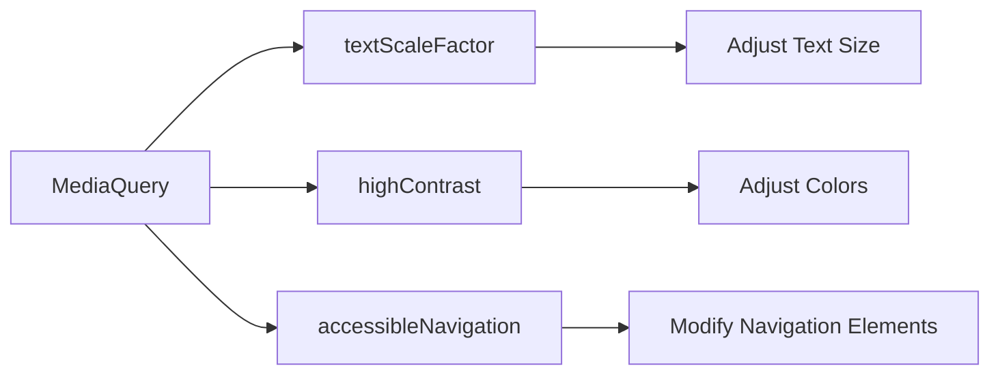

## 3.4.4 Accessibility Settings

In today's digital landscape, creating applications that are accessible to all users, including those with disabilities, is not just a best practice but a necessity. Accessibility in app design ensures that everyone, regardless of their abilities, can use your application effectively. This section delves into how Flutter developers can leverage accessibility settings to enhance user experience and broaden the reach of their apps.

### Importance of Accessibility

Accessibility is crucial for several reasons:

- **Inclusivity:** Designing with accessibility in mind ensures that your app can be used by people with varying abilities, including those with visual, auditory, or motor impairments.
- **Legal Compliance:** Many regions have legal requirements mandating digital accessibility, such as the Americans with Disabilities Act (ADA) in the United States.
- **Enhanced User Experience:** Respecting user accessibility settings can significantly enhance the user experience by making your app more intuitive and easier to navigate for everyone.
- **Broader Audience Reach:** By making your app accessible, you can reach a wider audience, including those who rely on assistive technologies.

### Responding to User Font Size Preferences

One of the most common accessibility settings users adjust is the text size. Flutter provides a straightforward way to respond to user-defined text scaling through `MediaQuery.of(context).textScaleFactor`. This property allows developers to detect the user's preferred text size and adjust the UI accordingly.

#### Detecting and Adjusting Text Size

To ensure readability, it's essential to adjust text sizes and layouts based on the `textScaleFactor`. Here's how you can implement this in your Flutter app:

```dart
Widget build(BuildContext context) {
  var textScale = MediaQuery.of(context).textScaleFactor;

  return Scaffold(
    appBar: AppBar(title: Text('Accessibility Example')),
    body: Padding(
      padding: EdgeInsets.all(16.0),
      child: Text(
        'Accessible Text',
        style: TextStyle(fontSize: 16 * textScale),
      ),
    ),
  );
}
```

In this example, the text size is dynamically adjusted based on the `textScaleFactor`, ensuring that the text remains readable regardless of the user's settings.

### Handling High Contrast and Other Accessibility Features

Flutter's `MediaQuery` provides several properties related to accessibility, such as `accessibleNavigation` and `invertColors`. These properties help developers adapt UI elements like colors, contrasts, and touch targets based on accessibility settings.

#### Adapting Colors for High Contrast

High contrast modes are essential for users with visual impairments, as they improve readability by increasing the contrast between text and background colors. Here's how you can adapt your app for high contrast:

```dart
Widget build(BuildContext context) {
  var highContrast = MediaQuery.of(context).highContrast;

  return Scaffold(
    appBar: AppBar(title: Text('High Contrast Adaptation')),
    body: Container(
      color: highContrast ? Colors.black : Colors.white,
      child: Text(
        'High Contrast Mode',
        style: TextStyle(
          color: highContrast ? Colors.white : Colors.black,
          fontSize: 18,
        ),
      ),
    ),
  );
}
```

This code snippet checks the `highContrast` property and adjusts the UI colors accordingly, providing a more accessible experience for users who need it.

### Mermaid.js Diagram: Accessibility Settings Adaptation

To better understand how different accessibility settings can be adapted in a Flutter application, consider the following diagram:



This diagram illustrates how `MediaQuery` properties can influence various UI adaptations, ensuring that your app is accessible to all users.

### Best Practices for Accessibility in Flutter

When designing accessible applications, consider the following best practices:

- **Test with Different Accessibility Settings:** Always test your app with various accessibility settings enabled to ensure a consistent and usable experience for all users.
- **Use Semantic Widgets:** Flutter provides semantic widgets that help screen readers understand the structure and content of your app. Use these widgets to provide descriptive labels and improve navigation for users relying on assistive technologies.
- **Ensure Sufficient Color Contrast:** Use tools to check color contrast ratios and ensure that your app's colors are distinguishable by users with color vision deficiencies.
- **Scalable UI Elements:** Design UI elements that can scale appropriately with text size changes, ensuring that all interactive components remain accessible and usable.

### Conclusion

By implementing accessibility settings in your Flutter applications, you not only comply with legal requirements but also create a more inclusive and user-friendly experience. Accessibility should be a fundamental consideration in your design process, ensuring that all users can enjoy and benefit from your app.

### Further Reading and Resources

- [Flutter Accessibility Documentation](https://flutter.dev/docs/development/accessibility-and-localization/accessibility)
- [Web Content Accessibility Guidelines (WCAG)](https://www.w3.org/WAI/standards-guidelines/wcag/)
- [Inclusive Design Principles](https://inclusivedesignprinciples.org/)

By following these guidelines and leveraging Flutter's capabilities, you can create applications that are not only functional but also accessible to a diverse audience.

## Quiz Time!



### Why is accessibility important in app design?

- [x] It ensures inclusivity for users with disabilities.
- [x] It enhances user experience for all users.
- [ ] It is only important for legal compliance.
- [x] It broadens the app's reach to a wider audience.

> **Explanation:** Accessibility ensures inclusivity, enhances user experience, and broadens reach, while legal compliance is also a factor but not the sole reason.

### How can you detect user-defined text scaling in Flutter?

- [x] Using `MediaQuery.of(context).textScaleFactor`
- [ ] Using `MediaQuery.of(context).size`
- [ ] Using `MediaQuery.of(context).platformBrightness`
- [ ] Using `MediaQuery.of(context).orientation`

> **Explanation:** `MediaQuery.of(context).textScaleFactor` is used to detect user-defined text scaling.

### What is the purpose of the `highContrast` property in `MediaQuery`?

- [x] To adapt UI colors for users needing high contrast
- [ ] To detect screen orientation changes
- [ ] To adjust text size automatically
- [ ] To manage navigation elements

> **Explanation:** The `highContrast` property helps adapt UI colors for users who require high contrast for better readability.

### Which of the following is a best practice for accessibility in Flutter?

- [x] Use semantic widgets for screen readers.
- [ ] Ignore color contrast ratios.
- [x] Test the app with different accessibility settings.
- [ ] Avoid scalable UI elements.

> **Explanation:** Using semantic widgets and testing with different settings are best practices, while ignoring contrast and avoiding scalability are not.

### What does the `accessibleNavigation` property in `MediaQuery` indicate?

- [x] Whether the user prefers simplified navigation
- [ ] The current screen orientation
- [ ] The device's pixel density
- [ ] The user's text scaling preference

> **Explanation:** `accessibleNavigation` indicates whether the user prefers simplified navigation, aiding in accessibility adaptations.

### How can you ensure sufficient color contrast in your app?

- [x] Use tools to check color contrast ratios.
- [ ] Use only bright colors.
- [ ] Avoid using any color in the UI.
- [ ] Rely solely on user feedback.

> **Explanation:** Using tools to check color contrast ratios ensures that your app's colors are distinguishable by users with color vision deficiencies.

### What is a benefit of designing accessible applications?

- [x] Reaching a wider audience
- [ ] Reducing app complexity
- [ ] Increasing development time
- [ ] Limiting user interactions

> **Explanation:** Designing accessible applications helps reach a wider audience, including those who rely on assistive technologies.

### Which property would you use to adapt text size in response to user preferences?

- [x] `textScaleFactor`
- [ ] `highContrast`
- [ ] `accessibleNavigation`
- [ ] `invertColors`

> **Explanation:** `textScaleFactor` is used to adapt text size based on user preferences.

### What is the role of semantic widgets in Flutter?

- [x] To provide descriptive labels for screen readers
- [ ] To enhance visual design
- [ ] To increase app performance
- [ ] To manage state efficiently

> **Explanation:** Semantic widgets provide descriptive labels for screen readers, improving accessibility for users relying on assistive technologies.

### True or False: Accessibility should be an afterthought in app design.

- [ ] True
- [x] False

> **Explanation:** Accessibility should be a fundamental consideration from the start of the design process, not an afterthought.


