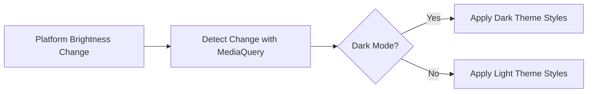

## 3.5.1 Detecting and Responding to Theme Changes

In today's digital landscape, providing a seamless user experience across different themes is not just a luxury—it's a necessity. With the increasing popularity of dark mode, users expect applications to respect their system-wide theme preferences. Flutter, with its robust theming capabilities, allows developers to create applications that dynamically adapt to theme changes. In this section, we will explore how to detect and respond to theme changes using `MediaQuery`, ensuring that your Flutter applications are both visually appealing and user-friendly.

### Theme Detection

Detecting the current theme in a Flutter application is straightforward, thanks to the `MediaQuery` widget. By leveraging `MediaQuery.of(context).platformBrightness`, you can determine whether the system is currently set to dark or light mode. This capability allows your application to adjust its UI elements accordingly, providing a consistent experience that aligns with the user's preferences.

#### How to Detect the Current Theme

The `platformBrightness` property of `MediaQuery` returns a `Brightness` value, which can be either `Brightness.dark` or `Brightness.light`. This value reflects the current theme setting of the operating system, allowing your application to respond appropriately.

```dart
Widget build(BuildContext context) {
  var brightness = MediaQuery.of(context).platformBrightness;
  bool isDarkMode = brightness == Brightness.dark;

  return Scaffold(
    appBar: AppBar(
      title: Text('Dynamic Theme'),
      backgroundColor: isDarkMode ? Colors.black : Colors.blue,
    ),
    body: Center(
      child: Text(
        'Current Theme: ${isDarkMode ? 'Dark' : 'Light'}',
        style: TextStyle(
          color: isDarkMode ? Colors.white : Colors.black,
          fontSize: 20,
        ),
      ),
    ),
    backgroundColor: isDarkMode ? Colors.grey[900] : Colors.white,
  );
}
```

In this example, we use `MediaQuery.of(context).platformBrightness` to determine the current theme and adjust the UI elements accordingly. The `AppBar` and `Text` widget colors change based on whether the theme is dark or light, ensuring that the application remains visually consistent.

### Responding to Theme Changes

Once you've detected the current theme, the next step is to respond to theme changes dynamically. This involves updating UI elements to maintain visual consistency and readability across different themes. Flutter's theming system, combined with `MediaQuery`, makes this process efficient and straightforward.

#### Dynamic Theme Adjustment

To dynamically adjust your application's UI based on theme changes, you can use conditional logic to apply different styles and colors. This ensures that your application remains visually appealing and accessible, regardless of the user's theme preference.

```dart
class MyApp extends StatelessWidget {
  @override
  Widget build(BuildContext context) {
    return MaterialApp(
      theme: ThemeData.light(),
      darkTheme: ThemeData.dark(),
      themeMode: ThemeMode.system, // Automatically switch between light and dark theme
      home: ThemeDemo(),
    );
  }
}

class ThemeDemo extends StatelessWidget {
  @override
  Widget build(BuildContext context) {
    var brightness = MediaQuery.of(context).platformBrightness;
    bool isDarkMode = brightness == Brightness.dark;

    return Scaffold(
      appBar: AppBar(
        title: Text('Theme Demo'),
        backgroundColor: isDarkMode ? Colors.black : Colors.blue,
      ),
      body: Center(
        child: Text(
          'Current Theme: ${isDarkMode ? 'Dark' : 'Light'}',
          style: TextStyle(
            color: isDarkMode ? Colors.white : Colors.black,
            fontSize: 20,
          ),
        ),
      ),
      backgroundColor: isDarkMode ? Colors.grey[900] : Colors.white,
    );
  }
}
```

In this example, the `MaterialApp` widget is configured to automatically switch between light and dark themes based on the system setting. The `ThemeMode.system` property ensures that the application respects the user's theme preference, providing a seamless experience.

### Diagram Showing Theme Change Flow

To better understand the flow of theme detection and response, let's visualize the process using a Mermaid.js diagram:



This diagram illustrates the flow of detecting a theme change and applying the appropriate styles. When the platform brightness changes, `MediaQuery` detects the change and determines whether dark mode is enabled. Based on this determination, the application applies either dark or light theme styles.

### Best Practices

When implementing theme changes in your Flutter application, consider the following best practices to ensure a smooth and consistent user experience:

- **Consistent UI Elements:** Ensure that all UI elements adapt appropriately to both dark and light themes. This includes adjusting colors, icons, and other visual elements to maintain readability and visual consistency.
- **Utilize ThemeData:** Leverage Flutter's `ThemeData` to manage colors and styles efficiently. By defining your application's theme in a centralized location, you can easily update styles and ensure consistency across your app.
- **Respect User Preferences:** Always respect the user's system theme preferences. By aligning your application's theme with the system setting, you enhance accessibility and user satisfaction.
- **Test Across Devices:** Test your application across different devices and operating systems to ensure that theme changes are handled correctly and consistently.

### Practical Example: Building a Theme-Sensitive App

Let's walk through a practical example of building a theme-sensitive Flutter application. This example will demonstrate how to detect and respond to theme changes, ensuring that your application adapts seamlessly to the user's preferences.

#### Step-by-Step Guide

1. **Set Up the Project:**
   - Create a new Flutter project using `flutter create theme_demo`.
   - Open the project in your preferred IDE.

2. **Configure ThemeData:**
   - Define light and dark themes using `ThemeData` in the `MaterialApp` widget.

   ```dart
   theme: ThemeData.light(),
   darkTheme: ThemeData.dark(),
   themeMode: ThemeMode.system,
   ```

3. **Implement Theme Detection:**
   - Use `MediaQuery.of(context).platformBrightness` to detect the current theme.

4. **Update UI Elements:**
   - Adjust UI elements dynamically based on the detected theme.

5. **Test the Application:**
   - Run the application on different devices and switch between light and dark modes to ensure that the UI updates correctly.

### Conclusion

Detecting and responding to theme changes in Flutter is a crucial aspect of creating responsive and adaptive applications. By leveraging `MediaQuery` and Flutter's theming capabilities, you can ensure that your application provides a consistent and accessible experience across different themes. By following best practices and testing your application thoroughly, you can create a visually appealing and user-friendly app that respects the user's preferences.

### Further Reading and Resources

- [Flutter Documentation: Theming](https://flutter.dev/docs/cookbook/design/themes)
- [Material Design Guidelines: Dark Theme](https://material.io/design/color/dark-theme.html)
- [Flutter Community: Best Practices for Theming](https://flutter.dev/community)

By understanding and implementing these concepts, you'll be well-equipped to create Flutter applications that dynamically adapt to theme changes, enhancing the overall user experience.

## Quiz Time!



### What property of MediaQuery is used to detect the current theme?

- [x] platformBrightness
- [ ] devicePixelRatio
- [ ] textScaleFactor
- [ ] padding

> **Explanation:** The `platformBrightness` property of `MediaQuery` is used to detect whether the current theme is dark or light.

### How can you automatically switch between light and dark themes in a Flutter app?

- [x] Use ThemeMode.system in MaterialApp
- [ ] Use ThemeMode.light in MaterialApp
- [ ] Use ThemeMode.dark in MaterialApp
- [ ] Use ThemeMode.custom in MaterialApp

> **Explanation:** Setting `themeMode` to `ThemeMode.system` in `MaterialApp` automatically switches between light and dark themes based on the system setting.

### Which widget is primarily used to apply different styles based on the current theme?

- [x] ThemeData
- [ ] MediaQuery
- [ ] Scaffold
- [ ] AppBar

> **Explanation:** `ThemeData` is used to define and apply different styles for light and dark themes in a Flutter application.

### What is the best practice for ensuring visual consistency across themes?

- [x] Use ThemeData to manage colors and styles
- [ ] Hardcode colors in widgets
- [ ] Use different fonts for each theme
- [ ] Ignore system theme preferences

> **Explanation:** Using `ThemeData` allows you to manage colors and styles efficiently, ensuring visual consistency across themes.

### What should you do to respect user theme preferences?

- [x] Align your app's theme with the system setting
- [ ] Use only dark theme
- [ ] Use only light theme
- [ ] Allow users to choose themes manually only

> **Explanation:** Aligning your app's theme with the system setting respects user preferences and enhances accessibility.

### What is a common pitfall when implementing theme changes?

- [x] Not updating all UI elements for both themes
- [ ] Using too many colors
- [ ] Ignoring text size
- [ ] Overusing animations

> **Explanation:** A common pitfall is not updating all UI elements to adapt to both themes, leading to visual inconsistencies.

### Which of the following is a benefit of using ThemeData?

- [x] Centralized management of styles
- [ ] Faster app performance
- [ ] Smaller app size
- [ ] Increased complexity

> **Explanation:** `ThemeData` provides centralized management of styles, making it easier to maintain consistency across the app.

### How can you test theme changes effectively?

- [x] Test on different devices and switch themes
- [ ] Only test on a single device
- [ ] Ignore testing for themes
- [ ] Use only emulators

> **Explanation:** Testing on different devices and switching themes ensures that the app handles theme changes correctly.

### What is the role of MediaQuery in theme detection?

- [x] It provides the platformBrightness property
- [ ] It manages app navigation
- [ ] It handles network requests
- [ ] It controls app state

> **Explanation:** `MediaQuery` provides the `platformBrightness` property, which is used to detect the current theme.

### True or False: Theme changes should be ignored in app design.

- [ ] True
- [x] False

> **Explanation:** Theme changes should not be ignored; they are crucial for providing a consistent and accessible user experience.


