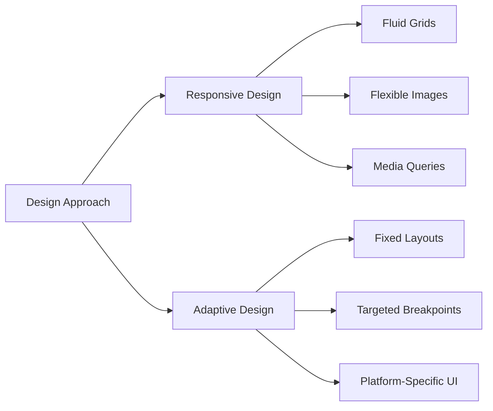

## 4.1.1 Differences Between Adaptive and Responsive UIs

In the world of mobile and web application development, creating user interfaces that provide a seamless experience across a multitude of devices is paramount. Two primary strategies to achieve this are responsive and adaptive design. While both aim to enhance user experience by adjusting the UI to different screen sizes and devices, they do so in fundamentally different ways. This section delves into the nuances of these approaches, offering insights into their definitions, comparisons, use cases, and implementation in Flutter.

### Definitions and Clarifications

#### Responsive Design

Responsive design is all about creating fluid layouts that automatically adjust to fit any screen size or orientation. This approach uses flexible grids, images, and CSS media queries to ensure that the UI components scale smoothly across various devices. The essence of responsive design lies in its ability to adapt dynamically, providing a consistent experience regardless of the device.

- **Fluid Grids:** These are grid systems that use relative units like percentages instead of fixed units like pixels. This allows the layout to resize proportionally with the screen size.
- **Flexible Images:** Images that scale within their containing elements to prevent overflow and maintain aspect ratios.
- **Media Queries:** CSS rules that apply styles based on device characteristics such as width, height, and orientation.

#### Adaptive Design

Adaptive design, on the other hand, involves creating distinct fixed layouts tailored to specific screen sizes or device categories. Unlike responsive design, which adjusts fluidly, adaptive design detects the device parameters and serves a predefined layout optimized for that particular device.

- **Fixed Layouts:** Predefined layouts designed for specific screen sizes.
- **Targeted Breakpoints:** Specific points at which the layout changes to accommodate different devices.
- **Platform-Specific UI:** Customizing the UI to match the design conventions of the platform, such as Material Design for Android or Cupertino for iOS.

### Comparative Analysis

Understanding the differences between responsive and adaptive design is crucial for choosing the right approach for your application.

#### Flexibility

- **Responsive Design:** Offers greater flexibility as it adjusts to any screen size or orientation. It is ideal for applications that need to support a wide range of devices.
- **Adaptive Design:** Targets specific screen sizes, offering less flexibility but potentially more control over the user experience on those devices.

#### Implementation

- **Responsive Design:** Typically requires less maintenance because it scales automatically. Developers can focus on creating a single layout that adapts to various conditions.
- **Adaptive Design:** Involves managing multiple layouts for different devices, which can increase maintenance overhead but allows for more tailored experiences.

#### Performance

- **Responsive Design:** May require more resources to handle dynamic adjustments, especially with complex layouts or high-resolution images.
- **Adaptive Design:** Can optimize performance for each layout since they are specifically designed for the device's capabilities.

### Use Cases

#### Responsive Design

Responsive design is ideal for applications targeting a wide range of devices with varying screen sizes. It is particularly useful for web applications that need to function across desktops, tablets, and smartphones without significant changes to the codebase.

#### Adaptive Design

Adaptive design is best suited for applications where specific layouts are needed for distinct devices, such as tablets and desktops. It allows developers to create optimized experiences for each device category, ensuring that the UI feels native and intuitive.

### Mermaid.js Diagrams

To visually represent the differences between responsive and adaptive design, consider the following flowchart:



### Code Examples

#### Responsive Layout Example using MediaQuery

The following Dart code demonstrates a simple responsive layout using Flutter's `MediaQuery`:

```dart
Widget build(BuildContext context) {
  var screenWidth = MediaQuery.of(context).size.width;
  return Scaffold(
    appBar: AppBar(title: Text('Responsive Example')),
    body: Center(
      child: screenWidth > 600
          ? Text('Large Screen')
          : Text('Small Screen'),
    ),
  );
}
```

**Explanation:**

- **MediaQuery:** Retrieves the current screen size, allowing the layout to adjust based on the width.
- **Conditional Rendering:** Displays different text based on whether the screen width exceeds 600 pixels.

#### Adaptive Layout Example using Platform Checks

The following Dart code illustrates an adaptive layout that changes based on the platform:

```dart
import 'dart:io' show Platform;

Widget build(BuildContext context) {
  return Scaffold(
    appBar: Platform.isIOS
        ? CupertinoNavigationBar(
            middle: Text('iOS Adaptive'),
          )
        : AppBar(
            title: Text('Android Adaptive'),
          ),
    body: Center(
      child: Platform.isIOS
          ? CupertinoButton(
              child: Text('iOS Button'),
              onPressed: () {},
            )
          : ElevatedButton(
              child: Text('Android Button'),
              onPressed: () {},
            ),
    ),
  );
}
```

**Explanation:**

- **Platform Checks:** Uses Dart's `Platform` class to determine the operating system and render platform-specific widgets.
- **Cupertino and Material Widgets:** Provides a native look and feel for iOS and Android, respectively.

### Best Practices

- **Choose Approaches Wisely:** Use responsive design for broader adaptability and adaptive design for targeted optimizations.
- **Combine Both:** In many cases, blending responsive and adaptive strategies can yield the best results, leveraging the strengths of each.
- **Maintain Consistency:** Ensure visual and functional consistency across different layouts to provide a seamless user experience.

### Practical Examples and Real-World Scenarios

Consider a news application that needs to display articles on both mobile and desktop devices. A responsive design approach would allow the layout to adjust fluidly, providing a consistent reading experience across all devices. However, an adaptive design could offer a more tailored experience by presenting a different layout for desktop users, such as a multi-column view, while maintaining a single-column layout for mobile users.

### Encouraging Hands-On Practice

To deepen your understanding of responsive and adaptive design, try implementing both approaches in a sample Flutter project. Experiment with different layouts and observe how they behave on various devices. Consider the following mini-exercise:

- **Exercise:** Create a simple Flutter app that displays a grid of images. Implement a responsive design that adjusts the number of columns based on screen width. Then, add an adaptive feature that changes the grid layout for tablets, providing a larger image preview.

### References and Further Reading

- [Flutter Documentation](https://flutter.dev/docs)
- [Responsive Web Design Basics](https://web.dev/responsive-web-design-basics/)
- [Adaptive vs. Responsive Design: What’s the Best Choice for Designers?](https://www.toptal.com/designers/responsive/adaptive-vs-responsive-design)

By understanding the differences between adaptive and responsive design, you can make informed decisions about which approach to use in your Flutter applications. Whether you choose to implement one strategy or combine both, the key is to create a user experience that is seamless, intuitive, and optimized for the devices your users are on.

## Quiz Time!



### What is the primary focus of responsive design?

- [x] Creating fluid layouts that adjust to various screen sizes and orientations.
- [ ] Creating distinct fixed layouts for specific screen sizes.
- [ ] Optimizing performance for each layout.
- [ ] Using platform-specific UI components.

> **Explanation:** Responsive design focuses on creating fluid layouts that adjust seamlessly to various screen sizes and orientations.

### Which design approach involves creating distinct fixed layouts tailored to specific screen sizes?

- [ ] Responsive Design
- [x] Adaptive Design
- [ ] Flexible Design
- [ ] Dynamic Design

> **Explanation:** Adaptive design involves creating distinct fixed layouts tailored to specific screen sizes or device categories.

### What is a key advantage of responsive design over adaptive design?

- [x] Greater flexibility to adjust to any screen size.
- [ ] Optimized performance for each layout.
- [ ] Less maintenance due to multiple layouts.
- [ ] Platform-specific UI customization.

> **Explanation:** Responsive design offers greater flexibility as it adjusts to any screen size or orientation.

### In which scenario is adaptive design most beneficial?

- [ ] When targeting a wide range of devices.
- [ ] When creating a single layout for all devices.
- [x] When specific layouts are needed for distinct devices.
- [ ] When using flexible grids and media queries.

> **Explanation:** Adaptive design is beneficial when specific layouts are needed for distinct devices, such as tablets and desktops.

### What tool does responsive design primarily rely on to adjust layouts?

- [ ] Fixed Layouts
- [ ] Platform Checks
- [x] Media Queries
- [ ] Targeted Breakpoints

> **Explanation:** Responsive design primarily relies on media queries to adjust layouts based on device characteristics.

### Which of the following is NOT a characteristic of adaptive design?

- [ ] Fixed Layouts
- [ ] Targeted Breakpoints
- [ ] Platform-Specific UI
- [x] Fluid Grids

> **Explanation:** Fluid grids are a characteristic of responsive design, not adaptive design.

### How does adaptive design optimize performance?

- [ ] By using flexible images and media queries.
- [x] By tailoring layouts specifically for each device.
- [ ] By creating a single layout for all devices.
- [ ] By using dynamic adjustments.

> **Explanation:** Adaptive design optimizes performance by tailoring layouts specifically for each device.

### Which design approach is generally easier to maintain?

- [x] Responsive Design
- [ ] Adaptive Design
- [ ] Both are equally easy to maintain.
- [ ] Neither is easy to maintain.

> **Explanation:** Responsive design is generally easier to maintain because it involves creating a single layout that adapts to various conditions.

### What is a common practice when using both responsive and adaptive design?

- [x] Combining both strategies to leverage their strengths.
- [ ] Choosing only one approach for simplicity.
- [ ] Avoiding media queries and platform checks.
- [ ] Using fixed layouts exclusively.

> **Explanation:** A common practice is to combine both responsive and adaptive strategies to leverage their strengths.

### True or False: Adaptive design is more flexible than responsive design.

- [ ] True
- [x] False

> **Explanation:** False. Responsive design is more flexible as it adjusts to any screen size, whereas adaptive design targets specific sizes.


