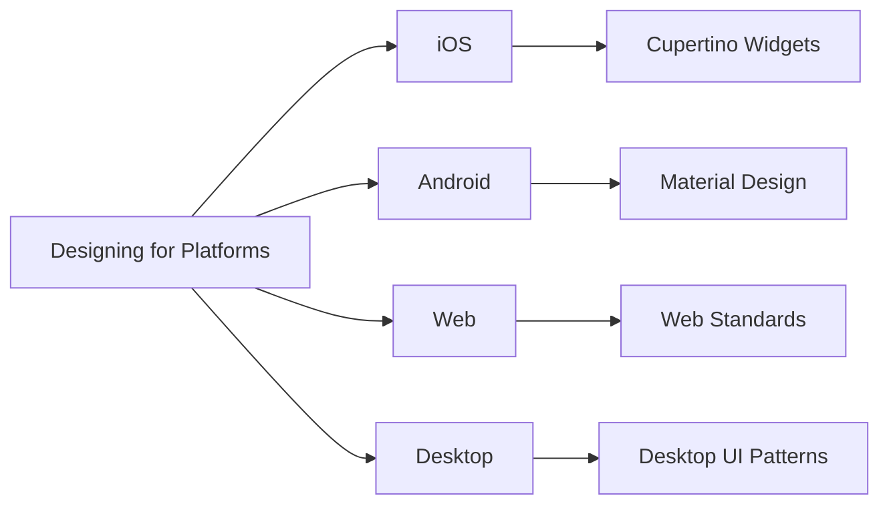

## 4.1.2 Designing for Multiple Platforms

In the rapidly evolving world of mobile and web applications, designing for multiple platforms is not just a luxury but a necessity. Users expect seamless experiences whether they're on an iOS device, an Android phone, a web browser, or a desktop application. Flutter, with its robust framework, offers developers the tools to create adaptive layouts that cater to these diverse environments. This section delves into the intricacies of designing for multiple platforms using Flutter, providing insights, best practices, and practical examples to guide you through the process.

### Understanding Platform-Specific Requirements

Each platform—iOS, Android, Web, and Desktop—comes with its own set of design guidelines and user expectations. Understanding these nuances is crucial for creating applications that feel intuitive and native to each environment.

- **iOS (Cupertino Design):** iOS applications are known for their sleek, minimalist design. They often use the Cupertino widget set in Flutter, which mimics the native iOS components. Key characteristics include smooth animations, a focus on clarity and depth, and intuitive navigation patterns.

- **Android (Material Design):** Android apps follow Material Design principles, which emphasize bold, graphic, and intentional design. Flutter's Material widgets provide a comprehensive set of components that adhere to these guidelines, ensuring consistency across Android devices.

- **Web:** Designing for the web involves adhering to web standards and ensuring responsiveness across different screen sizes and resolutions. Web applications often require considerations for mouse and keyboard interactions, unlike mobile platforms.

- **Desktop:** Desktop applications need to cater to larger screens and often involve more complex interactions. They may also need to support window resizing and various input methods, such as mouse and keyboard.

Understanding these platform-specific requirements helps in designing applications that not only look good but also provide a seamless user experience.

### Best Practices for Cross-Platform UIs

Creating a cross-platform UI involves balancing consistency with platform-specific customization. Here are some best practices to consider:

- **Consistency with Platform Standards:** Align your app’s design with the native guidelines of each platform. For instance, use Material Design for Android and Cupertino for iOS. This ensures that your application feels familiar to users on each platform.

- **Component Reusability:** Design components that can be reused across platforms. Flutter allows you to create widgets that adapt their appearance and behavior based on the platform, reducing the need for duplicate code.

- **Responsive Interactions:** Ensure that interactive elements respond appropriately to platform-specific gestures and inputs. For example, iOS users expect swipe gestures for navigation, while Android users might be more accustomed to using the back button.

#### Diagram Showing Platform-Specific Design Considerations



### Code Examples

To illustrate how you can implement platform-specific designs in Flutter, let's look at some practical code examples.

#### Adaptive AppBar Example

The following code demonstrates how to create an adaptive AppBar that changes its style based on the platform:

```dart
import 'dart:io' show Platform;
import 'package:flutter/cupertino.dart';
import 'package:flutter/material.dart';

Widget build(BuildContext context) {
  return Scaffold(
    appBar: Platform.isIOS
        ? CupertinoNavigationBar(
            middle: Text('iOS AppBar'),
          )
        : AppBar(
            title: Text('Android AppBar'),
          ),
    body: Center(child: Text('Platform Specific AppBar')),
  );
}
```

In this example, the `CupertinoNavigationBar` is used for iOS, while the `AppBar` is used for Android, ensuring that the app feels native on both platforms.

#### Using ThemeData for Platform-Specific Themes

Flutter allows you to define themes that can change based on the platform. Here's how you can implement platform-specific themes:

```dart
import 'dart:io' show Platform;
import 'package:flutter/cupertino.dart';
import 'package:flutter/material.dart';

class PlatformAdaptiveApp extends StatelessWidget {
  @override
  Widget build(BuildContext context) {
    return Platform.isIOS
        ? CupertinoApp(
            home: CupertinoPageScaffold(
              navigationBar: CupertinoNavigationBar(
                middle: Text('iOS App'),
              ),
              child: Center(child: Text('Welcome to iOS')),
            ),
          )
        : MaterialApp(
            home: Scaffold(
              appBar: AppBar(title: Text('Android App')),
              body: Center(child: Text('Welcome to Android')),
            ),
          );
  }
}
```

This code snippet demonstrates how to use `CupertinoApp` and `MaterialApp` to provide a consistent look and feel across iOS and Android platforms.

### Best Practices

- **Leverage Flutter’s Platform Widgets:** Utilize Flutter’s built-in widgets that adapt to different platforms, such as `Cupertino` and `Material` widgets. This not only saves time but also ensures that your application adheres to platform-specific design guidelines.

- **Abstract Platform-Specific Logic:** Encapsulate platform-specific code within separate widgets or services to keep the codebase clean and maintainable. This approach makes it easier to manage and update the application as platform guidelines evolve.

- **Test on All Target Platforms:** Regularly test your application on each platform to ensure that UI elements and interactions behave as expected. This includes testing on physical devices and emulators to catch any platform-specific issues.

### Practical Examples and Real-World Scenarios

Consider a scenario where you're developing a cross-platform e-commerce application. Users on iOS might expect a bottom navigation bar with smooth transitions, while Android users might prefer a navigation drawer. By using Flutter's adaptive capabilities, you can cater to these preferences without maintaining separate codebases for each platform.

Another example is handling platform-specific gestures. On iOS, users might expect to swipe left to delete an item, while on Android, a long press might be more intuitive. Flutter allows you to implement these interactions seamlessly, ensuring a native experience for users on both platforms.

### Encouraging Hands-On Practice

To solidify your understanding of designing for multiple platforms, try implementing a simple application that uses platform-specific widgets and themes. Experiment with different layouts and interactions to see how they translate across iOS, Android, Web, and Desktop.

### Conclusion

Designing for multiple platforms using Flutter involves understanding platform-specific requirements, leveraging Flutter's adaptive capabilities, and adhering to best practices for cross-platform UI design. By following these guidelines, you can create applications that provide a seamless, native experience across all platforms.

### References and Further Reading

- [Flutter Documentation](https://flutter.dev/docs)
- [Material Design Guidelines](https://material.io/design)
- [Cupertino Design Guidelines](https://developer.apple.com/design/human-interface-guidelines/ios/overview/themes/)
- [Responsive Web Design](https://www.w3schools.com/css/css_rwd_intro.asp)

## Quiz Time!



### What are the key characteristics of iOS design guidelines?

- [x] Sleek, minimalist design with smooth animations
- [ ] Bold, graphic, and intentional design
- [ ] Emphasis on large, interactive elements
- [ ] Focus on complex interactions

> **Explanation:** iOS design guidelines emphasize a sleek, minimalist design with smooth animations and intuitive navigation patterns.

### Which Flutter widget set is used to mimic native iOS components?

- [x] Cupertino
- [ ] Material
- [ ] WidgetsApp
- [ ] Foundation

> **Explanation:** The Cupertino widget set in Flutter is used to mimic native iOS components.

### What is a key consideration when designing for the web?

- [ ] Using only Material widgets
- [x] Ensuring responsiveness across different screen sizes
- [ ] Avoiding animations
- [ ] Using only Cupertino widgets

> **Explanation:** Designing for the web involves ensuring responsiveness across different screen sizes and resolutions.

### What is the primary design guideline for Android applications?

- [ ] Cupertino Design
- [x] Material Design
- [ ] Web Standards
- [ ] Desktop UI Patterns

> **Explanation:** Android applications follow Material Design principles, which emphasize bold, graphic, and intentional design.

### How can you ensure a consistent look and feel across iOS and Android platforms in Flutter?

- [x] Use CupertinoApp and MaterialApp
- [ ] Use only Material widgets
- [ ] Use only Cupertino widgets
- [ ] Avoid using platform-specific widgets

> **Explanation:** Using CupertinoApp for iOS and MaterialApp for Android ensures a consistent look and feel across platforms.

### What is a best practice for managing platform-specific code in Flutter?

- [x] Encapsulate platform-specific code within separate widgets or services
- [ ] Write separate codebases for each platform
- [ ] Avoid using platform-specific widgets
- [ ] Use only Material widgets

> **Explanation:** Encapsulating platform-specific code within separate widgets or services keeps the codebase clean and maintainable.

### Which Flutter widget is used for adaptive navigation bars on iOS?

- [x] CupertinoNavigationBar
- [ ] AppBar
- [ ] NavigationRail
- [ ] BottomNavigationBar

> **Explanation:** CupertinoNavigationBar is used for adaptive navigation bars on iOS.

### Why is it important to test your application on all target platforms?

- [x] To ensure UI elements and interactions behave as expected
- [ ] To reduce the number of widgets used
- [ ] To avoid using platform-specific widgets
- [ ] To increase the app's size

> **Explanation:** Testing on all target platforms ensures that UI elements and interactions behave as expected across different environments.

### What is a key benefit of using Flutter’s built-in platform widgets?

- [x] They adapt to different platforms, ensuring adherence to design guidelines
- [ ] They reduce the app's size
- [ ] They eliminate the need for testing
- [ ] They are only available for Android

> **Explanation:** Flutter’s built-in platform widgets adapt to different platforms, ensuring adherence to design guidelines.

### True or False: Designing for multiple platforms in Flutter requires maintaining separate codebases for each platform.

- [ ] True
- [x] False

> **Explanation:** Flutter allows you to create adaptive layouts that cater to multiple platforms without maintaining separate codebases for each platform.


