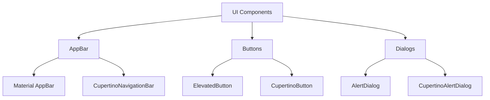

## 4.1.3 Material vs Cupertino Widgets

In the world of cross-platform app development, Flutter stands out for its ability to create beautiful, natively compiled applications for mobile, web, and desktop from a single codebase. A key feature of Flutter is its support for both Material and Cupertino design languages, allowing developers to create apps that feel native to both Android and iOS platforms. This section explores the differences between Material and Cupertino widgets, their design philosophies, and how to implement them effectively in your Flutter applications.

### Overview of Material and Cupertino Design Languages

#### Material Design

Material Design is a design language developed by Google, characterized by its emphasis on bold colors, grid-based layouts, responsive animations, and depth effects such as lighting and shadows. It aims to create a unified experience across all platforms and devices, focusing on the following principles:

- **Bold, Graphic, and Intentional:** Material Design uses bold colors and large typography to create a strong visual hierarchy.
- **Motion Provides Meaning:** Animations and transitions are used to guide the user's attention and provide feedback.
- **Adaptive Design:** Material Design is responsive, adapting to different screen sizes and orientations.

#### Cupertino Design

Cupertino Design, inspired by Apple's iOS design principles, focuses on clean typography, minimalistic icons, and smooth, fluid animations. It emphasizes a simple and elegant aesthetic, with a strong focus on the following aspects:

- **Clarity:** The design is clear and easy to understand, with a focus on legibility and simplicity.
- **Deference:** The UI is unobtrusive, allowing content to take center stage.
- **Depth:** Subtle use of shadows and blurs creates a sense of depth and hierarchy.

### Comparing Key Components

Understanding the differences between Material and Cupertino widgets is crucial for creating adaptive UIs that feel native to each platform. Let's compare some key components:

#### AppBar vs. CupertinoNavigationBar

- **Material's AppBar:** The `AppBar` widget is a core component of Material Design, providing a consistent place for branding, navigation, and actions. It typically includes a title, leading icon (such as a back button), and action buttons.

- **Cupertino's CupertinoNavigationBar:** The `CupertinoNavigationBar` is the iOS equivalent, offering a similar structure but with a focus on iOS aesthetics. It features a middle title, optional leading and trailing widgets, and supports large titles for a more immersive experience.

**Code Example: Material vs. Cupertino AppBar**

```dart
Widget build(BuildContext context) {
  return Platform.isIOS
      ? CupertinoPageScaffold(
          navigationBar: CupertinoNavigationBar(
            middle: Text('Cupertino AppBar'),
          ),
          child: Center(child: Text('iOS AppBar')),
        )
      : Scaffold(
          appBar: AppBar(
            title: Text('Material AppBar'),
          ),
          body: Center(child: Text('Android AppBar')),
        );
}
```

#### Buttons

- **Material's ElevatedButton:** The `ElevatedButton` is a Material widget that provides a raised button with a shadow, indicating elevation. It is commonly used for primary actions.

- **Cupertino's CupertinoButton:** The `CupertinoButton` is a flat button styled according to iOS conventions. It can be customized with colors and padding to fit the design requirements.

**Code Example: Material vs. Cupertino Buttons**

```dart
Widget build(BuildContext context) {
  return Platform.isIOS
      ? CupertinoButton(
          color: CupertinoColors.activeBlue,
          child: Text('Cupertino Button'),
          onPressed: () {},
        )
      : ElevatedButton(
          child: Text('Elevated Button'),
          onPressed: () {},
        );
}
```

#### Dialogs

- **Material's AlertDialog:** The `AlertDialog` widget in Material Design provides a modal dialog with a title, content, and actions. It is used for alerts, confirmations, and simple input.

- **Cupertino's CupertinoAlertDialog:** The `CupertinoAlertDialog` offers a similar functionality but adheres to iOS design guidelines, featuring a clean and minimalistic appearance.

### Mermaid.js Diagrams

To better visualize the comparison between Material and Cupertino widgets, consider the following diagram:



### Best Practices

When developing cross-platform applications with Flutter, consider the following best practices to ensure a seamless user experience:

- **Consistency Across Platforms:** Strive for consistency within each platform’s design language to meet user expectations. Use Material widgets for Android and Cupertino widgets for iOS to create a native feel.

- **Selective Adaptation:** Not all widgets need to be platform-specific. Identify which components benefit most from adaptation, such as navigation bars and buttons, while keeping other elements consistent across platforms.

- **User Experience Focus:** Prioritize enhancing the user experience by adhering to platform conventions and usability standards. This includes respecting platform-specific gestures and navigation patterns.

- **Testing on Real Devices:** Always test your application on both Android and iOS devices to ensure that the UI behaves as expected and provides a consistent experience.

- **Utilize Platform-Specific Features:** Leverage platform-specific features and APIs to enhance functionality and user experience, such as using iOS's swipe-to-go-back gesture or Android's material ripple effects.

### Conclusion

Understanding the differences between Material and Cupertino widgets is essential for creating adaptive and responsive UIs in Flutter. By leveraging the strengths of each design language, developers can build applications that feel native to both Android and iOS, providing users with a seamless and enjoyable experience. As you continue to explore Flutter's capabilities, remember to focus on user experience, consistency, and platform conventions to create truly adaptive applications.

### Further Reading and Resources

- [Flutter Documentation: Material Widgets](https://flutter.dev/docs/development/ui/widgets/material)
- [Flutter Documentation: Cupertino Widgets](https://flutter.dev/docs/development/ui/widgets/cupertino)
- [Material Design Guidelines](https://material.io/design)
- [Human Interface Guidelines by Apple](https://developer.apple.com/design/human-interface-guidelines/)

These resources provide additional insights into the design principles and implementation details of Material and Cupertino widgets, helping you to deepen your understanding and enhance your Flutter development skills.

## Quiz Time!



### What is the primary focus of Material Design?

- [x] Bold colors, grid-based layouts, and responsive animations
- [ ] Minimalistic icons and fluid animations
- [ ] Complex typography and detailed textures
- [ ] High contrast and sharp edges

> **Explanation:** Material Design emphasizes bold colors, grid-based layouts, and responsive animations to create a unified experience across platforms.

### Which widget is used for a navigation bar in Cupertino design?

- [ ] AppBar
- [x] CupertinoNavigationBar
- [ ] NavigationBar
- [ ] TopBar

> **Explanation:** CupertinoNavigationBar is the widget used for navigation bars in Cupertino design, adhering to iOS aesthetics.

### How does CupertinoButton differ from ElevatedButton?

- [x] CupertinoButton is styled according to iOS conventions
- [ ] ElevatedButton is used only for Android
- [ ] CupertinoButton has a shadow effect
- [ ] ElevatedButton cannot be customized

> **Explanation:** CupertinoButton is styled according to iOS conventions, while ElevatedButton is a Material widget with a shadow indicating elevation.

### What is a key characteristic of Cupertino design?

- [ ] Bold and graphic
- [x] Clarity and simplicity
- [ ] Complex animations
- [ ] High contrast

> **Explanation:** Cupertino design focuses on clarity and simplicity, with clean typography and minimalistic icons.

### Which widget provides a modal dialog in Material Design?

- [x] AlertDialog
- [ ] CupertinoAlertDialog
- [ ] ModalDialog
- [ ] MaterialDialog

> **Explanation:** AlertDialog is the widget used in Material Design to provide modal dialogs with a title, content, and actions.

### What should be prioritized when creating adaptive UIs?

- [x] User experience and platform conventions
- [ ] Complex animations and transitions
- [ ] High contrast and bold colors
- [ ] Consistent typography across platforms

> **Explanation:** User experience and platform conventions should be prioritized to ensure a seamless and enjoyable experience for users.

### What is a best practice for cross-platform development in Flutter?

- [x] Use Material widgets for Android and Cupertino widgets for iOS
- [ ] Use only Material widgets for all platforms
- [ ] Avoid platform-specific features
- [ ] Use Cupertino widgets for Android and Material widgets for iOS

> **Explanation:** Using Material widgets for Android and Cupertino widgets for iOS is a best practice to create a native feel for each platform.

### What is a benefit of testing on real devices?

- [x] Ensures the UI behaves as expected
- [ ] Reduces development time
- [ ] Eliminates the need for code reviews
- [ ] Guarantees no bugs in the code

> **Explanation:** Testing on real devices ensures that the UI behaves as expected and provides a consistent experience across platforms.

### Which design language emphasizes motion to provide meaning?

- [x] Material Design
- [ ] Cupertino Design
- [ ] Bootstrap
- [ ] Flat Design

> **Explanation:** Material Design emphasizes motion to provide meaning, using animations and transitions to guide the user's attention.

### True or False: Cupertino design is inspired by Android's design principles.

- [ ] True
- [x] False

> **Explanation:** False. Cupertino design is inspired by Apple's iOS design principles, focusing on clarity, simplicity, and depth.


