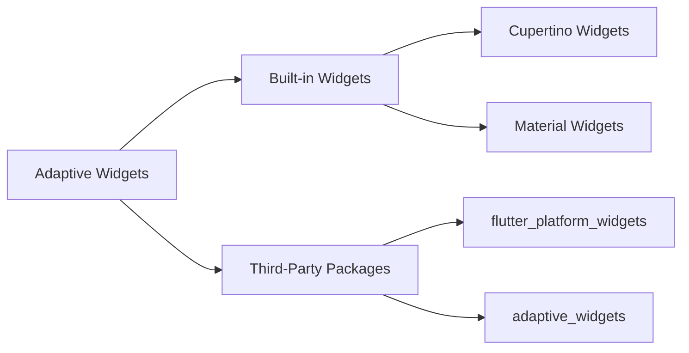

## 4.1.4 Adaptive Widgets in Flutter

In the realm of mobile application development, creating a seamless user experience across different platforms is paramount. Flutter, with its robust framework, offers the capability to design adaptive widgets that automatically adjust their appearance and behavior based on the underlying platform. This section delves into the concept of adaptive widgets, exploring both built-in and third-party solutions that empower developers to craft responsive and platform-specific UIs.

### Introduction to Adaptive Widgets

Adaptive widgets in Flutter are designed to provide a consistent user experience by adapting their look and feel to match the platform they are running on. This means that a single codebase can cater to both iOS and Android users, offering a native feel on each platform. Flutter's ecosystem includes a variety of packages that extend beyond the built-in `Cupertino` and `Material` design options, allowing for even more flexibility and customization.

#### Key Concepts of Adaptive Widgets

- **Platform Awareness:** Adaptive widgets detect the platform they are running on and adjust their appearance and behavior accordingly. This ensures that users have a native experience, whether they are using an iOS or Android device.
  
- **Consistency and Usability:** By using adaptive widgets, developers can maintain a consistent look and feel across platforms while still adhering to platform-specific design guidelines.

- **Efficiency:** Adaptive widgets reduce the need for platform-specific code, streamlining the development process and minimizing maintenance overhead.

### Exploring Flutter’s Built-in Adaptive Widgets

Flutter provides a set of built-in widgets that automatically adapt to the platform's design language. These include `Cupertino` widgets for iOS and `Material` widgets for Android, allowing developers to create apps that feel native on both platforms.

#### Adaptive Buttons

Buttons are a fundamental component of any user interface. Flutter offers adaptive buttons that change their appearance based on the platform:

- **CupertinoButton:** Specifically designed for iOS, this button follows the Cupertino design language, offering a sleek and modern look typical of iOS applications.

- **ElevatedButton:** A Material Design button for Android, it provides a raised appearance, indicating an action.

Here's a simple example demonstrating how to use these adaptive buttons:

```dart
import 'package:flutter/material.dart';
import 'dart:io' show Platform;

class AdaptiveButtonExample extends StatelessWidget {
  @override
  Widget build(BuildContext context) {
    return Platform.isIOS
        ? CupertinoButton(
            child: Text('iOS Button'),
            onPressed: () {
              print('CupertinoButton pressed');
            },
          )
        : ElevatedButton(
            child: Text('Android Button'),
            onPressed: () {
              print('ElevatedButton pressed');
            },
          );
  }
}
```

#### Adaptive Icons

Icons are another crucial element of UI design. Flutter provides adaptive icons that change style based on the platform, using classes like `Icons` and `CupertinoIcons`.

```dart
import 'package:flutter/material.dart';
import 'dart:io' show Platform;

class AdaptiveIconExample extends StatelessWidget {
  @override
  Widget build(BuildContext context) {
    return Icon(
      Platform.isIOS ? CupertinoIcons.home : Icons.home,
      size: 30.0,
    );
  }
}
```

### Third-Party Adaptive Libraries

While Flutter's built-in adaptive widgets are powerful, third-party libraries can further simplify the creation of adaptive UIs. These libraries provide additional widgets and utilities to enhance platform-specific design.

#### Popular Packages

- **flutter_platform_widgets:** This package provides a set of platform-aware widgets that automatically switch between Cupertino and Material styles based on the platform.

- **adaptive_widgets:** Offers a collection of widgets and utilities to create adaptive UIs with ease, focusing on simplifying the development process.

#### Integrating Third-Party Packages

To use these packages, you first need to add them to your `pubspec.yaml` file:

```yaml
dependencies:
  flutter_platform_widgets: ^1.0.0
  adaptive_widgets: ^1.0.0
```

Then, you can import and use them in your Flutter project:

```dart
import 'package:flutter/material.dart';
import 'package:flutter_platform_widgets/flutter_platform_widgets.dart';

class PlatformAdaptiveWidget extends StatelessWidget {
  @override
  Widget build(BuildContext context) {
    return PlatformScaffold(
      appBar: PlatformAppBar(
        title: Text('Adaptive Scaffold'),
      ),
      body: Center(
        child: PlatformElevatedButton(
          child: Text('Platform Adaptive Button'),
          onPressed: () {},
        ),
      ),
    );
  }
}
```

### Code Examples

#### Using flutter_platform_widgets Package

The `flutter_platform_widgets` package simplifies the process of creating adaptive UIs by providing platform-aware widgets. Here's an example of how to use it:

```dart
import 'package:flutter/material.dart';
import 'package:flutter_platform_widgets/flutter_platform_widgets.dart';

class PlatformAdaptiveWidget extends StatelessWidget {
  @override
  Widget build(BuildContext context) {
    return PlatformScaffold(
      appBar: PlatformAppBar(
        title: Text('Adaptive Scaffold'),
      ),
      body: Center(
        child: PlatformElevatedButton(
          child: Text('Platform Adaptive Button'),
          onPressed: () {},
        ),
      ),
    );
  }
}
```

#### Manual Adaptive Widget Example

For scenarios where you need more control, you can manually create adaptive widgets using platform checks:

```dart
import 'package:flutter/material.dart';
import 'dart:io' show Platform;

class ManualAdaptiveSwitch extends StatefulWidget {
  @override
  _ManualAdaptiveSwitchState createState() => _ManualAdaptiveSwitchState();
}

class _ManualAdaptiveSwitchState extends State<ManualAdaptiveSwitch> {
  bool _switchValue = false;

  @override
  Widget build(BuildContext context) {
    return Platform.isIOS
        ? CupertinoSwitch(
            value: _switchValue,
            onChanged: (bool newValue) {
              setState(() {
                _switchValue = newValue;
              });
            },
          )
        : Switch(
            value: _switchValue,
            onChanged: (bool newValue) {
              setState(() {
                _switchValue = newValue;
              });
            },
          );
  }
}
```

### Mermaid.js Diagrams

To better understand the flow of adaptive widgets, consider the following diagram:



### Best Practices

Creating adaptive UIs requires careful consideration of design and implementation. Here are some best practices to follow:

- **Abstraction:** Abstract platform-specific logic into separate files or classes to keep the codebase organized and maintainable.

- **Performance Considerations:** Ensure that adaptive widgets do not introduce unnecessary overhead or complexity. Optimize widget builds and avoid redundant platform checks.

- **Testing Across Platforms:** Rigorously test adaptive widgets on all target platforms to confirm their correct behavior and appearance. Use emulators and physical devices to ensure consistency.

### Conclusion

Adaptive widgets in Flutter provide a powerful toolset for creating cross-platform applications that feel native on both iOS and Android. By leveraging both built-in and third-party solutions, developers can streamline the development process, reduce code duplication, and enhance the user experience. As you continue to explore adaptive design, consider the best practices outlined here to create efficient, maintainable, and user-friendly applications.

---

## Quiz Time!



### What is the primary purpose of adaptive widgets in Flutter?

- [x] To adjust their appearance and behavior based on the underlying platform.
- [ ] To provide a consistent look across all platforms without any changes.
- [ ] To enhance performance by reducing widget complexity.
- [ ] To simplify state management in Flutter applications.

> **Explanation:** Adaptive widgets are designed to automatically adjust their appearance and behavior to match the design language of the platform they are running on, ensuring a native feel for users.

### Which built-in Flutter widget is specifically designed for iOS platforms?

- [x] CupertinoButton
- [ ] ElevatedButton
- [ ] FlatButton
- [ ] IconButton

> **Explanation:** The `CupertinoButton` is part of Flutter's Cupertino widget set, which is tailored for iOS design guidelines.

### What is the role of the `flutter_platform_widgets` package?

- [x] To provide platform-aware widgets that switch between Cupertino and Material styles.
- [ ] To enhance the performance of Flutter applications.
- [ ] To manage state across different platforms.
- [ ] To provide additional animation capabilities.

> **Explanation:** The `flutter_platform_widgets` package offers a set of widgets that automatically adapt their style based on the platform, simplifying the creation of adaptive UIs.

### How can you manually create an adaptive widget in Flutter?

- [x] By using platform checks with `Platform.isIOS` or `Platform.isAndroid`.
- [ ] By using the `flutter_platform_widgets` package.
- [ ] By implementing a custom widget class.
- [ ] By using the `adaptive_widgets` package.

> **Explanation:** Manually creating adaptive widgets involves using platform checks to determine the platform and then rendering the appropriate widget.

### What is a best practice when implementing adaptive widgets?

- [x] Abstract platform-specific logic into separate files or classes.
- [ ] Use only built-in widgets for all platforms.
- [ ] Avoid testing on physical devices.
- [ ] Implement all widgets manually without packages.

> **Explanation:** Abstracting platform-specific logic helps keep the codebase organized and maintainable, making it easier to manage and update.

### Which of the following is NOT a benefit of using adaptive widgets?

- [ ] Consistent user experience across platforms.
- [ ] Reduced need for platform-specific code.
- [x] Increased application size and complexity.
- [ ] Streamlined development process.

> **Explanation:** Adaptive widgets aim to reduce complexity and streamline development, not increase it.

### What should you consider when testing adaptive widgets?

- [x] Test on both emulators and physical devices.
- [ ] Only test on the platform you develop on.
- [ ] Focus solely on performance metrics.
- [ ] Avoid testing on older devices.

> **Explanation:** Testing on both emulators and physical devices ensures that adaptive widgets behave correctly across different environments.

### What is the primary advantage of using third-party adaptive libraries?

- [x] They simplify the creation of adaptive UIs with additional widgets and utilities.
- [ ] They provide better performance than built-in widgets.
- [ ] They are easier to use than built-in widgets.
- [ ] They offer more customization options for animations.

> **Explanation:** Third-party libraries like `flutter_platform_widgets` provide additional tools and widgets that make it easier to create adaptive UIs.

### Which widget set is tailored for Android design guidelines in Flutter?

- [ ] Cupertino Widgets
- [x] Material Widgets
- [ ] Adaptive Widgets
- [ ] Platform Widgets

> **Explanation:** Material Widgets are designed to follow Android's Material Design guidelines, providing a native look and feel on Android devices.

### True or False: Adaptive widgets can only be used on mobile platforms.

- [ ] True
- [x] False

> **Explanation:** Adaptive widgets can be used on various platforms, including mobile, web, and desktop, to provide a consistent user experience across different devices.


