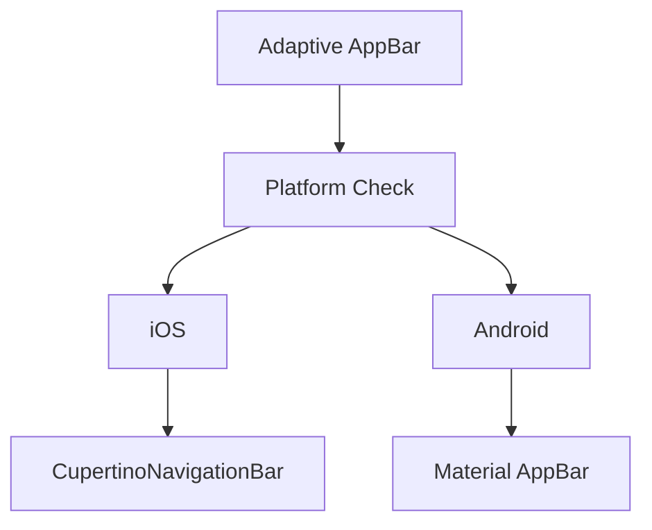

## 4.2.1 Adaptive AppBar

In the realm of mobile application development, providing a seamless and intuitive navigation experience is paramount. The AppBar plays a crucial role in this regard, serving as the primary navigation and identity element of an application. In this section, we delve into the concept of adaptive AppBars in Flutter, exploring how to tailor them to different platforms to enhance user experience.

### Understanding Adaptive AppBars

An AppBar is a fundamental component of most mobile applications, offering users a consistent space for navigation, branding, and actions. It typically includes elements such as the app title, navigation icons, and action buttons. However, the design and behavior of AppBars can vary significantly between platforms, such as Android and iOS, due to differing design guidelines and user expectations.

- **Material Design AppBar:** On Android, the AppBar is typically implemented using Material Design principles, characterized by a prominent title, optional leading icons (such as a menu or back button), and trailing action icons.
  
- **Cupertino NavigationBar:** On iOS, the AppBar is known as the `CupertinoNavigationBar`, following Apple's Human Interface Guidelines. It features a more subtle design with a centered title and optional navigation and action buttons.

Understanding these differences is crucial for creating an adaptive AppBar that provides a consistent user experience across platforms while respecting each platform's unique design language.

### Customizing AppBar for Different Platforms

To implement an adaptive AppBar in Flutter, we can leverage platform detection to switch between `AppBar` and `CupertinoNavigationBar` based on the operating system. This ensures that our app adheres to the design conventions of both Android and iOS, providing a native look and feel.

#### Key Properties and Customization Options

- **Material AppBar:**
  - `title`: Sets the primary text displayed in the AppBar.
  - `actions`: A list of widgets displayed on the right side of the AppBar, typically for actions like search or settings.
  - `leading`: A widget displayed before the `title`, often used for navigation icons.
  - `backgroundColor`: Sets the background color of the AppBar.

- **CupertinoNavigationBar:**
  - `middle`: Equivalent to the `title` in `AppBar`, displayed in the center.
  - `leading`: A widget displayed on the left, typically a back button.
  - `trailing`: A widget displayed on the right, used for actions.
  - `backgroundColor`: Sets the background color of the navigation bar.

### Code Examples

Below is a practical example of how to implement an adaptive AppBar in Flutter. This example demonstrates how to switch between `CupertinoNavigationBar` and `AppBar` based on the platform.

```dart
import 'dart:io' show Platform;
import 'package:flutter/cupertino.dart';
import 'package:flutter/material.dart';

Widget build(BuildContext context) {
  return Platform.isIOS
      ? CupertinoPageScaffold(
          navigationBar: CupertinoNavigationBar(
            middle: Text('Adaptive AppBar'),
            trailing: CupertinoButton(
              padding: EdgeInsets.zero,
              child: Icon(CupertinoIcons.add),
              onPressed: () {
                // Handle action
              },
            ),
          ),
          child: Center(child: Text('iOS AppBar Content')),
        )
      : Scaffold(
          appBar: AppBar(
            title: Text('Adaptive AppBar'),
            actions: [
              IconButton(
                icon: Icon(Icons.add),
                onPressed: () {
                  // Handle action
                },
              ),
            ],
          ),
          body: Center(child: Text('Android AppBar Content')),
        );
}
```

In this example, the `Platform.isIOS` check determines which AppBar to display. For iOS, we use `CupertinoPageScaffold` with a `CupertinoNavigationBar`, and for Android, we use `Scaffold` with a `Material AppBar`.

### Mermaid.js Diagrams

To better understand the structure of an adaptive AppBar, consider the following diagram:



This diagram illustrates the decision-making process for selecting the appropriate AppBar based on the platform.

### Best Practices

When implementing adaptive AppBars, consider the following best practices:

- **Consistency:** Ensure that the functionality of the AppBar remains consistent across platforms, even if the appearance differs. This includes maintaining similar navigation paths and action availability.
  
- **Navigation Elements:** Adapt navigation elements like buttons and titles to align with platform conventions. For example, use a back button on iOS and a hamburger menu on Android if applicable.
  
- **User Expectations:** Respect user expectations by following platform-specific design guidelines. This enhances familiarity and usability, making the app more intuitive for users.

### Conclusion

Creating an adaptive AppBar in Flutter is a powerful way to provide a native user experience across different platforms. By understanding the distinct design languages of Android and iOS and leveraging Flutter's capabilities, developers can build applications that feel right at home on any device. As you implement adaptive AppBars in your projects, remember to prioritize consistency and user expectations to deliver a seamless navigation experience.

## Quiz Time!



### What is the primary role of an AppBar in a mobile application?

- [x] To provide navigation and identity for the application.
- [ ] To display advertisements.
- [ ] To handle user authentication.
- [ ] To manage application settings.

> **Explanation:** The AppBar serves as the primary navigation and identity element, offering space for titles, navigation icons, and action buttons.

### Which widget is used for AppBars on iOS in Flutter?

- [ ] AppBar
- [x] CupertinoNavigationBar
- [ ] NavigationBar
- [ ] MaterialAppBar

> **Explanation:** The `CupertinoNavigationBar` is used on iOS to adhere to Apple's design guidelines.

### What method is used to detect the platform in Flutter?

- [x] Platform.isIOS
- [ ] Platform.isAndroid
- [ ] Platform.isWeb
- [ ] Platform.isDesktop

> **Explanation:** `Platform.isIOS` is used to check if the app is running on an iOS device.

### What is a key property of the Material `AppBar` for setting the title?

- [x] title
- [ ] middle
- [ ] leading
- [ ] trailing

> **Explanation:** The `title` property is used to set the primary text displayed in the Material `AppBar`.

### What is the equivalent of the `title` property in `CupertinoNavigationBar`?

- [ ] title
- [x] middle
- [ ] leading
- [ ] trailing

> **Explanation:** The `middle` property in `CupertinoNavigationBar` is equivalent to the `title` in `AppBar`.

### Which property is used to set the background color of an AppBar?

- [x] backgroundColor
- [ ] color
- [ ] themeColor
- [ ] primaryColor

> **Explanation:** The `backgroundColor` property sets the background color of the AppBar.

### How can you add an action button to a `CupertinoNavigationBar`?

- [x] Using the `trailing` property
- [ ] Using the `leading` property
- [ ] Using the `middle` property
- [ ] Using the `actions` property

> **Explanation:** The `trailing` property is used to add action buttons to a `CupertinoNavigationBar`.

### What is a common practice when implementing adaptive AppBars?

- [x] Ensuring consistent functionality across platforms
- [ ] Using the same design for all platforms
- [ ] Ignoring platform-specific guidelines
- [ ] Avoiding the use of navigation icons

> **Explanation:** Consistent functionality across platforms ensures a seamless user experience.

### What is the purpose of the `leading` property in an AppBar?

- [x] To display a widget before the title, often used for navigation icons
- [ ] To set the primary text of the AppBar
- [ ] To add action buttons on the right side
- [ ] To change the background color

> **Explanation:** The `leading` property is used to display a widget before the title, typically for navigation icons.

### True or False: The `CupertinoNavigationBar` automatically adapts its style based on the platform.

- [x] True
- [ ] False

> **Explanation:** The `CupertinoNavigationBar` is designed to follow iOS design guidelines, providing a native look and feel on iOS devices.


