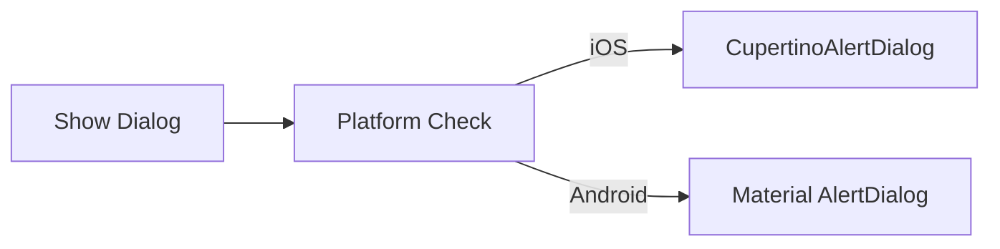

## 4.2.3 Adaptive Dialogs and Alerts

Dialogs and alerts are pivotal components in mobile applications, serving as conduits for user interaction and communication. Whether it's confirming an action, warning users about potential issues, or collecting input, dialogs play a crucial role in the user experience. In this section, we delve into the importance of adaptive dialogs in Flutter, focusing on how to create platform-specific dialogs that enhance the native feel of your applications.

### Importance of Platform-Specific Dialogs

Adapting dialogs to the platform is essential for maintaining a seamless user experience. Users are accustomed to certain styles and behaviors on their respective platforms—Android users expect Material Design elements, while iOS users anticipate Cupertino-style interfaces. By aligning your dialogs with these expectations, you not only improve the aesthetic appeal but also the usability of your application.

- **Native Look and Feel:** Platform-specific dialogs provide a familiar interface that aligns with the user's expectations, reducing cognitive load and enhancing usability.
- **Consistency:** Ensures that dialogs are consistent with other native applications on the device, fostering a cohesive user experience.
- **User Trust:** Users are more likely to trust and engage with applications that adhere to platform conventions.

### Different Dialog Styles

Flutter provides distinct dialog widgets to cater to both Android and iOS platforms. Understanding these styles is crucial for implementing adaptive dialogs effectively.

#### Material `AlertDialog`

The `AlertDialog` widget is the standard dialog for Android applications. It follows Material Design principles, featuring a title, content, and actions typically arranged horizontally.

- **Title:** A concise heading that indicates the purpose of the dialog.
- **Content:** A brief message or information related to the dialog's purpose.
- **Actions:** Buttons such as "Cancel" and "OK" that allow users to respond to the dialog.

#### Cupertino `CupertinoAlertDialog`

The `CupertinoAlertDialog` is tailored for iOS applications, adhering to Cupertino design guidelines. It features vertically arranged buttons and a distinct styling that resonates with iOS users.

- **Title:** Similar to the Material dialog, it provides a heading for the dialog.
- **Content:** Displays the message or information.
- **Actions:** Typically arranged vertically, offering a clear and accessible interface for user interaction.

### Implementing Adaptive Dialogs

To implement adaptive dialogs in Flutter, you can conditionally render different dialog widgets based on the platform. This ensures that your application provides the appropriate dialog style for each user.

#### Code Example: Adaptive Alert Dialog

Here's a practical example of how to implement an adaptive dialog in Flutter:

```dart
import 'dart:io' show Platform;
import 'package:flutter/cupertino.dart';
import 'package:flutter/material.dart';

Future<void> showAdaptiveDialog(BuildContext context) {
  return showDialog(
    context: context,
    builder: (BuildContext context) {
      return Platform.isIOS
          ? CupertinoAlertDialog(
              title: Text('iOS Alert'),
              content: Text('This is an iOS styled alert dialog.'),
              actions: [
                CupertinoDialogAction(
                  isDefaultAction: true,
                  child: Text('Cancel'),
                  onPressed: () => Navigator.of(context).pop(),
                ),
                CupertinoDialogAction(
                  child: Text('OK'),
                  onPressed: () => Navigator.of(context).pop(),
                ),
              ],
            )
          : AlertDialog(
              title: Text('Android Alert'),
              content: Text('This is a Material styled alert dialog.'),
              actions: [
                TextButton(
                  child: Text('Cancel'),
                  onPressed: () => Navigator.of(context).pop(),
                ),
                TextButton(
                  child: Text('OK'),
                  onPressed: () => Navigator.of(context).pop(),
                ),
              ],
            );
    },
  );
}

Widget build(BuildContext context) {
  return Scaffold(
    appBar: AppBar(title: Text('Adaptive Dialog Example')),
    body: Center(
      child: ElevatedButton(
        onPressed: () => showAdaptiveDialog(context),
        child: Text('Show Dialog'),
      ),
    ),
  );
}
```

In this example, the `showAdaptiveDialog` function checks the platform using `Platform.isIOS` and renders the appropriate dialog widget. This approach ensures that your dialogs are tailored to the user's device, providing a consistent and native experience.

### Diagram: Adaptive Dialog Rendering

To visualize the process of rendering adaptive dialogs, consider the following Mermaid.js diagram:



This diagram illustrates the decision-making process involved in selecting the appropriate dialog based on the platform.

### Best Practices for Adaptive Dialogs

Implementing adaptive dialogs involves more than just choosing the right widget. Here are some best practices to consider:

- **User Experience Consistency:** Ensure that dialogs behave consistently with other UI elements on the platform. This includes adhering to platform-specific animations and transitions.
- **Accessibility:** Make dialogs accessible by providing appropriate semantics and ensuring keyboard navigation support. Use the `Semantics` widget to enhance accessibility.
- **Simplicity:** Keep dialogs simple and focused on the intended action or message to avoid overwhelming the user. Limit the number of actions and ensure that the dialog's purpose is clear.

### Common Pitfalls and Challenges

While implementing adaptive dialogs, developers may encounter several challenges:

- **Platform Detection:** Relying solely on `Platform.isIOS` or `Platform.isAndroid` can lead to issues if the app is extended to other platforms like web or desktop. Consider using `Theme.of(context).platform` for a more flexible approach.
- **Complex Dialogs:** Overloading dialogs with too much information or too many actions can confuse users. Keep dialogs concise and focused.
- **Testing Across Devices:** Ensure that dialogs are tested on both Android and iOS devices to verify that they render and function correctly.

### Additional Resources

To further explore adaptive dialogs and alerts in Flutter, consider the following resources:

- [Flutter Documentation on Dialogs](https://flutter.dev/docs/development/ui/widgets/dialogs)
- [Material Design Guidelines](https://material.io/design/components/dialogs.html)
- [Cupertino Design Guidelines](https://developer.apple.com/design/human-interface-guidelines/ios/views/alerts/)

These resources provide in-depth insights into dialog design principles and best practices for both Material and Cupertino styles.

### Conclusion

Adaptive dialogs and alerts are integral to creating a seamless user experience in cross-platform applications. By leveraging Flutter's capabilities to render platform-specific dialogs, developers can ensure that their applications feel native and intuitive on both Android and iOS devices. Through careful consideration of design principles and best practices, you can enhance user engagement and satisfaction, ultimately leading to more successful applications.

---

## Quiz Time!



### What is the primary benefit of using platform-specific dialogs in Flutter?

- [x] To ensure a native look and feel for users on different platforms.
- [ ] To reduce the amount of code needed for dialog implementation.
- [ ] To make the application faster.
- [ ] To ensure dialogs are always displayed in full-screen mode.

> **Explanation:** Platform-specific dialogs provide a native look and feel, aligning with user expectations on different platforms, which enhances usability and user experience.

### Which widget is used for creating a Material-style dialog in Flutter?

- [x] AlertDialog
- [ ] CupertinoAlertDialog
- [ ] Dialog
- [ ] SimpleDialog

> **Explanation:** The `AlertDialog` widget is used for creating dialogs that follow Material Design principles, typically used in Android applications.

### What is a key difference between `AlertDialog` and `CupertinoAlertDialog`?

- [x] `AlertDialog` arranges buttons horizontally, while `CupertinoAlertDialog` arranges them vertically.
- [ ] `CupertinoAlertDialog` is only available on Android devices.
- [ ] `AlertDialog` does not support text content.
- [ ] `CupertinoAlertDialog` cannot have a title.

> **Explanation:** `AlertDialog` typically arranges buttons horizontally, following Material Design guidelines, while `CupertinoAlertDialog` arranges buttons vertically, adhering to Cupertino design principles.

### How can you determine which dialog style to render in a Flutter application?

- [x] By checking the platform using `Platform.isIOS` or `Platform.isAndroid`.
- [ ] By using the `Theme.of(context).brightness`.
- [ ] By checking the device's screen size.
- [ ] By using the `MediaQuery` widget.

> **Explanation:** You can determine the platform using `Platform.isIOS` or `Platform.isAndroid` to decide which dialog style to render.

### What is a best practice when designing dialogs for accessibility?

- [x] Providing appropriate semantics and ensuring keyboard navigation support.
- [ ] Using as many actions as possible to give users more options.
- [ ] Making dialogs full-screen to ensure visibility.
- [ ] Using only icons without text to save space.

> **Explanation:** Ensuring dialogs are accessible involves providing appropriate semantics and supporting keyboard navigation, making them usable for all users.

### Which of the following is a common pitfall when implementing adaptive dialogs?

- [x] Relying solely on `Platform.isIOS` or `Platform.isAndroid` for platform detection.
- [ ] Using too few actions in a dialog.
- [ ] Testing dialogs only on iOS devices.
- [ ] Using `AlertDialog` for all platforms.

> **Explanation:** Relying solely on `Platform.isIOS` or `Platform.isAndroid` can be limiting if the app is extended to other platforms like web or desktop.

### What is the purpose of the `showDialog` function in the adaptive dialog example?

- [x] To display the dialog on the screen.
- [ ] To determine the platform of the device.
- [ ] To close the dialog when an action is pressed.
- [ ] To style the dialog content.

> **Explanation:** The `showDialog` function is used to display the dialog on the screen, allowing user interaction.

### Which of the following is NOT a benefit of using adaptive dialogs?

- [ ] Enhancing user trust.
- [ ] Providing a consistent user experience.
- [ ] Reducing cognitive load.
- [x] Increasing the complexity of the codebase.

> **Explanation:** While adaptive dialogs enhance user experience, they do not inherently increase code complexity if implemented correctly.

### What should be considered when testing adaptive dialogs?

- [x] Testing on both Android and iOS devices to ensure correct rendering and functionality.
- [ ] Only testing on emulators to save time.
- [ ] Ensuring dialogs are always displayed in landscape mode.
- [ ] Using only one type of dialog for simplicity.

> **Explanation:** It's important to test adaptive dialogs on both Android and iOS devices to verify that they render and function correctly across platforms.

### True or False: Adaptive dialogs should always include as many actions as possible to give users more options.

- [ ] True
- [x] False

> **Explanation:** Adaptive dialogs should be simple and focused, providing only the necessary actions to avoid overwhelming the user.


