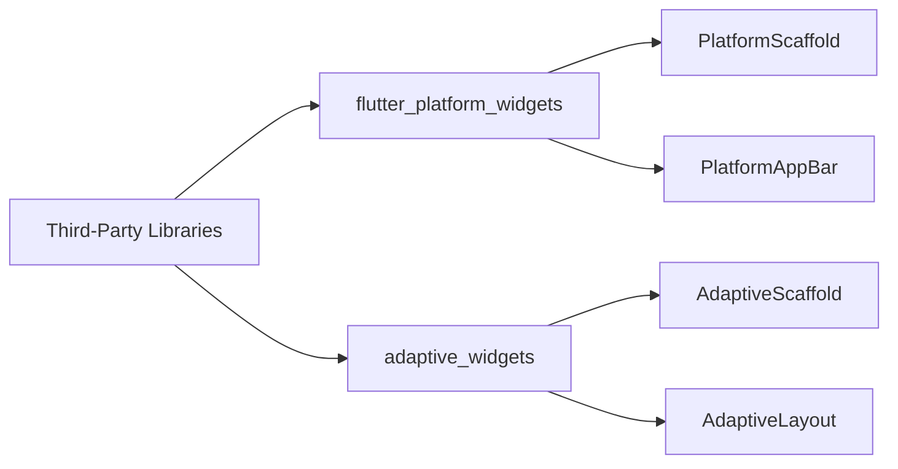

## 4.2.4 Third-Party Adaptive Libraries

In the world of mobile app development, creating user interfaces that seamlessly adapt to different platforms and screen sizes is crucial. Flutter, with its rich set of widgets, provides a solid foundation for building adaptive UIs. However, third-party libraries can further simplify this process by offering ready-made adaptive widgets and utilities. These libraries help developers focus more on the unique aspects of their applications rather than reinventing the wheel for platform-specific adaptations.

### Introduction to Third-Party Libraries

Third-party libraries in Flutter are invaluable tools that extend the framework's capabilities. They offer pre-built solutions that can save time and effort, especially when it comes to creating adaptive user interfaces. By leveraging these libraries, developers can ensure their applications look and feel native on both iOS and Android platforms without having to write extensive platform-specific code.

### Popular Adaptive Libraries

Several third-party libraries are popular among Flutter developers for creating adaptive UIs. Here, we will explore some of the most widely used libraries and their features.

#### flutter_platform_widgets

The `flutter_platform_widgets` library is a comprehensive solution for building platform-aware widgets. It simplifies the process of creating adaptive UIs by providing widgets that automatically adjust their appearance and behavior based on the underlying platform.

- **Key Features:**
  - Provides platform-specific widgets like `PlatformScaffold`, `PlatformAppBar`, and `PlatformButton`.
  - Allows easy customization to fit the design language of your app.
  - Supports both Cupertino (iOS) and Material (Android) design systems.

#### adaptive_widgets

The `adaptive_widgets` package focuses on providing widgets that adapt to the underlying platform with minimal configuration. It offers a straightforward way to implement responsive layouts that cater to different screen sizes and orientations.

- **Key Features:**
  - Offers widgets like `AdaptiveScaffold` and `AdaptiveLayout` for responsive design.
  - Simplifies the creation of layouts that adjust based on screen size.
  - Supports both large and small screen adaptations seamlessly.

#### Other Notable Libraries

- **platform_detect:** This package helps in detecting the platform and device type, allowing developers to conditionally render widgets or apply specific logic based on the platform.
- **device_preview:** A useful tool for testing your app on different devices and screen sizes without leaving your development environment.

### Integrating and Using Libraries

Integrating third-party libraries into your Flutter project is straightforward. Here's how you can add these packages to your project and start using them.

#### Adding Packages to `pubspec.yaml`

To use these libraries, you need to add them to your project's `pubspec.yaml` file. Here's an example of how to include `flutter_platform_widgets` and `adaptive_widgets`:

```yaml
dependencies:
  flutter:
    sdk: flutter
  flutter_platform_widgets: ^1.0.0
  adaptive_widgets: ^1.0.0
```

After adding the dependencies, run `flutter pub get` to install them.

#### Importing and Using the Libraries

Once the packages are added, you can import them into your Dart files and start using their widgets.

##### Using `flutter_platform_widgets` for Adaptive Button

Here's a simple example demonstrating how to use `flutter_platform_widgets` to create an adaptive button:

```dart
import 'package:flutter/material.dart';
import 'package:flutter_platform_widgets/flutter_platform_widgets.dart';

Widget build(BuildContext context) {
  return PlatformScaffold(
    appBar: PlatformAppBar(
      title: Text('Adaptive Library Example'),
    ),
    body: Center(
      child: PlatformElevatedButton(
        child: Text('Adaptive Button'),
        onPressed: () {},
      ),
    ),
  );
}
```

In this example, `PlatformScaffold` and `PlatformAppBar` automatically adjust their appearance based on the platform, ensuring a native look and feel.

##### Using `adaptive_widgets` Package for Responsive Layout

The following example shows how to use `adaptive_widgets` to create a responsive layout that adapts to different screen sizes:

```dart
import 'package:flutter/material.dart';
import 'package:adaptive_widgets/adaptive_widgets.dart';

Widget build(BuildContext context) {
  return AdaptiveScaffold(
    appBar: AdaptiveAppBar(
      title: Text('Adaptive Widgets Library'),
    ),
    body: AdaptiveLayout(
      largeScreen: Row(
        children: [
          Expanded(child: Text('Large Screen Layout')),
          Expanded(child: Icon(Icons.desktop_windows, size: 100)),
        ],
      ),
      smallScreen: Column(
        children: [
          Text('Small Screen Layout'),
          Icon(Icons.phone_android, size: 50),
        ],
      ),
    ),
  );
}
```

This example uses `AdaptiveScaffold` and `AdaptiveLayout` to provide different layouts for large and small screens, enhancing the user experience across devices.

### Mermaid.js Diagrams

To visualize the integration of third-party libraries in a Flutter project, consider the following diagram:



This diagram illustrates how the `flutter_platform_widgets` and `adaptive_widgets` libraries provide specific widgets that facilitate the creation of adaptive UIs.

### Best Practices

When using third-party adaptive libraries, it's essential to follow best practices to ensure your project remains maintainable and efficient.

- **Evaluate Libraries:** Choose libraries that are well-maintained, widely used, and fit the specific needs of your project. Check for recent updates and community support.
- **Understand Dependencies:** Be aware of additional dependencies introduced by these libraries to manage the project’s dependency tree effectively. This helps avoid potential conflicts and ensures smooth integration.
- **Customize When Necessary:** While libraries provide ready-made solutions, tailor them as needed to fit your app’s unique requirements and design language. This might involve overriding default styles or extending widgets to add custom functionality.

### Conclusion

Third-party adaptive libraries are powerful tools that can significantly streamline the development of adaptive UIs in Flutter. By leveraging these libraries, developers can create applications that provide a consistent and native experience across different platforms and devices. As you integrate these tools into your projects, remember to evaluate their suitability, understand their dependencies, and customize them to meet your app's specific needs.

By following the best practices outlined here, you can effectively use third-party libraries to enhance your Flutter applications, ensuring they are both adaptive and responsive to the diverse range of devices and platforms available today.

## Quiz Time!



### Which library provides platform-aware widgets to simplify adaptive UI creation?

- [x] flutter_platform_widgets
- [ ] adaptive_widgets
- [ ] platform_detect
- [ ] device_preview

> **Explanation:** `flutter_platform_widgets` offers platform-aware widgets that adjust their appearance based on the underlying platform, simplifying adaptive UI creation.

### What is the primary focus of the adaptive_widgets package?

- [x] Providing widgets that adapt to the underlying platform with minimal configuration
- [ ] Detecting the platform and device type
- [ ] Testing apps on different devices
- [ ] Offering platform-specific animations

> **Explanation:** The `adaptive_widgets` package focuses on providing widgets that adapt to the underlying platform with minimal configuration, making it easier to create responsive layouts.

### How do you add third-party libraries to a Flutter project?

- [x] By adding them to the pubspec.yaml file
- [ ] By downloading them manually
- [ ] By writing custom code
- [ ] By using the Flutter CLI

> **Explanation:** To add third-party libraries to a Flutter project, you include them in the `pubspec.yaml` file and run `flutter pub get` to install them.

### Which widget from flutter_platform_widgets automatically adjusts its appearance based on the platform?

- [x] PlatformScaffold
- [ ] AdaptiveScaffold
- [ ] MaterialApp
- [ ] CupertinoApp

> **Explanation:** `PlatformScaffold` is a widget from `flutter_platform_widgets` that automatically adjusts its appearance based on the platform, providing a native look and feel.

### What is the purpose of the device_preview package?

- [x] Testing apps on different devices and screen sizes
- [ ] Providing adaptive widgets
- [ ] Detecting platform and device type
- [ ] Offering platform-specific animations

> **Explanation:** The `device_preview` package is used for testing apps on different devices and screen sizes without leaving the development environment.

### Which library would you use to detect the platform and device type?

- [ ] flutter_platform_widgets
- [ ] adaptive_widgets
- [x] platform_detect
- [ ] device_preview

> **Explanation:** The `platform_detect` package is used to detect the platform and device type, allowing developers to conditionally render widgets or apply specific logic.

### How can you ensure a third-party library is well-maintained?

- [x] Check for recent updates and community support
- [ ] Use it without evaluation
- [ ] Only rely on documentation
- [ ] Ignore its dependencies

> **Explanation:** To ensure a third-party library is well-maintained, check for recent updates, community support, and evaluate its suitability for your project.

### What is a key benefit of using third-party adaptive libraries in Flutter?

- [x] They save time and effort by providing pre-built solutions
- [ ] They increase the complexity of the project
- [ ] They require extensive platform-specific code
- [ ] They limit customization options

> **Explanation:** Third-party adaptive libraries save time and effort by providing pre-built solutions that simplify the creation of adaptive UIs.

### Which widget from adaptive_widgets helps create responsive layouts?

- [ ] PlatformScaffold
- [x] AdaptiveLayout
- [ ] MaterialApp
- [ ] CupertinoApp

> **Explanation:** `AdaptiveLayout` from `adaptive_widgets` helps create responsive layouts that adapt to different screen sizes.

### True or False: Third-party libraries can help create adaptive UIs without writing extensive platform-specific code.

- [x] True
- [ ] False

> **Explanation:** True. Third-party libraries provide ready-made adaptive widgets and utilities, reducing the need for extensive platform-specific code.


