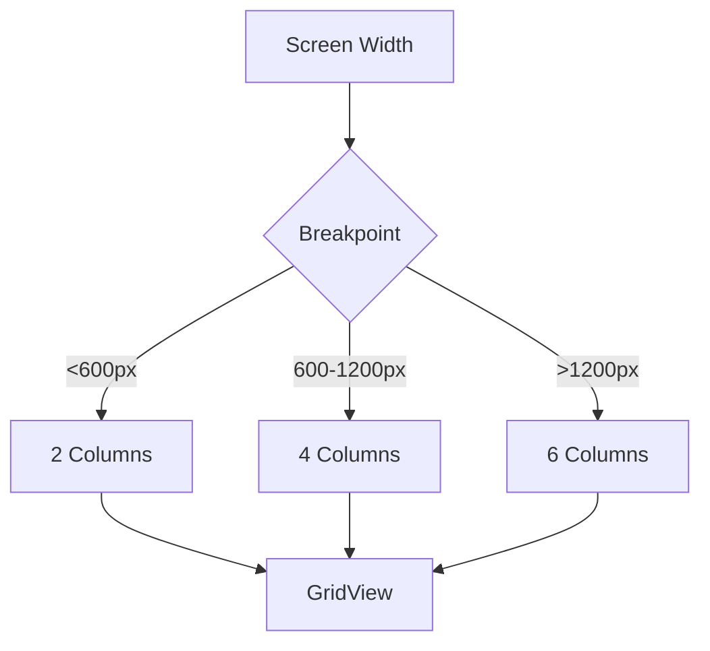

## 4.3.1 Breakpoints and Layout Grids

In the ever-evolving landscape of mobile and web development, creating applications that adapt seamlessly to various screen sizes is paramount. This section delves into the concepts of breakpoints and layout grids, two fundamental strategies for achieving responsive and adaptive designs in Flutter. By understanding and implementing these techniques, you can ensure your applications provide a consistent and engaging user experience across all devices.

### Understanding Breakpoints

Breakpoints are specific screen widths where the layout of an application changes to accommodate different screen sizes. They are essential in responsive design, allowing developers to tailor the user interface to the device's form factor, whether it's a mobile phone, tablet, or desktop. 

#### Common Breakpoint Values

Breakpoints are often inspired by popular frameworks and design guidelines. Here are some typical breakpoint values:

- **Mobile:** Less than 600px
- **Tablet:** Between 600px and 1024px
- **Desktop:** Greater than 1024px

These values serve as a guide, but they can be adjusted based on the specific needs of your application. The goal is to ensure that the layout remains functional and visually appealing at each breakpoint.

#### Implementing Breakpoints in Flutter

In Flutter, breakpoints can be implemented using the `MediaQuery` class, which provides information about the size and orientation of the current screen. By using `MediaQuery`, you can dynamically adjust the layout based on the screen width.

```dart
Widget build(BuildContext context) {
  var screenWidth = MediaQuery.of(context).size.width;

  int columns;
  if (screenWidth < 600) {
    columns = 2;
  } else if (screenWidth < 1200) {
    columns = 4;
  } else {
    columns = 6;
  }

  return Scaffold(
    appBar: AppBar(title: Text('Breakpoints and Grid')),
    body: GridView.builder(
      gridDelegate: SliverGridDelegateWithFixedCrossAxisCount(
        crossAxisCount: columns,
        crossAxisSpacing: 10,
        mainAxisSpacing: 10,
      ),
      itemCount: 20,
      itemBuilder: (context, index) {
        return Container(
          color: Colors.blueAccent,
          child: Center(child: Text('Item $index')),
        );
      },
    ),
  );
}
```

In this example, the number of columns in the grid changes based on the screen width, demonstrating a simple yet effective use of breakpoints.

### Implementing Layout Grids

Layout grids are a foundational tool for organizing content in a structured and scalable manner. They provide a framework that helps maintain alignment, consistency, and responsive behavior across different screen sizes.

#### Benefits of Using Grids

- **Alignment:** Grids ensure that elements are aligned consistently, which enhances the visual appeal and readability of the interface.
- **Consistency:** By using a grid system, you can maintain a consistent layout across different sections of your application.
- **Responsive Behavior:** Grids can adapt to different screen sizes, ensuring that the layout remains functional and aesthetically pleasing.

#### Defining Layout Grids in Flutter

Flutter provides several widgets that facilitate the creation of grid layouts, such as `GridView` and `SliverGrid`. These widgets allow you to define the number of columns and rows, as well as the spacing between elements.

```dart
GridView.builder(
  gridDelegate: SliverGridDelegateWithFixedCrossAxisCount(
    crossAxisCount: columns, // Number of columns based on breakpoints
    crossAxisSpacing: 10,
    mainAxisSpacing: 10,
  ),
  itemCount: 20,
  itemBuilder: (context, index) {
    return Container(
      color: Colors.blueAccent,
      child: Center(child: Text('Item $index')),
    );
  },
);
```

In this code snippet, the `GridView.builder` widget is used to create a grid layout. The `SliverGridDelegateWithFixedCrossAxisCount` delegate specifies the number of columns, which is determined by the current screen width.

### Best Practices for Breakpoints and Layout Grids

To effectively implement breakpoints and layout grids, consider the following best practices:

- **Consistent Breakpoints:** Use consistent breakpoint values across your application to maintain uniformity. This consistency helps users have a predictable experience as they navigate through different sections of your app.

- **Flexible Grids:** Design grid layouts that can flexibly adjust the number of columns or rows based on breakpoints. This flexibility ensures that your application can adapt to various screen sizes without compromising on usability or aesthetics.

- **Content Prioritization:** Arrange content within grids to highlight the most important elements at each breakpoint. Prioritizing content ensures that users can access key information quickly, regardless of the device they are using.

### Practical Example: Responsive Product Grid

Let's explore a practical example of a responsive product grid that adapts to different screen sizes using breakpoints and layout grids.

```dart
import 'package:flutter/material.dart';

class ProductGrid extends StatelessWidget {
  @override
  Widget build(BuildContext context) {
    var screenWidth = MediaQuery.of(context).size.width;

    int columns;
    if (screenWidth < 600) {
      columns = 2;
    } else if (screenWidth < 1200) {
      columns = 4;
    } else {
      columns = 6;
    }

    return Scaffold(
      appBar: AppBar(title: Text('Responsive Product Grid')),
      body: GridView.builder(
        gridDelegate: SliverGridDelegateWithFixedCrossAxisCount(
          crossAxisCount: columns,
          crossAxisSpacing: 10,
          mainAxisSpacing: 10,
        ),
        itemCount: 30,
        itemBuilder: (context, index) {
          return Card(
            elevation: 2,
            child: Column(
              children: [
                Expanded(
                  child: Image.network(
                    'https://via.placeholder.com/150',
                    fit: BoxFit.cover,
                  ),
                ),
                Padding(
                  padding: const EdgeInsets.all(8.0),
                  child: Text('Product $index'),
                ),
              ],
            ),
          );
        },
      ),
    );
  }
}
```

In this example, the product grid adjusts the number of columns based on the screen width. Each product is displayed in a card with an image and a title, demonstrating how content can be organized and prioritized within a grid layout.

### Visualizing Breakpoints and Layout Grids with Mermaid.js

To better understand the concept of breakpoints and layout grids, let's use a Mermaid.js diagram to visualize the decision-making process based on screen width.



This diagram illustrates how the application determines the number of columns in the grid based on the current screen width. The decision points (breakpoints) guide the layout adjustments, ensuring a responsive design.

### Conclusion

Breakpoints and layout grids are powerful tools in the arsenal of a Flutter developer aiming to create responsive and adaptive user interfaces. By understanding how to implement these strategies, you can design applications that provide a seamless experience across a wide range of devices. Remember to apply consistent breakpoints, design flexible grids, and prioritize content to enhance usability and engagement.

### Further Exploration

For those interested in diving deeper into responsive design, consider exploring the following resources:

- **Books:** "Responsive Web Design with HTML5 and CSS" by Ben Frain
- **Courses:** "Flutter & Dart - The Complete Guide" on Udemy
- **Documentation:** [Flutter Layouts](https://flutter.dev/docs/development/ui/layout) on the official Flutter website

By continuing to explore and experiment with these concepts, you'll be well-equipped to tackle the challenges of modern app development.

## Quiz Time!



### What are breakpoints in responsive design?

- [x] Specific screen widths where the layout changes
- [ ] Specific screen heights where the layout changes
- [ ] Specific color schemes for different devices
- [ ] Specific font sizes for different devices

> **Explanation:** Breakpoints are specific screen widths where the layout changes to accommodate different screen sizes.

### Which of the following is a common breakpoint value for mobile devices?

- [x] Less than 600px
- [ ] Between 600px and 1024px
- [ ] Greater than 1024px
- [ ] Exactly 800px

> **Explanation:** A common breakpoint value for mobile devices is less than 600px.

### What widget in Flutter is commonly used to create grid layouts?

- [x] GridView
- [ ] ListView
- [ ] Column
- [ ] Row

> **Explanation:** The GridView widget is commonly used to create grid layouts in Flutter.

### How does the `MediaQuery` class help in implementing breakpoints?

- [x] It provides information about the size and orientation of the current screen
- [ ] It provides information about the color scheme of the current screen
- [ ] It provides information about the font size of the current screen
- [ ] It provides information about the battery level of the device

> **Explanation:** The `MediaQuery` class provides information about the size and orientation of the current screen, which helps in implementing breakpoints.

### What is the benefit of using layout grids?

- [x] They ensure alignment and consistency
- [ ] They increase the number of colors in the UI
- [ ] They reduce the size of the application
- [ ] They increase the speed of network requests

> **Explanation:** Layout grids ensure alignment and consistency across different sections of the application.

### In the provided code example, how many columns are displayed for a screen width of 800px?

- [x] 4
- [ ] 2
- [ ] 6
- [ ] 8

> **Explanation:** For a screen width of 800px, the code example displays 4 columns.

### What is the purpose of the `SliverGridDelegateWithFixedCrossAxisCount` in a GridView?

- [x] It specifies the number of columns in the grid
- [ ] It specifies the number of rows in the grid
- [ ] It specifies the color of the grid
- [ ] It specifies the font size of the grid items

> **Explanation:** The `SliverGridDelegateWithFixedCrossAxisCount` specifies the number of columns in the grid.

### Why is content prioritization important in responsive design?

- [x] To highlight the most important elements at each breakpoint
- [ ] To increase the number of elements on the screen
- [ ] To decrease the number of colors used
- [ ] To reduce the size of the application

> **Explanation:** Content prioritization is important to highlight the most important elements at each breakpoint, ensuring key information is accessible.

### Which of the following is NOT a benefit of using layout grids?

- [x] They increase the speed of network requests
- [ ] They ensure alignment
- [ ] They maintain consistency
- [ ] They provide responsive behavior

> **Explanation:** Layout grids do not increase the speed of network requests; they ensure alignment, maintain consistency, and provide responsive behavior.

### True or False: Breakpoints can only be used for adjusting the number of columns in a grid.

- [ ] True
- [x] False

> **Explanation:** False. Breakpoints can be used to adjust various aspects of the layout, not just the number of columns in a grid.


