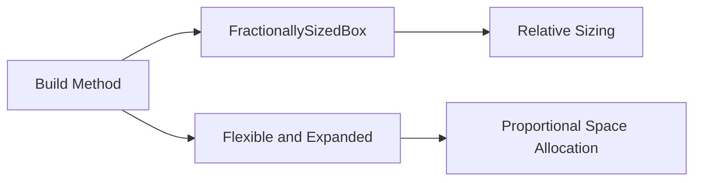

## 4.3.2 Implementing Fluid Layouts

In the realm of mobile app development, creating interfaces that adapt seamlessly to various screen sizes and orientations is crucial. Fluid layouts offer a powerful solution by using relative sizing and positioning, allowing UI elements to adjust dynamically without relying on predefined breakpoints. This approach enhances flexibility and reduces maintenance, making it an essential strategy for modern app design.

### Introduction to Fluid Layouts

Fluid layouts are characterized by their ability to adapt to different screen sizes using percentage-based dimensions and proportional spacing. Unlike fixed layouts, which use absolute measurements, fluid layouts leverage relative measurements, allowing elements to resize and reposition themselves based on the available screen space. This adaptability ensures that the user interface remains consistent and visually appealing across a wide range of devices.

**Benefits of Fluid Layouts:**

- **Enhanced Flexibility:** Fluid layouts automatically adjust to different screen sizes, ensuring a consistent user experience.
- **Reduced Maintenance:** By avoiding hardcoded dimensions, fluid layouts require less maintenance when adapting to new devices or screen sizes.
- **Improved User Experience:** Users enjoy a seamless experience as the UI adapts smoothly to their device, enhancing usability and accessibility.

### Creating Fluid Layouts

To implement fluid layouts in Flutter, developers can utilize a variety of widgets and techniques that facilitate relative sizing and positioning. Key widgets include `FractionallySizedBox`, `Flexible`, `Expanded`, and `MediaQuery`.

#### Key Widgets for Fluid Layouts

- **FractionallySizedBox:** This widget allows you to specify the size of a child widget as a fraction of its parent's size, making it ideal for creating fluid layouts.
- **Flexible and Expanded:** These widgets are used within a `Row` or `Column` to allocate space proportionally among child widgets.
- **MediaQuery:** Provides information about the size and orientation of the current screen, enabling dynamic adjustments based on device characteristics.

#### Utilizing Percentage-Based Dimensions

Percentage-based dimensions are a cornerstone of fluid layouts. By specifying dimensions as a fraction of the available space, developers can ensure that UI elements scale appropriately across different devices.

**Example: Fluid Grid Using FractionallySizedBox**

```dart
Widget build(BuildContext context) {
  return Scaffold(
    appBar: AppBar(title: Text('Fluid Layout Example')),
    body: Column(
      children: [
        FractionallySizedBox(
          widthFactor: 0.8,
          child: Container(
            height: 100,
            color: Colors.green,
            child: Center(child: Text('80% Width')),
          ),
        ),
        SizedBox(height: 20),
        FractionallySizedBox(
          widthFactor: 0.6,
          child: Container(
            height: 100,
            color: Colors.blue,
            child: Center(child: Text('60% Width')),
          ),
        ),
      ],
    ),
  );
}
```

In this example, `FractionallySizedBox` is used to create containers that occupy 80% and 60% of the available width, respectively. This ensures that the layout adapts fluidly to different screen sizes.

**Example: Fluid Column Using Flexible and Expanded**

```dart
Widget build(BuildContext context) {
  return Scaffold(
    appBar: AppBar(title: Text('Flexible and Expanded Example')),
    body: Column(
      children: [
        Flexible(
          flex: 2,
          child: Container(
            color: Colors.red,
            child: Center(child: Text('Flexible 2')),
          ),
        ),
        Flexible(
          flex: 1,
          child: Container(
            color: Colors.orange,
            child: Center(child: Text('Flexible 1')),
          ),
        ),
        Expanded(
          child: Container(
            color: Colors.yellow,
            child: Center(child: Text('Expanded')),
          ),
        ),
      ],
    ),
  );
}
```

In this example, `Flexible` and `Expanded` widgets are used to allocate space proportionally within a `Column`. The `flex` property determines the relative size of each child, allowing for a fluid distribution of space.

### Mermaid.js Diagrams

To better understand the implementation of fluid layouts, consider the following diagram illustrating the relationship between key components:



This diagram highlights how the `Build Method` utilizes `FractionallySizedBox` for relative sizing and `Flexible` and `Expanded` for proportional space allocation, forming the foundation of fluid layouts.

### Best Practices for Fluid Layouts

Implementing fluid layouts effectively requires adherence to best practices that ensure adaptability and maintainability:

- **Avoid Fixed Sizes:** Use relative measurements instead of fixed sizes to ensure that UI elements can adapt to different screen sizes and orientations.
- **Maintain Aspect Ratios:** Utilize widgets like `AspectRatio` to preserve the intended appearance of elements, ensuring that they scale proportionally.
- **Test Across Devices:** Regularly test fluid layouts on a variety of devices to verify that elements scale and position correctly, providing a consistent user experience.

### Practical Considerations and Challenges

While fluid layouts offer numerous benefits, developers may encounter challenges such as ensuring consistent spacing and alignment across different devices. Addressing these challenges requires careful planning and testing, as well as a willingness to iterate and refine the layout as needed.

**Common Challenges:**

- **Inconsistent Spacing:** Variations in screen size can lead to inconsistent spacing between elements. To address this, use proportional spacing techniques and test the layout on multiple devices.
- **Alignment Issues:** Ensuring that elements remain aligned across different screen sizes can be challenging. Utilize alignment widgets such as `Align` and `Center` to maintain consistent positioning.

### Conclusion

Fluid layouts are an essential strategy for creating responsive and adaptive UIs in Flutter. By leveraging relative sizing and positioning, developers can build interfaces that adapt seamlessly to varying screen sizes, enhancing flexibility and reducing maintenance. By following best practices and addressing common challenges, developers can create fluid layouts that provide a consistent and engaging user experience across a wide range of devices.

### Further Exploration

To deepen your understanding of fluid layouts and responsive design in Flutter, consider exploring the following resources:

- **Flutter Documentation:** The official Flutter documentation provides comprehensive guides and examples for implementing responsive layouts.
- **Online Courses:** Platforms like Udemy and Coursera offer courses on Flutter development, covering topics such as responsive design and fluid layouts.
- **Community Forums:** Engage with the Flutter community on platforms like Stack Overflow and Reddit to share insights and seek advice on implementing fluid layouts.

By continuing to explore and experiment with fluid layouts, developers can enhance their skills and create more adaptable and user-friendly applications.

## Quiz Time!



### What is a key characteristic of fluid layouts?

- [x] They use relative sizing and positioning.
- [ ] They rely on fixed breakpoints.
- [ ] They require absolute measurements.
- [ ] They are only suitable for web applications.

> **Explanation:** Fluid layouts use relative sizing and positioning to adapt to different screen sizes, unlike fixed layouts that rely on absolute measurements or breakpoints.

### Which widget is ideal for creating fluid layouts with percentage-based dimensions?

- [x] FractionallySizedBox
- [ ] SizedBox
- [ ] Container
- [ ] Align

> **Explanation:** `FractionallySizedBox` allows you to specify the size of a widget as a fraction of its parent's size, making it ideal for fluid layouts.

### How do `Flexible` and `Expanded` widgets contribute to fluid layouts?

- [x] They allocate space proportionally among child widgets.
- [ ] They fix the size of child widgets.
- [ ] They are used for absolute positioning.
- [ ] They only work with `Row` widgets.

> **Explanation:** `Flexible` and `Expanded` widgets allocate space proportionally among child widgets, allowing for dynamic resizing in fluid layouts.

### What is a common challenge when implementing fluid layouts?

- [x] Inconsistent spacing between elements.
- [ ] Lack of flexibility in design.
- [ ] Difficulty in using fixed sizes.
- [ ] Limited support for mobile devices.

> **Explanation:** Inconsistent spacing between elements can occur due to variations in screen size, requiring careful planning and testing to address.

### Which widget helps maintain aspect ratios in fluid layouts?

- [x] AspectRatio
- [ ] FractionallySizedBox
- [ ] Flexible
- [ ] Expanded

> **Explanation:** The `AspectRatio` widget helps maintain the intended appearance of elements by preserving their aspect ratio.

### Why is it important to test fluid layouts across multiple devices?

- [x] To ensure elements scale and position correctly.
- [ ] To verify fixed sizes are consistent.
- [ ] To identify breakpoints for different screens.
- [ ] To apply absolute measurements.

> **Explanation:** Testing across multiple devices ensures that elements scale and position correctly, providing a consistent user experience.

### What is a benefit of using fluid layouts over fixed layouts?

- [x] Reduced maintenance
- [ ] Increased complexity
- [ ] More breakpoints
- [ ] Fixed dimensions

> **Explanation:** Fluid layouts reduce maintenance by avoiding hardcoded dimensions and adapting automatically to different screen sizes.

### Which widget provides information about screen size and orientation?

- [x] MediaQuery
- [ ] Container
- [ ] Align
- [ ] SizedBox

> **Explanation:** `MediaQuery` provides information about the size and orientation of the current screen, enabling dynamic adjustments.

### What is a strategy to address alignment issues in fluid layouts?

- [x] Use alignment widgets like `Align` and `Center`.
- [ ] Use fixed sizes for all elements.
- [ ] Avoid testing on multiple devices.
- [ ] Rely on absolute positioning.

> **Explanation:** Using alignment widgets like `Align` and `Center` helps maintain consistent positioning across different screen sizes.

### True or False: Fluid layouts are only suitable for mobile applications.

- [ ] True
- [x] False

> **Explanation:** Fluid layouts are suitable for a wide range of applications, including mobile, web, and desktop, due to their adaptability to different screen sizes.


