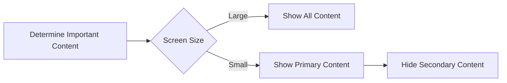

## 4.3.3 Content Prioritization

In today's mobile-first world, designing applications that provide an optimal user experience across a variety of devices is crucial. Content prioritization plays a vital role in this process by ensuring that the most important elements of your application are prominently displayed, especially on smaller screens. This section delves into the strategies and techniques for effectively prioritizing content in Flutter applications, ensuring that users have access to the most relevant information and features regardless of their device.

### Understanding Content Prioritization

Content prioritization involves determining which elements of your application are most important and ensuring they are prominently displayed. This is particularly crucial when dealing with smaller screens, where space is limited, and every pixel counts. By prioritizing content, you can enhance the user experience by making sure that the most critical information and functionalities are easily accessible.

#### Key Concepts:
- **Importance of Content Hierarchy:** Establish a clear hierarchy of content to guide users through your application effectively.
- **User-Centric Approach:** Focus on what users need most from your application and prioritize content accordingly.
- **Responsive Design:** Adapt your layout to different screen sizes while maintaining the integrity of your content hierarchy.

### Techniques for Content Prioritization

There are several techniques you can employ to prioritize content effectively in your Flutter applications:

#### Visibility Control

Visibility control involves showing or hiding content based on the screen size or device capabilities. This technique helps ensure that only the most relevant information is displayed on smaller screens, reducing clutter and improving usability.

**Example: Conditional Visibility**

```dart
Widget build(BuildContext context) {
  var screenWidth = MediaQuery.of(context).size.width;

  bool showSecondaryContent = screenWidth > 600;

  return Scaffold(
    appBar: AppBar(title: Text('Content Prioritization')),
    body: Column(
      children: [
        Text('Primary Content'),
        if (showSecondaryContent)
          Text('Secondary Content Visible on Larger Screens'),
      ],
    ),
  );
}
```

In this example, secondary content is only displayed if the screen width exceeds 600 pixels, ensuring that primary content remains the focus on smaller devices.

#### Reordering Elements

Reordering elements involves arranging content in a way that highlights key information first. This technique is particularly useful when adapting layouts for different screen sizes, ensuring that users always see the most important content first.

**Example: Reordering Widgets Based on Screen Size**

```dart
Widget build(BuildContext context) {
  var screenWidth = MediaQuery.of(context).size.width;

  return Scaffold(
    appBar: AppBar(title: Text('Reordered Content')),
    body: screenWidth > 600
        ? Row(
            children: [
              Expanded(child: Text('Sidebar')),
              Expanded(child: Text('Main Content')),
            ],
          )
        : Column(
            children: [
              Text('Main Content'),
              Text('Sidebar'),
            ],
          ),
  );
}
```

In this example, the layout changes from a column to a row when the screen width exceeds 600 pixels, prioritizing the main content on smaller screens.

#### Using Adaptive Widgets

Adaptive widgets can collapse or expand content as needed, allowing you to provide a flexible user interface that adapts to different screen sizes and orientations. These widgets help maintain a clean and organized layout by dynamically adjusting the visibility and arrangement of content.

### Diagram: Content Prioritization Flow

To better understand the flow of content prioritization, consider the following diagram:



This diagram illustrates the decision-making process involved in content prioritization, where the screen size determines whether all content is shown or if secondary content is hidden to emphasize primary content.

### Best Practices for Content Prioritization

Implementing content prioritization effectively requires adherence to several best practices:

- **Identify Core Features:** Focus on displaying the most critical information and functionalities prominently. This ensures that users can quickly access the features they need most.
- **User-Centric Design:** Prioritize content based on user needs and typical use cases. Understanding your audience and their expectations can guide your prioritization decisions.
- **Avoid Clutter:** Prevent overwhelming the user by limiting the amount of displayed content on smaller screens. A clean and organized layout enhances usability and user satisfaction.

### Practical Examples and Real-World Scenarios

Consider a news application where the primary content is the latest news articles, and secondary content includes advertisements and older articles. On smaller screens, you might choose to hide the advertisements and display only the latest articles. On larger screens, you can display both the latest articles and advertisements side by side.

### Encouragement for Hands-On Practice

To solidify your understanding of content prioritization, try implementing these techniques in your own Flutter projects. Experiment with different layouts and visibility conditions to see how they affect the user experience. Consider the following questions as you work:

- How does changing the order of elements impact the overall usability of your application?
- What content do your users interact with most, and how can you prioritize it effectively?
- How can you use adaptive widgets to create a more flexible and responsive user interface?

### Conclusion

Content prioritization is a crucial aspect of designing responsive and adaptive layouts in Flutter. By understanding and implementing the techniques discussed in this section, you can create applications that provide an optimal user experience across a variety of devices. Remember to focus on user needs, maintain a clear content hierarchy, and avoid clutter to ensure your application is both functional and visually appealing.

## Quiz Time!



### What is the primary goal of content prioritization in responsive design?

- [x] To ensure the most important elements are prominently displayed
- [ ] To make the application look more aesthetically pleasing
- [ ] To increase the number of features on smaller screens
- [ ] To reduce the overall size of the application

> **Explanation:** Content prioritization focuses on displaying the most critical information prominently, especially on smaller screens.

### Which technique involves showing or hiding content based on screen size?

- [x] Visibility Control
- [ ] Reordering Elements
- [ ] Using Adaptive Widgets
- [ ] Content Caching

> **Explanation:** Visibility control is used to show or hide content based on screen size or device capabilities.

### In the provided code example, what determines whether secondary content is displayed?

- [x] Screen width greater than 600 pixels
- [ ] User preferences
- [ ] Device orientation
- [ ] Network speed

> **Explanation:** The code uses a condition that checks if the screen width is greater than 600 pixels to display secondary content.

### What is a key benefit of reordering elements in a layout?

- [x] Highlighting key information first
- [ ] Reducing application load time
- [ ] Simplifying the codebase
- [ ] Increasing the number of widgets

> **Explanation:** Reordering elements helps highlight key information first, ensuring users see the most important content.

### Which widget can be used to create a flexible user interface that adapts to different screen sizes?

- [x] Adaptive Widgets
- [ ] Static Widgets
- [ ] Stateful Widgets
- [ ] Stateless Widgets

> **Explanation:** Adaptive widgets can collapse or expand content as needed, providing a flexible user interface.

### What should be the focus when identifying core features for content prioritization?

- [x] Displaying the most critical information prominently
- [ ] Including as many features as possible
- [ ] Reducing the number of widgets
- [ ] Increasing the complexity of the UI

> **Explanation:** The focus should be on displaying the most critical information and functionalities prominently.

### How can user-centric design aid in content prioritization?

- [x] By prioritizing content based on user needs and typical use cases
- [ ] By focusing solely on aesthetic appeal
- [ ] By reducing the number of features
- [ ] By increasing the number of advertisements

> **Explanation:** User-centric design prioritizes content based on user needs and typical use cases, enhancing the user experience.

### What is a potential pitfall of not prioritizing content effectively?

- [x] Overwhelming the user with too much information
- [ ] Reducing the number of features
- [ ] Simplifying the codebase
- [ ] Increasing application load time

> **Explanation:** Not prioritizing content effectively can overwhelm users with too much information, especially on smaller screens.

### Which of the following is a best practice for content prioritization?

- [x] Avoiding clutter by limiting displayed content on smaller screens
- [ ] Including all features on every screen size
- [ ] Focusing only on aesthetic appeal
- [ ] Reducing the number of widgets

> **Explanation:** Avoiding clutter by limiting displayed content on smaller screens is a best practice for content prioritization.

### True or False: Content prioritization is only necessary for mobile applications.

- [ ] True
- [x] False

> **Explanation:** Content prioritization is important for all types of applications, not just mobile, to ensure a good user experience across different devices.


