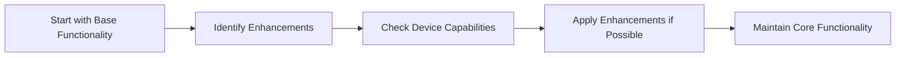

## 4.3.4 Progressive Enhancement

In the ever-evolving landscape of mobile and web applications, ensuring that your application is both accessible and feature-rich across a wide range of devices is crucial. Progressive enhancement is a strategy that allows developers to build applications that provide a basic level of functionality to all users while offering enhanced features to those with more capable devices. This approach not only improves user experience but also ensures that your application remains accessible and functional on less capable devices.

### Understanding Progressive Enhancement

**Progressive enhancement** is a design philosophy that emphasizes starting with a basic, functional application and then layering on additional features that enhance the user experience as the capabilities of the user's device allow. This approach is particularly important in today's diverse device ecosystem, where users may access applications on anything from low-end smartphones to high-performance tablets and desktops.

- **Base Functionality:** The core features of your application should be accessible to all users, regardless of their device capabilities. This ensures that everyone can use your application, even if they are on a less capable device.
- **Enhanced Features:** Additional features, such as animations, interactive elements, or advanced UI components, are added on top of the base functionality. These enhancements are only activated on devices that can support them without compromising performance or usability.

### Implementing Progressive Enhancement in Flutter

Flutter provides a robust framework for implementing progressive enhancement, thanks to its flexible widget system and powerful tools for detecting device capabilities. Here's how you can approach progressive enhancement in your Flutter applications:

#### Base Layer

Start by building a simple, functional layout that works across all devices. This base layer should include all the essential features of your application, ensuring that it is usable and accessible to everyone.

#### Enhancements

Once the base layer is in place, you can add advanced UI elements, animations, or interactive features that activate only on devices with sufficient capabilities. This can be done by checking device properties such as screen size, orientation, or platform.

#### Code Examples

Let's explore some practical code examples to illustrate how progressive enhancement can be implemented in Flutter.

**Basic Layout with Progressive Enhancements:**

```dart
Widget build(BuildContext context) {
  var screenWidth = MediaQuery.of(context).size.width;

  return Scaffold(
    appBar: AppBar(title: Text('Progressive Enhancement')),
    body: Column(
      children: [
        Text('Basic Functionality'),
        if (screenWidth > 600)
          ElevatedButton(
            onPressed: () {},
            child: Text('Enhanced Feature'),
          ),
      ],
    ),
  );
}
```

In this example, the application displays a basic text widget for all users. However, users with devices that have a screen width greater than 600 pixels will also see an additional button, providing enhanced functionality.

**Adding Animations Conditionally:**

```dart
Widget build(BuildContext context) {
  var screenWidth = MediaQuery.of(context).size.width;

  return Scaffold(
    appBar: AppBar(title: Text('Conditional Animation')),
    body: Center(
      child: screenWidth > 600
          ? AnimatedOpacity(
              opacity: 1.0,
              duration: Duration(seconds: 2),
              child: Text('Animated on Larger Screens'),
            )
          : Text('Static on Small Screens'),
    ),
  );
}
```

Here, an animated text widget is displayed on devices with larger screens, while a static text widget is shown on smaller screens. This approach ensures that animations do not negatively impact performance on less capable devices.

### Visualizing Progressive Enhancement

To better understand the steps involved in implementing progressive enhancement, consider the following diagram:



This flowchart illustrates the process of starting with a base level of functionality, identifying potential enhancements, checking device capabilities, applying enhancements where possible, and ensuring that core functionality is maintained throughout.

### Best Practices for Progressive Enhancement

When implementing progressive enhancement in your Flutter applications, consider the following best practices:

- **Ensure Accessibility:** Core functionalities must remain accessible even without progressive enhancements. This means that all users should be able to access the essential features of your application, regardless of their device capabilities.
- **Test Across Devices:** Verify that enhancements do not break the base functionality on less capable devices. Testing your application on a variety of devices is crucial to ensure that it performs well and remains usable for all users.
- **Incremental Improvements:** Add enhancements in manageable increments to simplify maintenance and updates. By gradually introducing new features, you can ensure that your application remains stable and easy to maintain.

### Conclusion

Progressive enhancement is a powerful strategy for building responsive and adaptive applications that provide a great user experience across a wide range of devices. By starting with a solid base layer and adding enhancements as device capabilities allow, you can ensure that your application is both accessible and feature-rich. As you continue to develop your Flutter applications, consider how you can apply the principles of progressive enhancement to create applications that are both functional and engaging for all users.

## Quiz Time!



### What is the main goal of progressive enhancement?

- [x] To build a base level of functionality and add advanced features for capable devices.
- [ ] To create a single version of an app that works on all devices.
- [ ] To focus only on high-end devices for the best user experience.
- [ ] To ensure that all features are available on all devices regardless of capability.

> **Explanation:** Progressive enhancement aims to provide a basic level of functionality to all users while adding advanced features for those with more capable devices.

### In the context of Flutter, what is the first step in implementing progressive enhancement?

- [x] Start with a simple, functional layout that works across all devices.
- [ ] Add animations and interactive features immediately.
- [ ] Identify the most advanced features to implement.
- [ ] Focus on optimizing performance for high-end devices first.

> **Explanation:** The first step is to create a simple, functional layout that works on all devices, ensuring accessibility and usability.

### How can you conditionally add enhancements in a Flutter app?

- [x] By checking device properties such as screen size or platform.
- [ ] By using a single layout for all devices.
- [ ] By hardcoding features for specific devices.
- [ ] By ignoring device capabilities and adding all features.

> **Explanation:** Enhancements can be added conditionally by checking device properties like screen size or platform to determine capability.

### What is a key benefit of progressive enhancement?

- [x] It ensures accessibility and usability across all devices.
- [ ] It focuses on high-end device users only.
- [ ] It reduces the need for testing on multiple devices.
- [ ] It simplifies the development process by ignoring older devices.

> **Explanation:** Progressive enhancement ensures that all users can access the core functionality, regardless of their device's capabilities.

### Which of the following is NOT a best practice for progressive enhancement?

- [ ] Ensure accessibility.
- [ ] Test across devices.
- [x] Add all enhancements at once.
- [ ] Incremental improvements.

> **Explanation:** Adding all enhancements at once is not a best practice; enhancements should be added incrementally to maintain stability and ease of maintenance.

### What does the following code snippet demonstrate?

```dart
Widget build(BuildContext context) {
  var screenWidth = MediaQuery.of(context).size.width;

  return Scaffold(
    appBar: AppBar(title: Text('Conditional Animation')),
    body: Center(
      child: screenWidth > 600
          ? AnimatedOpacity(
              opacity: 1.0,
              duration: Duration(seconds: 2),
              child: Text('Animated on Larger Screens'),
            )
          : Text('Static on Small Screens'),
    ),
  );
}
```

- [x] Conditional animation based on screen width.
- [ ] Static layout for all devices.
- [ ] Animation applied to all devices.
- [ ] A layout that does not change based on device capabilities.

> **Explanation:** The code snippet demonstrates how to apply animations conditionally based on the screen width, enhancing the experience on larger screens.

### What is the purpose of the `MediaQuery` widget in Flutter?

- [x] To access information about the device's screen and orientation.
- [ ] To create animations.
- [ ] To manage state across widgets.
- [ ] To handle user input events.

> **Explanation:** `MediaQuery` provides information about the device's screen size, orientation, and other properties, which is essential for implementing responsive designs.

### Why is it important to test enhancements across different devices?

- [x] To ensure that enhancements do not break the base functionality on less capable devices.
- [ ] To focus development efforts on high-end devices only.
- [ ] To reduce the number of features in the app.
- [ ] To ensure that all features are available on all devices.

> **Explanation:** Testing across devices ensures that enhancements do not negatively impact the base functionality, maintaining usability for all users.

### What does the following Mermaid.js diagram represent?


- [x] The process of implementing progressive enhancement.
- [ ] The lifecycle of a Flutter widget.
- [ ] The steps for debugging a Flutter app.
- [ ] The process of deploying a Flutter app.

> **Explanation:** The diagram represents the steps involved in implementing progressive enhancement, starting with base functionality and adding enhancements as device capabilities allow.

### True or False: Progressive enhancement focuses on providing the best experience for high-end devices only.

- [ ] True
- [x] False

> **Explanation:** Progressive enhancement focuses on providing a basic level of functionality to all users while enhancing the experience for those with more capable devices, not just high-end devices.


