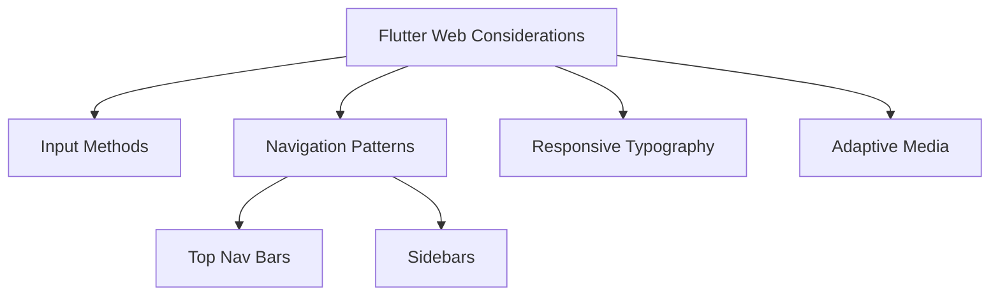

## 4.4.1 Flutter for Web Considerations

As Flutter continues to evolve, its capability to build applications that run seamlessly across multiple platforms, including web, has become a significant advantage. However, developing for the web introduces a unique set of challenges and opportunities that differ from mobile development. This section delves into the essential considerations when adapting Flutter apps for the web, ensuring that your applications are not only functional but also optimized for web users.

### Differences Between Web and Mobile Platforms

When transitioning a Flutter application from mobile to web, understanding the fundamental differences between these platforms is crucial. Here are some key distinctions:

- **Input Methods:**
  - **Mobile:** Primarily touch-based, with gestures like swipes and pinches.
  - **Web:** Predominantly mouse and keyboard inputs, requiring hover states and focus management.

- **Navigation:**
  - **Mobile:** Often linear and stack-based, using bottom navigation bars or drawers.
  - **Web:** Utilizes URLs, links, and browser navigation, necessitating support for deep linking and back/forward navigation.

- **Performance Considerations:**
  - **Mobile:** Optimized for specific device capabilities, often with more control over hardware.
  - **Web:** Requires efficient asset loading and rendering optimizations to accommodate varying browser capabilities and network conditions.

### Adapting Mobile Designs for Web Browsers

When adapting mobile designs for the web, consider the following adjustments to ensure a seamless user experience:

- **Layout Adjustments:**
  - **Larger Screens:** Web applications often run on larger screens with different aspect ratios. Use flexible layouts that can adapt to these changes, such as grid systems and responsive design patterns.
  - **Navigation Patterns:** Implement web-friendly navigation elements like top navigation bars and sidebars, which are more intuitive for desktop users.

- **Example: Responsive Web Layout:**

  ```dart
  Widget build(BuildContext context) {
    var screenWidth = MediaQuery.of(context).size.width;

    return Scaffold(
      appBar: AppBar(title: Text('Flutter Web Example')),
      body: screenWidth > 1200
          ? Row(
              children: [
                Expanded(child: Sidebar()),
                Expanded(flex: 3, child: ContentArea()),
              ],
            )
          : Column(
              children: [
                Sidebar(),
                ContentArea(),
              ],
            ),
    );
  }

  class Sidebar extends StatelessWidget {
    @override
    Widget build(BuildContext context) {
      return Container(
        color: Colors.blueGrey,
        child: ListView(
          children: [
            ListTile(title: Text('Home')),
            ListTile(title: Text('About')),
            ListTile(title: Text('Contact')),
          ],
        ),
      );
    }
  }

  class ContentArea extends StatelessWidget {
    @override
    Widget build(BuildContext context) {
      return Container(
        padding: EdgeInsets.all(16.0),
        child: Text('Main Content Area', style: TextStyle(fontSize: 24)),
      );
    }
  }
  ```

This example demonstrates a responsive layout that adjusts based on screen width, using a sidebar and content area that switch between row and column layouts.

### Responsive Typography and Media

Ensuring that your typography and media are responsive is vital for maintaining readability and visual appeal across different web browsers:

- **Scalable Typography:** Use relative units like `em` or `rem` for font sizes to ensure they scale appropriately with the user's browser settings.
- **Adaptive Media:** Implement responsive images and videos that adjust to the screen size and resolution, using techniques like `srcset` for images.

### Best Practices for Flutter Web Development

To maximize the effectiveness of your Flutter web applications, adhere to the following best practices:

- **Optimize Performance:**
  - Minimize build sizes by tree-shaking unused code and assets.
  - Use lazy loading for assets and components to improve initial load times.

- **SEO and Accessibility:**
  - Ensure your application supports SEO-friendly URLs and metadata.
  - Implement accessibility features such as ARIA labels and keyboard navigation to make your app usable for everyone.

- **Consistent User Experience:**
  - Maintain a consistent look and feel across platforms while adapting to the unique aspects of web interfaces.
  - Use platform-specific adaptations sparingly to ensure a unified experience.

### Mermaid.js Diagram: Flutter for Web Adaptations



This diagram illustrates the key considerations and adaptations necessary for developing Flutter applications for the web.

### Conclusion

Adapting Flutter applications for the web requires a thoughtful approach to design and development. By understanding the differences between web and mobile platforms, adjusting layouts and navigation patterns, and adhering to best practices for performance and accessibility, you can create web applications that are both functional and engaging. As you continue to explore Flutter's capabilities, remember to keep the user experience at the forefront of your development process.

## Quiz Time!



### What is a key difference between web and mobile platforms in Flutter development?

- [x] Web uses mouse and keyboard inputs, while mobile uses touch inputs.
- [ ] Web requires more storage space than mobile.
- [ ] Web apps are faster than mobile apps.
- [ ] Mobile apps have more complex navigation than web apps.

> **Explanation:** Web platforms primarily use mouse and keyboard inputs, whereas mobile platforms rely on touch-based interactions.

### How can you ensure typography is responsive on the web?

- [x] Use relative units like `em` or `rem` for font sizes.
- [ ] Use fixed pixel sizes for fonts.
- [ ] Avoid using scalable fonts.
- [ ] Use only system fonts.

> **Explanation:** Using relative units like `em` or `rem` allows typography to scale with the user's browser settings, ensuring responsiveness.

### What navigation pattern is more intuitive for desktop users?

- [x] Top navigation bars and sidebars.
- [ ] Bottom navigation bars.
- [ ] Floating action buttons.
- [ ] Gesture-based navigation.

> **Explanation:** Top navigation bars and sidebars are more intuitive for desktop users, aligning with common web navigation patterns.

### Which of the following is a performance optimization technique for Flutter web apps?

- [x] Lazy loading assets and components.
- [ ] Increasing the number of animations.
- [ ] Using larger image files.
- [ ] Disabling caching.

> **Explanation:** Lazy loading assets and components can improve initial load times by only loading necessary resources.

### Why is it important to implement accessibility features in web applications?

- [x] To make the app usable for everyone, including those with disabilities.
- [ ] To increase the app's file size.
- [ ] To make the app run faster.
- [ ] To reduce development time.

> **Explanation:** Accessibility features ensure that the app is usable by everyone, including users with disabilities, enhancing inclusivity.

### What is a benefit of using SEO-friendly URLs in web applications?

- [x] Improved search engine visibility and ranking.
- [ ] Increased application size.
- [ ] Faster application performance.
- [ ] Reduced development complexity.

> **Explanation:** SEO-friendly URLs help improve the application's visibility and ranking on search engines.

### How can you maintain a consistent user experience across platforms?

- [x] Use platform-specific adaptations sparingly.
- [ ] Use different color schemes for each platform.
- [ ] Implement completely different layouts for web and mobile.
- [ ] Avoid using responsive design.

> **Explanation:** Using platform-specific adaptations sparingly helps maintain a consistent user experience across different platforms.

### What is a common method for adapting media to different screen sizes?

- [x] Using `srcset` for responsive images.
- [ ] Using fixed-size images.
- [ ] Avoiding images altogether.
- [ ] Using only vector graphics.

> **Explanation:** The `srcset` attribute allows images to adapt to different screen sizes and resolutions, ensuring responsiveness.

### Which input method is primarily used on web platforms?

- [x] Mouse and keyboard.
- [ ] Touch gestures.
- [ ] Voice commands.
- [ ] Stylus input.

> **Explanation:** Web platforms primarily use mouse and keyboard inputs for interaction.

### True or False: Web applications require the same performance optimizations as mobile applications.

- [ ] True
- [x] False

> **Explanation:** Web applications may require different performance optimizations, such as efficient asset loading and minimizing build sizes, compared to mobile applications.


