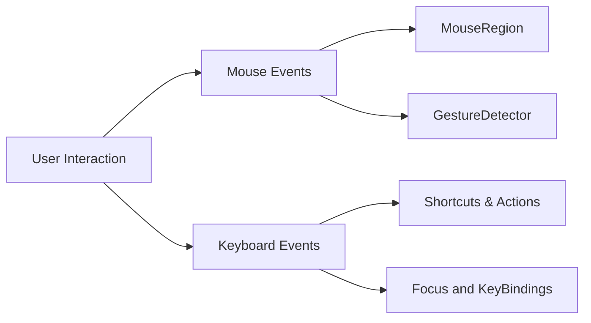

## 4.4.2 Mouse and Keyboard Support

As Flutter expands its reach beyond mobile devices to web and desktop platforms, understanding how to effectively implement mouse and keyboard support becomes crucial. Unlike touch-based mobile interfaces, desktop applications rely heavily on non-touch inputs, such as mouse and keyboard, which necessitate different interaction patterns and considerations. This section explores the importance of these inputs, how to handle pointer events, implement keyboard navigation, and provides practical code examples to illustrate these concepts.

### Importance of Non-Touch Inputs

Desktop platforms inherently differ from mobile devices in terms of user interaction. While mobile apps are predominantly touch-based, desktop applications require support for mouse and keyboard inputs. This shift in interaction necessitates a rethink of UI design and functionality to ensure a seamless user experience across platforms.

- **User Expectations:** Desktop users expect to interact with applications using a mouse and keyboard. This includes hovering over elements, clicking, dragging, and using keyboard shortcuts for navigation and commands.
- **Accessibility:** Providing robust keyboard navigation and shortcuts enhances accessibility, allowing users with disabilities or those who prefer keyboard interactions to navigate the application efficiently.
- **Efficiency:** Keyboard shortcuts can significantly improve user efficiency by allowing quick access to common functions without navigating through menus.

### Handling Pointer Events

Flutter provides several widgets and mechanisms to handle pointer events, such as mouse movements, clicks, and drags. Two primary widgets used for this purpose are `MouseRegion` and `GestureDetector`.

#### MouseRegion

The `MouseRegion` widget is used to detect when a mouse pointer enters, exits, or hovers over a widget. This is particularly useful for changing the appearance of UI elements in response to mouse actions, such as highlighting a button when hovered over.

**Example: Mouse Hover Effect**

```dart
class HoverEffectButton extends StatefulWidget {
  @override
  _HoverEffectButtonState createState() => _HoverEffectButtonState();
}

class _HoverEffectButtonState extends State<HoverEffectButton> {
  bool _isHovered = false;

  @override
  Widget build(BuildContext context) {
    return MouseRegion(
      onEnter: (_) => setState(() => _isHovered = true),
      onExit: (_) => setState(() => _isHovered = false),
      child: Container(
        padding: EdgeInsets.all(16.0),
        decoration: BoxDecoration(
          color: _isHovered ? Colors.blueAccent : Colors.blue,
          borderRadius: BorderRadius.circular(8.0),
        ),
        child: Text(
          'Hover Me',
          style: TextStyle(color: Colors.white, fontSize: 18),
        ),
      ),
    );
  }
}
```

In this example, the `MouseRegion` widget is used to detect when the mouse enters or exits the button area, changing the button's color accordingly.

#### GestureDetector

The `GestureDetector` widget is versatile and can be used to detect a variety of gestures, including taps, double taps, long presses, and drags. While it is commonly used for touch events, it can also handle mouse clicks and other pointer events on desktop platforms.

**Example: Click and Drag**

```dart
class DraggableBox extends StatelessWidget {
  @override
  Widget build(BuildContext context) {
    return GestureDetector(
      onPanUpdate: (details) {
        // Handle drag updates
        print('Dragging: ${details.localPosition}');
      },
      onTap: () {
        // Handle tap
        print('Box tapped!');
      },
      child: Container(
        width: 100,
        height: 100,
        color: Colors.green,
        child: Center(child: Text('Drag Me')),
      ),
    );
  }
}
```

This example demonstrates how to use `GestureDetector` to handle drag updates and taps on a widget, providing interactive feedback to the user.

### Keyboard Navigation

Implementing keyboard navigation involves creating shortcuts and focus management to enhance usability for desktop users. Flutter provides the `Shortcuts`, `Actions`, and `Focus` widgets to facilitate this.

#### Shortcuts and Actions

The `Shortcuts` widget maps keyboard key combinations to `Intent` objects, which can then trigger actions defined in the `Actions` widget. This system allows for a clean separation of input handling and application logic.

**Example: Keyboard Shortcut**

```dart
class KeyboardShortcutExample extends StatelessWidget {
  @override
  Widget build(BuildContext context) {
    return Scaffold(
      appBar: AppBar(title: Text('Keyboard Shortcut')),
      body: Shortcuts(
        shortcuts: <LogicalKeySet, Intent>{
          LogicalKeySet(LogicalKeyboardKey.control, LogicalKeyboardKey.keyS): SaveIntent(),
        },
        child: Actions(
          actions: <Type, Action<Intent>>{
            SaveIntent: CallbackAction<SaveIntent>(
              onInvoke: (SaveIntent intent) => _saveData(),
            ),
          },
          child: Focus(
            autofocus: true,
            child: Center(
              child: Text('Press Ctrl+S to Save'),
            ),
          ),
        ),
      ),
    );
  }

  void _saveData() {
    // Implement save functionality
    print('Data Saved!');
  }
}

class SaveIntent extends Intent {}
```

In this example, pressing `Ctrl+S` triggers the `_saveData` method, demonstrating how to implement keyboard shortcuts using `Shortcuts` and `Actions`.

#### Focus Management

The `Focus` widget is used to manage keyboard focus within an application. It allows widgets to receive keyboard input and can be used to navigate between focusable elements using the keyboard.

**Example: Focus Navigation**

```dart
class FocusExample extends StatelessWidget {
  @override
  Widget build(BuildContext context) {
    return Scaffold(
      appBar: AppBar(title: Text('Focus Example')),
      body: Column(
        children: [
          Focus(
            child: TextField(
              decoration: InputDecoration(labelText: 'Input 1'),
            ),
          ),
          Focus(
            child: TextField(
              decoration: InputDecoration(labelText: 'Input 2'),
            ),
          ),
        ],
      ),
    );
  }
}
```

This example shows how to use the `Focus` widget to manage keyboard focus between two text fields, allowing users to navigate using the Tab key.

### Best Practices for Mouse and Keyboard Support

- **Responsive to Interaction Types:** Ensure that UI elements respond appropriately to both mouse and touch inputs. For instance, buttons should provide visual feedback on hover and click.
- **Accessibility:** Implement keyboard navigation and shortcuts to support users who rely on keyboard interactions. This includes providing focus indicators and ensuring all interactive elements are accessible via keyboard.
- **Consistent Behavior:** Ensure that interactions behave consistently across different input methods to prevent user confusion. For example, a button should respond similarly whether activated by a mouse click or keyboard shortcut.

### Diagram: Mouse and Keyboard Interaction

To better understand the flow of mouse and keyboard interactions in a Flutter application, consider the following diagram:



This diagram illustrates how user interactions are processed through different widgets and systems in Flutter, allowing for comprehensive handling of both mouse and keyboard inputs.

### Conclusion

Supporting mouse and keyboard inputs in Flutter applications for web and desktop platforms is essential for creating a seamless and accessible user experience. By leveraging widgets like `MouseRegion`, `GestureDetector`, `Shortcuts`, and `Focus`, developers can implement robust interaction patterns that cater to the expectations of desktop users. As you integrate these features into your applications, remember to adhere to best practices for accessibility and consistency to ensure a positive user experience.

### Further Reading and Resources

- [Flutter Desktop Support](https://flutter.dev/desktop)
- [Flutter Web Support](https://flutter.dev/web)
- [Flutter Accessibility Guide](https://flutter.dev/docs/development/accessibility-and-localization/accessibility)
- [Keyboard and Mouse Input in Flutter](https://flutter.dev/docs/development/ui/advanced/gestures)

By understanding and implementing these concepts, you can enhance the interactivity and usability of your Flutter applications across all platforms, ensuring they are both responsive and adaptive to user needs.

## Quiz Time!



### What is the primary purpose of the `MouseRegion` widget in Flutter?

- [x] To detect mouse pointer events such as enter, exit, and hover.
- [ ] To handle touch gestures like taps and swipes.
- [ ] To manage keyboard focus within an application.
- [ ] To create animations for UI elements.

> **Explanation:** The `MouseRegion` widget is specifically designed to detect mouse pointer events, making it ideal for implementing hover effects and other mouse-based interactions.

### Which widget is used to implement keyboard shortcuts in Flutter?

- [ ] MouseRegion
- [x] Shortcuts
- [ ] GestureDetector
- [ ] Focus

> **Explanation:** The `Shortcuts` widget is used to map keyboard key combinations to `Intent` objects, allowing for the implementation of keyboard shortcuts.

### How can you manage keyboard focus between multiple text fields in Flutter?

- [ ] Using MouseRegion
- [ ] Using GestureDetector
- [x] Using Focus
- [ ] Using Shortcuts

> **Explanation:** The `Focus` widget is used to manage keyboard focus, allowing users to navigate between focusable elements such as text fields using the keyboard.

### What is a common use case for the `GestureDetector` widget?

- [ ] Detecting mouse hover events
- [x] Handling tap and drag gestures
- [ ] Managing keyboard shortcuts
- [ ] Creating animations

> **Explanation:** The `GestureDetector` widget is versatile and commonly used to handle various gestures, including taps and drags, making it suitable for interactive UI elements.

### Which of the following is a best practice for implementing mouse and keyboard support?

- [x] Ensure consistent behavior across different input methods.
- [ ] Focus only on touch interactions for desktop applications.
- [ ] Avoid using keyboard shortcuts for accessibility reasons.
- [ ] Implement mouse support but ignore keyboard navigation.

> **Explanation:** Ensuring consistent behavior across different input methods is crucial to prevent user confusion and provide a seamless experience.

### What is the role of the `Actions` widget in Flutter?

- [ ] To detect mouse pointer events
- [x] To define the logic for handling `Intent` objects
- [ ] To create animations for UI elements
- [ ] To manage keyboard focus

> **Explanation:** The `Actions` widget is used to define the logic for handling `Intent` objects, which are triggered by keyboard shortcuts mapped in the `Shortcuts` widget.

### How does the `Focus` widget enhance accessibility in Flutter applications?

- [ ] By detecting mouse hover events
- [ ] By handling tap gestures
- [x] By managing keyboard focus and navigation
- [ ] By creating animations

> **Explanation:** The `Focus` widget enhances accessibility by managing keyboard focus and navigation, allowing users to interact with the application using the keyboard.

### Which widget would you use to implement a hover effect for a button in a Flutter web application?

- [x] MouseRegion
- [ ] GestureDetector
- [ ] Shortcuts
- [ ] Actions

> **Explanation:** The `MouseRegion` widget is ideal for implementing hover effects, as it detects when the mouse pointer enters or exits a widget.

### What is the benefit of using keyboard shortcuts in desktop applications?

- [x] They improve user efficiency by providing quick access to common functions.
- [ ] They are only useful for debugging purposes.
- [ ] They replace the need for mouse interactions entirely.
- [ ] They are primarily used for mobile applications.

> **Explanation:** Keyboard shortcuts improve user efficiency by allowing quick access to common functions, enhancing the overall user experience in desktop applications.

### True or False: The `GestureDetector` widget can only be used for touch-based interactions.

- [ ] True
- [x] False

> **Explanation:** False. The `GestureDetector` widget can handle both touch and mouse interactions, making it versatile for use in both mobile and desktop applications.


