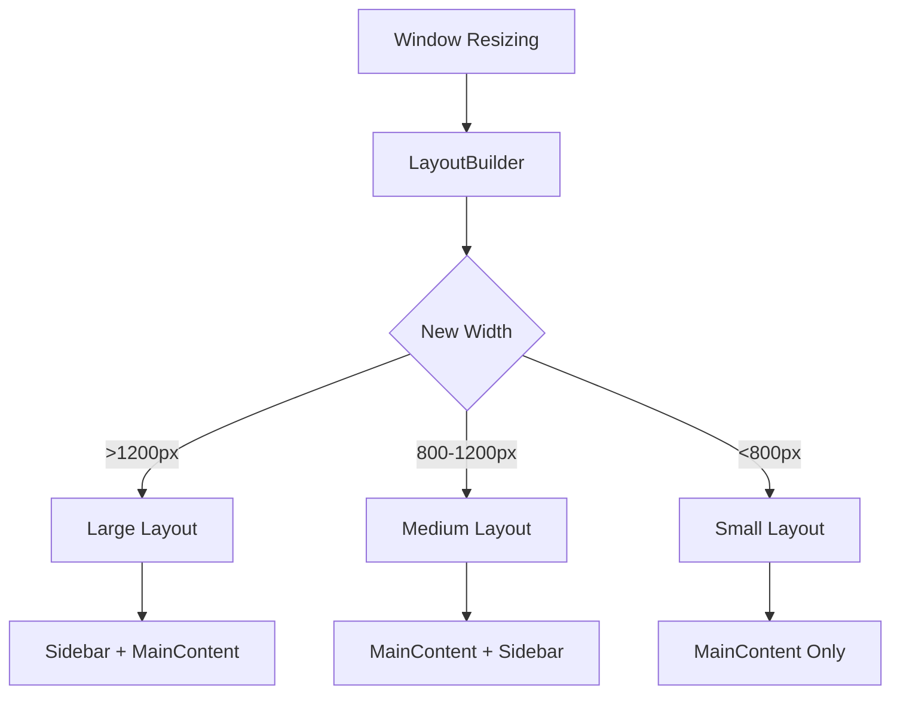

## 4.4.3 Window Resizing and Constraints

As Flutter developers, we often focus on building applications for mobile devices. However, Flutter's versatility extends to web and desktop platforms, where window resizing becomes a critical aspect of user interaction. Unlike mobile apps, where screen size is relatively fixed, desktop and web applications must gracefully handle dynamic window sizes. This section delves into the techniques and best practices for managing window resizing and constraints in Flutter, ensuring that your applications remain responsive and user-friendly across all platforms.

### Handling Dynamic Window Sizes

In desktop and web environments, users frequently resize application windows. This dynamic resizing requires our applications to adjust their layouts in real-time, maintaining usability and aesthetic appeal. The challenge lies in creating a flexible UI that adapts to various screen dimensions without compromising functionality or design integrity.

#### Key Considerations for Dynamic Resizing

- **User Experience:** Ensure that resizing does not disrupt the user's workflow. Elements should remain accessible and readable.
- **Performance:** Efficiently manage layout changes to maintain smooth performance during resizing.
- **Design Consistency:** Maintain a consistent design language across different window sizes, while allowing for necessary layout adjustments.

### Implementing Responsive Layouts for Resizing

Flutter provides powerful tools to create responsive layouts that adapt to window size changes. Two essential tools in this regard are `LayoutBuilder` and `MediaQuery`.

#### Using LayoutBuilder

`LayoutBuilder` is a widget that builds itself based on the constraints it receives from its parent. It is particularly useful for creating adaptive layouts that respond to changes in available space.

```dart
Widget build(BuildContext context) {
  return Scaffold(
    appBar: AppBar(title: Text('Window Resizing Example')),
    body: LayoutBuilder(
      builder: (context, constraints) {
        if (constraints.maxWidth > 1200) {
          return Row(
            children: [
              Expanded(child: Sidebar()),
              Expanded(flex: 3, child: MainContent()),
            ],
          );
        } else if (constraints.maxWidth > 800) {
          return Column(
            children: [
              MainContent(),
              Sidebar(),
            ],
          );
        } else {
          return MainContent();
        }
      },
    ),
  );
}

class Sidebar extends StatelessWidget {
  @override
  Widget build(BuildContext context) {
    return Container(
      color: Colors.blueGrey,
      child: ListView(
        children: [
          ListTile(title: Text('Dashboard')),
          ListTile(title: Text('Settings')),
          ListTile(title: Text('Profile')),
        ],
      ),
    );
  }
}

class MainContent extends StatelessWidget {
  @override
  Widget build(BuildContext context) {
    return Container(
      padding: EdgeInsets.all(16.0),
      child: Text('Main Content Area', style: TextStyle(fontSize: 24)),
    );
  }
}
```

In this example, `LayoutBuilder` dynamically adjusts the layout based on the window's width. For large screens, it uses a `Row` to display a sidebar alongside the main content. For medium screens, it switches to a `Column` layout, stacking the main content and sidebar. On smaller screens, it displays only the main content.

#### Using MediaQuery

`MediaQuery` provides information about the size and orientation of the current screen, allowing you to make responsive decisions based on the device's characteristics.

```dart
Widget build(BuildContext context) {
  var screenWidth = MediaQuery.of(context).size.width;

  if (screenWidth > 1200) {
    // Large screen layout
  } else if (screenWidth > 800) {
    // Medium screen layout
  } else {
    // Small screen layout
  }
}
```

`MediaQuery` is particularly useful for obtaining screen dimensions and other properties, such as pixel density and text scaling factors, which can inform your layout decisions.

### Managing Constraints

Constraints in Flutter define the minimum and maximum size that a widget can occupy. Properly managing these constraints is crucial to ensure that UI elements maintain their proportions and usability during resizing.

#### Applying Constraints

Using `BoxConstraints`, you can specify the range of sizes a widget can take. This is particularly useful for maintaining consistent element sizes across different layouts.

```dart
Widget build(BuildContext context) {
  return Scaffold(
    appBar: AppBar(title: Text('Constraints Example')),
    body: Center(
      child: ConstrainedBox(
        constraints: BoxConstraints(
          minWidth: 200,
          maxWidth: 400,
          minHeight: 100,
          maxHeight: 300,
        ),
        child: Container(
          color: Colors.green,
          child: Center(child: Text('Constrained Box')),
        ),
      ),
    ),
  );
}
```

In this example, the `ConstrainedBox` ensures that the contained widget remains within specified size limits, regardless of the window's dimensions.

### Best Practices for Window Resizing

- **Flexible Sizing:** Use relative units like percentages and flexible widgets such as `Expanded` and `Flexible` to allow UI elements to adapt seamlessly to new sizes.
- **Maintain Usability:** Ensure that resizing does not compromise the usability of interactive elements or the readability of content. Test your layouts at various sizes to ensure a consistent experience.
- **Consistent Layouts:** Strive for consistency across different window sizes while allowing necessary adjustments to enhance user experience.

### Mermaid.js Diagram: Window Resizing Handling



This diagram illustrates the decision-making process within the `LayoutBuilder`, showcasing how different layouts are selected based on the window's width.

### Conclusion

Handling window resizing and constraints is a crucial aspect of developing responsive Flutter applications for web and desktop platforms. By leveraging tools like `LayoutBuilder` and `MediaQuery`, and applying constraints effectively, you can create dynamic UIs that adapt seamlessly to changing window sizes. Remember to prioritize usability and design consistency, ensuring that your applications provide an excellent user experience across all devices.

For further exploration, consider diving into Flutter's official documentation on [responsive design](https://flutter.dev/docs/development/ui/layout/responsive) and experimenting with different layout strategies to find what works best for your projects.

## Quiz Time!



### What is the primary purpose of using `LayoutBuilder` in Flutter?

- [x] To build widgets based on the constraints provided by the parent
- [ ] To manage state changes in the application
- [ ] To handle network requests
- [ ] To create animations

> **Explanation:** `LayoutBuilder` is used to build widgets based on the constraints provided by the parent, allowing for responsive layout adjustments.

### How does `MediaQuery` help in responsive design?

- [x] It provides information about the size and orientation of the current screen
- [ ] It manages the application's state
- [ ] It handles user input events
- [ ] It creates animations

> **Explanation:** `MediaQuery` provides information about the size and orientation of the current screen, which is essential for making responsive design decisions.

### What is a key benefit of using `ConstrainedBox` in Flutter?

- [x] It allows you to specify minimum and maximum sizes for a widget
- [ ] It automatically animates widgets
- [ ] It handles network requests
- [ ] It manages application state

> **Explanation:** `ConstrainedBox` allows you to specify minimum and maximum sizes for a widget, ensuring consistent sizing across different layouts.

### Which widget would you use to create a flexible layout that adapts to available space?

- [x] Expanded
- [ ] ListView
- [ ] GestureDetector
- [ ] StreamBuilder

> **Explanation:** `Expanded` is used to create flexible layouts that adapt to the available space within a `Row` or `Column`.

### What is the role of `BoxConstraints` in Flutter?

- [x] To define the minimum and maximum size a widget can occupy
- [ ] To handle user input
- [ ] To manage animations
- [ ] To create network requests

> **Explanation:** `BoxConstraints` define the minimum and maximum size a widget can occupy, crucial for maintaining layout consistency.

### Why is it important to maintain usability during window resizing?

- [x] To ensure interactive elements remain accessible and readable
- [ ] To increase application performance
- [ ] To handle network requests efficiently
- [ ] To manage application state

> **Explanation:** Maintaining usability during window resizing ensures that interactive elements remain accessible and readable, providing a good user experience.

### What is a common practice to ensure consistent layouts across different window sizes?

- [x] Use relative units and flexible widgets
- [ ] Hardcode pixel values
- [ ] Ignore small screen sizes
- [ ] Use only fixed layouts

> **Explanation:** Using relative units and flexible widgets ensures consistent layouts across different window sizes by allowing elements to adapt to available space.

### What does the `Expanded` widget do in a `Row` or `Column`?

- [x] It takes up the remaining available space
- [ ] It creates a new screen
- [ ] It handles user input
- [ ] It manages state

> **Explanation:** The `Expanded` widget takes up the remaining available space within a `Row` or `Column`, making it ideal for flexible layouts.

### How can you ensure that resizing does not compromise the usability of your application?

- [x] Test layouts at various sizes and prioritize usability
- [ ] Use fixed pixel values for all elements
- [ ] Ignore user feedback
- [ ] Focus only on large screen sizes

> **Explanation:** Testing layouts at various sizes and prioritizing usability ensures that resizing does not compromise the application's usability.

### True or False: `MediaQuery` can be used to obtain the current screen's pixel density.

- [x] True
- [ ] False

> **Explanation:** `MediaQuery` provides information about the current screen's pixel density, which can be used for responsive design decisions.


