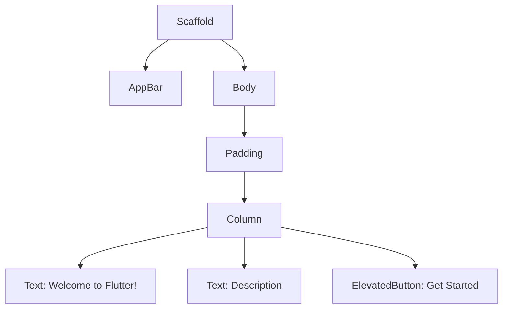

## 5.1.1 When to Use Single-Column Layouts

In the realm of mobile application design, single-column layouts have emerged as a fundamental pattern, particularly for devices with narrow screens such as smartphones. This section delves into the purpose, advantages, best practices, and implementation of single-column layouts in Flutter, providing you with the insights and tools necessary to create effective and user-friendly mobile interfaces.

### Purpose and Scope

**Single-Column Layouts Defined:**

A single-column layout is a design pattern where content is arranged in a vertical sequence, one item after another. This approach is particularly effective for mobile devices, where screen real estate is limited, and users interact with content primarily through scrolling. The single-column layout ensures that content is presented in a linear and easily digestible format, enhancing the user experience by reducing complexity and improving focus.

**Significance in Mobile Design:**

Single-column layouts are especially beneficial for smartphones due to their narrow screens. By presenting content in a single, uninterrupted flow, these layouts accommodate the natural scrolling behavior of users, making navigation intuitive and seamless. This design pattern is not only about fitting content on a small screen but also about prioritizing information and guiding users through a coherent narrative.

### Advantages

**Simplicity and Clarity:**

One of the primary advantages of single-column layouts is their simplicity. By eliminating the need for users to navigate multiple columns, these layouts offer a straightforward and uncluttered user experience. This simplicity translates to clarity, as users can focus on one piece of content at a time without being distracted by adjacent columns.

**Improved Readability:**

Single-column layouts enhance readability by presenting content in a linear fashion. This format is akin to reading a book or scrolling through a social media feed, where the eye naturally moves from top to bottom. By limiting the width of text blocks, single-column layouts prevent the eye from having to travel long distances horizontally, reducing strain and improving comprehension.

**Easier Maintenance:**

From a development perspective, single-column layouts are easier to maintain. With a single flow of content, updates and scalability become more manageable. Developers can focus on optimizing the vertical arrangement of elements without worrying about the complexities introduced by multiple columns.

### Best Practices

**Content Hierarchy:**

Organizing content in a logical and prioritized manner is crucial in single-column layouts. Use headings, subheadings, and visual cues to guide users through the content. Prioritize important information at the top, and use a clear hierarchy to ensure that users can quickly find what they need.

**Whitespace Utilization:**

Whitespace, or negative space, is a powerful tool in single-column layouts. It helps prevent clutter and enhances focus by giving elements room to breathe. Adequate spacing between elements can significantly improve the overall aesthetic and usability of the interface.

**Optimizing Touch Targets:**

In mobile design, ensuring that interactive elements are adequately sized for touch interactions is essential. Buttons, links, and other touch targets should be large enough to be easily tapped without causing frustration. This consideration is particularly important in single-column layouts, where elements are often stacked closely together.

**Accessibility Considerations:**

Accessibility should be a priority in any design. Use appropriate font sizes and contrast ratios to ensure readability for all users, including those with visual impairments. Implement features such as screen reader support and focus indicators to enhance the accessibility of your application.

### Implementation Guidance

**Code Examples:**

Below is a basic example of implementing a single-column layout in Flutter using the `Column` widget. This example demonstrates how to structure a simple vertical layout with text and buttons.

```dart
import 'package:flutter/material.dart';

void main() => runApp(MyApp());

class MyApp extends StatelessWidget {
  @override
  Widget build(BuildContext context) {
    return MaterialApp(
      home: Scaffold(
        appBar: AppBar(
          title: Text('Single-Column Layout Example'),
        ),
        body: SingleColumnLayout(),
      ),
    );
  }
}

class SingleColumnLayout extends StatelessWidget {
  @override
  Widget build(BuildContext context) {
    return Padding(
      padding: const EdgeInsets.all(16.0),
      child: Column(
        crossAxisAlignment: CrossAxisAlignment.start,
        children: [
          Text(
            'Welcome to Flutter!',
            style: Theme.of(context).textTheme.headline4,
          ),
          SizedBox(height: 20),
          Text(
            'This is a simple example of a single-column layout. '
            'Single-column layouts are ideal for mobile screens as they provide a clean and focused user experience.',
          ),
          SizedBox(height: 20),
          ElevatedButton(
            onPressed: () {
              // Button action
            },
            child: Text('Get Started'),
          ),
        ],
      ),
    );
  }
}
```

**Mermaid.js Diagrams:**

To visualize the widget hierarchy of the above layout, consider the following Mermaid.js diagram:



This diagram illustrates the hierarchical structure of the widgets used in the single-column layout, highlighting the linear flow of content.

### Examples and Case Studies

**Popular Applications:**

Many popular applications effectively utilize single-column layouts to enhance user experience. For instance, social media apps like Instagram and Twitter use single-column feeds to present content in a continuous scroll, allowing users to focus on one post at a time.

**Screenshots and Code Snippets:**

Consider the following screenshot of a hypothetical news app that uses a single-column layout to display articles:


The layout is implemented using a `ListView` to allow for efficient scrolling of a large number of articles.

```dart
ListView.builder(
  itemCount: articles.length,
  itemBuilder: (context, index) {
    return ListTile(
      title: Text(articles[index].title),
      subtitle: Text(articles[index].summary),
      onTap: () {
        // Navigate to article details
      },
    );
  },
)
```

### Common Pitfalls

**Overloading with Content:**

A common mistake in single-column layouts is overloading the column with too much information. This can overwhelm users and make navigation difficult. To avoid this, prioritize content and consider using expandable sections or pagination to manage large amounts of information.

**Ignoring Responsiveness:**

While single-column layouts are inherently suited for narrow screens, it's important to ensure they adapt well to different screen sizes and orientations. Use responsive design techniques to adjust padding, font sizes, and element spacing based on the device's characteristics.

### Conclusion

Single-column layouts are a powerful tool in mobile design, offering simplicity, clarity, and improved readability. By following best practices and considering accessibility, developers can create intuitive and user-friendly interfaces. The provided code examples and diagrams serve as a starting point for implementing effective single-column layouts in Flutter. As you apply these concepts to your projects, remember to prioritize content hierarchy, utilize whitespace effectively, and ensure responsiveness across devices.

## Quiz Time!



### What is a single-column layout?

- [x] A design pattern where content is arranged in a vertical sequence, one item after another.
- [ ] A design pattern where content is arranged in multiple columns side by side.
- [ ] A design pattern that only uses images and no text.
- [ ] A design pattern that is only used for desktop applications.

> **Explanation:** A single-column layout arranges content in a vertical sequence, making it ideal for narrow screens like smartphones.

### Why are single-column layouts particularly effective on smartphones?

- [x] They accommodate the natural scrolling behavior of users.
- [ ] They allow for more complex navigation patterns.
- [ ] They require less coding effort.
- [ ] They are only used for displaying images.

> **Explanation:** Single-column layouts accommodate the natural scrolling behavior of users, making navigation intuitive and seamless on smartphones.

### What is a key advantage of single-column layouts?

- [x] Improved readability by presenting content in a linear fashion.
- [ ] They allow for more advertisements on the screen.
- [ ] They make the app run faster.
- [ ] They are easier to design than multi-column layouts.

> **Explanation:** Single-column layouts improve readability by presenting content in a linear fashion, similar to reading a book or scrolling through a social media feed.

### How can whitespace be effectively used in single-column layouts?

- [x] To prevent clutter and enhance focus by giving elements room to breathe.
- [ ] To fill up space that would otherwise be empty.
- [ ] To add more content to the layout.
- [ ] To reduce the size of the app.

> **Explanation:** Whitespace is used to prevent clutter and enhance focus by giving elements room to breathe, improving the overall aesthetic and usability.

### What should be considered to optimize touch targets in single-column layouts?

- [x] Ensure that interactive elements are adequately sized for touch interactions.
- [ ] Make all elements the same size.
- [ ] Use only text links for navigation.
- [ ] Avoid using buttons altogether.

> **Explanation:** Interactive elements should be adequately sized for touch interactions to prevent user frustration and ensure usability.

### What is a common pitfall when using single-column layouts?

- [x] Overloading the column with too much information.
- [ ] Using too much whitespace.
- [ ] Making buttons too large.
- [ ] Using too many colors.

> **Explanation:** Overloading the column with too much information can overwhelm users and make navigation difficult.

### How can single-column layouts be adapted for different screen sizes?

- [x] Use responsive design techniques to adjust padding, font sizes, and element spacing.
- [ ] Use the same layout for all devices.
- [ ] Avoid using images.
- [ ] Only use text content.

> **Explanation:** Responsive design techniques should be used to adjust padding, font sizes, and element spacing based on the device's characteristics.

### What is the role of content hierarchy in single-column layouts?

- [x] To organize content in a logical and prioritized manner.
- [ ] To make all content the same importance.
- [ ] To hide less important content.
- [ ] To use more images than text.

> **Explanation:** Content hierarchy is important to organize content in a logical and prioritized manner, guiding users through the content effectively.

### Which widget is commonly used for implementing single-column layouts in Flutter?

- [x] Column
- [ ] Row
- [ ] GridView
- [ ] Stack

> **Explanation:** The `Column` widget is commonly used for implementing single-column layouts in Flutter, arranging content vertically.

### True or False: Single-column layouts are only suitable for mobile applications.

- [ ] True
- [x] False

> **Explanation:** While single-column layouts are particularly effective for mobile applications, they can also be used in other contexts where a linear flow of content is desired.


