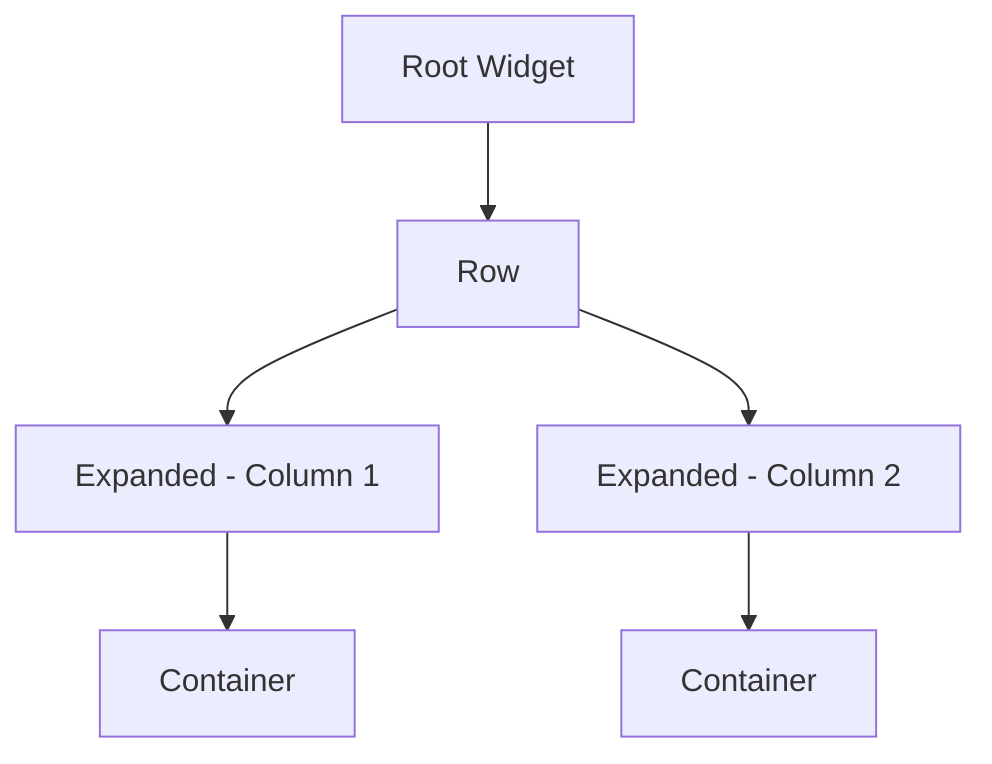

## 5.1.2 Implementing Multi-Column Interfaces

As mobile applications increasingly target a wide array of devices, from compact smartphones to expansive desktop monitors, the ability to adapt user interfaces to different screen sizes becomes crucial. Multi-column layouts are a powerful tool in this adaptation process, offering a way to organize content efficiently on larger screens such as tablets and desktops. In this section, we will delve into the implementation of multi-column interfaces in Flutter, exploring their benefits, key widgets, design considerations, and common pitfalls.

### Purpose and Scope

Multi-column layouts divide the screen into multiple vertical sections, allowing for a more organized presentation of content. This technique is particularly useful on larger screens where a single-column layout might lead to wasted space and a less engaging user experience. By leveraging multi-column layouts, developers can enhance information density, improve navigation, and increase content visibility.

#### Benefits of Multi-Column Layouts

- **Enhanced Organization:** Multi-column layouts allow developers to logically separate different types of content, making it easier for users to find and interact with the information they need.
  
- **Improved Navigation:** By incorporating navigation elements such as sidebars or navigation rails alongside content, multi-column layouts facilitate easier access to different sections of an application.

- **Increased Content Visibility:** With more screen real estate available, developers can display more information simultaneously without overwhelming the user, leading to a more efficient and pleasant user experience.

### Flutter Widgets and Techniques

Flutter provides a rich set of widgets and tools to create multi-column layouts that are both responsive and adaptive. Key widgets such as `Row`, `Column`, `Expanded`, and `Flex` play a crucial role in building these interfaces.

#### Key Widgets

- **Row and Column:** These foundational widgets allow for horizontal and vertical alignment of child widgets, respectively. They are essential for creating basic multi-column layouts.

- **Expanded:** This widget helps distribute available space among children of a Row or Column, ensuring that each column is proportionally sized.

- **Flex:** A more flexible widget that can be used to create both horizontal and vertical layouts, offering greater control over the distribution of space.

#### Adaptive Layouts

To ensure that multi-column layouts adapt gracefully to different screen sizes, Flutter offers tools like `LayoutBuilder` and `MediaQuery`.

- **LayoutBuilder:** This widget provides the current constraints of its parent, allowing developers to adjust the layout dynamically based on available space.

- **MediaQuery:** This tool gives access to the device's screen dimensions and orientation, enabling responsive adjustments to the UI.

### Step-by-Step Implementation

Let's walk through the implementation of a basic multi-column layout in Flutter, followed by responsive adjustments for smaller screens.

#### Basic Multi-Column Layout

Below is a simple example of a two-column layout using Flutter:

```dart
import 'package:flutter/material.dart';

void main() => runApp(MyApp());

class MyApp extends StatelessWidget {
  @override
  Widget build(BuildContext context) {
    return MaterialApp(
      home: Scaffold(
        appBar: AppBar(title: Text('Multi-Column Layout')),
        body: Row(
          children: <Widget>[
            Expanded(
              child: Container(
                color: Colors.blue,
                child: Center(child: Text('Column 1')),
              ),
            ),
            Expanded(
              child: Container(
                color: Colors.green,
                child: Center(child: Text('Column 2')),
              ),
            ),
          ],
        ),
      ),
    );
  }
}
```

In this example, we use a `Row` widget to create a horizontal layout, with two `Expanded` widgets ensuring that each column takes up equal space.

#### Responsive Adjustments

To make this layout responsive, we can use `LayoutBuilder` to switch to a single-column layout on smaller screens:

```dart
import 'package:flutter/material.dart';

void main() => runApp(MyApp());

class MyApp extends StatelessWidget {
  @override
  Widget build(BuildContext context) {
    return MaterialApp(
      home: Scaffold(
        appBar: AppBar(title: Text('Responsive Multi-Column Layout')),
        body: LayoutBuilder(
          builder: (context, constraints) {
            if (constraints.maxWidth > 600) {
              // Two-column layout for larger screens
              return Row(
                children: <Widget>[
                  Expanded(
                    child: Container(
                      color: Colors.blue,
                      child: Center(child: Text('Column 1')),
                    ),
                  ),
                  Expanded(
                    child: Container(
                      color: Colors.green,
                      child: Center(child: Text('Column 2')),
                    ),
                  ),
                ],
              );
            } else {
              // Single-column layout for smaller screens
              return Column(
                children: <Widget>[
                  Container(
                    color: Colors.blue,
                    child: Center(child: Text('Column 1')),
                  ),
                  Container(
                    color: Colors.green,
                    child: Center(child: Text('Column 2')),
                  ),
                ],
              );
            }
          },
        ),
      ),
    );
  }
}
```

In this code, `LayoutBuilder` checks the available width and switches between a `Row` and a `Column` layout accordingly.

#### Mermaid.js Diagrams

To better understand the relationship between widgets in a multi-column setup, consider the following diagram:



This diagram illustrates the hierarchical structure of the multi-column layout, with a `Row` widget containing two `Expanded` widgets, each housing a `Container`.

### Design Considerations

When designing multi-column interfaces, several factors should be taken into account to ensure a cohesive and user-friendly experience.

#### Visual Balance

Ensure that columns are balanced in terms of content and spacing. Avoid overcrowding one column while leaving another sparse, as this can lead to a visually unappealing layout.

#### Alignment and Consistency

Maintain consistent alignment across columns to provide a cohesive look. This includes aligning text, images, and other elements uniformly.

#### Handling Varying Content Lengths

Content length can vary significantly between columns. Consider using scrollable widgets or adjusting the layout dynamically to accommodate longer content without disrupting the overall design.

### Examples and Case Studies

Let's explore some real-world applications that effectively utilize multi-column layouts.

#### Example: News Application

A news application might use a multi-column layout to display headlines in one column and detailed articles in another. This allows users to quickly scan headlines while having the option to delve deeper into specific articles.

```dart
// Example code snippet for a news application layout
```

#### Case Study: E-commerce Platform

An e-commerce platform could employ a multi-column layout to showcase product categories on one side and featured products on the other, enhancing the shopping experience by making navigation intuitive and content accessible.

```dart
// Example code snippet for an e-commerce platform layout
```

### Common Pitfalls

While multi-column layouts offer numerous benefits, they also come with potential challenges.

#### Complexity in Maintenance

Overly complex multi-column layouts can become difficult to maintain, especially as the application grows. Keep the layout as simple as possible and document the structure thoroughly.

#### Performance Issues

Deeply nested widget trees can lead to performance degradation. Use profiling tools to monitor performance and refactor the layout as needed to ensure smooth operation.

### Conclusion

Implementing multi-column interfaces in Flutter can significantly enhance the user experience on larger screens by improving organization, navigation, and content visibility. By leveraging key widgets and adaptive techniques, developers can create responsive layouts that adjust seamlessly to different devices. However, it's essential to consider design balance, alignment, and potential pitfalls to maintain a high-quality user interface.

### References and Further Reading

- [Flutter Documentation](https://flutter.dev/docs)
- [Responsive Design in Flutter](https://flutter.dev/docs/development/ui/layout/responsive)
- [Material Design Guidelines](https://material.io/design)

## Quiz Time!



### What is a primary benefit of using multi-column layouts on larger screens?

- [x] Enhanced organization of content
- [ ] Reduced complexity of the UI
- [ ] Improved performance on all devices
- [ ] Simplified navigation for mobile users

> **Explanation:** Multi-column layouts enhance the organization of content by logically separating different types of information, making it easier for users to navigate and interact with the application.

### Which Flutter widget is essential for creating a basic horizontal multi-column layout?

- [x] Row
- [ ] Column
- [ ] Stack
- [ ] Container

> **Explanation:** The `Row` widget is used to create horizontal layouts, making it essential for implementing multi-column interfaces.

### How can you make a multi-column layout responsive to different screen sizes?

- [x] Use LayoutBuilder and MediaQuery
- [ ] Only use the Column widget
- [ ] Avoid using Expanded widgets
- [ ] Use fixed pixel values for widths

> **Explanation:** `LayoutBuilder` and `MediaQuery` allow developers to adjust layouts dynamically based on the screen size, making multi-column layouts responsive.

### What is a common pitfall when implementing multi-column layouts?

- [x] Complexity in maintenance
- [ ] Lack of available widgets
- [ ] Inability to handle user input
- [ ] Limited design options

> **Explanation:** Multi-column layouts can become complex and difficult to maintain, especially if not designed with scalability in mind.

### What is the role of the Expanded widget in a multi-column layout?

- [x] It distributes available space among children
- [ ] It aligns widgets to the center
- [ ] It stacks widgets vertically
- [ ] It provides padding between widgets

> **Explanation:** The `Expanded` widget helps distribute available space among children of a `Row` or `Column`, ensuring proportional sizing.

### Which tool helps in accessing the device's screen dimensions and orientation in Flutter?

- [x] MediaQuery
- [ ] LayoutBuilder
- [ ] Flex
- [ ] Expanded

> **Explanation:** `MediaQuery` provides access to the device's screen dimensions and orientation, aiding in responsive design.

### Why is it important to maintain consistent alignment across columns?

- [x] To provide a cohesive look
- [ ] To reduce code complexity
- [ ] To improve application performance
- [ ] To simplify navigation logic

> **Explanation:** Consistent alignment across columns ensures a cohesive look, enhancing the visual appeal and usability of the interface.

### What is a potential performance issue with deeply nested widget trees?

- [x] Performance degradation
- [ ] Increased code readability
- [ ] Simplified layout logic
- [ ] Enhanced user interaction

> **Explanation:** Deeply nested widget trees can lead to performance degradation, making it important to monitor and optimize the layout.

### How can varying content lengths be managed in a multi-column layout?

- [x] Use scrollable widgets or dynamic layout adjustments
- [ ] Fix the height of all columns
- [ ] Avoid using columns altogether
- [ ] Use only static content

> **Explanation:** Managing varying content lengths can be achieved by using scrollable widgets or adjusting the layout dynamically to accommodate longer content.

### True or False: Multi-column layouts are only beneficial for desktop applications.

- [ ] True
- [x] False

> **Explanation:** Multi-column layouts are beneficial for any larger screen, including tablets and desktops, not just desktop applications.


