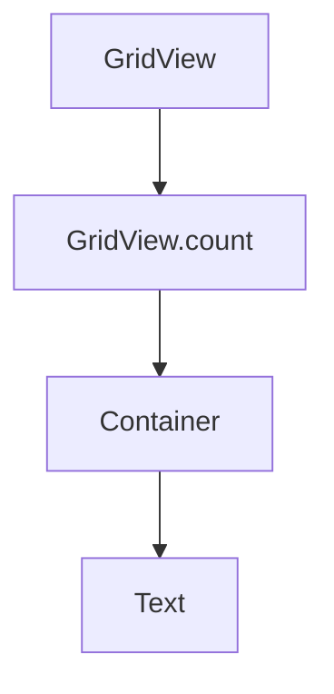

## 5.1.3 Grid Systems in Flutter

Grid systems are a fundamental aspect of modern UI design, providing a structured and uniform way to organize content. In Flutter, grid layouts offer a flexible approach to arrange widgets in a grid-like structure, making them ideal for creating visually appealing and responsive interfaces. This section delves into the intricacies of grid systems in Flutter, exploring their implementation, customization, and optimization for responsive design.

### Introduction to Grid Systems

Grid systems are used to create structured layouts by dividing a page into a series of rows and columns. This approach allows for a consistent alignment of elements, enhancing the visual harmony and readability of the interface. Unlike single-column or multi-column layouts, grid systems offer a more versatile framework for organizing content, particularly when dealing with complex or dynamic data sets.

**Benefits of Grid Layouts:**
- **Consistency:** Ensures uniformity in spacing and alignment across the interface.
- **Flexibility:** Adapts to various screen sizes and orientations, providing a responsive design.
- **Scalability:** Easily accommodates additional content without disrupting the overall layout.
- **Visual Appeal:** Enhances the aesthetic quality of the UI through structured organization.

### Using `GridView`

The `GridView` widget in Flutter is a powerful tool for implementing grid layouts. It comes in several variants, each catering to different use cases and performance needs.

#### Overview of `GridView` Variants

- **`GridView.count`:** Allows for a fixed number of tiles in the cross axis, making it easy to create simple grid layouts.
- **`GridView.builder`:** Provides a more efficient way to build grids with a large number of items by lazily building child widgets.
- **`GridView.custom`:** Offers the most flexibility, allowing for custom grid layouts using a `SliverGridDelegate`.

#### Basic Implementation with `GridView.count`

Here's a basic example of using `GridView.count` to create a simple grid layout:

```dart
import 'package:flutter/material.dart';

void main() => runApp(MyApp());

class MyApp extends StatelessWidget {
  @override
  Widget build(BuildContext context) {
    return MaterialApp(
      home: Scaffold(
        appBar: AppBar(title: Text('GridView Example')),
        body: GridView.count(
          crossAxisCount: 2,
          crossAxisSpacing: 10.0,
          mainAxisSpacing: 10.0,
          padding: EdgeInsets.all(10.0),
          children: List.generate(20, (index) {
            return Container(
              decoration: BoxDecoration(
                color: Colors.blue,
                borderRadius: BorderRadius.circular(8.0),
              ),
              child: Center(
                child: Text(
                  'Item $index',
                  style: TextStyle(color: Colors.white),
                ),
              ),
            );
          }),
        ),
      ),
    );
  }
}
```

In this example, `GridView.count` is used to create a grid with two columns. Each item is a simple container with a blue background and white text.

#### Mermaid.js Diagrams

To visualize the grid structure and widget hierarchy, we can use a Mermaid.js diagram:



### Custom Grids

For more complex grid layouts, Flutter provides the `SliverGrid` widget, which allows for advanced customization and performance optimization.

#### Advanced Grid Structures with `SliverGrid`

`SliverGrid` is part of Flutter's sliver family, which is designed for creating scrollable areas with custom layouts. It offers more control over the grid's behavior and appearance.

#### Custom Grid Delegates

To define unique grid behaviors, you can create custom `SliverGridDelegate` classes. Here's an example of a custom grid configuration:

```dart
import 'package:flutter/material.dart';

class CustomGridDelegate extends SliverGridDelegate {
  @override
  SliverGridLayout getLayout(SliverConstraints constraints) {
    return SliverGridRegularTileLayout(
      crossAxisCount: 3,
      mainAxisStride: 150.0,
      crossAxisStride: 150.0,
      childMainAxisExtent: 100.0,
      childCrossAxisExtent: 100.0,
      reverseCrossAxis: false,
    );
  }

  @override
  bool shouldRelayout(SliverGridDelegate oldDelegate) {
    return false;
  }
}
```

In this example, `CustomGridDelegate` defines a grid with three columns and specific item dimensions.

### Responsive Grid Design

Creating responsive grid layouts involves adjusting the number of columns and item sizes based on the screen size and orientation.

#### Dynamic Column Counts

Using `MediaQuery` and `LayoutBuilder`, you can dynamically adjust the number of columns in a grid:

```dart
import 'package:flutter/material.dart';

class ResponsiveGrid extends StatelessWidget {
  @override
  Widget build(BuildContext context) {
    return LayoutBuilder(
      builder: (context, constraints) {
        int columns = constraints.maxWidth > 600 ? 4 : 2;
        return GridView.builder(
          gridDelegate: SliverGridDelegateWithFixedCrossAxisCount(
            crossAxisCount: columns,
            crossAxisSpacing: 10.0,
            mainAxisSpacing: 10.0,
          ),
          itemBuilder: (context, index) {
            return Container(
              color: Colors.teal,
              child: Center(child: Text('Item $index')),
            );
          },
        );
      },
    );
  }
}
```

In this example, the number of columns changes based on the screen width, providing a responsive layout.

#### Adaptive Item Sizes

To make grid items resize or rearrange dynamically, consider using flexible widgets and percentage-based dimensions.

### Styling and Theming

Consistent styling and theming are crucial for maintaining a cohesive appearance across grid items.

#### Consistent Spacing and Dimensions

Use properties like `crossAxisSpacing` and `mainAxisSpacing` to ensure uniform spacing between grid items. Additionally, maintain consistent item dimensions for visual harmony.

#### Theming Considerations

Apply global themes to grid items to ensure they align with the overall design language of your application.

### Performance Considerations

Efficient rendering and state management are vital for maintaining performance in grid layouts.

#### Lazy Loading with `GridView.builder`

`GridView.builder` is ideal for efficiently rendering large data sets by lazily building child widgets as they are scrolled into view.

#### Avoiding Rebuilds

Implement `const` constructors and efficient state management to minimize unnecessary widget rebuilds, enhancing performance.

### Examples and Case Studies

Explore Flutter applications that effectively use grid systems for content display. Analyze their grid implementations, highlighting best practices and design choices.

### Common Pitfalls

Avoid overcomplicating grid structures, which can hinder readability and performance. Ensure grids adapt smoothly to various screen sizes to maintain responsiveness.

---

## Quiz Time!



### What is a primary benefit of using grid systems in UI design?

- [x] Consistency in layout
- [ ] Complexity in design
- [ ] Increased loading times
- [ ] Limited flexibility

> **Explanation:** Grid systems provide consistency in layout, ensuring uniformity in spacing and alignment across the interface.

### Which `GridView` variant is best for efficiently rendering large data sets?

- [ ] GridView.count
- [x] GridView.builder
- [ ] GridView.custom
- [ ] GridView.extent

> **Explanation:** `GridView.builder` is designed for efficiently rendering large data sets by lazily building child widgets.

### What does the `crossAxisCount` property in `GridView.count` specify?

- [x] The number of columns in the grid
- [ ] The number of rows in the grid
- [ ] The spacing between grid items
- [ ] The size of each grid item

> **Explanation:** The `crossAxisCount` property specifies the number of columns in the grid.

### How can you dynamically adjust the number of columns in a grid based on screen size?

- [x] Using `MediaQuery` and `LayoutBuilder`
- [ ] Using `GridView.count`
- [ ] Using `SliverGridDelegate`
- [ ] Using `GridView.custom`

> **Explanation:** `MediaQuery` and `LayoutBuilder` can be used to dynamically adjust the number of columns based on screen size.

### What is a common pitfall when designing grid layouts?

- [x] Overcomplicating grid structures
- [ ] Using consistent spacing
- [ ] Applying global themes
- [ ] Ensuring responsiveness

> **Explanation:** Overcomplicating grid structures can hinder readability and performance.

### Which property ensures uniform spacing between grid items?

- [x] `crossAxisSpacing` and `mainAxisSpacing`
- [ ] `crossAxisCount`
- [ ] `childAspectRatio`
- [ ] `padding`

> **Explanation:** `crossAxisSpacing` and `mainAxisSpacing` ensure uniform spacing between grid items.

### What is the role of `SliverGridDelegate` in custom grids?

- [x] To define unique grid behaviors
- [ ] To specify the number of grid items
- [ ] To apply themes to grid items
- [ ] To manage grid item animations

> **Explanation:** `SliverGridDelegate` is used to define unique grid behaviors in custom grids.

### How can you maintain consistent dimensions for grid items?

- [x] By using fixed dimensions or aspect ratios
- [ ] By varying item sizes randomly
- [ ] By ignoring spacing properties
- [ ] By using `GridView.custom`

> **Explanation:** Maintaining fixed dimensions or aspect ratios ensures consistent dimensions for grid items.

### Why is `GridView.builder` preferred for large data sets?

- [x] It lazily builds child widgets
- [ ] It uses fixed item sizes
- [ ] It requires less code
- [ ] It automatically applies themes

> **Explanation:** `GridView.builder` is preferred for large data sets because it lazily builds child widgets as they are scrolled into view.

### True or False: Grid systems are less flexible than single-column layouts.

- [ ] True
- [x] False

> **Explanation:** Grid systems are more flexible than single-column layouts, allowing for structured and adaptive content organization.


