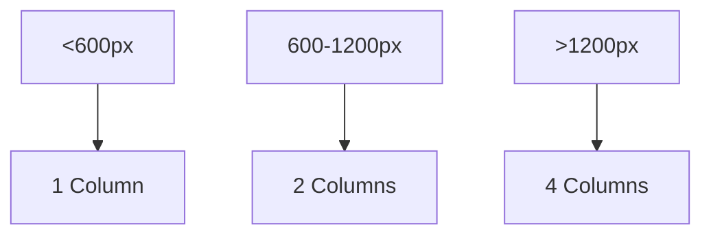

## 5.1.4 Dynamic Column Counts

In the realm of responsive design, dynamic column counts play a pivotal role in ensuring that applications look great and function seamlessly across a wide range of devices and screen sizes. This section delves into the concept of dynamic column counts, their implementation in Flutter, and how they can enhance user experience by adapting to different screen dimensions and orientations.

### Concept Overview

Dynamic column counts refer to the ability of a layout to adjust the number of columns based on the available screen space. This flexibility is crucial in responsive design as it allows applications to provide optimal viewing experiences on devices ranging from small smartphones to large desktop monitors.

- **Importance in Responsive Design:**
  - **Optimized Layouts:** By adjusting the number of columns, you can ensure that content is neither too cramped on smaller screens nor too sparse on larger ones.
  - **Enhanced User Experience:** Dynamic column counts contribute to a more intuitive and visually appealing interface, adapting to the user's device and orientation.
  - **Consistency Across Devices:** Maintaining a consistent look and feel across devices helps in building a cohesive brand experience.

### Implementation Techniques

#### Responsive Widgets

Flutter provides several widgets that facilitate the creation of adaptable column structures:

- **Flexible and Expanded Widgets:** These widgets allow children of a `Row` or `Column` to expand and fill available space, making them ideal for creating responsive layouts.
- **Wrap Widget:** The `Wrap` widget automatically adjusts the number of items per row based on the available space, making it useful for dynamic column layouts.

#### Adaptive Properties

- **GridView's `crossAxisCount`:** This property in `GridView` can be dynamically adjusted to change the number of columns based on screen width.

#### Code Examples

Here is a basic example demonstrating how to use `GridView` with a dynamic `crossAxisCount`:

```dart
import 'package:flutter/material.dart';

class DynamicGridExample extends StatelessWidget {
  @override
  Widget build(BuildContext context) {
    return Scaffold(
      appBar: AppBar(title: Text('Dynamic Column Counts')),
      body: LayoutBuilder(
        builder: (context, constraints) {
          int columnCount = calculateColumnCount(constraints.maxWidth);
          return GridView.builder(
            gridDelegate: SliverGridDelegateWithFixedCrossAxisCount(
              crossAxisCount: columnCount,
              childAspectRatio: 1.0,
            ),
            itemCount: 20,
            itemBuilder: (context, index) {
              return Card(
                color: Colors.blueAccent,
                child: Center(child: Text('Item $index')),
              );
            },
          );
        },
      ),
    );
  }

  int calculateColumnCount(double width) {
    if (width < 600) {
      return 1;
    } else if (width < 1200) {
      return 2;
    } else {
      return 4;
    }
  }
}
```

### Calculating Column Numbers

#### Breakpoint Strategy

Defining breakpoints is essential for determining how many columns should be displayed at different screen widths. A common strategy might include:

- **1 Column:** For screens less than 600 pixels wide.
- **2 Columns:** For screens between 600 and 1200 pixels.
- **4 Columns:** For screens wider than 1200 pixels.

#### Using `MediaQuery`

`MediaQuery` can be used to retrieve screen dimensions and make informed layout decisions:

```dart
int calculateColumnCount(BuildContext context) {
  double width = MediaQuery.of(context).size.width;
  if (width < 600) {
    return 1;
  } else if (width < 1200) {
    return 2;
  } else {
    return 4;
  }
}
```

#### Code Implementation

Incorporate the column calculation logic within a `LayoutBuilder` to dynamically adjust the layout:

```dart
LayoutBuilder(
  builder: (context, constraints) {
    int columnCount = calculateColumnCount(context);
    // Use columnCount in your layout
  },
);
```

### Adaptive Layouts with `LayoutBuilder`

#### Responsive Callbacks

`LayoutBuilder` provides access to parent constraints, allowing you to adjust layouts in real-time based on available space.

#### Conditional Rendering

Implement conditional logic within `LayoutBuilder` to switch between different column configurations:

```dart
LayoutBuilder(
  builder: (context, constraints) {
    int columnCount = calculateColumnCount(constraints.maxWidth);
    return GridView.count(
      crossAxisCount: columnCount,
      children: List.generate(20, (index) {
        return Center(
          child: Text('Item $index'),
        );
      }),
    );
  },
);
```

#### Code Examples

Here's an example where column counts are adjusted dynamically within `LayoutBuilder` callbacks:

```dart
LayoutBuilder(
  builder: (context, constraints) {
    int columnCount = calculateColumnCount(constraints.maxWidth);
    return GridView.builder(
      gridDelegate: SliverGridDelegateWithFixedCrossAxisCount(
        crossAxisCount: columnCount,
        childAspectRatio: 1.0,
      ),
      itemCount: 20,
      itemBuilder: (context, index) {
        return Card(
          color: Colors.blueAccent,
          child: Center(child: Text('Item $index')),
        );
      },
    );
  },
);
```

### User Experience Considerations

#### Consistency Across Devices

Ensure that dynamic column changes do not disrupt the user experience. Consistent layouts help users navigate your app intuitively.

#### Seamless Transitions

Implement smooth transitions when column counts change to maintain visual continuity. This can be achieved using animations or gradual adjustments.

#### Accessibility

Ensure that changes in layout do not negatively impact accessibility features. Consider how screen readers and other assistive technologies will interpret dynamic layouts.

### Implementation Guidance

#### Code Snippets

Include complete Flutter code examples demonstrating dynamic column counts, as shown in previous sections.

#### Mermaid.js Diagrams

Use diagrams to illustrate the layout adjustments at different breakpoints. Here's a simple example of how you might represent this concept:



### Examples and Case Studies

#### Showcase Applications

Applications like Pinterest and Instagram effectively utilize dynamic column counts to adapt their layouts to various screen sizes and orientations.

#### Analysis

These applications handle different screen sizes by dynamically adjusting their grid layouts, ensuring that content is displayed optimally regardless of the device.

### Common Pitfalls

#### Inconsistent Layouts

Avoid layouts that change too drastically between breakpoints, as this can confuse users and disrupt the flow of the application.

#### Performance Overheads

Dynamic layouts can introduce performance issues if not optimized properly. Ensure that layout calculations and updates are efficient to maintain smooth performance.

### Conclusion

Dynamic column counts are a powerful tool in the responsive design toolkit, enabling developers to create adaptable, user-friendly interfaces that work seamlessly across a variety of devices. By leveraging Flutter's robust widget system and responsive capabilities, you can build applications that not only look great but also provide a consistent and enjoyable user experience.

## Quiz Time!



### What is the primary benefit of using dynamic column counts in responsive design?

- [x] Optimizing layouts for different screen sizes
- [ ] Reducing code complexity
- [ ] Increasing application speed
- [ ] Simplifying navigation logic

> **Explanation:** Dynamic column counts allow layouts to adapt to different screen sizes, ensuring content is displayed optimally.

### Which Flutter widget is commonly used to create adaptable column structures?

- [ ] ListView
- [x] GridView
- [ ] Stack
- [ ] Scaffold

> **Explanation:** `GridView` is used to create grid-based layouts where the number of columns can be dynamically adjusted.

### How can you determine the number of columns to display based on screen width?

- [ ] By using a fixed value
- [x] By defining breakpoints and using `MediaQuery`
- [ ] By calculating the number of items
- [ ] By using a random generator

> **Explanation:** Breakpoints and `MediaQuery` allow you to determine the appropriate number of columns based on screen width.

### What is the role of `LayoutBuilder` in dynamic column layouts?

- [ ] To manage state changes
- [x] To provide access to parent constraints for layout adjustments
- [ ] To handle user inputs
- [ ] To render animations

> **Explanation:** `LayoutBuilder` provides access to parent constraints, enabling dynamic layout adjustments based on available space.

### Which property in `GridView` is used to set the number of columns?

- [ ] mainAxisCount
- [x] crossAxisCount
- [ ] columnCount
- [ ] rowCount

> **Explanation:** The `crossAxisCount` property in `GridView` is used to set the number of columns.

### What should be considered to ensure a consistent user experience across devices?

- [x] Consistent layouts and smooth transitions
- [ ] Reducing the number of widgets
- [ ] Increasing animation speed
- [ ] Using only one layout for all devices

> **Explanation:** Consistent layouts and smooth transitions help maintain a cohesive user experience across devices.

### How can you ensure that dynamic layouts do not negatively impact accessibility?

- [ ] By ignoring accessibility features
- [ ] By using only static layouts
- [x] By considering how screen readers interpret dynamic changes
- [ ] By disabling dynamic layouts

> **Explanation:** It's important to consider how screen readers and other assistive technologies will interpret dynamic layouts to ensure accessibility.

### What is a common pitfall when implementing dynamic column counts?

- [ ] Using too few columns
- [ ] Overusing animations
- [x] Inconsistent layouts between breakpoints
- [ ] Ignoring user inputs

> **Explanation:** Inconsistent layouts between breakpoints can confuse users and disrupt the flow of the application.

### How can performance issues be minimized in dynamic layouts?

- [ ] By using more widgets
- [ ] By increasing the number of columns
- [x] By optimizing layout calculations and updates
- [ ] By reducing screen size

> **Explanation:** Optimizing layout calculations and updates helps maintain smooth performance in dynamic layouts.

### True or False: `MediaQuery` can be used to retrieve screen dimensions for layout decisions.

- [x] True
- [ ] False

> **Explanation:** `MediaQuery` provides screen dimensions, which can be used to make informed layout decisions.


