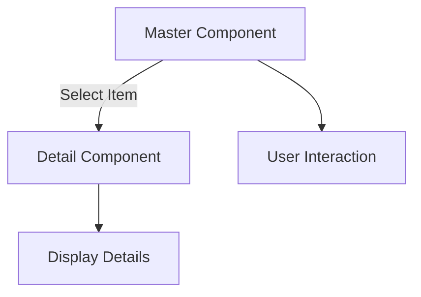

## 5.2.1 Understanding Master-Detail Pattern

The master-detail interface pattern is a widely used design approach that enhances user navigation and information display by organizing content into two main sections: the master and the detail. This pattern is particularly effective in applications where users need to navigate through a list of items and view detailed information about each item.

### Pattern Definition

The master-detail pattern consists of two primary components:

- **Master Component:** This is typically a list or menu that displays a collection of items. Users interact with the master component to select an item they are interested in.
- **Detail Component:** Once an item is selected from the master component, the detail component displays more detailed information about that item. This could be a full-page view or a side panel, depending on the application's layout.

The purpose of this pattern is to streamline user interactions by separating navigation from content display, allowing users to focus on specific details without distraction.

### Use Cases

The master-detail pattern is particularly beneficial in scenarios where users need to browse and select from a list of items to view more detailed information. Common use cases include:

- **Email Clients:** Users can browse through a list of emails (master) and read the full content of a selected email (detail).
- **Contact Lists:** Users can view a list of contacts (master) and see detailed information about a selected contact (detail).
- **E-commerce Catalogs:** Users can browse product categories (master) and view detailed product descriptions and images (detail).

In these scenarios, the master-detail pattern improves data organization and accessibility, making it easier for users to find and interact with the information they need.

### User Benefits

Implementing a master-detail pattern offers several benefits to users:

- **Streamlined Navigation:** By separating content into master and detail views, users can easily navigate through lists and focus on specific items without unnecessary clutter.
- **Enhanced Focus:** Users can concentrate on the details of a selected item without being distracted by other content.
- **Improved Data Organization:** The pattern allows for effective categorization and management of information, making it easier for users to locate and interact with data.

### Design Principles

To effectively implement the master-detail pattern, consider the following design principles:

- **Consistency:** Maintain a consistent layout and interaction pattern across different sections to provide a seamless user experience.
- **Intuitive Navigation:** Ensure that users can easily switch between master and detail views, using clear navigation cues and controls.
- **Clear Visual Hierarchy:** Use visual cues such as size, color, and spacing to distinguish between master and detail components, helping users understand the relationship between them.

### Implementation Guidance

Implementing a master-detail pattern in Flutter involves using widgets like `ListView` for the master component and a custom widget for the detail view. Here's a basic example:

```dart
import 'package:flutter/material.dart';

void main() {
  runApp(MasterDetailApp());
}

class MasterDetailApp extends StatelessWidget {
  @override
  Widget build(BuildContext context) {
    return MaterialApp(
      title: 'Master-Detail Pattern',
      home: MasterDetailScreen(),
    );
  }
}

class MasterDetailScreen extends StatefulWidget {
  @override
  _MasterDetailScreenState createState() => _MasterDetailScreenState();
}

class _MasterDetailScreenState extends State<MasterDetailScreen> {
  int _selectedIndex = 0;
  final List<String> _items = List.generate(10, (index) => 'Item $index');

  @override
  Widget build(BuildContext context) {
    return Scaffold(
      appBar: AppBar(
        title: Text('Master-Detail Pattern'),
      ),
      body: Row(
        children: <Widget>[
          Expanded(
            flex: 2,
            child: ListView.builder(
              itemCount: _items.length,
              itemBuilder: (context, index) {
                return ListTile(
                  title: Text(_items[index]),
                  selected: index == _selectedIndex,
                  onTap: () {
                    setState(() {
                      _selectedIndex = index;
                    });
                  },
                );
              },
            ),
          ),
          Expanded(
            flex: 3,
            child: DetailView(item: _items[_selectedIndex]),
          ),
        ],
      ),
    );
  }
}

class DetailView extends StatelessWidget {
  final String item;

  DetailView({required this.item});

  @override
  Widget build(BuildContext context) {
    return Center(
      child: Text(
        'Details for $item',
        style: TextStyle(fontSize: 24),
      ),
    );
  }
}
```

In this example, the `MasterDetailScreen` uses a `Row` widget to display a `ListView` on the left and a `DetailView` on the right. The `ListView` represents the master component, and the `DetailView` displays details about the selected item.

#### Mermaid.js Diagram

Below is a diagram illustrating the relationship and flow between master and detail components:



### Examples and Inspirations

Several popular applications successfully employ the master-detail pattern:

- **Gmail:** The Gmail app uses a master-detail layout to display a list of emails and the content of a selected email.
- **Contacts App:** Many contacts apps use this pattern to show a list of contacts and detailed information for each contact.
- **Amazon:** The Amazon app uses a master-detail approach to display product categories and detailed product information.

These implementations are effective because they provide a consistent and intuitive navigation experience, allowing users to focus on the content they are interested in.

### Common Pitfalls

When implementing the master-detail pattern, be aware of the following common pitfalls:

- **Complex Navigation Flows:** Avoid creating overly complex navigation between master and detail views, which can confuse users.
- **Inconsistent Layouts:** Ensure that layouts are consistent across different sections to provide a seamless user experience.

### Conclusion

The master-detail pattern is a powerful design approach that enhances user navigation and information display by organizing content into master and detail components. By following best practices and design principles, you can create intuitive and effective user interfaces that improve data organization and accessibility.

## Quiz Time!



### What is the primary purpose of the master-detail pattern?

- [x] To enhance user navigation and information display
- [ ] To increase application performance
- [ ] To reduce code complexity
- [ ] To improve security

> **Explanation:** The master-detail pattern is primarily used to enhance user navigation and information display by organizing content into master and detail components.

### Which component typically displays a collection of items in the master-detail pattern?

- [x] Master Component
- [ ] Detail Component
- [ ] Navigation Component
- [ ] Footer Component

> **Explanation:** The master component typically displays a collection of items, allowing users to select an item to view more details.

### In which scenario is the master-detail pattern particularly beneficial?

- [x] Email clients
- [ ] Single-page applications
- [ ] Real-time chat applications
- [ ] Gaming applications

> **Explanation:** The master-detail pattern is beneficial in email clients, where users can browse a list of emails and view the content of a selected email.

### What is a key benefit of using the master-detail pattern?

- [x] Streamlined navigation
- [ ] Increased application size
- [ ] Reduced user engagement
- [ ] Complex user interface

> **Explanation:** A key benefit of the master-detail pattern is streamlined navigation, allowing users to easily browse and focus on specific content.

### What design principle is important for implementing the master-detail pattern?

- [x] Consistency
- [ ] Complexity
- [ ] Redundancy
- [ ] Ambiguity

> **Explanation:** Consistency is important in implementing the master-detail pattern to provide a seamless user experience across different sections.

### What is a common pitfall when implementing the master-detail pattern?

- [x] Complex navigation flows
- [ ] Simplified user interface
- [ ] Increased performance
- [ ] Enhanced focus

> **Explanation:** A common pitfall is creating complex navigation flows, which can confuse users and hinder the user experience.

### Which widget is commonly used for the master component in Flutter?

- [x] ListView
- [ ] GridView
- [ ] Stack
- [ ] Container

> **Explanation:** The `ListView` widget is commonly used for the master component to display a list of items.

### How does the master-detail pattern improve data organization?

- [x] By categorizing and managing information effectively
- [ ] By increasing the number of displayed items
- [ ] By adding more visual elements
- [ ] By reducing the number of user interactions

> **Explanation:** The master-detail pattern improves data organization by categorizing and managing information effectively, making it easier for users to find and interact with data.

### What should be avoided to maintain a consistent layout in the master-detail pattern?

- [x] Inconsistent layouts
- [ ] Clear visual hierarchy
- [ ] Intuitive navigation
- [ ] Streamlined content

> **Explanation:** Inconsistent layouts should be avoided to maintain a consistent layout and provide a seamless user experience.

### True or False: The master-detail pattern is only suitable for mobile applications.

- [ ] True
- [x] False

> **Explanation:** False. The master-detail pattern is suitable for various platforms, including mobile, web, and desktop applications, where users need to navigate and view detailed information.


