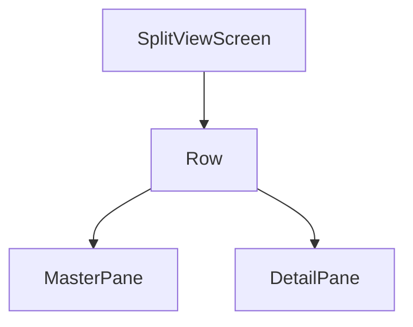

## 5.2.2 Implementing with Split Views

In the realm of responsive design, split views play a pivotal role in enhancing user experience, particularly on larger screens such as tablets and desktops. This section delves into the concept of split views within master-detail interfaces, providing a comprehensive guide on implementing them using Flutter. We will explore the widgets that facilitate split view layouts, demonstrate step-by-step implementation, and discuss responsive adjustments to ensure adaptability across various devices.

### Concept Overview

Split views are a fundamental design pattern used in master-detail interfaces, allowing users to view both the master list and the detail content simultaneously. This layout is particularly beneficial on larger screens, where the additional space can be utilized to display more information without overwhelming the user. By presenting both the master and detail sections side by side, split views enhance navigation efficiency and provide a seamless user experience.

In a typical master-detail interface, the master pane contains a list of items, while the detail pane displays information about the selected item. This setup is ideal for applications like email clients, file explorers, and content management systems, where users frequently switch between different items.

### Flutter Widgets for Split Views

Flutter offers a rich set of widgets that make implementing split views straightforward. Key widgets include `Row`, `Expanded`, `Flexible`, and `NavigationRail`, each contributing to the layout's flexibility and responsiveness.

- **Row:** The `Row` widget is essential for creating horizontal layouts, making it a natural choice for split views. It allows you to place the master and detail panes side by side.

- **Expanded and Flexible:** These widgets are used within a `Row` to allocate space to each pane. `Expanded` fills the available space, while `Flexible` allows for more granular control over the space distribution.

- **NavigationRail:** Particularly useful for larger screens, `NavigationRail` provides a vertical navigation bar that can be integrated into the master pane, offering a more intuitive navigation experience.

- **Responsive Tools:** To ensure the layout adapts to different screen sizes, `LayoutBuilder` and `MediaQuery` are invaluable. `LayoutBuilder` allows you to build layouts based on the parent widget's constraints, while `MediaQuery` provides information about the screen size and orientation.

### Step-by-Step Implementation

#### Basic Split View Layout

Let's start by creating a basic split view layout using Flutter. This example demonstrates a two-pane layout with a master list on the left and a detail view on the right.

```dart
import 'package:flutter/material.dart';

void main() {
  runApp(SplitViewApp());
}

class SplitViewApp extends StatelessWidget {
  @override
  Widget build(BuildContext context) {
    return MaterialApp(
      title: 'Split View Demo',
      home: SplitViewScreen(),
    );
  }
}

class SplitViewScreen extends StatelessWidget {
  @override
  Widget build(BuildContext context) {
    return Scaffold(
      appBar: AppBar(
        title: Text('Split View Example'),
      ),
      body: Row(
        children: <Widget>[
          Expanded(
            flex: 1,
            child: MasterPane(),
          ),
          Expanded(
            flex: 2,
            child: DetailPane(),
          ),
        ],
      ),
    );
  }
}

class MasterPane extends StatelessWidget {
  @override
  Widget build(BuildContext context) {
    return ListView.builder(
      itemCount: 20,
      itemBuilder: (context, index) {
        return ListTile(
          title: Text('Item $index'),
          onTap: () {
            // Handle item tap
          },
        );
      },
    );
  }
}

class DetailPane extends StatelessWidget {
  @override
  Widget build(BuildContext context) {
    return Center(
      child: Text('Detail View'),
    );
  }
}
```

In this example, we use a `Row` widget to arrange the master and detail panes horizontally. Each pane is wrapped in an `Expanded` widget to ensure they occupy the available space proportionally.

#### Responsive Adjustments

To make the layout responsive, we need to adjust it for smaller screens, collapsing the split view into a single-pane view. This can be achieved using `LayoutBuilder` and `MediaQuery`.

```dart
class SplitViewScreen extends StatelessWidget {
  @override
  Widget build(BuildContext context) {
    return Scaffold(
      appBar: AppBar(
        title: Text('Split View Example'),
      ),
      body: LayoutBuilder(
        builder: (context, constraints) {
          if (constraints.maxWidth > 600) {
            // Split view for larger screens
            return Row(
              children: <Widget>[
                Expanded(
                  flex: 1,
                  child: MasterPane(),
                ),
                Expanded(
                  flex: 2,
                  child: DetailPane(),
                ),
              ],
            );
          } else {
            // Single pane view for smaller screens
            return MasterPane();
          }
        },
      ),
    );
  }
}
```

Here, `LayoutBuilder` is used to check the available width. If the width exceeds 600 pixels, a split view is displayed; otherwise, only the master pane is shown.

#### Mermaid.js Diagrams

To better understand the widget hierarchy and layout structure, let's visualize the split view using a Mermaid.js diagram.



This diagram illustrates the hierarchical relationship between the `SplitViewScreen`, `Row`, `MasterPane`, and `DetailPane` widgets.

### Responsive Adjustments

#### Dynamic Layout Switching

To further enhance responsiveness, we can implement logic to dynamically switch between split views and single-pane views based on screen width and orientation. This ensures that the application provides an optimal user experience across all devices.

```dart
class SplitViewScreen extends StatelessWidget {
  @override
  Widget build(BuildContext context) {
    final isLandscape = MediaQuery.of(context).orientation == Orientation.landscape;
    final isLargeScreen = MediaQuery.of(context).size.width > 600;

    return Scaffold(
      appBar: AppBar(
        title: Text('Split View Example'),
      ),
      body: isLargeScreen || isLandscape
          ? Row(
              children: <Widget>[
                Expanded(
                  flex: 1,
                  child: MasterPane(),
                ),
                Expanded(
                  flex: 2,
                  child: DetailPane(),
                ),
              ],
            )
          : MasterPane(),
    );
  }
}
```

In this example, `MediaQuery` is used to determine the screen orientation and size. The layout switches to a split view if the screen is large or in landscape orientation.

#### Code Examples

The following code demonstrates how to use `MediaQuery` and `LayoutBuilder` to achieve responsive behavior:

```dart
class ResponsiveSplitView extends StatelessWidget {
  @override
  Widget build(BuildContext context) {
    return Scaffold(
      appBar: AppBar(
        title: Text('Responsive Split View'),
      ),
      body: LayoutBuilder(
        builder: (context, constraints) {
          if (constraints.maxWidth > 800) {
            return Row(
              children: <Widget>[
                Expanded(
                  flex: 1,
                  child: MasterPane(),
                ),
                Expanded(
                  flex: 3,
                  child: DetailPane(),
                ),
              ],
            );
          } else if (constraints.maxWidth > 600) {
            return Row(
              children: <Widget>[
                Expanded(
                  flex: 2,
                  child: MasterPane(),
                ),
                Expanded(
                  flex: 1,
                  child: DetailPane(),
                ),
              ],
            );
          } else {
            return MasterPane();
          }
        },
      ),
    );
  }
}
```

This code snippet demonstrates how to adjust the layout based on different screen widths, providing a more granular control over the layout's responsiveness.

### Styling and Theming

#### Visual Consistency

To ensure visual consistency across both master and detail panes, it's crucial to apply a cohesive theme. This includes maintaining consistent colors, fonts, and styles throughout the application.

```dart
class SplitViewApp extends StatelessWidget {
  @override
  Widget build(BuildContext context) {
    return MaterialApp(
      title: 'Split View Demo',
      theme: ThemeData(
        primarySwatch: Colors.blue,
        textTheme: TextTheme(
          bodyText1: TextStyle(fontSize: 16.0),
          bodyText2: TextStyle(fontSize: 14.0),
        ),
      ),
      home: SplitViewScreen(),
    );
  }
}
```

In this example, a global theme is defined using `ThemeData`, ensuring consistent styling across the application.

#### Responsive Typography

Adjusting font sizes and styles is essential to maintain readability in different layouts. Using `MediaQuery`, you can dynamically adjust typography based on screen size.

```dart
class DetailPane extends StatelessWidget {
  @override
  Widget build(BuildContext context) {
    double fontSize = MediaQuery.of(context).size.width > 600 ? 18.0 : 14.0;

    return Center(
      child: Text(
        'Detail View',
        style: TextStyle(fontSize: fontSize),
      ),
    );
  }
}
```

This code adjusts the font size based on the screen width, ensuring that text remains legible on both large and small screens.

### Examples and Case Studies

To illustrate the effectiveness of split views, let's examine a few Flutter applications that utilize this design pattern.

- **Email Clients:** Many email clients use split views to display the inbox and the selected email content side by side, allowing users to navigate through emails efficiently.

- **File Explorers:** File management applications often employ split views to present a directory tree on one side and the contents of the selected folder on the other.

- **Content Management Systems:** CMS platforms use split views to enable users to browse through content lists while editing or viewing detailed content on the same screen.

In each of these cases, the split view layout enhances user interaction by reducing the need for frequent navigation between different screens.

### Common Pitfalls

#### Overlooking Responsiveness

One of the most common pitfalls when implementing split views is neglecting to ensure the layout adapts well to various screen sizes. It's crucial to test the application on different devices and orientations to verify that the layout remains functional and visually appealing.

#### Performance Issues

Complex split view layouts can lead to performance issues, especially on lower-end devices. To mitigate this, consider the following strategies:

- **Optimize Widget Builds:** Minimize unnecessary widget rebuilds by using keys and optimizing the widget tree.

- **Efficient State Management:** Use efficient state management techniques to reduce the overhead of state changes.

- **Lazy Loading:** Implement lazy loading for content that is not immediately visible, such as long lists in the master pane.

By addressing these challenges, you can create a responsive and performant split view layout that enhances the user experience across all devices.

### Conclusion

Implementing split views in Flutter is a powerful way to create master-detail interfaces that enhance user interaction, particularly on larger screens. By leveraging Flutter's rich set of widgets and responsive tools, you can build layouts that adapt seamlessly to different devices and orientations. Remember to maintain visual consistency, optimize performance, and test thoroughly to ensure a smooth user experience.

As you continue to explore responsive design patterns, consider how split views can be integrated into your applications to improve usability and efficiency. By mastering this design pattern, you'll be well-equipped to create intuitive and engaging user interfaces that meet the needs of diverse audiences.

## Quiz Time!



### What is the primary benefit of using split views in master-detail interfaces?

- [x] Allows simultaneous viewing of master and detail sections
- [ ] Reduces the need for navigation menus
- [ ] Increases application performance
- [ ] Simplifies the codebase

> **Explanation:** Split views enable users to view both the master list and detail content simultaneously, enhancing navigation efficiency and user experience.

### Which Flutter widget is essential for creating horizontal layouts in split views?

- [x] Row
- [ ] Column
- [ ] Stack
- [ ] ListView

> **Explanation:** The `Row` widget is used to arrange widgets horizontally, making it ideal for creating split views.

### How can you ensure a split view layout adapts to different screen sizes?

- [x] Use LayoutBuilder and MediaQuery
- [ ] Use only the Row widget
- [ ] Hardcode dimensions for each screen size
- [ ] Use a single Column widget

> **Explanation:** `LayoutBuilder` and `MediaQuery` provide information about the screen size and constraints, allowing you to build responsive layouts.

### What is the role of the Expanded widget in a split view layout?

- [x] Allocates space to child widgets proportionally
- [ ] Aligns widgets to the center
- [ ] Provides padding around widgets
- [ ] Changes the orientation of child widgets

> **Explanation:** The `Expanded` widget is used within a `Row` or `Column` to allocate space to child widgets proportionally.

### Which widget provides a vertical navigation bar suitable for larger screens?

- [x] NavigationRail
- [ ] AppBar
- [ ] BottomNavigationBar
- [ ] Drawer

> **Explanation:** `NavigationRail` is designed for larger screens and provides a vertical navigation bar that can be integrated into the master pane.

### How can you dynamically switch between split views and single-pane views?

- [x] Use MediaQuery to check screen width and orientation
- [ ] Use a fixed layout for all screens
- [ ] Implement separate layouts for each device
- [ ] Use only the Column widget

> **Explanation:** `MediaQuery` allows you to determine the screen width and orientation, enabling dynamic layout switching.

### What is a common pitfall when implementing split views?

- [x] Overlooking responsiveness
- [ ] Using too many widgets
- [ ] Not using enough colors
- [ ] Ignoring user feedback

> **Explanation:** A common pitfall is failing to ensure the layout adapts well to various screen sizes, which can affect usability.

### How can you maintain performance in complex split view layouts?

- [x] Optimize widget builds and use efficient state management
- [ ] Use as many widgets as possible
- [ ] Avoid using state management
- [ ] Hardcode all dimensions

> **Explanation:** Optimizing widget builds and using efficient state management techniques can help maintain performance in complex layouts.

### What is the purpose of responsive typography in split views?

- [x] Adjust font sizes for readability on different screens
- [ ] Change font colors based on user preference
- [ ] Use the same font size for all devices
- [ ] Increase font size only on large screens

> **Explanation:** Responsive typography involves adjusting font sizes and styles to maintain readability across different screen sizes.

### True or False: Split views are only useful for tablet applications.

- [ ] True
- [x] False

> **Explanation:** Split views are beneficial for any larger screen, including desktops and tablets, where simultaneous viewing of master and detail sections enhances user experience.


